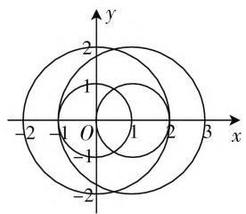

# 稳中求新 育人为本 凸显素养

——2020年高考数学上海卷评析

河南省开封高中 顾伯宇

从 2017 年起,上海市全面实施教育考试综合改革以来,考试命题等发生了重大变化.2020 年高考数学上海试卷,保持整体指导思想,试卷结构稳定,题型稳中求新,难度相对适中,体现传承特征,强调数学学科核心素养,突出数学关键能力,切实落实立德树人.

# 一、结构整体稳定，利于考生发挥

2020年高考数学上海试卷整体结构稳定、层次分明，题型、题量、难易程度、主干知识点等方面与往年高考试卷基本保持一致，试卷起点低，坡度缓，有较强的亲和力，相对来说比较有利于考生正常发挥，考出最佳的水平.

试卷中各部分知识的比例符合高考数学科目《考试说明》中的要求,其中,数与运算、方程与代数、函数与分析、数据整理与概率统计约占整份试卷总分值的65%,图形与几何约占整份试卷总分值的35%.

整份试卷对数学基础知识、基本技能、基本思想方法的考查比较全面，全面考查了集合、不等式、命题及其关系、函数、三角、数列、平面向量、行列式、圆锥曲线、复数、排列组合、空间图形、线性规划、参数方程等基本概念和知识，同时对数学阅读、理解、表达，以及数学文字语言、图形语言、符号语言之间转换等基本技能的考查也渗透其中.

例 1 （2020 年高考数学上海卷第 16 题）命题 p：存在 $a \in R$ 且 $a \neq 0$ ，对任意的 $x \in R$ ，均有 $f(x + a) < f(x) + f(a)$ 恒成立；命题 $q_{1}: f(x)$ 单调递减，且 $f(x) > 0$ 恒成立；命题 $q_{2}: f(x)$ 单调递增，存在 $x_{0} < 0$ 使得 $f(x_{0}) = 0$ 。则下列说法正确的是（）.

A. $q_{1}, q_{2}$ 都是 $p$ 的充分条件  
B. 只有 $q_{1}$ 是 $p$ 的充分条件  
C. 只有 $q_{2}$ 是 p 的充分条件  
D. $q_{1}, q_{2}$ 都不是 $p$ 的充分条件

分析: 结合函数的单调性以及充分条件之间的关系, 利用全称命题与存在命题的关系以及应用, 分别结合已知命题 $q_{1}$ 、 $q_{2}$ 加以分类讨论, 进而得以确定 $q_{1}$ $\Rightarrow p, q_{2} \Rightarrow p$ , 得出正确的结论.

解析:对于命题 $q_{1}$ : 因为 $f(x)$ 单调递减, 所以对任意 a > 0, 都有 $f(x + a) < f(x)$ .

又因为 $f(x)>0$ ，任取 a>0，都有 $f(a)>0$ ，所以 $f(x+a)<f(x)+f(a)$ ，即 $q_{1}\Rightarrow p$ ；

对于命题 $q_{2}$ : 因为 $f(x)$ 单调递增, 所以存在 a < 0, 使得 $f(x + a) < f(x)$ .

又因为存在 $x_0 < 0$ 使得 $f(x_0) = 0$ ，所以取 $a = x_0$ ，使得 $f(x + a) < f(x) = f(x) + f(a)$ ，即 $q_2 \Rightarrow p$ .

故选择答案:A.

点评:结合函数的基本性质、命题及其关系等知识加以交汇与融合,借助分类讨论思想,通过逻辑推理来进行分析与处理,从而得以合理推理,正确判断.这类问题也是上海试卷中比较常见的一种逻辑推理问题,具有一定的难度与混淆度,要引起高度重视.

# 二、难度设置合理，重思想疏运算

2020年高考数学上海试卷题目的难度设置合理，填空题第1—9题，选择题第13、14题，解答题第17、18题等都是考查纯粹的数学知识点，或者典型问题与典型方法，大部分基础扎实的同学都不存在问题。

其实，2020年高考数学上海试卷侧重思想而非侧重运算。试卷中难度较大的题目，比如填空题中的第10、11、12题，选择题中的第16题，解答题中的第20题(3)，第21题(2)(3)等，这些题目都在考查函数与方程思想、分类与整合思想以及数形结合思想等，需要在准确理解题意的基础上进行合理逻辑推理、作图分析，最后代数化做出判断或给出相应解题过程。

例 2 （2020 年高考数学上海卷第 18 题）已知 $f(x)=\sin\omega x(\omega>0)$ .

(1) $f(x)$ 的周期是 $4\pi$ ，求 $\omega$ ，并求此时 $f(x)=\frac{1}{2}$ 的解集；

(2) 已知 $\omega = 1, g(x) = f^2(x) + \sqrt{3} f(-x) \cdot f\left(\frac{\pi}{2} - x\right), x \in \left[0, \frac{\pi}{4}\right]$ , 求 $g(x)$ 的值域.

分析:(1) 结合函数的周期直接确定参数 $\omega$ 的值;

(2) 通过三角函数关系式的转化, 结合二倍角公式的转化, 借助辅助角公式的应用, 转化为相应的正弦型函数, 再结合自变量的取值范围限制, 利用三角函数的图像与性质来确定相应的值域问题.

解析:(1)由于 $T=4\pi=\frac{2\pi}{\omega}$ ，解得 $\omega=\frac{1}{2}$ .

由上可知 $\sin\frac{x}{2}=\frac{1}{2}$ ，故 $\frac{x}{2}=2k\pi+(-1)^{k}\cdot\frac{\pi}{6}$ ， $k \in Z$ , 解得 $x = 4k\pi + (-1)^{k} \cdot \frac{\pi}{3}, k \in \mathbf{Z}$ ，所以 $f(x) = \frac{1}{2}$ 的解集为 $\{x \mid x = 4k\pi + (-1)^{k} \cdot \frac{\pi}{3}, k \in \mathbf{Z}\}$ .

$$
\begin{array}{l} \sin \left(\frac {\pi}{2} - x\right) = \sin^ {2} x - \sqrt {3} \sin x \cos x = \frac {1 - \cos 2 x}{2} - \\ \frac {\sqrt {3}}{2} \sin 2 x = \frac {1}{2} - \left(\frac {\sqrt {3}}{2} \sin 2 x + \frac {1}{2} \cos 2 x\right) = \frac {1}{2} - \\ \sin \left(2 x + \frac {\pi}{6}\right). \\ \end{array}
$$

(2) 由于 $f(x) = \sin x$ ，可得 $g(x) = f^2(x) + \sqrt{3} f(-x)f\left(\frac{\pi}{2} - x\right) = \sin^2 x + \sqrt{3}\sin (-x) \cdot$

而 $x \in \left[0, \frac{\pi}{4}\right]$ ，可得 $2x + \frac{\pi}{6} \in \left[\frac{\pi}{6}, \frac{2\pi}{3}\right]$ ，则 $\sin \left(2x + \frac{\pi}{6}\right) \in \left[\frac{1}{2}, 1\right]$ ，所以 $g(x) = \frac{1}{2} - \sin \left(2x + \frac{\pi}{6}\right) \in \left[-\frac{1}{2}, 0\right]$ ，即 $g(x)$ 的值域为 $\left[-\frac{1}{2}, 0\right]$ .

点评:三角函数的图像与性质是三角函数中最基本的知识点.而二倍角公式的合理应用,在破解一些三角函数问题中应用广泛.特别是碰到一些比较复杂的三角函数关系式问题时,就必须对此三角函数关系式进行合理变形与转化,正确应用,合理转化,巧妙处理.

# 三、强调核心素养，突出关键能力

2020年高考数学上海试卷以数学基础知识为载体，以数学学科核心素养为导向，突出考查考生的数学抽象、逻辑推理、数学建模、直观想象、数学运算、数学分析、空间想象等学科关键能力.比如，填空题中的第 11 题与选择题中的第 16 题, 这两个函数问题通过数学知识合理的交汇与融合, 需要考生对函数的基本概念、基本性质以及数学逻辑语言等都有深刻的理解和整体的认知, 同时对方程、不等式、充要条件等相关知识也有合理的综合应用, 强调对数学知识本质属性的理解与掌握、数学方法的灵活运用, 体现了对数学抽象、逻辑推理等数学学科核心素养的考查.

又比如,填空题中的第12题平面向量问题与选择题中的第15题立体几何问题,这两个问题都需要考生具有良好的数形结合、分类讨论与空间想象的意识,有效考查了考生的直观想象、逻辑思维、数学建模等数学学科核心素养.

解答题中的第 21 题数列问题,则需要考生能够通过分析、尝试、归纳、总结等过程找到解决问题的切入点与思路,并进行严格的推理论证,充分考查了考生有效认识问题、分析问题、创造性解决问题的能力等.

例 3 （2020 年高考数学上海卷第 12 题）已知 $a_{1}$ ， $a_{2}$ ， $b_{1}$ ， $b_{2}$ ，…， $b_{k}$ ( $k \in N^{*}$ ) 是平面内两两不同的向量，满足 $|a_{1} - a_{2}| = 1$ ，且 $|a_{i} - b_{j}| \in \{1, 2\}$ （其中 i = 1, 2, j = 1, 2, …, k），则 k 的最大值为 \_\_\_\_.

分析:在平面直角坐标系中,假定 $a_{1}=0=(0,0)$ , 结合 $\left|a_{i}-b_{j}\right|\in\{1,2\}$ 确定向量 $b_{j}$ 的对应点的位置, 再利用条件 $\left|a_{1}-a_{2}\right|=1$ 进行平移变换, 确定此时向量 $b_{j}$ 的对应点的位置, 数形结合确定不同圆之间的交点情况, 进而确定平面向量的最多个数, 即为对应参数 k 的最大值.

text_image

y
2
1
O
-1
-2
1
2
3
x

图1

解析:建立如图1所示的平面直角坐标系,不妨设 $a_{1}=0=(0,0)$ ,设 $b_{j}=(x,y)$ .

对于 $a_{1}=0=(0,0)$ ，由 $\left|a_{i}-b_{j}\right|\in\{1,2\}$ 可得 $\left|b_{j}\right|=1$ 或 2，此时向量 $b_{j}$ 的对应点在以原点为圆心，半径为 1 或 2 的圆上，相应的方程为 $x^{2}+y^{2}=1$ 或 $x^{2}+y^{2}=4$ .

结合条件 $|\pmb{a}_1 - \pmb{a}_2| = 1$ ，只要将上面的圆向外平移1个单位即可，为说明方便，取一特殊值，如图中取 $\pmb{a}_2 = (1,0)$ ，即向右平移1个单位，相应的方程为 $(x-$ $1)^{2} + y^{2} = 1$ 或 $(x - 1)^{2} + y^{2} = 4.$ （下转第24页）

$\frac{2(x-1)^{2}}{5}+\frac{3(y-1)^{2}}{5}=1$ ，故点Q的轨迹是以(1,1)为中心，长半轴长为 $\frac{\sqrt{10}}{2}$ ，短半轴长为 $\frac{\sqrt{15}}{3}$ ，且焦点在直线y=1上的椭圆(除去原点).

评注: 上述给出的解法充分利用在新坐标系下“ $|O'R'|=1$ ”, 极大地简化了计算. 其实, 点 $P_{1}(x_{1}, y_{1})$ 和 $P_{2}(x_{2}, y_{2})$ 在伸缩变换 $\left\{\begin{aligned} x' &= \frac{x}{a}, \\ y' &= \frac{y}{b}\end{aligned}\right.$ 下变为点 $P_{1}'(x_{1}', y_{1}')$ 和点 $P_{2}'(x_{2}', y_{2}')$ , 则 $|P_{1}'P_{2}'| = \frac{\sqrt{\frac{1}{a^{2}} + \frac{1}{b^{2}}k^{2}}}{\sqrt{1 + k^{2}}} |P_{1}P_{2}|$ , 其中 k 为直线 $P_{1}P_{2}$ 的斜率.

# 五、直线与椭圆的相切问题

例5 已知点 $P(x, y)$ 在椭圆 $x^2 + \frac{y^2}{4} = 1$ 上运动，求 $u = \frac{y}{2x - 4}$ 的最大值.

解:作坐标变换 $\left\{\begin{aligned}x^{\prime}=x,\\ y^{\prime}=\frac{y}{2},\end{aligned}\right.$ 则在新坐标系 $x^{\prime}O^{\prime}y^{\prime}$ 中，椭圆变成单位圆 $x^{\prime 2} + y^{\prime 2} = 1, u = \frac{\frac{y}{2}}{x - 2} = \frac{y'}{x' - 2}$ . 所求问题可转化为： $P'(x', y')$ 是单位圆 $x^{\prime 2} +$ $y'^{2}=1$ 上的动点,求 $u=\frac{y'}{x'-2}$ 的最大值.

设 $A(2,0)$ ，则 $u$ 即为直线 $AP'$ 的斜率 $k$ .

设过点 A 的圆的切线为 AB、AC(B、C 为切点)，则 $k_{AB} = -\frac{\sqrt{3}}{3}, k_{AC} = \frac{\sqrt{3}}{3}$ .

当点 $P^{\prime}$ 和点 $C$ 重合时， $k$ 取最大值 $\frac{\sqrt{3}}{3}$ ，即当 $\left\{ \begin{array}{l} x' = \frac{1}{2}, \\ y' = -\frac{\sqrt{3}}{2}, \end{array} \right.$ 也即当 $\left\{ \begin{array}{l} x = \frac{1}{2}, \\ y = -\sqrt{3} \end{array} \right.$ 时， $u_{\max} = \frac{\sqrt{3}}{3}$ .

评注:本题的常规解法是用椭圆的参数方程及三角函数求极值的方法求解,或化为椭圆上的点和定点 $A(2,0)$ 的连线的斜率的最值求解,但运算相对比较复杂.

一般情况下，解决直线与椭圆问题时，需要联立求解，用韦达定理求解出 $x_{1} + x_{2}$ 或 $x_{1}x_{2}$ ，较为烦琐，把椭圆变成圆以后，我们就可以利用圆的一些几何性质来解决直线（直线伸缩变换后仍为直线）与椭圆的相交或相切问题，计算也会大大简化。值得注意的是伸缩变换后同一直线上或平行直线上的两线段长度比不发生改变。两图形经伸缩变换后交点个数不变，也就是说，原图形若相交，则变换后仍相交；原图形若相切，则变换后仍相切；原图形中若是弦的中点，则变换后仍是弦的中点。F

# (上接第21页)

数形结合可知两者共有 6 个不同的交点, 则 k 的最大值为 6, 故填答案: 6.

点评: 解决此类创新应用问题, 关键是借助平面直角坐标系加以直观分析, 先确定其中的一个要素进行分析与处理, 再结合条件对相应的图像进行平移变换, 从而由数形直观来解决. 从解析几何图形直观入手, 借助圆的平移变换, 从而有效、直观、快捷地处理问题.

同时，2020年高考数学上海试卷在注重对数学知识本质理解与掌握的基础上，重视数学思维的灵活性、严谨性及深刻性，突出对考生创新意识、应用意识的考查，对高中数学教学起到积极的引导作用，有利于高校选拔优秀人才.

# 四、总结命题规律，指导后继教学

从 2020 年高考数学上海试卷看,试卷中基础题、中档题、难题的比例基本维持在 4:4:2 的相对稳定水平,对于大部分考生来说,试卷的难易度与往年高考相类似,平时教学与学习中基本也是这个层次,因而在考前多做一些基础性的训练,依旧可以帮助考生取得一个不错的成绩.

这也给后继的高三教学与复习备考指明方向. 大家不需要过分地去钻研偏、难、怪的试题, 夯实基础, 把握主干, 不断地提高能力. 同时, 考生在冲刺复习阶段, 一定要重点关注一些基础类型的题目, 越是基础扎实, 高考越是稳妥. 考生要关注数学的发展, 关注社会民生, 社会热点, 树立创新意识, 就能够在新高考当中脱颖而出. F