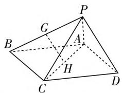
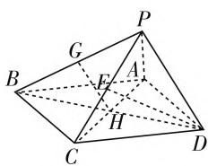

# 逆向思维,引领学生走出“空间线面关系证明”问题的困境

● 甘肃省张掖市实验中学 史博民

立体几何作为高考的核心考查对象，其“空间线面关系证明”问题是高考全国卷Ⅱ的必考题型。笔者在多年的教学中发现，文科学生逻辑推理能力的相对薄弱，使得“空间线面关系证明”问题成为其难以攻破的壁垒。这主要体现在以下三个方面：一是不会审题，“见山是山，见水是水”审题只停留于表面，缺乏对“条件”“结论”进行充分挖掘的意识，无法明确其逻辑关联性，难以找到解题切入点；二是证明思路不清，逻辑混乱；三是证明过程芜音累句，条件不充分或条件冗余时有发生。

为了进一步培养学生的逻辑推理能力,提高其解决“空间线面关系证明”问题的能力,笔者以2019年浙江卷文科数学的一道试题为例,探究逆向思维在解决“空间线面关系证明”问题中的应用.

题目 如图 1, 在四棱锥 P-ABCD 中, 底面 ABCD 为平行四边形, $\triangle PCD$ 为等边三角形, 平面 PAC⊥平面 PCD, PA⊥CD, CD=2, AD=3.

text_image

Geometric diagram of a pyramid with labeled vertices and internal points, used in spatial geometry problems.

图1

（Ⅰ）设 G, H 分别为 PB,
AC 的中点, 求证: GH // 平面 PAD;

(Ⅱ) 求证: $PA \perp$ 平面 PCD;

(Ⅲ) 略.

本题依托于空间相关定理的灵活应用,重点考查了学生的空间想象能力及逻辑推理能力.

# 一、“四环节”解决问题

# 环节(一): 发散思维, 审清题意

审题中不断寻找“条件”的必要条件及“结论”的充分条件，进行充分的思维发散，探索“条件”与“结论”间的逻辑关系，从而达到审清题意的目的.

例如针对本题可以做如下发散思维：

1. 寻找“条件”的必要条件

“底面ABCD为平行四边形”联想到“ $AC \cap BD = H, H$ 为BD的中点”；由“ $\triangle PCD$ 为等边三角形”联想到“三线合一性质”；由“平面 $PAC \perp$ 平面PCD”联想到“线面垂直”，进而想到“线线垂直”。

# 2. 寻找“结论”的充分条件

欲证 $GH \parallel$ 平面 $PAD$ , 就得证明线线平行或面面平行; 欲证 $PA \perp$ 平面 $PCD$ , 就得证明线线垂直或面面垂直.

# 环节(二):逆向分析,明确思路

大多数学生习惯于沿着事物发展的正方向去思考问题并寻求解决办法. 其实, 对于某些问题, 从结论回推, 逆向思考, 从求解回到已知条件, 会使问题简单化. 从所要证明的“结论”出

text_image

Geometric diagram of a pyramid with labeled vertices and internal points, used for spatial geometry problems.

图2

发,引导学生应用逆向思维书写流程式的分析过程,可以帮助学生理顺逻辑关系,破解思维难点,迅速找到解题切入点.

(I)GH // 平面 PAD ← GH // PD
← {H 为 BD 的中点 ← H 为 AC 的中点且四边形 ABCD 为平行四边形
G 为 PB 的中点(已知)
(II)PA ⊥ 平面 PCD ← {PA ⊥ CD(已知)
PA ⊥ ED(E 为 PC 的中点)
← ED ⊥ 平面 PAC ← 平面 PCD ⊥ 平面 PAC(已知)

# 环节(三): 补充条件, 证明初现

在以上的分析过程中,部分环节只反映了空间相关定理的“主线”,条件并不充分,为此需要对这些环节进行补充完善,保证推理过程的充分性.

补充完善:(I)

$PD \subset$ 平面 $PAD$ $GH \parallel$ 平面 $PAD \xleftarrow{GH \not\subset$ 平面 $PAD} GH \parallel PD$ 补充内容

$\leftarrow\left\{\begin{aligned}H & 为 BD 的中点←— H 为 AC 的中点且四边形 ABCD 为平行四边形 \\ G & 为 PB 的中点(已知)\end{aligned}\right.$

补充完善:(Ⅱ)

$ED \cap CD = D$ $PA \perp \text{平面 } PCD \xleftarrow{ED, CD \subset \text{ 平面 } PCD}$ 补充内容 $PA \perp CD$ (已知) $PA \perp ED$ (E 为 PC 的中点) ← $ED \perp \text{ 平面 } PAC$ 平面 $PCD \cap \text{ 平面 } PAC = PC$ $ED \subset \text{ 平面 } PCD$ $ED \perp PC$ 补充内容

平面 $PCD \perp \text{ 平面 } PAC$ (已知)

# 环节(四):组织语言,完成证明

基于上面的详尽分析,适当组织语言,证明水到渠成.

（Ⅰ）证明：连接 BD，易知 $AC \cap BD = H, H$ 为 BD 的中点。又由 G 为 BP 的中点，故 $GH \parallel PD$ 。

又因为 $GH \not\subset$ 平面 PAD, $PD \subset$ 平面 PAD, 所以 $GH \parallel$ 平面 PAD.

（Ⅱ）证明：取棱 $PC$ 的中点 $E$ ，连接 $DE$ .依题意，

得 $DE \perp PC$ .

又因为平面 $PAC \perp$ 平面PCD，平面 $PAC \cap$ 平面 $PCD = PC, DE \subset$ 平面PCD，所以 $DE \perp$ 平面PAC.

又 $PA \subset$ 平面 $PAC$ , 故 $DE \perp PA$ . 又已知 $PA \perp CD, CD \cap DE = D, CD, DE \subset$ 平面 $PCD$ , 所以 $PA \perp$ 平面 $PCD$ .

(Ⅲ) 略.

# 二、总结反思

“空间线面关系证明”问题的解决思路是:在“空间问题平面化”的大方向指引下,基于试题,进行必要的平面与空间的相互转化,从而推进问题的解决.借助空间八大定理的图形及符号语言,引导学生理解其内在的逻辑性,使其能够明确区分出定理的“主线”条件与辅助条件(例如,线面平行的判定定理中,“线线平行”就是“主线”条件,而其余条件均为辅助条件),是解决好“空间线面关系证明”问题的前提.在明确“主线”条件的前提下,引导学生深刻领会“线线平行(垂直)、线面平行(垂直)、面面平行(垂直)”的内在联系,是解决好“空间线面关系证明”问题的关键所在.W

# (上接第54页)

(i) 若 $\mu \neq 0$ ，则直线 $AB$ 过定点 $\left(-\frac{2y_0}{\mu} + x_0, \frac{2b^2x_0}{\mu a^2} - y_0\right)$ ;  
(ii) 若 $\mu=0$ ，则直线 AB 斜率为定值 $-\frac{b^{2}}{a^{2}}\cdot\frac{x_{0}}{y_{0}}(y_{0}\neq0)$ .

# 3. 抛物线

同理可得到命题为:(证明过程限于篇幅,请读者尝试完成)

命题 3-1: 抛物线: $y^{2}=2px(p>0), P(x_{0},y_{0})$ 为抛物线上定点, A, B 是抛物线上异于 P 点的不同两点. 若 $k_{PA} \cdot k_{PB} = \lambda \neq 0$ , 则直线 AB 过定点 $\left(-\frac{2p}{\lambda} + x_{0}, -y_{0}\right)$ ;

命题 3-2: 抛物线: $y^{2} = 2px (p > 0)$ , $P(x_{0}, y_{0})$ 为抛物线上定点, $A, B$ 是抛物线上异于 $P$ 点的不同两点. 如果 $k_{PA} + k_{PB} = \mu$ , 那么

(i) 若 $\mu = 0$ ，则直线 AB 斜率为定值 $-\frac{p}{y_{0}} (y_{0} \neq 0)$ ;

(ii) 若 $\mu \neq 0$ ，则直线 $AB$ 过定点 $\left(-\frac{2y_0}{\mu} + x_0, \frac{2p}{\mu} - y_0\right)$ .

评注:证明过程特别注意平移原点得到新坐标系下圆锥曲线方程形式;设此时直线方程形式 $mx + ny = 1$ ;求出定点要注意还原.尽管坐标系原点发生了平移,但直线的斜率仍然保持不变.

根据以上推理我们可以得到关于圆锥曲线的一个定理：

圆锥曲线不共线三点定理即简称“不共线三点定理”：

圆锥曲线上不共线三点,如果其中一个定点与其余两个点的连线所在直线的斜率之积、和为定值,那么过这两个点的直线的斜率为定值或恒过定点.

评注: 这个定理为我们探究这类圆锥曲线问题提供了很好的解题方向, 特别是恰当使用原点平移变换, 在数学竞赛考试中为进一步简化圆锥曲线计算带来很大的便利. W