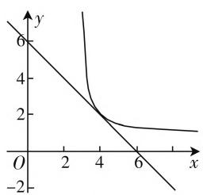

# 一道代数式最值题的多种解法与教学启示

# 山东省济宁孔子国际学校 李修国

多元代数式的最值问题(特别是二元代数式的最值问题)一直备受命题者的青睐,经常出现在模拟考试、高考、竞赛、自主招生等试题中.此类问题通过条件关系的限定,进而结合代数式的转化与应用来处理相应的最值问题,能较好地考查学生的综合能力,具有很好的选拔与区分功能.但是,此类问题求解时往往技巧性比较强,学生不易掌握,但其切入点比较多,经常显现方法各异的情景.

# 一、问题呈现

问题 已知 $x, y > 0$ ，且 $\frac{8}{x^2} + \frac{1}{y} = 1$ ，则 $x + y$ 的最小值为 \_\_\_\_.

# 二、问题分析

本题结合二元代数式的定值条件——“ $\frac{8}{x^{2}}+\frac{1}{y}=1$ ”，两参数之间具有非对称性，进而确定与之相关的代数式“ $x+y$ ”的最值。由于已知条件中涉及的二元代数式是二次分式，且不具有对称性、轮换性，而对应求解的最值中相应的代数式又是一次整式，如何找到题目已知关系式与所求代数式之间的联系与过渡，合理切入，或从不等式角度切入，或从函数角度切入，或从几何角度切入等，其中合理的变形与转化是发现规律与破解问题的重要一环。

# 三、多种解法

# 思维视角(一): 不等式思维

解法1:(均值不等式法)因为x,y>0,且 $\frac{8}{x^{2}}+\frac{1}{y}=1$ ,所以有 $x+y=x\left(\frac{8}{x^{2}}+\frac{1}{y}\right)+y=\frac{8}{x}+\frac{x}{y}+y\geqslant3\sqrt[5]{\frac{8}{x}\cdot\frac{x}{y}\cdot y}=6$ ,当且仅当 $\frac{8}{x}=\frac{x}{y}=y$ ,即x=4,y=2时等号成立,所以 $x+y$ 的最小值为6.

故填答案:6.

点评:结合条件中的常数“1”,通过代数式的巧妙转化 $x+y=x\left(\frac{8}{x^{2}}+\frac{1}{y}\right)+y$ ,通过变形转化为三项和式问题,进而借助三元均值不等式的应用,加以确定对应的最值即可达到目的.

解法2:(基本不等式+均值不等式法)由基本不等式,可得 $1=\frac{8}{x^{2}}+\frac{1}{y}\geqslant2\sqrt{\frac{8}{x^{2}}\cdot\frac{1}{y}}=4\sqrt{\frac{2}{x^{2}y}}$ ,则有 $x^{2}y\geqslant32$ ,而结合均值不等式,可得 $x+y=\frac{x+x+2y}{2}\geqslant\frac{1}{2}\times3\sqrt[3]{x\cdot x\cdot2y}=\frac{3}{2}\sqrt[3]{2x^{2}y}\geqslant\frac{3}{2}\sqrt[3]{2\times32}=6$ ,当且仅当 $\frac{8}{x^{2}}=\frac{1}{y}$ ,且x=2y,即x=4,y=2时等号成立,所以 $x+y$ 的最小值为6.

故填答案:6.

点评:结合条件中的关系式,利用基本不等式加以转化得到 $x^{2}y \geqslant 32$ ,再结合关系式的变形,借助三元均值不等式加以确定对应的最值即可达到目的.

解法3:(三角代换法)由于x,y>0,且 $\frac{8}{x^{2}}+\frac{1}{y}=1$ ,可设 $\cos^{2}\alpha=\frac{8}{x^{2}}$ , $\sin^{2}\alpha=\frac{1}{y}$ , $\alpha\in(0,\frac{\pi}{2})$ ,则有 $x=\frac{2\sqrt{2}}{\cos\alpha}$ , $y=\frac{1}{\sin^{2}\alpha}$ ,而结合均值不等式,可得

$$
\begin{array}{l} x + y = \frac {2 \sqrt {2}}{\cos \alpha} + \frac {1}{\sin^ {2} \alpha} = \frac {\sqrt {2}}{\cos \alpha} + \frac {\sqrt {2}}{\cos \alpha} + \frac {1}{\sin^ {2} \alpha} \\ \geqslant 3 \sqrt [ 3 ]{\frac {\sqrt {2}}{\cos \alpha} \cdot \frac {\sqrt {2}}{\cos \alpha} \cdot \frac {1}{\sin^ {2} \alpha}} \\ = 3 \sqrt [ 3 ]{\frac {2}{\cos^ {2} \alpha \sin^ {2} \alpha}} \geqslant 3 \sqrt [ 3 ]{\frac {2}{\left(\frac {\cos^ {2} \alpha + \sin^ {2} \alpha}{2}\right) ^ {2}}} = 6, \\ \end{array}
$$

当且仅当 $\frac{\sqrt{2}}{\cos\alpha} = \frac{1}{\sin^2\alpha}$ 且 $\cos^2\alpha = \sin^2\alpha$ ，即 $\alpha = \frac{\pi}{4}$ 亦即 $x = 4, y = 2$ 时，等号成立，所以 $x + y$ 的最小值为6.

故填答案:6.

点评:结合条件中的关系式,根据三角代换处理 $\cos^{2}\alpha=\frac{8}{x^{2}},\sin^{2}\alpha=\frac{1}{y}$ ，进而把关系式 $x+y$ 转化为三角关系式，借助均值不等式、基本不等式以及三角函数中的平方关系来确定对应的最值问题.

# 思维视角(二): 函数思维

解法4:(导数法)因为x,y>0,且 $\frac{8}{x^{2}}+\frac{1}{y}=1$ ,可得 $y=\frac{x^{2}}{x^{2}-8}=\frac{8}{x^{2}-8}+1,x>2\sqrt{2}$ ,构造函数 $f(x)=x+y=x+\frac{8}{x^{2}-8}+1,x>2\sqrt{2}$ ,可得 $f'(x)=1-\frac{16x}{(x^{2}-8)^{2}}=\frac{(x-4)(x^{3}+4x^{2}-16)}{(x^{2}-8)^{2}}$ ,当 $x>2\sqrt{2}$ 时, $x^{3}+4x^{2}-16>0$ ,所以,当 $x\in(2\sqrt{2},4)$ 时, $f'(x)<0$ ;当 $x\in(4,+\infty)$ 时, $f'(x)>0$ ,则 $f(x)_{\min}=f(4)=6$ .所以 $x+y$ 的最小值为6.

故填答案:6.

点评:结合条件中的关系式加以转化,利用关于参数x的关系式来表示y,进而构造函数 $f(x)=x+y$ ,并转化为含有x的关系式,通过函数的求导,结合导函数正负取值情况的确定,利用函数的单调性来确定相应的极小值,也就是所求的最小值,从而问题得以有效破解.

# 思维视角(三): 几何思维

解法5：（数形结合法）因为 $x, y > 0$ ，且 $\frac{8}{x^2} + \frac{1}{y} = 1$ ，可得 $y = \frac{x^2}{x^2 - 8} = \frac{8}{x^2 - 8} + 1, x > 2\sqrt{2}$ .

设 $x + y = m$ ，则 $y = -x + m$ ，那么原问题就转化为直线 $y = -x + m$ 和曲线 $y = \frac{8}{x^{2} - 8} + 1, x > 2\sqrt{2}$ 有公共点时，对应直线 $y = -x + m$ 的截距 m 的最小值，作出曲线 $y = \frac{8}{x^{2} - 8} + 1, x > 2\sqrt{2}$ 的图像，如图 1 所示，显然当直线与曲线相切时，m 有最小值，而结合导数的几何意义有 $y' = -\frac{16x}{(x^{2} - 8)^{2}} = 1$ ，整理可得 $(x - 4)(x^{3} + 4x^{2} - 16) = 0$ ，由于 $x > 2\sqrt{2}$ ，则有 $x^{3} + 4x^{2}$

line

| x | y |
|---|---|
| 0 | 6 |
| 4 | 2 |
| 6 | 1 |
| 8 | -2 |

图1

-16>0, 可解得 x=4, 此时 $y=\frac{8}{x^{2}-8}+1=2$ , 因此当 x=4, y=2 时, m 有最小值 6, 所以 $x+y$ 的最小值为 6.

故填答案:6.

点评:结合条件中的关系式加以转化,利用关于参数x的关系式来表示y,引入参数 $x+y=m$ ,从而问题转化为“直线 $y=-x+m$ 和曲线 $y=\frac{8}{x^{2}-8}+1$ , $x>2\sqrt{2}$ 有公共点时,对应直线 $y=-x+m$ 的截距m的最小值”,结合曲线的图像,数形结合来破解相应的最值问题.

# 四、规律总结，教学启示

通过以上相关二元代数式最值问题的破解以及相关的方法策略的介绍, 破解此类分式代数式的最值, 关键是借助基本不等式、均值不等式等不等式思维加以转化来处理, 也可以有效结合导数法等函数思维来解决, 还可以结合平面解析几何中的数形结合等几何思维来直观解决, 进而得以巧妙破解相应的二元代数式最值问题, 巧妙的思维方法值得学习, 总结规律如下:

(1) 不等式思维: 分析代数式的结构特征, 特别是一些分式代数式问题, 利用不等式知识, 通过不等式的性质、基本不等式(或均值不等式、权方和不等式等)、求解不等式(组)等来分析与求解代数式的最值问题.  
(2) 函数思维: 通过消参代换, 或合理引参, 构建对于的函数关系式, 或借助特殊函数的图像与性质 (例如二次函数、确定的单调性函数、三角函数等), 或借助求导处理, 都可以用来分析与求解代数式的最值问题.  
（3）几何思维：将条件中抽象的等量关系式加以直观化处理，借助平面几何知识，或建立平面几何模型，或构建平面解析几何曲线，以“形”助“数”，数形结合，或通过平面几何知识直观处理，或通过平面解析几何有效解决，直观形象分析与求解代数式的最值问题.

特别,在具体求解此类相应二元代数式最值问题的过程中,借助不同的思维方式,合理切入,巧妙转化,同时要学会灵活变通,巧妙应用. $^{F}$