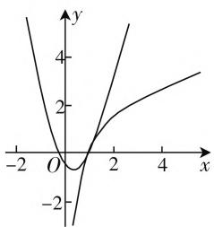

# 公切线总存在,参数值妙破解

—— 一道函数题的探究

山东省日照实验高级中学 任百敏

近几年高考数学试卷中与函数切线相关的问题时有涉及,与日增多.特别涉及多曲线(主要是两曲线)的公切线问题,形式各样,变化多端,创新新颖,问题更加复杂,需要多重考虑.

# 一、问题呈现

问题:(2021年广东省深圳市福田区红岭中学高考数学二模试卷·16)已知函数 $f(x)=2\ln x$ , $g(x)=ax^{2}-x-\frac{1}{2}(a>0)$ ，若总存在直线与函数 $y=f(x)$ ， $y=g(x)$ 的图像均相切，则a的取值范围是\_\_\_\_.

此题以一条确定的曲线和一条含参的曲线为问题背景，以对数函数、二次函数的图像与性质为媒介，结合公切线总存在来合理设置，进而求解对应参数的取值范围。破解此类试题时，可以从函数的图形入手来分析，可以由一条曲线的切线入手再过渡到另一条曲线的切线来链接，还可以先探寻结论再合理证明等不同方法来分析与处理，充分体现逻辑思维的发散性、应用的创新性。

# 二、问题破解

解法 1: (函数图形分析法) 设函数 $y=f(x)$ 与 $y=g(x)$ 的图像在交点处存在公切线 $y=kx+t$ ，且切点为 $(n,2\ln n)$ ，由于 $f'(x)=\frac{2}{x}, g'(x)=2ax-$ 1, 结合导数的几何意义可得 $\frac{2}{n} = k = 2an - 1$ ，整理可得 $kn = 2, an^2 = \frac{n + 2}{2}$ ，结合 $2\ln n = kn + t = an^2 - n - \frac{1}{2}$ ，化简可得 $2\ln n = \frac{1 - n}{2}$ ，即 $4\ln n + n = 1$ 。设函数 $h(n) = 4\ln n + n, n > 0$ ，求导 $h'(n) = \frac{4}{n} + 1 > 0$ ，可

line

| x | y |
|---|---|
| -2 | 4 |
| 0 | 0 |
| 2 | 2 |
| 4 | 3 |

图1

得函数 $h(n)$ 在 $(0, +\infty)$ 上单调递增，由于 $h(1) = 1$ 可得 $4\ln n + n = 1$ 的解为 $n = 1$ ，此时 $a = \frac{n + 2}{2n^2} = \frac{3}{2}$ 由函数 $y = ax^2 - x - \frac{1}{2} (a > 0)$ 的图像可知，当 $a$ 越大时，抛物线的开口越小，可得此时函数 $y = f(x)$ 和 $y = g(x)$ 的图像相离，总存在直线与它们的图像都相切，则有 $a \geqslant \frac{3}{2}$ ，所以 $a$ 的取值范围是 $\left[\frac{3}{2}, +\infty\right)$ .

故填答案: $\left[\frac{3}{2},+\infty\right)$ .

点评:通过设出两函数的图像在交点处的公切线以及对应的切点坐标,通过求导,结合导数的几何意义以及函数解析式,建立参数之间的关系式,利用参数的转化加以合理消参,进而构建函数,利用函数的求导以及单调性的判断确定方程的解,进而求解参数的值,再利用抛物线的图形特征加以分析,进而确定参数的取值范围问题.借助两函数图像的一“动”—“静”的组合,合理分析函数图形特征,数形结合,问题迎刃而解.

解法2:(判别式法)由于 $f'(x)=\frac{2}{x}$ ，设切点为 $(n,2\ln n)$ ，则切线方程为 $y-2\ln n=\frac{2}{n}(x-n)$ ，代入 $y=g(x)=ax^{2}-x-\frac{1}{2}(a>0)$ ，消去参数 y 整理可得 $ax^{2}-\left(\frac{2}{n}+1\right)x+\frac{3}{2}-2\ln n=0$ ，所以判别式 $\Delta=\left(\frac{2}{n}+1\right)^{2}-4a\left(\frac{3}{2}-2\ln n\right)=0$ ，则有 $a=\frac{(n+2)^{2}}{2n^{2}(3-4\ln n)}$ .

设函数 $h(n) = \frac{(n + 2)^2}{2n^2(3 - 4\ln n)}, n > 0$ ，求导 $h'(n) = \frac{2(n + 2)(4\ln n + n - 1)}{n^3(3 - 4\ln n)^2}$ .

由 $h^{\prime}(n) = 0$ ，解得 $n = 1$ ，则当 $0 < n < 1$ 时， $h^{\prime}(n)$

<0, 函数 $h(n)$ 单调递减; 当 n > 1 时, $h'(n) > 0$ , 函数 $h(n)$ 单调递增.

所以 $h(n)_{\min} = h(1) = \frac{3}{2}$ ，则有 $a \geqslant \frac{3}{2}$ ，所以 $a$ 的取值范围是 $\left[\frac{3}{2}, +\infty\right)$ .

故填答案: $\left[\frac{3}{2},+\infty\right)$ .

点评:根据确定函数 $y=f(x)$ 的解析式进行求导,并设出对应的切点坐标,确定对应的切线方程,代入另一函数的解析式进行消参处理,建立二次方程,利用公切线的条件确定对应方程的判别式为0,分离参数a,进而构建函数,利用函数的求导以及单调性的判断确定函数的最值,进而确定参数的取值范围问题.借助两函数解析式(一“含参”一“不含参”)的组合,从代数角度切入,结合方程的转化与判别式的确定,而后加以代数运算、逻辑推理,最终解决问题.

# 三、变式拓展

探究 1: 回归问题本质, 把原来涉及两函数的图像的公切线问题直接转化为不等式的恒成立问题, 得到以下对应的变式问题. 难度与原来问题相当, 问题背景与设问方式更为直接.

变式 1: 已知不等式 $ax^{2}-2\ln x-x-\frac{1}{2}\geqslant0(a>0)$ 对任意 x>0 恒成立，则 a 的取值范围是 \_\_\_\_.

结合上述解法即可得以破解， $a$ 的取值范围是 $\left[\frac{3}{2}, +\infty\right)$ ，故填答案： $\left[\frac{3}{2}, +\infty\right)$ .

探究 2: 改变问题设问方式, 由原来的全称命题——“总存在公切线”改变为特称命题——“有公切线”, 得到对应的变式问题.

变式2: 若函数 $f(x)=\ln x$ 与函数 $g(x)=x^{2}+2x+\ln a(x<0)$ 的图像有公切线，则实数 a 的取值范围是 \_\_\_\_.

解析: $f'(x)=\frac{1}{x},g'(x)=2x+2$ ,设与 $g(x)=x^{2}+2x+\ln a$ 相切的切点为 $(s,t),s<0$ ,与曲线 $f(x)=\ln x$ 相切的切点为 $(m,n),m>0$ ,则有公共切线斜率为 $2s+2=\frac{1}{m}=\frac{n-t}{m-s}$ .

又 $t = s^2 + 2s + \ln a, n = \ln m$ ，即有 $\ln a = s^2 - 1 + \ln(2s + 2)$ .

设 $h(s)=s^{2}-1-\ln(2s+2)(-1<s<0)$ ，所以 $h'(s)=\frac{2s^{2}+2s-1}{s+1}<0$ ，则有 $h(s)>h(0)=-\ln2-1$ ，即 $\ln a>-\ln2-1$ ，由于 $s\in(-1,0)$ ，且趋近于 -1 时， $h(s)$ 无限增大，所以 $a>\frac{1}{2e}$ .

故填答案: $\left(\frac{1}{2e},+\infty\right)$ .

探究 3: 改变问题的设问方式, 利用两函数图像的公共点为公切点来设置, 得到以下相应的变式问题.

变式3:设点P为函数 $f(x)=\frac{1}{2}x^{2}+2ax$ 与 $g(x)=3a^{2}\ln x+b(a>0)$ 的图像的公共点,以P为切点可作直线与两曲线都相切,则实数b的最大值为\_\_\_\_.

解析:设点 $P(m,n)$ ，由于点 P 为两曲线的切点，则 $\frac{1}{2}m^{2}+2am=3a^{2}\ln m+b$ ，函数 $f(x)=\frac{1}{2}x^{2}+2ax$ 的导数为 $f'(x)=x+2a, g(x)=3a^{2}\ln x+b$ 的导数为 $g'(x)=\frac{3a^{2}}{x}$ .

又它们在点 P 处的切线相同，则 $f'(m)=g'(m)$ ，即 $m+2a=\frac{3a^{2}}{m}$ ，即 $(m+3a)(m-a)=0$ 。

又 $a > 0, m > 0$ ，所以 $m = a$ ，于是 $b = \frac{5}{2} a^2 - 3a^2 \ln a$ ，其中 $a > 0$ ，设函数 $h(x) = \frac{5}{2} x^2 - 3x^2 \ln x$ ，其中 $x > 0$ ，则 $h'(x) = 2x(1 - 3\ln x)$ ，其中 $x > 0$ ，所以 $h(x)$ 在 $(0, e^{\frac{1}{3}})$ 上单调递增，在 $(e^{\frac{1}{3}}, +\infty)$ 上单调递减.

所以实数 $b$ 的最大值为 $h(\mathrm{e}^{\frac{1}{3}}) = \frac{3}{2}\mathrm{e}^{\frac{2}{3}}$ .

故填答案: $\frac{3}{2}e^{2}$ .

# 四、解后反思

解决多曲线(主要是两曲线)的公切线问题,可以借助其中一条曲线的切线方程的设置或求解,再与另一条曲线建立对应的关系式;可以借助函数的图像加以数形结合,直观分析;还可以通过思维的变化过程,先探寻再分析等.破解的关键就是从复杂的曲线或已知的曲线入手,再与简单的曲线或含参的曲线建立关系,合理串联,巧妙转化.F