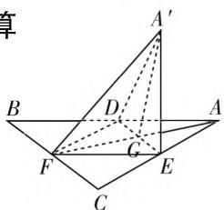

# 压轴小题细归类,突破“瓶颈”迈一流

# ● 江苏省宜兴市第二高级中学 杨晶晶

在高考数学一轮、二轮复习后，有相当多的考生会出现一个成绩提升的停滞期或平台期，达到一个成绩突破的“瓶颈期”——无论怎样复习、怎样努力，数学成绩没有明显下降或提升，陷入了停滞不前的状态，让人苦恼。而要真正有效突破复习的“瓶颈”，让数学成绩再上一个台阶，就得充分挖掘选择题与填空题中的压轴小题，合理归类，整体提升，对这两类客观题的第8,11,12,15,16题有较大收获，取得较大的突破，达到“柳暗花明”，实现保“本”冲“优”，大步迈进双一流。

# 一、函数的图像与性质及其应用

例 1 （2020 年江南名校联考）已知 $f(x)$ 是定义在 R 上的奇函数，且当 x > 0 时， $f(x) = \frac{2}{\pi} x - \ln x + \ln \frac{\pi}{2}$ ，则函数 $g(x) = f(x) - \sin x$ 的零点个数为（）.

A. 1 B. 2 C. 3 D. 5

解析: 函数 $g(x)$ 的零点个数, 即函数 $y = f(x)$ 的图像与 $y = \sin x$ 的图像交点个数, 当 x > 0 时, $f(x) = \frac{2}{\pi}x - \ln x + \ln \frac{\pi}{2}$ , 则 $f'(x) = \frac{2}{\pi} - \frac{1}{x} = \frac{2x - \pi}{\pi x}$ . 令 $f'(x) = 0$ , 得 $x = \frac{\pi}{2}$ , 易知当 $0 < x < \frac{\pi}{2}$ 时, $f'(x) < 0$ ; 当 $x > \frac{\pi}{2}$ 时, $f'(x) > 0$ , 则 $f(x)$ 在 $\left(0, \frac{\pi}{2}\right)$ 上单调递减, 在 $\left(\frac{\pi}{2}, +\infty\right)$ 上单调递增, 所以当 $x = \frac{\pi}{2}$ 时, $f(x)$ 取得最小值, 且最小值为 $f\left(\frac{\pi}{2}\right) = 1$ , 而函数 $y = \sin x$ 在 $x = \frac{\pi}{2}$ 处取得最大值 1, 所以当 x > 0 时, $f(x)$ 的图像与 $y = \sin x$ 的图像有且只有一个交点 $\left(\frac{\pi}{2}, 1\right)$ , 由 $f(x)$ 和 $y = \sin x$ 均为奇函数, 可得当 x < 0 时, $f(x)$ 的图像与 $y = \sin x$ 的图像的交点也有且只有一个, 为点 $\left(-\frac{\pi}{2}, -1\right)$ , 又两函数的图像均过原点, 因此函数 $y=f(x)$ 与 $y=\sin x$ 的图像有 3 个交点，所以函数 $g(x)=f(x)-\sin x$ 的零点有 3 个.

故选 C.

归纳提升:(1)利用图像法求函数 $f(x)$ 的零点个数时,直接画函数 $f(x)$ 的图像较困难,可以将函数的解析式变形,将相关函数的零点个数问题转化为两个基本初等函数的图像的交点个数问题,进而画出两个基本初等函数的图像,数形结合,看其交点的横坐标有几个不同的值,就有几个不同的零点.

(2) 求解函数的图像与性质的综合应用问题的基本破解策略: ① 有效实现函数的基本性质、方程、不等式等问题的合理转化, 掌握一些常见的方法与技巧; ② 合理破解函数的单调性、奇偶性、周期性、最值、对称性及方程与零点等相关问题, 掌握一些常见的方法与技巧.

# 二、三角函数与解三角形

例 2 （2020 届江苏省扬州市高三数学四模（6 月最后一卷）试卷·14）在锐角 $\triangle ABC$ 中，a, b, c 分别为角 A, B, C 的对边，若 $a \cos B = b (1 + \cos A)$ ，则 $\frac{a^{2}}{b^{2}} + \frac{b}{c}$ 的取值范围为 \_\_\_\_.

解析:由 $a\cos B=b(1+\cos A)$ ，及正弦定理可知， $\sin A\cos B=\sin B(1+\cos A)$ ，则有 $\sin A\cos B-\cos A\sin B=\sin B$ ，即 $\sin(A-B)=\sin B$ ，可得 A-B=B，即 A=2B，则 $C=\pi-A-B=\pi-3B$ ，而 $\triangle ABC$ 为锐角三角形，则有 $\left\{\begin{aligned}0&<B<\frac{\pi}{2},\\ 0&<2B<\frac{\pi}{2},\quad 解得\frac{\pi}{6}<B\\ 0&<\pi-3B<\frac{\pi}{2},\end{aligned}\right.$ $<\frac{\pi}{4}$ ，结合正弦定理有 $\frac{a^{2}}{b^{2}}+\frac{b}{c}=\frac{\sin^{2}A}{\sin^{2}B}+\frac{\sin B}{\sin C}=$

$$
\frac {\sin^ {2} 2 B}{\sin^ {2} B} + \frac {\sin B}{\sin 3 B} = \frac {4 \sin^ {2} B \cos^ {2} B}{\sin^ {2} B} + \frac {\sin B}{3 \sin B - 4 \sin^ {3} B} =
$$

$4\cos^{2}B+\frac{1}{3-4\sin^{2}B}.$ 令 $t=3-4\sin^{2}B$ ，由 $B\in$

$\left(\frac{\pi}{6}, \frac{\pi}{4}\right)$ , 可得 $\sin B \in \left(\frac{1}{2}, \frac{\sqrt{2}}{2}\right)$ , 则有 $t \in (1, 2)$ , 所以 $\frac{a^2}{b^2} + \frac{b}{c} = t + \frac{1}{t} + 1 \in \left(3, \frac{7}{2}\right)$ , 即 $\frac{a^2}{b^2} + \frac{b}{c}$ 的取值范围为 $\left(3, \frac{7}{2}\right)$ .

故填答案: $\left(3,\frac{7}{2}\right)$ .

归纳提升:(1)研究三角函数的图像与性质,关键在于灵活利用三角恒等变换公式将函数化为 $y = A \sin(\omega x + \varphi) + B (\omega > 0, A > 0)$ 的形式,进一步讨论函数的单调性、对称性、周期、零点等.

(2) 解三角形的关键是灵活运用三角形的基本特征, 借助正弦定理或余弦定理实施边与角的转化, 特别在求解三角形面积的取值问题时, 常把三角形面积这个目标函数转化为三角形的边或角的形式, 然后借助基本不等式或函数性质 (特别是二次函数) 来分析与解决.

# 三、空间位置关系与计算

例 3 （多选题）如图 1 所示, 等边 $\triangle ABC$ 的中线 AF 与中位线 DE 相交于点 G, 其中 $\triangle A'ED$ 是 $\triangle AED$ 绕 DE 旋转过程中的一个图形, 那么下列命题中正确的是().

text_image

章
A'
B
D
A
F
G
E
C

图1

A. 动点 $A'$ 在平面 $ABC$ 上的射影在线段 $AF$ 上  
B. 恒有 $BD \parallel$ 平面 $A'EF$   
C. 三棱锥 $A' - EFD$ 的体积有最大值  
D. 异面直线 $A^{\prime}F$ 与 DE 不可能垂直

解析:对于选项 A, 因为 $\triangle ABC$ 是正三角形, $A^{\prime}D = A^{\prime}E$ , 则知点 $A^{\prime}$ 在平面 ABC 上的射影在线段 AF 上, 正确;

对于选项 B, 结合 D, E, F 分别是线段 AB, AC, BC 的中点, 可得 $BD \parallel EF$ , 则知恒有 $BD \parallel$ 平面 $A'EF$ , 正确;

对于选项 C，由于三棱锥 $A^{\prime}-FED$ 的底面 $\triangle EFD$ 的面积是定值，则其体积由高（即点 $A^{\prime}$ 到底面的距离）决定，可知当平面 $A^{\prime}DE \perp$ 平面 BCED 时，三棱锥 $A^{\prime}-FED$ 的体积有最大值，正确；

对于选项 D, 由于 $DE \perp$ 平面 $A'FG$ , 故有 $A'F \perp DE$ , 错误.

故选 ABC.

归纳提升:(1) 在平面图形折叠成空间图形的过程中,要充分抓住边、角、线等元素之间的关系保持不变的,抓住不变性,明确几何量之间的关系是解题的关键.

(2) 涉及空间角或空间距离的求解问题,关键是合理借助几何法作出相应的空间角或空间距离,合理推理,巧妙求解;或构建合理的空间直角坐标系,通过坐标法加以代数运算,合理考查学生数学运算与逻辑推理等数学核心素养.

# 四、导数及其应用

例 4 （安徽省十校联盟 2020 届高三线上自主联合检测数学理科试卷·12）已知函数 $f(x)=2ax-a\sin x+\cos x$ 在 $(-∞,+∞)$ 上单调递减，则实数 a 的取值范围是（）.

A. $\left(-\infty,\frac{\sqrt{3}}{3}\right]$

B. $\left(-\infty,\frac{\sqrt{3}}{3}\right)$

C. $\left(-\infty,-\frac{\sqrt{3}}{3}\right]$

D. $\left(-\infty,-\frac{\sqrt{3}}{3}\right)$

解析:由于 $f'(x)=2a-a\cos x-\sin x$ ，而函数 $f(x)=2ax-a\sin x+\cos x$ 在 $(-∞,+∞)$ 上单调递减，则有 $f'(x)\leqslant0$ 恒成立，即 $2a-a\cos x-\sin x\leqslant0$ 恒成立。分离参数可得 $a\leqslant\frac{\sin x}{2-\cos x},x\in(-∞,+∞)$ ，则知 $a\leqslant\left(\frac{\sin x}{2-\cos x}\right)_{\min}$ 。设 $t=\frac{\sin x}{2-\cos x}$ ，整理可得 $2t=\sin x+t\cos x=\sqrt{1+t^{2}}\sin(x+\varphi)$ ，则有 $2t\leqslant\sqrt{1+t^{2}}$ ，解得 $-\frac{\sqrt{3}}{3}\leqslant t\leqslant\frac{\sqrt{3}}{3}$ ，所以 $a\leqslant\left(\frac{\sin x}{2-\cos x}\right)_{\min}=-\frac{\sqrt{3}}{3}$ ，即实数 a 的取值范围是 $\left(-∞,-\frac{\sqrt{3}}{3}\right]$ 。

故选 C.

归纳提升:(1) 利用导数这一基本工具来研究函数的图像与基本性质(单调性、极值或最值等)时,要充分考虑函数中的相关字母参数问题,借助参数的不同取值情况并结合题目条件合理进行分类讨论.

(2) 利用导数这一基本工具来研究函数的零点或相应的不等式问题时, 往往要通过合理构建相关的函数加以合理转化, 利用函数的单调性加以数形结合, 破解的关键是合理构建相关的函数来处理.

借助实例,系统归类一些常见的压轴小题,总结规律,归纳提升,可以有效突破“瓶颈”,提升自己破解选择题与填空题中的压轴小题的能力,提升高考数学一轮、二轮复习效益,实现本质改变,达到有效突破. F