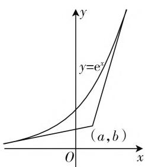

# 双切线存在性,巧思维妙破解

——2021年高考数学新高考卷Ⅰ第7题

\- 江苏省海头高级中学 王从江

双切线问题是近年高考数学新高考试卷中的一个创新热点，题设以一条曲线或两条曲线为问题背景，结合双切线的巧妙设置来综合考查，或双切线的位置关系，或双切线的存在性，形式各样，变化多端，很好地把函数与导数之间的相关知识加以合理交汇与巧妙融合，“数”“形”结合，“动”“静”配合，画面感强，创新新颖，备受关注.

# 一、真题呈现

高考真题:(2021年新高考卷Ⅰ第7题)若过点 $(a,b)$ 可以作曲线 $y=e^{x}$ 的两条切线,则().

A. $e^{b} < a$

B. $e^{a} < b$

C. $0 < a < e^{b}$

D. $0 < b < e^{a}$

# 二、真题剖析

该题条件简单明了,以未知的一个点的坐标 $(a,b)$ 为背景,其可以作确定指数函数 $y=e^{x}$ 所对应的曲线的两条切线,利用双切线的存在性,进而确定该点坐标 $(a,b)$ 中对应的参数所对应的代数式的大小关系.

在具体破解时,利用导数的运算以及导数的几何意义,合理确定导函数的基本特征,在此基础上,可以借助代数推理,结合切线方程的建立以及对应函数的构建,借助函数的单调性、最值,并结合方程的根的情况来进行推理与分析;可以借助数形直观,利用函数图像的直观性,结合点所处位置的分类讨论加以排除与确定;可以引入特殊值,以特殊情况下不等式成立的情况,来反馈一般,结合各选项中的关系式来判断与选择.切入视角各样,破解技巧多变,都可以很好破解问题,作出正确的判断.

# 三、真题破解

解法 1: (代数推理法) 由于函数 $y = e^{x}$ 是定义域 R 上的增函数, 导函数 $y' = e^{x} > 0$ 恒成立.

设切点为 $(t, \mathrm{e}^t)$ ，则切线方程为 $y = \mathrm{e}^t (x - t) + \mathrm{e}^t$ ，则有 $b = \mathrm{e}^t (a - t) + \mathrm{e}^t$ ，整理可得 $(t - a - 1)\mathrm{e}^t + b = 0$ .

构造函数 $f(t) = (t - a - 1)\mathrm{e}^t + b$ ，求导可得 $f'(t) = (t - a)\mathrm{e}^t$ .

由 $f'(t)=0$ 解得 t=a，则知当 $t\in(-\infty,a)$ 时，函数 $f(t)$ 单调递减；当 $t\in(a,+\infty)$ 时，函数 $f(t)$ 单调递增.

根据题意可知，方程 $f(t) = 0$ 有两解，所以 $f(t)_{\min} = f(a) = -\mathrm{e}^a + b < 0$ ，则有 $b < \mathrm{e}^a$ .

又因为当 $t \to +\infty$ 时， $f(t) \to +\infty$ ，则存在 $x_1 \in (a, +\infty)$ ，使得 $f(x_1) = 0$ ，而当 $t \to -\infty$ 时， $f(t) \to b$ ，则应有 $b > 0$ ，此时存在 $x_2 \in (-\infty, a)$ ，使得 $f(x_2) = 0$ 。

综上分析,可得 $0 < b < e^{a}$ .

故选D.

点评:设出相应的切点,利用导数的几何意义以及导数的运算确定切线方程,代入已知点的坐标转化为相应的方程;合理构建函数,利用求导处理,并结合函数的单调性确定函数的最小值;根据方程有两解得以确定函数的最小值小于零,进而确定参数之间的关系;最终结合极限思维确定函数的两个零点的存在性,进而确定参数的取值情况.借助代数转化,通过函数构建以及函数基本性质的应用来巧妙应用.

解法 2: (数形结合法) 由于函数 $y = e^{x}$ 是定义域 R 上的增函数, 导函数 $y' = e^{x} > 0$ 恒成立, 作出函数 $y = e^{x}$ 的图像, 如图 1 所示, y > 0, 即切点必须在 x 轴上方, 若点 $(a, b)$ 在 x 轴上或 x 轴下方时, 则该点与其中一个切点的连线的斜率小于0, 这与导函数 $y' = e^{x} > 0$ 恒成立矛盾.

text_image

y
y=e^x
(a, b)
O
x

图1

由此可知点 $(a, b)$ 在 $x$ 轴或 $x$ 轴下方时，只有一条切线.

若点 $(a, b)$ 在函数 $y = \mathrm{e}^x$ 所对应的曲线上，也只有一条切线.

若点 $(a,b)$ 在函数 $y=e^{x}$ 所对应的曲线上侧,此时没有切线.

综上分析,结合函数 $y=e^{x}$ 的图像,可知点 $(a,b)$ 在函数 $y=e^{x}$ 所对应的曲线的下方,并且在 x 轴的上方,此时有两条切线,数形结合可知 $0<b<e^{a}$ .

故选D.

点评:结合指数函数的图像加以直观,通过对应点所在位置情况的分类讨论,利用该导函数恒大于零的特点,在不同点所处位置情况的条件下分析存在两条切线的情况,进行合理的排除与确定,从而得以确定对应代数式之间的大小关系问题.借助数形结合,更加直观形象,并利用分类讨论,条理清晰,分析合理.

解法3:(特殊值法)由于函数 $y=e^{x}$ 是定义域 R 上的增函数,导函数 $y' = e^{x} > 0$ 恒成立,结合函数 $y = e^{x}$ 的图像,可知 y > 0,即切点坐标必须在 x 轴上方,取特殊值 a = 0,此时点 $(0, b)$ 在 y 轴上,而要使得过点 $(0, b)$ 可以作曲线 $y = e^{x}$ 的两条切线,则只能是 0 < b < 1,由此可以判断 0 < b < 1 = $e^{0}$ ,回归一般性,结合各选项,可知 0 < b < $e^{a}$ .

故选D.

点评:结合利用该导函数恒大于零的特点,通过特殊值的选取,更加直接明了地确定另一参数的取值情况,进而在这个特殊值背景下,结合题目条件中的选项,合理转化对应的代数关系式,选择相吻合的答案.借助特殊值处理,更加简捷快速,破解的关键是特殊值的选择与确定,具有一定的片面性,要加以合理的验证与纠正.

# 四、变式拓展

探究 1: 保留原来高考真题中题目创新新颖的背景, 改变原来问题中的“指数函数 $y = e^{x}$ ”为“对数函数 $y = \ln x$ ”, 结合双切线的存在性, 进而确定相应代数式的大小问题. 考点基本保持不变, 难度与原题基本相当.

变式1: 若过点 $(a,b)$ 可以作曲线 $y=\ln x$ 的两条切线, 则().

A. $\ln b < a$

B. $\ln a < b$

C. $a < \ln b$

D. $b < \ln a$

解析:由于函数 $y=\ln x$ 是定义域 $(0,+\infty)$ 上的增函数,导函数 $y'=\frac{1}{x}>0$ 恒成立,结合函数 $y=\ln x$ 的图像,可知 x>0,即切点坐标必须在 y 轴右侧,取特殊值 b=0,此时点 $(a,0)$ 在 x 轴上,而要使得过点 $(a,0)$ 可以作曲线 $y=\ln x$ 的两条切线,则只能是 0<a<1,则知 $\ln a<0$ ,由此可以判断 $\ln a<0=b$ ,回归一般性,结合各选项,可知 $\ln a<b$ .

故选 B.

点评:这里直接利用特殊值法加以解析与判断.当然也可以利用代数推理或数形结合法来处理,具体的过程可以参照高考真题的破解过程,再结合具体的对数函数背景加以适当改变,从而得以正确剖析.

# 五、解后反思

涉及曲线中的双切线问题,主要包括双切线的存在性与双切线的位置关系这两类问题,具体破解时,关键还是抓住导数的运算与导数的几何意义,结合具体情境,合理转化,巧妙应用.

# (一) 双切线存在性的破解技巧策略

抓住导数的几何意义,利用导函数所对应的函数值与切线的斜率之间的对应关系,结合双曲线的存在性的相关条件,合理确定满足条件的关系式或联系,或代数推理,或数形结合,视角不同,注意利用导函数的函数值与切线的斜率之间的直接关系来确定双切线的存在性问题.

# （二）双切线位置关系的破解技巧策略

通过求导运算,抓住导数的几何意义,确定导函数在切点处的函数表达式,利用双切线位置关系(经常是平行关系、垂直关系等),合理建立相应的关系式,借助双切线位置关系的应用,进而确定与之相关的参数值、代数式大小关系等相关问题.注意数形结合与代数推理相结合.F