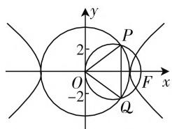

# 对一个双曲线的结论及其应用

# ● 江苏省昆山市柏庐高级中学 王 跃

圆锥曲线中,有一些相应的定点、特殊点等问题.此类问题有效沟通起“动态”与“静态”之间的联系,是高考数学中的比较常见题型之一,备受关注.同时,其也是解析几何中的综合与交汇的重要载体,是考查数学能力,体现选拔功能的一个阵地.下面结合涉及双曲线中的定点或特殊点的一个结论展示,并通过实例剖析该结论的实际应用.

# 一、结论展示

【结论】设 F 是双曲线 $C: \frac{x^{2}}{a^{2}} - \frac{y^{2}}{b^{2}} = 1 (a > 0, b > 0)$ 的一个焦点，O 为坐标原点，以线段 OF 为直径的圆与圆 $x^{2} + y^{2} = a^{2}$ 相交于 P, Q 两点，则 P, Q 恰是双曲线 C 的准线与渐近线的交点.

证明：设点 $F$ 坐标为 $(c, 0)$ ，则以线段 $OF$ 为直径的圆的方程为 $\left(x - \frac{c}{2}\right)^2 + y^2 = \left(\frac{c}{2}\right)^2$ ，即 $x^2 + y^2 - cx = 0$ ，与圆 $x^{2} + y^{2} = a^{2}$ 联立，解得 $x = \frac{a^2}{c}$ ，即直线 $PQ$ 为双曲线 $C$ 的准线，不妨设点 $P$ 在第一象限，将 $x = \frac{a^2}{c}$ 代入圆 $x^{2} + y^{2} = a^{2}$ ，可得 $y = \frac{ab}{c}$ ，即点 $P\left(\frac{a^2}{c}, \frac{ab}{c}\right)$ ，于是 $\frac{y}{x} = \frac{b}{a}$ ，即点 $P$ 在双曲线 $C$ 的渐近线 $y = \frac{b}{a} x$ 上。根据对称性可知，点 $Q$ 在双曲线 $C$ 的渐近线 $y = -\frac{b}{a} x$ 上，所以 $P, Q$ 恰是双曲线 $C$ 的准线与渐近线的交点。

text_image

y
2
P
O
-2
F
x
Q

图1

点评:通过证明,有效沟通起双曲线与两个圆之间的关系,把双曲线与圆的相关几何性质加以合理链接,从而得以转化.根据该结论,可以确定对应点所在的位置,也可以结合点所在的位置来确定相应的点所在的直线或所在的圆等问题.

# 二、结论应用

# （一）位置特征的判定

例 1 设 F 为双曲线 $C: \frac{x^{2}}{a^{2}} - \frac{y^{2}}{b^{2}} = 1 (a > 0, b > 0)$ 的右焦点，O 为坐标原点，双曲线的渐近线与圆 $x^{2} + y^{2} = a^{2}$ 在第一、四象限内的交点分别为 P, Q 两点，则四点 O, P, F, Q() .

A. 一定不共圆

B. 一定共圆

C. 有时共圆, 有时不共圆

D. 以上均不正确

分析:根据结论确定P,Q恰是双曲线C的准线与渐近线的交点,进而可知四点O,P,F,Q在以OF为直径的圆上,从而判定四点共圆,得以准确判定相关点的位置特征的判定问题.

解析:由于P,Q两点分别是双曲线的渐近线与圆 $x^{2}+y^{2}=a^{2}$ 在第一、四象限内的交点,根据结论,可知P,Q恰是双曲线C的准线与渐近线的交点,则知四点O,P,F,Q在以OF为直径的圆上,所以四点O,P,F,Q一定共圆.

故选 B.

点评:借助结论,双曲线 C 的准线与渐近线的交点恰好是相关两圆(圆 $x^{2}+y^{2}=a^{2}$ 与以 OF 为直径的圆)的交点,这为判定相应点的位置特征提供条件.利用结论,可以用来判定四点共圆、点与直线的位置关系以及其他相关的位置特征的判定问题.

# (二) 离心率的求解

例 2 [2019 年高考数学全国卷 II 理科第 11 题 (文科第 12 题)] 设 F 为双曲线 $C: \frac{x^{2}}{a^{2}} - \frac{y^{2}}{b^{2}} = 1 (a > 0, b > 0)$ 的右焦点，O 为坐标原点，以 OF 为直径的圆与圆 $x^{2} + y^{2} = a^{2}$ 交于 P, Q 两点. 若 $|PQ| = |OF|$ ，则 C 的离心率为（）.

A. $\sqrt{2}$

B. $\sqrt{3}$

C. 2

D. $\sqrt{5}$

分析:根据结论确定P,Q恰是双曲线C的准线与渐近线的交点,再结合题目条件得以确定直线 PQ 过以 OF 为直径的圆的圆心,从而建立相应的关系式,得以求解双曲线的离心率问题.

解析:根据结论可知,P,Q恰是双曲线C的准线与渐近线的交点,而 $|PQ|=|OF|$ ,则直线PQ过以OF为直径的圆的圆心,可得 $2\cdot\frac{a^{2}}{c}=c$ ,即 $2a^{2}=c^{2}$ ,所以双曲线C的离心率 $e=\frac{c}{a}=\sqrt{2}$ .

故选A.

点评:借助结论,快速确定点的位置,为进一步建立关系式提供条件,避免复杂的代数运算与逻辑推理,巧妙建立相关参数之间的关系式,从而得以简单快捷求解相应的双曲线离心率问题.

# (三) 参数值的确定

例3 设 $F$ 为双曲线 $C: \frac{x^2}{a^2} - \frac{y^2}{4} = 1 (a > 0)$ 的右焦点， $O$ 为坐标原点，双曲线的渐近线与圆 $x^2 + y^2 = a^2$ 在第一象限内的交点为 $P$ ，若 $|OP| = |PF|$ ，则实数 $a$ 的值为 \_\_\_\_.

分析:根据结论加以转化,从而确定点P在以OF为直径的圆上,利用圆的几何性质以及题目条件确定 $\triangle OPF$ 的几何特征,进而确定对应的双曲线渐近线的斜率,得以确定对应的参数值问题.

解析:由于双曲线的渐近线与圆 $x^{2}+y^{2}=a^{2}$ 在第一象限内的交点为 P，根据结论可知，点 P 在以 OF 为直径的圆上，而 $\left|OP\right|=\left|PF\right|$ ，则知 $\triangle OPF$ 为等腰直角三角形，即 $\angle POF=45^{\circ}$ ，可得 $\frac{b}{a}=\tan45^{\circ}=1$ ，即 a=b=2。

故填答案:2.

点评:借助结论,合理过渡,巧妙判定点的位置特征,进而得以确定三角形的形状、夹角的大小等问题,合理建立相关参数之间的关系式,从而得以快速求解相应的双曲线中的参数值问题.

# (四) 综合应用问题

例4（2019年高考数学全国卷I理科第16题）已知双曲线 $C:\frac{x^2}{a^2} -\frac{y^2}{b^2} = 1(a > 0,b > 0)$ 的左、右焦点分别为 $F_{1},F_{2}$ ，过 $F_{1}$ 的直线与C的两条渐近线分别交于A，B两点.若 $\overrightarrow{F_{1}A}=\overrightarrow{AB},\overrightarrow{F_{1}B}\cdot\overrightarrow{F_{2}B}=0$ ，则C的离心率为\_\_\_\_.

分析:根据结论,结合题目条件中平面向量的关系式加以合理应用,进而确定点A在双曲线C的左准线上,求得点A的坐标,再利用坐标的中点公式求得点B的坐标,代入双曲线C的渐近线方程,得以求解双曲线的离心率问题.

解析:由 $\overrightarrow{F_{1}A}=\overrightarrow{AB}$ 可知, A 是 $F_{1}B$ 的中点, 而 O 为 $F_{1}F_{2}$ 的中点, 则知 $OA \parallel F_{2}B$ . 又 $\overrightarrow{F_{1}B} \cdot \overrightarrow{F_{2}B}=0$ , 则知 $F_{1}B \perp F_{2}B$ , 可得 $F_{1}B \perp OA$ , 则知点 A 就是以 $OF_{1}$ 为直径的圆与渐近线的交点. 根据结论可知, 点 A 在双曲线 C 的左准线上, 可得 $x_{A}=-\frac{a^{2}}{c}$ . 由双曲线 C 的渐近线方程 $y=-\frac{b}{a}x$ , 可得点 A 的坐标为 $\left(-\frac{a^{2}}{c}, \frac{ab}{c}\right)$ , 而 $F_{1}(-c,0)$ , 结合 A 是 $F_{1}B$ 的中点, 可得 $B\left(c-\frac{2a^{2}}{c}, \frac{2ab}{c}\right)$ , 代入双曲线 C 的渐近线方程 $y=\frac{b}{a}x$ , 可得 $\frac{2ab}{c}=\frac{b}{a} \cdot \left(c-\frac{2a^{2}}{c}\right)$ , 即 $4a^{2}=c^{2}$ , 所以双曲线 C 的离心率 $e=\frac{c}{a}=2$ .

故填答案:2.

点评:借助结论,巧妙把双曲线问题、平面向量问题、平面几何问题等加以合理融合与转化,达到交汇知识,融合能力的目的,进而巧妙转化,合理应用,有效破解双曲线中的综合应用问题.

涉及双曲线中的定点或特殊点问题, 设置巧妙, 背景生动, 交汇性强, 知识内容丰富, 综合性强, 趣味性高. 通过掌握涉及双曲线的定点或特殊点的相应结论, 并结合双曲线的相关知识与基本性质加以综合应用, 转化合理, 求解巧妙, 有效提升学生的推理能力与创新意识, 全面提高思维能力和思维品质, 培养数学核心素养. W