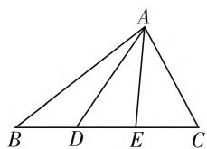
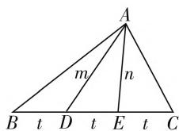
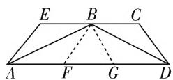

# 巧借中线定理,妙解高中问题

# ● 南京市金陵中学河西分校 杨 红

三角形的中线定理是初中平面几何中的一个重要定理，经常用来破解相关的平面几何问题，其内容如下：若 $AD$ 是 $\triangle ABC$ 的中线，则有 $|AB|^2 + |AC|^2 = 2(|AD|^2 + |BD|^2)$ . 该结论在现行不同版本的高中数学必修4、必修5教材中都有出现，涉及平面几何背景的解三角形问题、平面向量问题、解析几何问题等，根据平面几何图形的条件与特征，经常可以巧妙利用三角形的中线定理来处理，合理转化，巧妙破解.

# 一、中线定理在解三角形中的应用

在解三角形问题中,通过题中相应的线段中点条件,结合三角形的中线定理来确定相应的线段中点,再利用解三角形中的正弦(或余弦)定理或其他相关的数学知识工具(函数、不等式或平面向量等)来转化与应用.

例 1 [2020 届江苏省苏北四市(徐州、宿迁、淮安、连云港)高三上学期第一次质量检测(期末)数学试题·13] 如图 1, 在 $\triangle ABC$ 中, $D, E$ 是 $BC$ 上的两个三等分点, $\overrightarrow{AB} \cdot \overrightarrow{AD} = 2\overrightarrow{AC} \cdot \overrightarrow{AE}$ , 则 $\cos \angle ADE$ 的最小值为 \_\_\_\_.

分析:结合平面几何图形的直观,设出相关的线段长度,结合三角形的中线定理建立相应的关系式,借助题目中的平面向量的数量积的关系式,利用数量积定义与余弦定理来建立关系式,进而得到相关参数之间的等量关系,最后利用余弦定理来确定对应的余弦值,并借助基本不等式来确定最小值.

  
图1

  
图2

解析：如图2所示，设 $|AB|=c,\quad|AC|=b,\quad|BC|=a,\quad|AD|=m,\quad|AE|=n,\quad|BD|=|DE|=|EC|=t.$ 在 $\triangle ABE$ 中，AD为BE边上的中线，结合

三角形的中线定理，可得 $c^2 + n^2 = 2m^2 + 2t^2$ ，即 $c^2 = 2m^2 + 2t^2 - n^2$ .同理可得 $b^2 = 2n^2 + 2t^2 - m^2$ .结合 $\overrightarrow{AB} \cdot \overrightarrow{AD} = 2\overrightarrow{AC} \cdot \overrightarrow{AE}$ 以及余弦定理，可得 $cm \cdot \frac{c^2 + m^2 - t^2}{2cm} = 2bn \cdot \frac{b^2 + n^2 - t^2}{2bn}$ ，整理有 $c^2 + m^2 = 2b^2 + 2n^2 - t^2$ .将 $c^2 = 2m^2 + 2t^2 - n^2$ 和 $b^2 = 2n^2 + 2t^2 - m^2$ 代入上式，整理可得 $5m^2 = 7n^2 + t^2$

在 $\triangle ADE$ 中, 结合余弦定理, 可得 $\cos\angle ADE =$ $\frac{m^{2}+t^{2}-n^{2}}{2mt}=\frac{m^{2}+t^{2}-\frac{5m^{2}-t^{2}}{7}}{2mt}=\frac{m^{2}+4t^{2}}{7mt}\geqslant$ $\frac{2\sqrt{m^{2}\times4t^{2}}}{7mt}=\frac{4}{7}$ ，当且仅当 $m^{2}=4t^{2}$ ，即m=2t时，等号成立.

故填答案: $\frac{4}{7}$ .

点评:根据题目条件中的平面几何的图形特征,以及三角形的背景与应用,综合平面几何的图形特征、平面向量的性质以及解三角形知识等来综合处理,多知识交汇融合,平面几何直观想象,合理应用解三角形的相关知识与数形直观,进行逻辑推理与转化,从而得以正确破解.

# 二、中线定理在平面向量中的应用

在平面向量中,通过题中相应的线段中点条件,结合三角形的中线定理来确定相应的线段中点,综合平面向量的线性关系与运算、坐标运算等,以及平面向量的其他相关知识加以分析与应用.

例 2 （2019 年高考数学天津卷文、理科第 14 题）在四边形 ABCD 中， $AD \parallel BC, AB = 2\sqrt{3}, AD = 5, \angle A = 30^{\circ}$ ，点 E 在线段 CB 的延长线上，且 AE = BE，则 $\overrightarrow{BD} \cdot \overrightarrow{AE} =$ \_\_\_\_ .

分析:结合平面几何图形的直观想象,以平面四边形为几何背景,通过相应的边、角的关系与转化,通过平面几何的逻辑推理以及三角形的中线定理、余弦定理的应用,数形结合,直观形象,进一步综合平面向量的极化恒等式来建立关系式得以转化,从而得以分析与求解.

  
图3

解析:如图3,过点B作 $BF \parallel AE$ 交AD于点F.

因为 AE = BE，故四边形 AEBF 为菱形.

取 FD 的中点 G，由于 $AD \parallel BC, \angle A = 30^{\circ}$ ，点 E 在线段 CB 的延长线上，且 AE = BE，

则知 $\angle BAE = \angle ABE = \angle DAB = 30^{\circ}$

则有 $\angle BFD = \angle EAD = 60^{\circ}$

又 $AB = 2\sqrt{3}$ ，可得 $AE = BE = AF = BF = 2$

而 AD=5，可得 FD=3。

在 $\triangle BFD$ 中，由余弦定理可得 $BD = \sqrt{2^2 + 3^2 - 2 \times 2 \times 3 \times \cos 60^\circ} = \sqrt{7}$ .

结合三角形的中线定理，可得 $(2BG)^{2} + FD^{2} = 2(BF^{2} + BD^{2})$ ，可得 $BG^2 = \frac{13}{4}$

由极化恒等式，可得 $\overrightarrow{BD} \cdot \overrightarrow{AE} = -\overrightarrow{BD} \cdot \overrightarrow{BF} = -\left(\overrightarrow{BG}^2 - \frac{1}{4}\overrightarrow{FD}^2\right) = -\left(\frac{13}{4} - \frac{1}{4} \times 3^2\right) = -1.$

故填答案: -1.

点评: 在破解平面向量问题中, 回归平面向量“形”的本质, 从平面几何角度直观入手, 通过线段中点的选取, 利用平面向量的极化恒等式来建立向量关系式, 并进一步加以转化与化简, 可以用来破解一些与之相关的平面向量问题, 数形结合, 直观想象, 合理转化, 从而得以解决.

# 三、中线定理在解析几何中的应用

在解析几何中,通过题中相应的线段中点条件,结合三角形的中线定理来建立对应线段的关系式,综合利用解析几何中圆的性质、圆锥曲线的定义、方程与几何性质,以及其他相关的数学知识工具(函数、不等式、解三角形或平面向量等)来转化与应用.

例 3 （原创题）已知圆 O: $x^{2} + y^{2} = 4$ ，直线 l 与圆 O 交于点 P, Q 两点，A(2,2)，若 $AP^{2} + AQ^{2} = 40$ ，则 $\triangle APQ$ 的面积最大值为 \_\_\_\_.

分析: 在解析几何背景中, 先引入线段 PQ 的中点 M 的坐标, 从形的角度入手, 结合平面几何中三角形的中线定理加以转化得以确定点 M 的轨迹方程, 进而利用两点间的距离公式以及三角形的面积公式加以合理转化,结合三角形的性质,通过合理配方转化,来确定相应的最值问题.

解析:设点 M 为 PQ 的中点, $M(x,y)$ .

根据三角形的中线定理, 可得 $AP^{2} + AQ^{2} = 2AM^{2} + 2MQ^{2}$ .

根据条件 $AP^{2} + AQ^{2} = 40$ ,

则有 $40 = 2AM^{2} + 2(OQ^{2} - OM^{2})$

整理有 $AM^{2}+4-OM^{2}=20$ ，即 $AM^{2}-OM^{2}=16$ ，

可得 $(x - 2)^{2} + (y - 2)^{2} - (x^{2} + y^{2}) = 16$

整理有 $x + y + 2 = 0$ ,

而 $AM^2 = OM^2 + 16 = x^2 + y^2 + 16$

$$
P Q ^ {2} = 4 \left(r ^ {2} - O M ^ {2}\right) = 4 \left(4 - x ^ {2} - y ^ {2}\right),
$$

所以 $S_{\triangle APQ} \leqslant \frac{1}{2} PQ \cdot AM = \frac{1}{2}\sqrt{PQ^2 \cdot AM^2}$

$$
\begin{array}{l} = \sqrt {(x ^ {2} + y ^ {2} + 1 6) (4 - x ^ {2} - y ^ {2})} \\ = \sqrt {- (x ^ {2} + y ^ {2}) ^ {2} - 1 2 (x ^ {2} + y ^ {2}) + 6 4} \\ \leqslant \sqrt {- \left(\frac {(x + y) ^ {2}}{2}\right) ^ {2} - 1 2 \times \frac {(x + y) ^ {2}}{2} + 6 4} \\ = \sqrt {- \left(\frac {(- 2) ^ {2}}{2}\right) ^ {2} - 1 2 \times \frac {(- 2) ^ {2}}{2} + 6 4} = 6, \\ \end{array}
$$

当且仅当 $x + y = -2$ ，即 $PQ \perp AM$ 时，等号成立.即 $\triangle APQ$ 的面积最大值为6.

故填答案:6.

点评:在解析几何问题的破解中,充分挖掘和利用解析几何图形本身的一些平面几何性质,建立起解析几何与平面几何之间相应的边、角等之间的关系,数与形合理转化,往往可以使得问题的解决更为直观,操作更为方便快捷,运算更为有效简单,得到一些优美且简洁的解答.

三角形的中线定理缘于平行四边形四边对角线平方和定理，还可以进一步得到三角形中线长定理，在相应的高中数学问题中的应用，进一步拉近了初中数学与高中数学之间的有机联系，充分说明数学知识的基础性、连续性与拓展性。而巧妙借助三角形的中线定理来破解一些相应的高中数学问题，根据平面几何图形的条件与特征，经常可以巧妙利用三角形的中线定理来处理，可以更进一步回归本质，数形直观，抓住题意，合理转化，在破解一些相关问题中更为直观有效，是破解相关问题的一种基本思维，一种通解，一种妙解。W