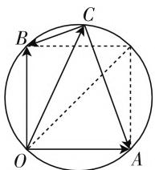
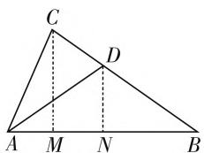
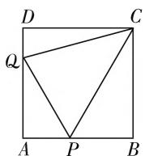
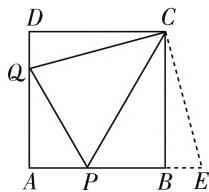

# 平面几何巧切入 数学问题妙破解

# ● 江苏省灌云县第一中学 侍红杏

平面几何是初中数学的一个重要部分,特别涉及三角形、平面四边形(正方形、长方形、梯形或平行四边形等)、圆等相关问题与对应的重要几何,也是高中数学问题中常用的问题背景与知识载体.因而,在破解此类高中数学问题时,经常回归初中平面几何知识,通过数形结合、定理转化、代数运算、推理分析等手段来巧妙破解,实现初高中数学知识的连续性与延伸性.

# 一、借助平面几何,数形结合分析

在破解高中数学中的一些平面向量、解三角形、复数以及圆锥曲线等小题时，经常借助初中的平面几何知识，数形结合，避免繁杂运算与逻辑推理证明，动静结合，体现数学思维的基本性质.

例 1 已知 a, b 是平面内两个互相垂直的单位向量, 若平面向量 c 满足 $(a - c) \cdot (b - c) = 0$ , 则 $|c|$ 的最大值是().

A.1

B. 2

C. $\sqrt{2}$

D. $\frac{\sqrt{2}}{2}$

分析:根据条件,作出相关的平面向量,通过向量之间的关系确定线段的垂直关系,结合四点共圆来分析与判断,进而通过动点C的变化规律以及圆的几何性质来数形结合,直观观察 $|c|$ 的最值即可.

解析：如图1所示，设 $\overrightarrow{OA} = a, \overrightarrow{OB} = b, \overrightarrow{OC} = c$ ，且 $|\overrightarrow{OA}| = |\overrightarrow{OB}| = 1, \overrightarrow{OA} \perp \overrightarrow{OB}$ ，结合平面向量的线性运算知， $\overrightarrow{CA} = a - c, \overrightarrow{CB} = b - c.$ 由题意 $(a - c) \cdot (b - c) = 0$ 可知， $\overrightarrow{CA} \perp \overrightarrow{CB}$ ，则有 $O, A, C, B$ 四点共圆，数形结合可知，当 $OC$ 为相关圆的直径时， $|c|$ 取得最大值，此时 $\mid \overrightarrow{OC} | = \sqrt{2}$

text_image

Geometric diagram showing a circle with inscribed triangle ABC and auxiliary points O, A, B, including dashed lines for construction.

图1

故选 C.

点评:借助平面向量的几何意义以及平面向量的线性运算的几何意义,利用数量关系隐含的位置关系引入平面几何图形——圆,借助四点共圆的判定与性质直观分析,有图有证据,方便操作与破解.

# 二、借助平面几何,定理转化处理

在破解高中数学中的一些平面向量、解三角形等小题时，经常借助初中的平面几何的相关定理（如三角形的中线定理、圆的切割线定理等），通过合理转化，实现初高中知识之间的过渡与化归，体现数学思维的转化性与化归性.

例 2 （2020 届江苏省南京市高三下学期 6 月份第三次模拟考试数学试题·14）在 $\triangle ABC$ 中， $A=\frac{\pi}{3}$ ，D 是 BC 的中点。若 $AD\leqslant\frac{\sqrt{2}}{2}BC$ ，则 $\sin B\sin C$ 的最大值为 \_\_\_\_.

分析:根据平面几何中三角形的性质,通过三角形的中线定理来建立相应的关系式,并利用余弦定理来建立相应的关系式,通过条件中的不等式综合来建立相应的不等式,从而得以转化,再利用正弦定理即可得以巧妙转化与求解.

解析:由于 D 是 BC 的中点,结合平面几何中三角形的中线定理可得 $AB^{2} + AC^{2} = 2(AD^{2} + BD^{2})$ , 则有 $c^{2} + b^{2} = 2\left(AD^{2} + \frac{1}{4}a^{2}\right)$ , 整理可得 $2AD^{2} = c^{2} + b^{2} - \frac{1}{2}a^{2}$ . 根据条件 $AD \leqslant \frac{\sqrt{2}}{2}BC = \frac{\sqrt{2}}{2}a$ , 可得 $2AD^{2} = c^{2} + b^{2} - \frac{1}{2}a^{2} \leqslant a^{2}$ , 即 $b^{2} + c^{2} - a^{2} \leqslant \frac{1}{2}a^{2}$ , 结合余弦定理可得 $b^{2} + c^{2} - a^{2} = 2bc\cos A = bc$ , 即 $bc \leqslant \frac{a^{2}}{2}$ , 所以由正弦定理, 可得 $\sin B\sin C \leqslant \frac{1}{2}\sin^{2}A = \frac{3}{8}$ .

故填答案: $\frac{3}{8}$ .

点评:借助三角形背景中有关中点的条件,通过三角形的中线定理加以转化与应用,合理串联起平面几何与解三角形的相关知识,定理巧妙应用,思维合理转化,有效联接起初中与高中数学知识,方便进一步推理与运算.

# 三、借助平面几何，代数运算处理

在破解高中数学中的一些平面向量、解三角形、圆锥曲线等小题时，经常借助初中的平面几何的相关知识，引入参数、坐标、三角函数的定义等，通过合理代数运算，实现初中平面几何知识破解高中相关数学问题的巧妙应用，体现数学思维的连贯性与应用性.

例 3 （2020 届江苏省泰州市高三 5 月份调研测试题 • 14）在 $\triangle ABC$ 中，点 D 在边 BC 上，且满足 AD = BD, $3\tan^{2}B - 2\tan A + 3 = 0$ ，则 $\frac{BD}{CD}$ 的取值范围为 \_\_\_\_.

分析:根据条件,结合平面几何图形的直观,利用辅助线的构造,通过底边AB上的线段之间的关系,将线段比的参数表示为 $\tan A$ 和 $\tan B$ 的关系式,并利用条件关系式的转化与消元,实现参数与 $\tan B$ 的分离,结合代数运算以及基本不等式的应用与分式不等式的求解来确定对应的取值范围问题.

解析: 如图 2 所示, 过点 C 作 $CM \perp AB$ , 垂足为 M, 取 AB 的中点 N, 连接 DN. 令 $\lambda = \frac{BD}{CD} > 0$ . 因为 $CM \parallel DN$ , 所以 $\frac{BD}{CD}$

text_image

C
D
A M N B

图2

$= \frac{BN}{MN} = \lambda$ ，那么有 $\frac{BM}{AM} = \frac{BN + MN}{BN - MN} = \frac{\frac{BN}{MN} + 1}{\frac{BN}{MN} - 1} =$ $\frac{\lambda + 1}{\lambda - 1} = \frac{\tan A}{\tan B}$ . 由 $3\tan^2 B - 2\tan A + 3 = 0$ ，可得 $3\tan^2 B - \frac{2(\lambda + 1)}{\lambda - 1}\tan B + 3 = 0.$ 又点 $D$ 在边 $BC$ 上，则知 $0 < 2B < \pi$ ，即 $0 < B < \frac{\pi}{2}$ ，所以 $2 \cdot \frac{\lambda + 1}{\lambda - 1} = 3\left(\tan B + \frac{1}{\tan B}\right) \geqslant 3 \times 2\sqrt{\tan B \times \frac{1}{\tan B}} = 6$ ，当且仅当 $\tan B = \frac{1}{\tan B}$ ，即 $\tan B = 1$ ，亦即 $B = \frac{\pi}{4}$ 时，等号成立，则有 $\frac{\lambda + 1}{\lambda - 1} \geqslant 3$ ，解得 $1 < \lambda \leqslant 2$ ，即 $\frac{BD}{CD}$ 的取值范围是(1,2].

故填答案:(1,2].

点评:借助平面几何知识加以数形直观,通过定义、参数、坐标等的引入与应用,结合代数运算,并结合相关的知识来综合分析与处理,实现巧妙利用初中平面几何知识破解高中数学问题的目的.

# 四、借助平面几何，推理分析证明

在破解高中数学中的一些平面向量、解三角形、复数等小题时，经常借助初中的平面几何知识，结合逻辑推理，利用推理证明来避免繁杂的代数运算，体现数学思维的逻辑性与条理性.

例 4 （广东省江门市 2021 届普通高中高三 12 月调研测试数学试题·16）如图 3，正方形 ABCD 的边长为 1, P, Q 分别为边 AB, DA 上的点， $\triangle APQ$ 的周长为 2，则 $\angle PCQ =$ \_\_\_\_ .

  
图3

text_image

D
C
Q
A
P
B
E

图4

分析: 结合初中平面几何知识, 借助正方形的性质, 利用添加的辅助线, 结合直角三角形的全等的判断与性质加以转化, 利用线段的长度关系, 结合相关三角形全等的判定与性质, 综合平面四边形的内角和性质加以转化, 从推理分析角度确定相关角的度数问题.

解析:如图4所示,沿长线段AB至点E,使得BE=DQ,连接CE,结合正方形的性质,易得Rt△CBE≌Rt△CDQ,则有∠CEB=∠CQD,CE=CQ,结合△APQ的周长为2,可得PQ=2-AP-AQ=1-AP+1-AQ=PB+DQ=PB+BE=PE.又由于CE=CQ,CP=CP,可得△CPE≌△CPQ,则有∠PCE=∠PCQ,在四边形AECQ中,由于∠CEB+∠CQA=∠CQD+∠CQA=180°,所以∠EAQ+∠QCE=180°,结合∠EAQ=90°,可得∠QCE=90°,从而∠PCQ= $\frac{1}{2}$ ∠QCE=45°.

故填答案: $45^{\circ}$ .

点评:借助正方形、三角形的直观图形与相应的几何性质,通过合理的图形变换与巧妙旋转,利用三角形全等的判定与性质,数形结合来分析,结合平面几何中的相关推理证明,逻辑清晰,巧妙定角.

在解决一些与初中平面几何有关的高中数学问题时,充分挖掘问题中平面几何相对应的几何知识,借助定义、性质、定理等,实现相关数学问题的直观化,回归本质,合理通过数形结合、定理转化、代数运算、推理分析等手段来解决,有效拓展解题思路,缩小思维步骤,优化解题过程,提升数学能力,培养核心素养.W