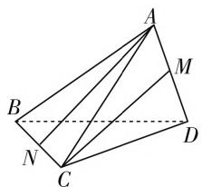
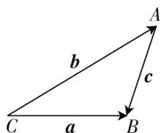
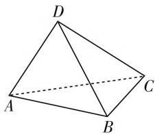
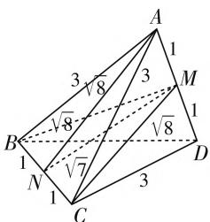
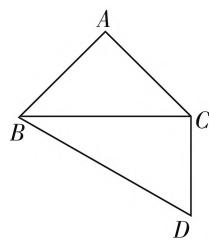
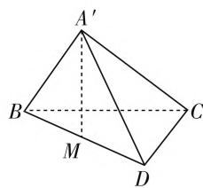
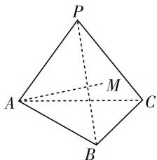
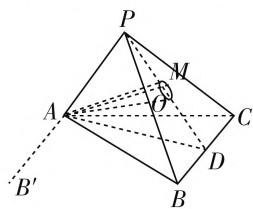
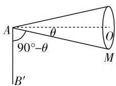

# 我来问道无余说,云在青天水在瓶

——探求异面直线所成角的一点想法

● 浙江省湖州市练市中学 曹琪强  
● 浙江省湖州市第二中学 曹亚奇  
● 浙江省湖州市第二中学 沈 恒

# 一、问题提出

例 1 （2015 年浙江卷理科 13）如图 1，三棱锥 A-BCD 中，AB=AC=BD=CD=3,AD=BC=2,M,N 分别是 AD,BC 的中点，则异面直线 AN,CM 所成角的余弦值是 \_\_\_\_.

text_image

Geometric diagram of a tetrahedron with labeled vertices A, B, C, D and internal points M, N, showing edges and dashed lines.

图1

分析:由异面直线所成角的定义,求异面直线所成角一般用“平移法”,即通过平移两条直线成为两条相交直线,那么这两条相交直线所成的锐角或直角就是所求的异面直线所成的角.但本题我们可以发挥更大的想象空间,探究其他的求解方法,以提高解决异面直线所成角的应对能力.

# 二、方法探索

我们首先看,在人教版必修5中,教材为我们简单地证明了余弦定理:

$$
\begin{array}{l} (a - b) \cdot (a - b) = a \cdot a + b \cdot b - \\ 2 \pmb {a} \cdot \pmb {b} = a ^ {2} + b ^ {2} - 2 a b \cos C, \text {所以} c ^ {2} \\ = a ^ {2} + b ^ {2} - 2 a b \cos C. \\ \end{array}
$$

如图2，设 $\overrightarrow{CB} = a, \overrightarrow{CA} = b, \overrightarrow{AB} = c$ ，那么 $c = a - b, |c|^2 = c \cdot c =$

  
图2

同理可以证明： $a^2 = c^2 +b^2 -2bc\cos A;b^2 = a^2 +$ $c^2 = 2ac\cos B.$

于是,得到余弦定理:三角形中任何一边的平方等于其他两边的平方和减去这两边与它们的夹角的余弦的积的两倍.

以上，就是利用向量基底的方法将某一边拆成另外两边的组合 $\overrightarrow{BC} = \overrightarrow{AC} -\overrightarrow{AB}$ ，两边平方来求模长 $|\overrightarrow{BC}|^2 = (\overrightarrow{AC} -\overrightarrow{AB})^2 = \overrightarrow{AC^2} +\overrightarrow{AB^2} -2\overrightarrow{AB}\cdot \overrightarrow{AC}$ ，书写上化简即可得 $a^2 = b^2 +c^2 -2bc\cos A.$

在这个证明中,我们感到的“向量运算的威力”,实际上是向量的基底方法的威力,同时我们可以明确拆向量(基底方法)的基本原则:第一,拆成同起点;第二，拆成的向量模长确定.

其次我们可以利用同样的方法,得到空间余弦定理:

在空间或者平面上有四个点 A, B, C, D, 如图 3, 那么必然有 $\overrightarrow{AC} \cdot \overrightarrow{BD} = \overrightarrow{AC} \cdot (\overrightarrow{AD} - \overrightarrow{AB})$ $= \overrightarrow{AC} \cdot \overrightarrow{AD} - \overrightarrow{AC} \cdot \overrightarrow{AB}$ , 再将数量积展开得到 $\overrightarrow{AC} \cdot \overrightarrow{AD} - \overrightarrow{AC} \cdot \overrightarrow{AB} = |\overrightarrow{AC}| \cdot |\overrightarrow{AD}| \cdot \cos \angle CAD - |\overrightarrow{AC}| \cdot |\overrightarrow{AB}| \cdot \cos \angle CAB$ , 此时在 $\triangle CAD, \triangle CAB$ 内分别有:

natural_image

Geometric diagram of a tetrahedron with vertices labeled A, B, C, D (no text or symbols present)

图3

$$
\cos \angle C A D = \frac {A C ^ {2} + A D ^ {2} - C D ^ {2}}{2 A C \cdot A D},
$$

$$
\cos \angle C A B = \frac {A C ^ {2} + A B ^ {2} - C B ^ {2}}{2 A C \cdot A B},
$$

代入化简 $\overrightarrow{AC} \cdot \overrightarrow{BD} = \overrightarrow{AC} \cdot (\overrightarrow{AD} - \overrightarrow{AB})$

$$
= \overrightarrow {A C} \cdot \overrightarrow {A D} - \overrightarrow {A C} \cdot \overrightarrow {A B} = | \overrightarrow {A C} | \cdot | \overrightarrow {A D} | \cdot
$$

$$
\begin{array}{l} \cos \angle C A D - | \overrightarrow {A C} | \cdot | \overrightarrow {A B} | \cdot \cos \angle C A B \\ = | \overrightarrow {A C} | \cdot | \overrightarrow {A D} | \cdot \frac {A C ^ {2} + A D ^ {2} - C D ^ {2}}{2 A C \cdot A D} - | \overrightarrow {A C} | \cdot \\ \end{array}
$$

$$
| \overrightarrow {A B} | \cdot \frac {A C ^ {2} + A B ^ {2} - C B ^ {2}}{2 A C \cdot A B}
$$

$$
= \frac {A D ^ {2} + C B ^ {2} - A B ^ {2} - C D ^ {2}}{2}.
$$

在四边形中,空间与平面皆可,我们可以利用上述过程得到对棱向量的一组公式:

$$
\overrightarrow {A C} \cdot \overrightarrow {B D} = \frac {A D ^ {2} + C B ^ {2} - A B ^ {2} - C D ^ {2}}{2}.
$$

记忆方法:看四个字母,依次为 ACBD,两边和中间的 AD,CB 平方之后符号为正,交叉的 AB,CD 为负;需要利用余弦定理来推导,所以除以 2,所以也可得到: $\overrightarrow{MN} \cdot \overrightarrow{PA} = \frac{MA^{2} + NP^{2} - MP^{2} - NA^{2}}{2}$ .

结论 1: 在空间中, 四个点可以表示两条异面直线, 例如异面直线 AC, BD 所成角 $\theta, \theta \in \left(0, \frac{\pi}{2}\right]$ ,

则 $\cos \theta = \cos \langle \overrightarrow{AC},\overrightarrow{BD}\rangle = \frac{|\overrightarrow{AC}\cdot\overrightarrow{BD}|}{|\overrightarrow{AC}|\cdot|\overrightarrow{BD}|}$

$$
= \frac {\left| A D ^ {2} + C B ^ {2} - A B ^ {2} - C D ^ {2} \right|}{2 A C \cdot B D}.
$$

所以我们也把这个公式称为对棱夹角公式.

# 三、方法应用

接下来我们举例来验证该方法在解高考题中的应用,不过要注意,一般异面直线的夹角相对比较简单,我们利用平移+余弦定理或建系+向量等方法均可以求得. 本文只是给出向量法的另一种结论形式; 掌握该方法, 也可以实现在空间几何中, 特别是空间动态翻折问题中比较广泛的应用.

例 1 解析: 如图 4, 由三线合一与勾股定理易知, CM =$\sqrt{8}, MN=\sqrt{7}$ . 再又由对棱夹角公式得

text_image

A
1
3√8
3
M
B
1
√8
√7
C
1
3
D
1

图4

$$
\begin{array}{l} \cos \theta = \frac {\left| A M ^ {2} + N C ^ {2} - A C ^ {2} - N M ^ {2} \right|}{2 \cdot A N \cdot C M} \\ = \frac {\left| 1 + 1 - 9 - 7 \right|}{2 \cdot \sqrt {8} \cdot \sqrt {8}} = \frac {7}{8}. \\ \end{array}
$$

点评: 此方法对一些不太会添辅助线的同学, 起到了意想不到的结果, 只要构建一个三棱锥, 求出其他几条边长, 代入公式即可, 是不是够方便.

我们再来试几个高考真题或模拟题：

例 2 （2016 年杭州模拟）如图 5, $\triangle ABC$ 是等腰直角三角形, AB = AC, $\angle BCD = 90^{\circ}$ , 且 $BC = \sqrt{3} CD = 3$ , 将 $\triangle ABC$ 沿 BC 边翻折, 设点 A 在平面 BCD 上的射影为点 M.

(1) 略.

(2) 当点 M 位于线段 BD 上时, 直线 AB 和 CD 所成角的余弦值为多少?

分析: 此题虽然是翻折问题, 但其实是翻折到一个特定的位置的一个静态的三棱锥, 求出边长, 用上述公式代入比较简单.

解析:如图6, $A^{\prime}M$ ⊥平面BDC,且M恰为BD中点,则有 $A^{\prime}B=A^{\prime}D=A^{\prime}C=\frac{3}{\sqrt{2}}$ .由空间余弦定理得

natural_image

Geometric diagram of a quadrilateral ABCD with diagonal BD, no text or labels present

图5

text_image

A'
B
M
C
D

图6

$$
\begin{array}{l} \cos \theta = \frac {\left| A ^ {\prime} D ^ {2} + B C ^ {2} - A ^ {\prime} C ^ {2} - B D ^ {2} \right|}{2 \cdot A ^ {\prime} B \cdot C D} \\ = \frac {\left| A ^ {\prime} B ^ {2} + 6 ^ {2} - A ^ {\prime} C ^ {2} - (2 \sqrt {3}) ^ {2} \right|}{2 \cdot \frac {3}{\sqrt {2}} \cdot \sqrt {3}} = \frac {\sqrt {6}}{6}. \\ \end{array}
$$

例 3 如图 7, 在三棱锥 P-ABC 中, AB=AC=

$PB = PC = 10, PA = 8, BC = 12,$ 点 $M$ 在平面 $PBC$ 内，且 $AM = 7$ 设异面直线 $AM$ 与 $BC$ 所成角为 $\alpha$ ，则 $\cos \alpha$ 的最大值为（ ）.

A. $\frac{1}{7}$

B. $\frac{3}{7}$

C. $\frac{6}{7}$

D. $\frac{4\sqrt{3}}{7}$

text_image

P
A
M
C
B

图7

解析:由 AM=7 知,M 在以 A 为球心的球面上, 又 A 在平面 PBC 上, 所以 M 的轨迹是球 A 被平面 PBC 截得的圆, AM 其实是圆锥的母线.

如图8，取 $BC$ 的中点 $D$ ，易证 $BC \perp$ 平面 $PAD$ ，易求得 $AD = PD = 8$ ，则 $\triangle PAD$ 是等边三角形， $AO \perp PD, AO = 4\sqrt{3}$ 。又 $AO \perp BC$ ，且 $PD$ 与 $BC$ 相交于点 $D$ ，故 $AO \perp$ 平面 $PBC$ 。

text_image

Geometric diagram of a pyramid with labeled vertices and internal points, including dashed lines indicating hidden edges.

图8

  
图9

$\angle MAO = \theta$ ，则 $\cos \theta = \frac{AO}{AM} = \frac{4\sqrt{3}}{7},\sin \theta = \frac{1}{7}$ ，如图9，把 $CB$ 平移到 $AB^{\prime}$ ，则 $AB^{\prime}$ 与 $AM$ 所成角的范围为 $\alpha$ $\in \left[\frac{\pi}{2} -\theta ,\frac{\pi}{2}\right]$ ，故 $\cos \alpha_{\max} = \cos \left(\frac{\pi}{2} -\theta\right) = \sin \theta = \frac{1}{7}.$

说明: 此题的本质是空间异面直线, 直线 AM 是一条动态旋转的直线(圆锥的母线), 虽然我们不能直接用结论 1 对棱夹角公式, 但是我们可以用结论 2 来处理. (下转第 41 页)

开数学的基本知识、数学思想方法和数学能力等. 重视“四基”落实, 一定是永恒不变的真理.

因此在新高考数学备考中,要重视数学思想与方法的提炼与小结,以数学基本知识为基础,渗透数学思想方法,提升数学能力,要加强通性通法的教学,这才是最基本的,也是高考数学命题的根本所在.充分抓住数学本质,回归数学本源,万变不离其宗,摒弃乱七八糟的“秒杀”技巧和解题“套路”.

# (三) 突出思维过程,注重思维方法的引领

数学不仅仅是知识的学科,更是思维的学科.解题的关键是思维过程的完善与实施,注重解题中思维的全呈现、全暴露,如何从条件入手,如何联系数学知识,如何渗透数学思想方法,如何切入,如何转化,如何求解等一系列的过程,形成一个完整的思维过程链,形成引领作用.

因此在新高考数学备考中,要着力培育学生的思维能力,突出解题思维过程的完善与实施,要以思路切入为重点,引导学生怎么从条件出发,经过怎样的分析和转化,结合结果的联系,最终找到解决问题的思路和方法.华罗庚先生说过:“学数学要到数学家的废纸篓里找答案.”因为废纸篓里有破解问题的思维过程和思路方法.

# （四）重视试题讲评，提升教学的针对性和有效性

把课堂当做老师展示自己的舞台还是当做学生耕耘希望的田野，是衡量一个教师教学观的试金石。试题讲评无论何时都是数学教学的重要工作之一，其效果好比医生的治病救人，关键在于找准“症”，既要知其然，更要知其所以然，然后才能对症下药，做到药到病除。合理“望、闻、问、切”，而非不问青红皂白，把试题讲评当成老师的“独角戏”。

因此在新高考数学备考中,具体试卷讲评时,要对试卷进行简单的统计分析,确定需评讲的内容和时间,要对教学过程进行整体设计,合理突出解题的关键点、易错点和规范性的讲解,注意合理取舍,不讲也会的免讲,一讲就会的少讲,讲了也不会的坚决不讲.同时试卷讲评后,注意要求学生进行全面订正,合理纠错与知识遗漏点、缺点补救,总结答题中相应的经验和教训,对一些重点问题可以进行变式练习与训练等,形成试卷讲评的最优效果,切实落实教学的针对性与有效性.

# (五) 切忌猜题押宝, 努力做好该做的事情

历年高考前夕,各种各样的“猜题押宝”都会华丽登场.一些教师也会根据自身历年的教学实践加以“个人猜想”——哪个知识点考查的概率多与少,哪个知识点考查的方式,侧重性的评说等.这在一定程度上会影响考生的复习与备考,导致数学基本知识、数学思想方法和数学能力的偏差.

其实，猜题押宝的弊端从表面上看是应试，往深里说是视野和格局。无论是课程改革还是高考改革，其出发点都在于立德树人，高科技竞争的表现是创新能力的竞争，其背后则是人才的竞争，而人才的竞争又必定体现为课堂教学的竞争，而最终的最终乃是教师水平的竞争。合理的引领，全面的复习，能力的提升，素养的培养等，这才是一名优秀的教师所必须具备的。

一切皆有可能,没有什么是一成不变的,只有我们来适应高考,而不是高考来将就我们.当高考没有模式时,才能算是真正成熟了.而没有规律才是最大的规律.相应地,当高考备考真正做到关注人和素养,避免套路和刷题,做到沉下心来,扎好马步,练好基本功,这也才算是真正对路了.F

# (上接第47页)

# 四、一点体会

综上,我们可以发现,利用(对棱夹角公式)空间余弦定理可以将夹角问题快速地转化为边长问题,可以方便我们进行运算.还有对于一些动态的翻折旋转问题,要知道异面直线垂直时角最大,向两侧翻折旋转至共面有角的最小.

数学家克莱因说过：“教师掌握的知识要比他所教的知识多得多，才能引导学生绕过悬崖、渡过险滩。”所以上述这些方法为我们教学中对于一些复杂异面直线所成角问题进行了很重要的补充，起到了化繁为简的效果，极大地调动了学生学习立体几何的积极性，丰富了学生解题视野，扩展了学生的发散思维，同时从平面到空间上的扩展与延伸有助于培养学生创新思维的形成和发展。

# 参考文献：

[1] 周笔崇, 施刚良. 再谈浙江高考中的圆锥情结 [J]. 中学教研 (数学), 2016(8). F