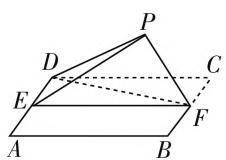
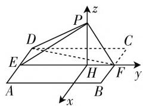
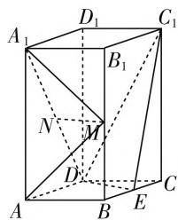
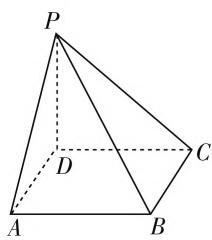
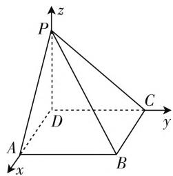

# 立体几何与空间向量备考策略

# 山东省梁山县第一中学 朱晶晶

立体几何作为数学核心素养的重要载体,一直是高中数学的主干内容,也是历年高考必考的重要内容之一.下面结合近三年的高考试题,以及在平时教学过程中的体会,谈谈个人的认识和思考.

# 一、三年高考试题统计分析

<table><tr><td>年份</td><td>2018年</td><td>2019年</td><td>2020年</td></tr><tr><td>试卷</td><td>全国卷I(理)</td><td>全国卷I(理)</td><td>新高考(山东)</td></tr><tr><td>题号及题型</td><td>T7,T12T18</td><td>T12T18</td><td>T4T16T20</td></tr><tr><td>分值</td><td>22</td><td>17</td><td>22</td></tr><tr><td>考点</td><td>1.直线与平面所成角的定义2.面面垂直的判定3.直线与平面所成角的求法4.几何法与向量法的应用</td><td>1.多面体外接球的求法2.直线与平面平行的判定3.二面角的定义和求法4.几何法与向量法的应用</td><td>1.空间线面垂直的判定2.线面角的定义和求法3.空间点、线、面距离4.几何法与向量法的应用</td></tr></table>

# 二、高考真题

# 1.【2018年全国卷Ⅰ(理,18,12分)】

如图 1, 四边形 ABCD 为正方形, E, F 分别为 AD, BC 的中点, 以 DF 为折痕把 $\triangle DFC$ 折起, 使点 C 到达点 P 的位置, 且 $PF \perp BF$ .

(1) 证明: 平面 PEF ⊥ 平面 ABFD;  
(2) 求 DP 与平面 ABFD 所成角的正弦值.

  
图1

text_image

P
z
D
C
E
H
F
y
A
B
x

图2

【答案】(1) 由已知可得 $BF \perp PF, BF \perp EF$ .

又 $PF \cap EF = F$ ，所以 $BF \perp$ 平面 $PEF$ .

又 $BF \subset$ 平面 ABFD,

所以平面 $PEF \perp$ 平面 ABFD.

(2) 如图 2, 作 $PH \perp EF$ , 垂足为 H.

由(1)知, $PH \perp$ 平面 ABFD.

以 H 为坐标原点， $\overrightarrow{HF}$ 的方向为 y 轴正方向， $\overrightarrow{BF}$ 为单位长，建立如图所示的空间直角坐标系 H-xyz. 由题意及(1)可得 $DE \perp PE$ .

又 DP=2, DE=1, 所以 $PE=\sqrt{3}$ .

又 PF=1, EF=2, 故 $PE \perp PF$ .

可得 $PH=\frac{\sqrt{3}}{2}, EH=\frac{3}{2}.$

则 $H(0,0,0), P\left(0,0, \frac{\sqrt{3}}{2}\right), D\left(-1, -\frac{3}{2}, 0\right)$ , $\overrightarrow{DP} = \left(1, \frac{3}{2}, \frac{\sqrt{3}}{2}\right), \overrightarrow{HP} = \left(0, 0, \frac{\sqrt{3}}{2}\right)$ 为平面 $ABFD$ 的一个法向量.

设 DP 与平面 ABFD 的所成角为 $\theta$ ，

则 $\sin \theta = \left|\frac{|\overrightarrow{HP}|\bullet|\overrightarrow{DP}|}{|\overrightarrow{HP}|\bullet|\overrightarrow{DP}|}\right| = \frac{\frac{3}{4}}{\sqrt{3}} = \frac{\sqrt{3}}{4}.$

所以 DP 与平面 ABFD 所成角的正弦值为 $\frac{\sqrt{3}}{4}$ .

# 2.【2019年全国卷Ⅰ(理,18,12分)】

如图 3, 直四棱柱 ABCD - $A_{1}B_{1}C_{1}D_{1}$ 的底面是菱形, $AA_{1} = 4$ , AB = 2, $\angle BAD = 60^{\circ}$ , E, M, N 分别是 BC, $BB_{1}$ , $A_{1}D$ 的中点.

(1) 证明: $MN \parallel$ 平面 $C_1DE$ ;  
(2) 求二面角 $A - MA_{1} - N$ 的正弦值.

【答案】(1) 证明略.

text_image

A₁
D₁
C₁
B₁
N
M
D
A
B
E
C

图3

(2) 二面角 $A - MA_{1} - N$ 的正弦值为 $\frac{\sqrt{10}}{5}$ .

3.【2020年新高考卷Ⅰ(山东卷,20,12分)】

如图 4, 四棱锥 P-ABCD 的底面为正方形, PD

⊥底面ABCD.设平面PAD与平面PBC的交线为l.

(1) 证明: $l \perp$ 平面 PDC;  
(2) 已知 $PD = AD = 1, Q$ 为 $l$ 上的点，求 $PB$ 与平面 $QCD$ 所成角的正弦值的最大值.

text_image

P
D
A
B
C

图4

text_image

P
z
C
y
A
D
B
x

图 5

解析:证明:(1) 因为 $PD \perp$ 底面 ABCD,

所以 $PD \perp AD$ .

又底面 ABCD 为正方形, 所以 $AD \perp DC$ ,

因此 $AD \perp$ 底面 $PDC$ .

因为 $AD \parallel BC, AD \not\subset$ 平面 $PBC$ ,

所以 $AD \parallel$ 平面 $PBC$ .

由已知得 $l \parallel AD.$

因此 $l \perp$ 平面 $PDC$ .

(2) 以 D 为坐标原点, $\overrightarrow{DA}$ 的方向为 x 轴正方向, 建立如图 5 所示的空间直角坐标系 D - xyz.

则 $D(0,0,0),C(0,1,0),B(1,1,0),P(0,0,1),$ $\overrightarrow{DC} = (0,1,0),\overrightarrow{PB} = (1,1, - 1).$

由(1)可设 $Q(a,0,1)$ ，则 $\overrightarrow{DQ}=(a,0,1)$ .

设 $n = (x,y,z)$ 是平面QCD的法向量，

则 $\left\{\begin{aligned}n\cdot\overrightarrow{DQ}&=0,\\ n\cdot\overrightarrow{DC}&=0,\end{aligned}\right.$ 即 $\left\{\begin{aligned}ax+z&=0,\\ y&=0.\end{aligned}\right.$

可取 $\boldsymbol{n}=(-1,0,a)$ .

所以 $\cos \langle n, \overrightarrow{PB} \rangle = \frac{n \cdot \overrightarrow{PB}}{|n| |\overrightarrow{PB}|} = \frac{-1 - a}{\sqrt{3}\sqrt{1 + a^2}}.$

设 PB 与平面 QCD 所成角为 $\theta$ ，

则 $\sin \theta = \frac{\sqrt{3}}{3} \times \frac{|a + 1|}{\sqrt{1 + a^2}} = \frac{\sqrt{3}}{3} \sqrt{1 + \frac{2a}{a^2 + 1}}.$

因为 $\frac{\sqrt{3}}{3}\sqrt{1 + \frac{2a}{a^2 + 1}}\leqslant \frac{\sqrt{6}}{3}$ ，当且仅当 $a = 1$ 时，等号成立.

所以 $PB$ 与平面 $QCD$ 所成角的正弦值的最大值为 $\frac{\sqrt{6}}{3}$ .

# 三、高考立体几何备考建议

# 1. 注重基础, 回归教材

立体几何在高考试题中大多数以中低档的形式出现,因此在平时备考复习过程中的重心应以基础知识、基本方法为主,应以教材作为最基本的复习资料,千万不要脱离教材,让各种教辅资料影响了备考复习计划和重难点的把握.在复习立体几何过程中,传统方法(几何法)和向量法(代数法)两种方法同等重要,在教学过程中双管齐下.

# 2. 重视空间想象, 提升作图能力

作图是立体几何学习的基本功,备考中应重点训练空间想象能力,要求学生达到以下要求:

(1) 会画出图形: 即让学生画出适合题意的空间图形或辅助线;  
(2) 会观察图形:依据题目给出的空间图形,想象空间图形的形状和有关线面的空间位置关系;  
(3) 会使用图形: 对整个图形或图形某部分进行翻折、旋转、平移、展开、割补等;  
(4) 会分析图形:会对空间图形进行分解、组合.

# 3. 关注热点, 谨防冷点

(1) 柱体、椎体、球体在考题中几乎是年年考, 台体在近几年的全国卷中, 几乎没有涉及.  
(2) 了解点面距离、点线距离、线线距离、线面距离、面面距离等的转化.  
(3) 球的切接问题的考查.

# 4. 精心选题,夯实基础

建议：

(1)课本例题习题或改编习题:强化基础;   
(2) 历年高考真题: 认清方向;  
(3) 新高考地区模拟题: 提高能力.