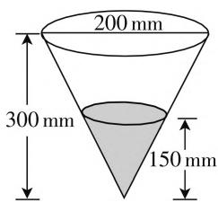

# 立德树人,素养引领,适度创新,突出应用

——2021年高考数学北京卷评析

郑州幼儿师范高等专科学校 孙平利  
● 郑州幼儿师范高等专科学校 王晨霞

2021年高考数学北京卷整体上符合国家课程标准要求，结合北京市高中数学教学现状，知识要素覆盖全面，数学素养考查突出。相比于去年，数学试题在试卷结构、考试内容和难度上保持一致。题型依然是选择题、填空题和解答题，每一部分题型的难度预设基本符合从易到难的分布。

试题的表述形式简洁、规范，图文准确并相互匹配，呈现方式及作答方式坚持多样化，延续了北京数学试卷“大气、平和”的特点。命题的总体稳定有利于考生稳定心态，正常发挥，考出自己的数学真实水平。

# 一、文化浸润，立德树人

2021年是中国共产党百年华诞，第6题以党旗为背景，考查等差数列的基础知识。同时，党旗宽与长的比值2∶3是最接近黄金比的、最简的相邻整数之比，体现数学与艺术的完美结合，引导学生去发现美。结合党旗知识，着眼于传承红色基因，引导学生学史明理、学史增信，坚定理想信念，担当时代责任，厚植爱国主义情怀。

例 1 （2021 年北京卷第 8 题）对 24 小时内降水在平地上的积水厚度(mm) 进行如下定义：

<table><tr><td>0~10</td><td>10~25</td><td>25~50</td><td>50~100</td></tr><tr><td>小雨</td><td>中雨</td><td>大雨</td><td>暴雨</td></tr></table>

小明用一个圆锥形容器接了24小时的雨水,则这一天的雨水的等级属于().

A. 小雨 B. 中雨  
C. 大雨    D. 暴雨

解析:根据相似,小圆锥的底面半径 $r=\frac{200}{2}\times\frac{150}{300}=50(\mathrm{mm})$ ,

text_image

200 mm
300 mm
150 mm

图1

则小圆锥的体积 $V=\frac{1}{3}\pi r^{2}h=125000\pi(\mathrm{mm}^{3})$ ，所以实

际的积水厚度为 $H = \frac{V}{S_{\text{大圆}}} = \frac{125000\pi}{\pi \times 100^2} = 12.5(\mathrm{mm})$ ，属于中雨等级.

故选B.

点评:该题以学生综合实践活动为背景,通过自制雨量器,收集雨水,测量降水量,将劳动教育与数学学科内容有机融合.从而引导学生热爱劳动,崇尚劳动,将环境保护教育、生态文明等主题教育与数学测试试题有机结合,引导学生树立尊重自然、顺应自然、保护自然的发展理念,展现了数学的教育价值,贯彻了《中小学德育工作指南》,助力培养德智体美劳全面发展的社会主义建设者和接班人.

# 二、立足基础，突出主干

在考查数学的“四基”（基础知识、基本技能、基本思想、基本活动经验）中，突出数学学科特色，着重考查学生的理性思维能力，发挥数学作为基础学科的作用，重视考查中学数学基础知识和方法的掌握程度，重点考查主干知识与内容.

例如,选择题的前5道题和填空题前3道题,涉及的内容都是基础知识和基本方法,考查了集合、复数、充要条件、三视图、双曲线的性质、二项式定理、抛物线的性质、平面向量等内容.在试题设计上,这些试题涉及的知识点相对单一、思维相对简单,易于解答.在此基础上,试卷对主干内容重点考查,体现了对数学知识考查的全面性、基础性和综合性,6道解答题中重点考查了解三角形及立体几何、概率统计、导数、直线与圆锥曲线、数列综合等主干内容.解答题的前2道题,题干简洁表述清晰,集中考查了解三角形和立体几何的主干知识及核心概念.

# 三、稳中有变，适度创新

相比 2020 年高考数学北京卷,2021 年数学试题在保持整体稳定的基础上, 又体现了适度创新. 例如第14题保留了开放性问题的位置. 而将结构不良问题放在了解答题第一题, 虽然难度不大, 但与去年不同的是所给三个条件中, 有一个是不成立的, 而另外两组成立的条件在解法上也有所不同, 为学生展现数学思维能力搭建了平台. 再如第3题, 考查了常用逻辑用语的必要条件、充分条件、充要条件的内容, 与去年试题相比, 位置相对提前, 但降低了考查的难度, 更加凸显了考查考生对相关概念的理解和掌握. 命题的适度创新, 增强了试题的灵活性, 为引导教学、防止题型固化、命题方式固化起到了积极的作用, 也有利于对学生能力素养的考查.

例 2 （2021 年北京卷第 14 题）若点 $P(\cos\theta, \sin\theta)$ 与点 $Q\left(\cos\left(\theta + \frac{\pi}{6}\right), \sin\left(\theta + \frac{\pi}{6}\right)\right)$ 关于 y 轴对称，写出一个符合题意的 $\theta$ 值为 \_\_\_\_.

解析:由于点 P, Q 均在单位圆上, 两者要关于 y 轴对称, 只要满足 $\frac{1}{2}\left(\theta + \theta + \frac{\pi}{6}\right) = \frac{\pi}{2}$ , 解得 $\theta = \frac{5\pi}{12}$ .故填答案: $\frac{5\pi}{12}$ (答案不唯一).

点评:其实,只要满足 $\theta=\frac{5\pi}{12}+k\pi,k\in Z$ 的角 $\theta$ 值都符合题意.对于此类开放结论的数学开放题,相比常规的破解方法,巧妙借助特殊值的选取,破解起来更为快捷简单,简单易操作.当然此类开放性问题的答案不唯一,借助特殊值的选取只能确定其中一个取值,无法完整解答所有满足条件的常数的取值情况.

# 四、关注本质，专注素养

试卷突出体现数学学科素养本质，在关注考生未来发展的同时，以能力立意，强调对数学方法和数学本质的考查。例如第20题考查了解析几何中的主要方法，需要学生具备一定的数学运算核心素养和解决问题的能力；第21题以数列为载体，考查归纳概括、分类讨论等数学思想方法，考查学生对新概念的理解，考查学生获取新知识的能力和对新问题的理解探究能力。

而在数学核心素养方面也加以关注,例如,第4题求四面体的表面积需要学生能根据三视图作出直观图进行求解,考查直观想象素养;第13题,考查的是向量的运算,基于向量具有几何和代数双重特征,本题既可以用坐标计算,也可以借助几何直观解决,考查代数运算、逻辑推理素养;第17题以正方体为载体考查直线与平面平行的性质及二面角的相关知识,考查逻辑推理和代数运算素养.

例3（2021年北京卷第15题）已知函数 $f(x) = |\lg x| - kx - 2$ ，给出下列四个结论：

① 若 $k = 0$ ，则 $f(x)$ 有两个零点；② $\exists k < 0$ ，使得 $f(x)$ 有一个零点；③ $\exists k < 0$ ，使得 $f(x)$ 有三个零点；④ $\exists k > 0$ ，使得 $f(x)$ 有三个零点.

以上正确结论的序号是\_\_\_\_。

解析: 令 $f(x)=\left|\lg x\right|-kx-2=0$ ，可转化为函数 $y_{1}=\left|\lg x\right|$ 与 $y_{2}=kx+2$ 的交点问题，数形结合可知，当 k=0 时，两函数的图像有两个交点，故①正确；

当 k<0 时，两函数的图像相切时，两函数的图像有一个交点，故②正确；两函数的图像相交时，两函数的图像最多只有两个交点，故③错误；

当 k > 0 时，过点 $(0,2)$ 存在函数 $g(x) = \ln x (x > 1)$ 的切线，此时两函数的图像有两个交点，而当直线斜率比相切时的斜率小时，两函数的图像就有三个交点，故④正确；

综上分析,正确结论的序号是①②④.

故填答案:①②④.

点评:以函数为问题背景,利用函数与方程相互转化,把问题转化为基本初等函数的图像问题,数形结合,并结合参数的取值情况分类讨论来确定两个函数的图像的交点问题,即为函数的零点个数问题,很好考查逻辑推理能力、代数运算能力以及灵活运用知识的综合能力等,以及逻辑推理、数学运算等核心素养.

# 五、突出应用，体现价值

试卷中设置以源于社会实际和学生真实生活的情境，引导学生感悟数学的科学价值、应用价值、文化价值、美学价值。例如第6题中，5种规格中国共产党党旗的长与宽的比值都相等，近似于黄金分割，体现出党旗与数学之美的结合。第8题以学生综合实践活动切入，通过计算圆锥形量雨器内雨水的体积，求出降雨量，既提供了学习生活中解决现实问题的事例，又考查了学生分析和解决问题的能力。

例 4 （2021 年北京卷第 18 题）为加快新冠肺炎检测效率，某检测机构采取“k 合 1 检测法”，即将 k 个人的拭子样本合并检测，若为阴性，则可以确定所有样本都是阴性的；若为阳性，则还需要对本组的每个人再做检测。现有 100 人，已知其中 2 人感染病毒。

(I)(i) 若采用“10合1检测法”，且两名患者在同

一组，求总检测次数；

(ii) 已知 10 人分成一组, 分 10 组, 两名感染患者在同一组的概率为 $\frac{1}{11}$ , 定义随机变量 X 为总检测次数, 求检测次数 X 的分布列和数学期望 $E(X)$ .

（Ⅱ）若采用“5 合 1 检测法”，检测次数 Y 的期望为 $E(Y)$ ，试比较 $E(X)$ 和 $E(Y)$ 的大小（直接写出结果）.

解析: (Ⅰ)(i) 共测两轮, 第一轮 100 人分 10 组, 测了 10 次; 第二轮对两各患者所在组每个人都检测一次, 共测了 10 次, 所以总检测次数为 $10 + 10 = 20$ 次.

(ii) 由(i)知,两名感染患者在同一组时,共需要检测20次.若两名感染患者不在同一组时,共需要检测 $10+10+10=30$ 次.

则检测次数 $X$ 的可能取值为20,30，而 $P(X = 20) = \frac{1}{11}, P(X = 30) = 1 - \frac{1}{11} = \frac{10}{11}$ .

则 $X$ 的分布列为：

<table><tr><td>X</td><td>20</td><td>30</td></tr><tr><td>P</td><td>1/11</td><td>10/11</td></tr></table>

故 $E(X) = 20 \times \frac{1}{11} + 30 \times \frac{10}{11} = \frac{320}{11}$ .

(Ⅱ) $E(X)<E(Y).$

点评:该题以当前我国常用的大规模核酸检测“k合1”方案为情境,求解检验次数,研究分布列和期望,尤其是对“10合1”与“5合1”两个方案的对比,感受方案选择与感染人数的关系,既考查了学生概率统计的知识和思想方法,也体现了数学模型在解决现实问题时的优化作用.

纵观 2021 年高考数学北京卷的整份试卷,保持了北京试卷综合、灵活的特色,稳中求变. 在突出基本知识、基本技能和基本思想方法考查的同时,突出考查学生的数学素养,展现数学的应用价值及学科育人价值,给不同能力水平的学生提供了展示的平台,对数学教学起到了积极的引导作用. F

# (上接第20页)

# 三、主题单元复习教学的实施策略

# 1. 强化数学知识内在联系,理解数学本质

教材中的章节之间是前后联系的,章节内部的内容也有千丝万缕的关联,有特殊一般的关系,也有类比并列的关系,还有螺旋上升的关系.所以,课堂教学设计时,需要认真地研读教材、读透教材,不仅需要搞清楚单元知识内容,还需要关注单元知识间的联系、摸清单元内容的主线、梳理清晰的生成路径,弄懂来龙去脉,建立该章节的数学逻辑体系,最终以框图等形式概括总结出章节知识的框架,揭示其数学本质.

# 2. 注重数学方法探究发现, 激活数学思维

美国教育家布鲁纳认为:学习的本质在于发现,学生在学习过程中要主动发现知识、主动探索事物.学生的课堂任务是参与知识的发生、发展与形成过程,通过感受、体验、发现的过程来获取知识、掌握方法,通过创设一定的学习情境,激发学生的学习兴趣,提出解决问题的设想,通过小组合作等方式,探索解决问题的路径,获得数学学习的方法,培养数学思维和能力,发展数学情感与品质.在数学课堂教学中,精心设计数学探究活动,让教师在课堂教学中有效地引导学生进行自主探究,积累探究学习的实践经验,活跃数学思维.让学生能从数学的视角观察问题,学会数学思考,总结数学思想方法.如:本节课中,让学生经历独立思考解题→展示解答过程→同伴互帮纠错→小组讨论总结→教师方法归纳→习题巩固练习的探究过程,找到指、对数运算的一般步骤和方法.

# 3. 体验数学课程研究路径, 提升数学素养

章建跃博士指出：“一个定义、三个注意、大量练习”的课堂教学是不值得提倡的。复习课中通过罗列一些概念，提出几点注意，使用大量练习，或许也能让多数学生巩固知识、掌握方法，然而立意不高，很难实现学生的深度学习追求高立意的主题单元复习课，可以通过主题单元复习向学生传递数学研究路径。如：本节课以指数与对数主题单元复习，让学生在课堂探究以及课后的研究性学习中体验数学运算的研究路径，即：定义 $\rightarrow$ 性质 $\rightarrow$ 运算性质 $\rightarrow$ 运用，这可以为今后学习运算问题积累学习经验。在教学过程中，让学生感受体验到数学研究的“一般套路”，为以后的类似研究储备一种研究经验，建立一套熟悉的研究路径，体验数学的学习价值，获得基本的数学活动经验便于独立研究新的数学对象，提升学生的数学核心素养。让课堂的数学学习成为一个生动、主动及富有个性的过程。F