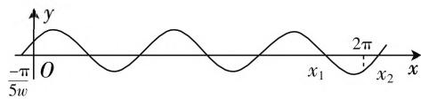
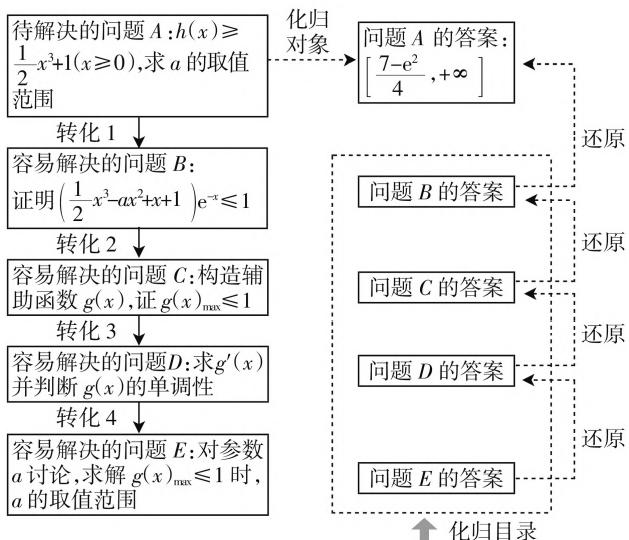

# 绘三角图像 渗数学思想 提核心素养

# 浙江省余姚市第三中学 黄顺江

三角函数图像性质的教学中,教师多偏向于“整体代换”的代数方法,由于在解决问题的时候,学生往往需要注意很多细节才能正确解答,所以解此类型的题目时经常容易犯错,导致正确率不高.究其原因:学生对三角函数的图像掌握不到位,图像的变换及其性质只停留在背诵记忆的层面,没有真正理解其数学本质.下面笔者结合历年高考题用数形结合的方法来解决三角函数的图像和性质问题.

# 一、数形结合解决正弦型函数图像的平移问题

例 1 （2016 年北京卷理科第 7 题）将函数 $y = \sin\left(2x - \frac{\pi}{3}\right)$ 的图像上的点 $P\left(\frac{\pi}{4}, t\right)$ 向左平移 $s (s > 0)$ 个单位长度得到点 $P'$ ，若点 $P'$ 位于函数 $y = \sin 2x$ 的图像上，则（）.

A. $t = \frac{1}{2}, s$ 的最小值为 $\frac{\pi}{6}$   
B. $t = \frac{\sqrt{3}}{2}, s$ 的最小值为 $\frac{\pi}{6}$   
C. $t = \frac{1}{2}, s$ 的最小值为 $\frac{\pi}{3}$   
D. $t = \frac{\sqrt{3}}{2}, s$ 的最小值为 $\frac{\pi}{3}$

分析: 将 $\left(\frac{\pi}{4}, t\right)$ 代入 $y=\sin\left(2x-\frac{\pi}{3}\right)$ 中, 可马上算出 t 的值. s 是平移的单位数, 我们可以根据五点描图法, $y=\sin\left(2x-\frac{\pi}{3}\right)$ 图像的第一个起始点为 $\left(\frac{\pi}{6},0\right)$ , $y=\sin2x$ 图像的第一个起始点为 $(0,0)$ , 而由 $\left(\frac{\pi}{6},0\right)$ 平移到 $(0,0)$ 说明整个图像向左平移了 $\frac{\pi}{6}$ 个单位, 可快速求解得 A 选项正确, 避免了一些死板的记忆, 而多了一些对图像变换本质的理解, 对为什么 “左加右减”, 为什么平移的单位数要将系数 “2” 提出后, 才能正确地得到平移的单位数, 多了一些思考! 在解题中充分渗透数形结合的数学思想, 这无疑对培养学生的数学核心素养有很大的帮助.

# 二、数形结合解决正弦型函数图像的性质问题

例 2 （2018 年天津卷第 6 题）将函数 $y = \sin\left(2x + \frac{\pi}{5}\right)$ 的图像向右平移 $\frac{\pi}{10}$ 个单位长度，所得图像对应的函数（）.

A. 在区间 $\left[-\frac{\pi}{4}, \frac{\pi}{4}\right]$ 上单调递增  
B. 在区间 $\left[-\frac{\pi}{4}, 0\right]$ 上单调递减  
C. 在区间 $\left[\frac{\pi}{4}, \frac{\pi}{2}\right]$ 上单调递增  
D. 在区间 $\left[\frac{\pi}{2}, \pi\right]$ 上单调递减

分析: 我们用五点作图法得到图像的第一个起始点为 $\left(-\frac{\pi}{10},0\right)$ ，然后结合周期，快速地画出 $y=\sin\left(2x+\frac{\pi}{5}\right)$ 在一个周期内的图像。由图像可观察得出：将 $y=\sin\left(2x+\frac{\pi}{5}\right)$ 的图像向右平移 $\frac{\pi}{10}$ 个单位长度后，图像的单调区间一目了然，可直接选出正确的选项。如果采用传统的整体代换方法，需要先正确地将函数 $y=\sin\left(2x+\frac{\pi}{5}\right)$ 的图像向右平移 $\frac{\pi}{10}$ 个单位长度后，得函数解析式为 $y=\sin2x$ ，然后求出 $y=\sin2x$ 的单调递增区间和单调递减区间，恰当地取 k 的整数值，再去检验哪个选项是正确的。这将小题大做，既浪费时间，又容易在求解的过程中出现一些计算错误，导致解题速度和正确率都会大大降低，事倍功半不尽人意。

# 三、数形结合解决正弦型函数的参数范围问题

例3（2019年全国卷第12题）设函数 $f(x) = \sin \left( wx + \frac{\pi}{5}\right) (w > 0)$ ，已知 $f(x)$ 在 $[0, 2\pi]$ 有且仅有5个零点，下述四个结论：① $f(x)$ 在 $(0, 2\pi)$ 有且仅有3个极大值点；② $f(x)$ 在 $(0,2\pi)$ 有且仅有2个极大值点；③ $f(x)$ 在 $\left(0,\frac{\pi}{10}\right)$ 上单调递增；④w的取值范围是 $\left[\frac{12}{5},\frac{29}{10}\right)$ ，其中所有正确结论的编号是（）

A. ①④

B.②③

C.①②③

D.①③④

分析：在五点描图法中，函数 $f(x) = \sin \left( wx + \frac{\pi}{5}\right) (w > 0)$ 的图像的第一个起始点为 $\left(\frac{-\pi}{5w}, 0\right)$ . 因为 $w > 0$ ，所以 $\frac{-\pi}{5w} < 0$ ，画好一个周期的图像后，继续往右再画两个周期，如图1所示.



<details>
<summary>text_image</summary>

y
-π/5w O x₁ x₂ 2π x
</details>

图1

从图中可以观察出:要使得 $f(x)$ 在 $[0,2\pi]$ 有且仅有 5 个零点, 则 $x_{1} \leqslant 2\pi < x_{2}$ . 又因为 $wx_{1} + \frac{\pi}{5} = 5\pi, wx_{2} + \frac{\pi}{5} = 6\pi$ , 得 $x_{1} = \frac{24\pi}{5w}, x_{2} = \frac{29\pi}{5w}$ , 所以 $\frac{24\pi}{5w} \leqslant 2\pi < \frac{29\pi}{5w}$ , 所以 $\frac{12}{5} \leqslant w < \frac{29}{10}$ .

此时只需要判断 ③ 是否正确就可以了(方法略).

本题难度较大,重点考查学生应用所学知识分析问题和解决问题的能力.如果学生只停留在记结论解决问题的层面,没有很好地理解五点作图法,没有真正理解三角函数图像的变换和性质,面对这种复杂的含参问题,考查三角函数的性质及参数范围,就会束手无策.

# 四、教学思考

从上面的运用举例不难看出：“以表助形”“为数配形”“以形助数”在解决 $f(x) = A \sin (\omega x + \varphi)$ 图像性质问题时，发挥着重要的作用。“五点作图法”形象直观，图像性质一目了然，容易被学生所接受。数形结合的方法不仅可以淡化特殊技巧、降低运算步骤繁多带来的错误率，而且在解决问题的过程中少了很多注意的细节（如 $A$ 是否为负， $\omega$ 是否为负等），从而使问题处理起来更加简洁。在应用图像解决问题的同时，培养了学生的观察能力和应用数形结合的方法解决问题的能力。

所以在平时的教学中,我们应当重视学生对数学本质的理解和掌握,而不是一味地只总结结论,让学生用结论解题就可以了,这样会导致学生对知识本质缺乏认识,理解不够透彻,数学解题能力得不到提升.教学中只有重视知识的形成过程,教会学生弄清问题的本质,追本溯源,不但要“知其然”,更要“知其所以然”,学生才能举一反三、融会贯通,提高分析问题和解决问题的能力.教师在教学中应当为学生创造更多实践探究的机会,逐步培养学生的关键能力,达成发展素质教育的目标.

# 参考文献：

[1] 曹刚, 李小燕. 三角函数的性质 [J]. 中学数学教学参考 (上), 2019(1/2).  
[2] 张小凯. 三角恒等变换 [J]. 中学数学教学参考 (上), 2019(1/2). F

(上接第55页) 熟悉的、简单的子问题,通过解决一个个子问题,最终问题得以解决.具体化归过程如图3所示.

# 五、结束语

化归思想方法不仅是一种重要的思维策略，也是一种重要的数学解题思想。本题第二小问的解答方法有多种，本人选择两种具有代表性化归的解法，通过把难解的题转化为某个易解的题或者是已经解决的题，可以提高学生的解题效率。深刻学习和运用化归思想，在提高学生解题能力方面具有重要作用，能否运用好化归思想，也直接影响学生高考的数学成绩。F



<details>
<summary>flowchart</summary>

```mermaid
graph TD
    A["待解决的问题 A: h(x) ≥ 1/2 x³ + 1 (x ≥ 0), 求 a 的取值范围"] --> B["转化 1"]
    B --> C["容易解决的问题 B: 证明 (1/2 x³ - ax² + x + 1) e⁻ˣ ≤ 1"]
    C --> D["转化 2"]
    D --> E["容易解决的问题 C: 构造辅助函数 g(x), 证 g(x)ₘₐₓ ≤ 1"]
    E --> F["转化 3"]
    F --> G["容易解决的问题 D: 求 g'(x) 并判断 g(x) 的单调性"]
    G --> H["转化 4"]
    H --> I["容易解决的问题 E: 对参数 a 讨论, 求解 g(x)ₘₐₓ ≤ 1 时, a 的取值范围"]
    I --> J["化归对象"]
    J --> K["问题 A 的答案: [7 - e²/4, +∞"]]
    K --> L["还原"]
    K --> M["问题 B 的答案"]
    M --> N["还原"]
    M --> O["问题 C 的答案"]
    O --> P["还原"]
    O --> Q["问题 D 的答案"]
    Q --> R["还原"]
    Q --> S["问题 E 的答案"]
    S --> T["化归目录"]
```
</details>

图3