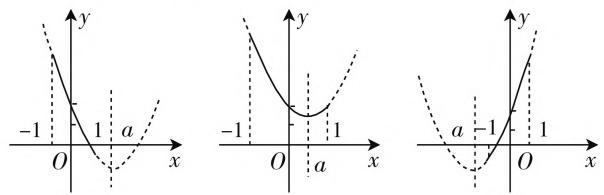
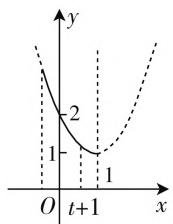
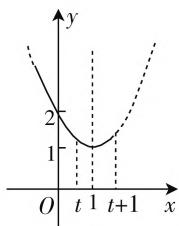
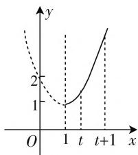

# 给定区间的函数最值问题

# ● 江苏省苏州市常熟市尚湖高级中学 马怡平

探求相关函数在给定区间上的最值问题,最常用的思维方法就是先作出函数 $y=f(x)$ 的草图,然后根据图像的增减性进行分析与研究.而一些函数无法直接作出相应的图像,数形结合处理的愿望落空,则可以考虑通过函数的单调性等来分析与处理.

# 一、最值确定问题

对于给定区间上的函数的最值确定问题,往往直接或间接给出对应的函数以及相应的给定区间,通过单调性的判定与应用来确定函数的最值问题.

例1 函数 $y = x - \frac{1}{x}$ 在[1,2]上的最大值为（ ）.

A. 0

B. $\frac{3}{2}$

C. 2

D. 3

分析: 确定函数 y=x 与 $y=-\frac{1}{x}$ 在 $[1,2]$ 上的单调性, 进而确定函数 $y=x-\frac{1}{x}$ 在 $[1,2]$ 上的单调性, 利用单调性的性质来确定相应的最大值即可.

解析:由于函数 y=x 在 $[1,2]$ 上是增函数, 函数 $y = -\frac{1}{x}$ 在 $[1,2]$ 上是增函数, 那么函数 $y = x - \frac{1}{x}$ 在 $[1,2]$ 上是增函数, 所以当 x=2 时, $y_{\max}=2-\frac{1}{2}=\frac{3}{2}$ .

故选 B.

点评:利用不同函数在给定区间上的单调性一致来确定其和函数的单调性问题,在此基础上利用单调性的性质来确定函数在给定区间上的最值问题.

# 二、参数取值问题

对于给定区间上的函数的参数取值问题,已知给定区间中含有参数或函数解析式中含有参数,结合最大(小)值的设置,可以有效来确定参数取值问题.

例2 已知函数 $f(x) = x^{2} - 6x + 8, x \in [1, a]$ ，并且 $f(x)$ 的最小值为 $f(a)$ ，则 $a$ 的取值范围是

分析:通过配方来确定二次函数的对称轴,进而确定函数的单调减区间,结合条件来确定函数在给定区间上的单调性,利用单调区间的特征来确定参数的取值范围即可.

解析:由题可知, $f(x)=x^{2}-6x+8=(x-3)^{2}-1,x\in[1,a]$ 的图像的对称轴为x=3,则知函数 $f(x)$ 的单调递减区间为 $(-∞,3]$ .

当 $a \leqslant 3$ 时，题中 $f(x)$ 的最小值为 $f(a)$ ，可知 $f(x)$ 在 $[1, a]$ 上是单调递减的，可得 $1 < a \leqslant 3$ .

当 $a > 3$ 时， $f(a) \leqslant f(1) = f(5)$ ，所以 $a \leqslant 5$ .

故填答案:(1,5].

点评:在同一函数的单调性一致的情况下,函数给定的单调区间 $[a,b]$ 与该函数的单调区间 $[c,d]$ 之间的关系不确定,应视具体情况而定.

例 3 函数 $f(x)=4x^{2}-4ax+a^{2}-2a+2$ 在区间 $[0,2]$ 上有最小值 3，则实数 a 的值为 \_\_\_\_.

分析:通过配方来确定二次函数的对称轴,结合对称轴的值进行分类讨论,利用对称轴的不同位置来分析函数在给定区间 $[0,2]$ 上的单调性以及相应的最小值,从而建立相应的方程来求解对应的参数值.

解析:由于函数 $f(x)=(2x-a)^{2}+2-2a$ ，其对称轴为 $x=\frac{a}{2}$ .

① 当 $\frac{a}{2} \leqslant 0$ ，即 $a \leqslant 0$ 时，此时函数 $f(x)$ 在 $[0, 2]$ 上是增函数，则知 $f(x)_{\min} = f(0) = a^2 - 2a + 2$ ，那么由 $a^2 - 2a + 2 = 3$ ，解得 $a = 1 \pm \sqrt{2}$ ，结合 $a \leqslant 0$ ，可得 $a = 1 - \sqrt{2}$ ；

② 当 $0 < \frac{a}{2} < 2$ ，即 $0 < a < 4$ 时，结合二次函数的图像与性质知， $f(x)_{\min} = f\left(\frac{a}{2}\right) = -2a + 2$ ，那么由 $-2a + 2 = 3$ ，解得 $a = -\frac{1}{2} \notin (0,4)$ ，舍去；

③ 当 $\frac{a}{2} \geqslant 2$ ，即 $a \geqslant 4$ 时，此时函数 $f(x)$ 在 $[0,2]$ 上是减函数，则知 $f(x)_{\min} = f(2) = a^2 - 10a + 18$ ，那么由 $a^2 - 10a + 18 = 3$ ，解得 $a = 5 \pm \sqrt{10}$ ，结合 $a \geqslant 4$ ，可得 $a = 5 + \sqrt{10}$ .

综上所述, 可知 $a=1-\sqrt{2}$ 或 $a=5+\sqrt{10}$ .

故填答案: $1-\sqrt{2}$ 或 $5+\sqrt{10}$ .

点评:要注意二次函数的对称轴与所给区间之间的位置关系,合理通过两者之间的关系加以分类讨论,进而确定二次函数的最值,同时还要注意二次函数在已知区间上最值的取得不一定在顶点处.

# 三、含参应用问题

对于给定区间的函数的含参应用问题,主要涉及两大类:一类是函数解析式中含有参数,另一类是给定区间中含有参数,进而确定对应的最值问题.解决此类含参应用问题时,数形结合,分类讨论,汇总最值.

例4 求函数 $f(x) = x^{2} - 2ax + 2$ 在 $[-1, 1]$ 上的最小值.

分析:通过配方来确定二次函数的对称轴,数形结合,通过对称轴的值与给定区间之间的关系进行分类讨论,分别确定不同情况下函数的单调性,进而确定相应的最小值,最后加以汇总即可.

解析:由于函数 $f(x)=x^{2}-2ax+2=(x-a)^{2}+2-a^{2}$ 的图像的对称轴方程为 x=a，且函数图像开口向上，如图 1 所示.

text_image

Three mathematical diagrams showing parabola and line segments on Cartesian coordinates with labeled axes and points.

图1

① 当 $a > 1$ 时，函数 $f(x)$ 在 $[-1, 1]$ 上单调递减，故 $f(x)_{\min} = f(1) = 3 - 2a$ ；  
② 当 $-1 \leqslant a \leqslant 1$ 时，函数 $f(x)$ 在 $[-1,1]$ 上先减后增，故 $f(x)_{\min} = f(a) = 2 - a^{2}$ ;  
③ 当 a<-1 时，函数 $f(x)$ 在 $[-1,1]$ 上单调递增，故 $f(x)_{\min}=f(-1)=3+2a$ .

综上分析，可知 $f(x)$ 的最小值为 $f(x)_{\min} = \left\{ \begin{array}{ll}3 - 2a,a > 1,\\ 2 - a^2, - 1\leqslant a\leqslant 1,\\ 3 + 2a,a <   - 1. \end{array} \right.$

点评:通过二次函数这一熟知的基本初等函数为背景,以给定区间为不动条件,通过二次函数的对称轴的变化加以数形结合,进而数形直观确定函数的单调性情况,得以确定函数的最值问题.

例 5 设函数 $f(x)=x^{2}-2x+2, x\in[t,t+1]$ ，其中 $t\in R$ ，求函数 $f(x)$ 的最小值.

分析:通过配方来确定二次函数的对称轴,数形结合,通过对称轴的值与给定区间之间的关系进行分类讨论,分别确定不同情况下函数的单调性,进而确定相应的最小值,最后加以汇总即可.

解析: 函数 $f(x)=x^{2}-2x+2=(x-1)^{2}+1, x \in [t, t+1], t \in \mathbf{R}$ ，对称轴为 x=1.

  
(1)

line

| Point | x | y |
|---|---|---|
| t | 0 | 2 |
| t+1 | 0 | 1 |
| t+1 | t+1 | 1 |

(2)

line

| x | y |
|---|---|
| 0 | 2 |
| 1 | 1 |
| t+1 | 2 |

(3)   
图2

① 当 $t+1<1$ ，即 t<0 时，函数图像如图 2(1)，函数 $f(x)$ 在区间 $[t,t+1]$ 上为减函数，所以最小值为 $f(t+1)=t^{2}+1$ ;  
② 当 $t \leqslant 1 \leqslant t + 1$ ，即 $0 \leqslant t \leqslant 1$ 时，函数图像如图 2(2)，最小值为 $f(1) = 1$ ;  
③ 当 t > 1 时，函数图像如图 2(3)，函数 $f(x)$ 在区间 $[t, t + 1]$ 上为增函数，所以最小值为 $f(t) = t^{2} - 2t + 2$ .

综上分析, 可知 $f(x)$ 的最小值为 $f(x)_{\min}=$

$$
\left\{ \begin{array}{l} t ^ {2} - 2 t + 2, t > 1, \\ 1, 0 \leqslant t \leqslant 1, \\ t ^ {2} + 1, t <   0. \end{array} \right.
$$

点评:通过二次函数这一熟知的基本初等函数为背景,以二次函数的对称轴为不动条件(此时函数图像确定),通过给定区间的变化加以数形结合,进而数形直观确定函数的单调性情况,得以确定函数的最值问题.

给定区间上的函数最值问题,有效把函数的解析式、函数的图像与性质等相关知识加以交汇与融合,设置多样,变化多端,同时能充分考查数学知识与数学能力,分类与整合、数形结合以及化归与转化思想,以及直观想象、逻辑推理的核心素养,是充分体现能力与素养的良好载体,要引起重视.