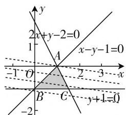

# 考点透视,精准备考

—— 高考中的不等式

\- 江苏省灌南高级中学 江海军

不等式是高中数学中的一个重点知识，涉及不等式关系与不等式、一元二次不等式及其解法、二元一次不等式(组)与简单的线性规划问题以及基本不等式等内容。在历年高考中，不等式有时单独考查，有时与其他章节的数学知识交汇出现，常常作为辅佐工具用来解决其他数学知识，是历年高考中变化多端，形式各样，常考常新的一类基本考点。

# 一、不见不散——不等式性质

例 1 （2020 年上海卷第 13 题）已知 $a, b \in R$ ，下列不等式恒成立的是（）.

A. $a^2 + b^2 \leqslant 2ab$

B. $a^2 + b^2 \geqslant -2ab$

C. $a + b \geqslant -2\sqrt{|ab|}$

D. $a + b \leqslant 2\sqrt{|ab|}$

分析:根据不等式的基本性质直接推理,或结合举反例的方法加以推理与分析.

解析:选项 A 中, 其等价于 $a^{2} + b^{2} - 2ab = (a - b)^{2} \leqslant 0$ , 该不等式不恒成立, 错误;

选项 B 中, 其等价于 $a^{2} + b^{2} + 2ab = (a + b)^{2} \geqslant 0$ , 该不等式恒成立, 正确;

选项 C 中, 若 a < 0, b < 0, 则不等式 $a + b \leqslant -2\sqrt{|ab|}$ 恒成立, 错误;

选项 D 中, 若 a > 0, b > 0, 则不等式 $a + b \geqslant 2\sqrt{|ab|}$ 恒成立, 错误.

故选 B.

点评:高考中不等式性质的考查往往以不等式的判断形式出现.解答涉及不等式的基本性质的判断问题时,常用的方式是借助相应的不等式性质加以推理与分析,还可以用举反例的方法来排除,但是在举反例时要特别注意反例一定要在已知条件下进行.

# 二、情有独钟——不等式求解

例2（2020年全国卷I文科第1题）已知集合 $A = \{x\mid x^2 -3x - 4 <   0\} ,B = \{-4,1,3,5\}$ ，则 $A\cap B$ $= (\quad)$ .

A. $\{-4,1\}$ B. $\{1,5\}$ C. $\{3,5\}$ D. $\{1,3\}$

分析: 结合集合 A 中的二次不等式 $x^{2}-3x-4<0$ 进行因式分解处理, 进而求解相应的二次不等式, 再利用集合的交集运算与集合 B 的点集取公共部分, 即可求解 $A \cap B$ , 作出对应的判断.

解析:由不等式 $x^{2}-3x-4<0$ , 可得 $(x-4)(x+1)<0$ , 解得 -1<x<4, 所以 $A\cap B=\{1,3\}$ .

故选 D.

点评: 高考中的二次不等式, 可以在各种各样的场合中出现, 涉及集合的运算、函数的图像与性质、函数与方程问题、直线与圆锥曲线的位置关系等众多知识点, 有时单独出现, 有时融合其他知识点中. 求解二次不等式可转化为二次函数图像问题处理, 也可因式分解处理.

# 三、数形结合——线性规划

例 3 （2020 年全国卷 I 理科第 13 题）若 x, y 满足约束条件 $\left\{\begin{aligned}&2x+y-2\leqslant0,\\ &x-y-1\geqslant0,\\ &y+1\geqslant0,\end{aligned}\right.$ 则 $z=x+7y$ 的最大值为 \_\_\_\_.

分析:根据题目条件给出的约束条件画出对应的不等式组所表示的可行域,然后结合目标函数的几何意义,数形结合并借助代数运算即可求得其最大值.

解析:绘制不等式组所表示的平面区域,如图1所示,目标函数 $z=x+7y$ ,即 $y=-\frac{1}{7}x+\frac{1}{7}z$ ,其中z取得最大值时,其几何意义表示直线系在y轴上的截距最大,据此结合目标函数的几何意义可知,目标函数在点 A 处取

text_image

2x+y-2=0
x-y-1=0
-1 O A 2 3 x
B C y+1=0
-2

图1

得最大值，联立直线方程 $\left\{ \begin{array}{l} 2x + y - 2 = 0, \\ x - y - 1 = 0, \end{array} \right.$ 可得点 $A$ 的坐标为 $A(1,0)$ ，据此可知目标函数 $z = x + 7y$ 的最大值为 $z_{\max} = 1 + 7 \times 0 = 1$ .

故填答案:1.

点评:高考中线性规划的考查方向主要是在可行域约束条件下已知目标函数的最值的求解与应用问题等,涉及最值、参数等形式.破解此类问题的关键是通过可行域的确定,数形结合来分析与处理.

# 四、知识交汇——大小比较

例 4 （2020 年全国卷Ⅲ理科第 12 题）已知 $5^{5} < 8^{4}, 13^{4} < 8^{5}$ ，设 $a = \log_{5}3, b = \log_{8}5, c = \log_{13}8$ ，则（）.

A. $a < b < c$

B. $b < a < c$

C. b < c < a

D. $c < a < b$

分析:结合参数的取值范围的限制,通过作商比较法处理来确定a,b的大小关系,并结合不等式的性质以及函数的单调性分别确定b,c的取值限制,进而得以确定三数的大小关系.

解析：由题意可知， $a,b,c\in (0,1)$ ，由于 $\frac{a}{b} =$ $\frac{\log_53}{\log_85} = \frac{\lg 3}{\lg 5}\cdot \frac{\lg 8}{\lg 5} <  \frac{1}{(\lg 5)^2}\cdot \left(\frac{\lg 3 + \lg 8}{2}\right)^2 =$ $\left(\frac{\lg 3 + \lg 8}{2\lg 5}\right)^2 = \left(\frac{\lg 24}{\lg 25}\right)^2 <  1,$ 则有 $a <   b$

又由 $b = \log_35$ ，得 $8^{b} = 5$ ，由 $5^{5} < 8^{4}$ 可得 $8^{5b} < 8^{4}$ 则有 $5b < 4$ ，解得 $b < \frac{4}{5}$

由 $c=\log_{13}8$ ，得 $13^{c}=8$ ，由 $13^{4}<8^{5}$ 可得 $13^{4}<13^{5c}$ ，则有 4<5c，解得 $c>\frac{4}{5}$ .

综上所述， $a < b < c$

故选A.

点评:高考中数或式的大小比较问题经常与函数等知识加以交汇与综合.通过对数式的大小比较,涉及基本不等式、对数式与指数式的互化以及指数函数单调性的应用,很好考查推理论证能力与数学运算能力等.

# 五、能力体现——不等式证明

例 5 （2020 年全国卷Ⅲ第 23 题）设 $a, b, c \in R$ ,

$$
a + b + c = 0, a b c = 1.
$$

(1) 证明: $ab + bc + ca < 0$ ;   
(2) 用 $\max \{a, b, c\}$ 表示 $a, b, c$ 中的最大值，证明： $\max \{a, b, c\} \geqslant \sqrt[3]{4}$ .

分析:(1) 结合代数式的平方转化, 结合代数式的变形与性质来证明;(2) 不失一般性, 假设给出三数 a, b, c 的最大值为 a, 结合条件分别确定 a 关于 b, c 的关系式, 通过关系式 $a^{3}=a^{2}\cdot a$ 的转化与代换, 并利用基本不等式和不等式的求解来证明相应的不等式成立.

证明:(1)由于 $a+b+c=0$ ,则有 $(a+b+c)^{2}=a^{2}+b^{2}+c^{2}+2ab+2bc+2ca=0$ ,可得 $ab+bc+ca=-\frac{1}{2}(a^{2}+b^{2}+c^{2})$ ,由于abc=1,则a,b,c均不为0,则有 $a^{2}+b^{2}+c^{2}>0$ ,所以 $ab+bc+ca=-\frac{1}{2}(a^{2}+b^{2}+c^{2})<0$ .

(2) 不失一般性, 不妨设 $\max\{a, b, c\} = a$ , 由 $a + b + c = 0, abc = 1$ , 可知 $a > 0, b < 0, c < 0$ , 且 $a = -b - c, a = \frac{1}{bc}$ , 所以 $a^3 = a^2 \cdot a = (-b - c)^2 \cdot \frac{1}{bc} = \frac{(b + c)^2}{bc} = \frac{b^2 + c^2 + 2bc}{bc} \geqslant \frac{2bc + 2bc}{bc} = 4$ , 当且仅当 $b = c$ 时等号成立, 解得 $a \geqslant \sqrt[3]{4}$ , 即 $\max\{a, b, c\} \geqslant \sqrt[3]{4}$ .

点评:利用基本不等式来证明一些相应的不等式问题时,经常要对条件中给出的不等式的结构进行合理变形与转化,使得满足基本不等式的结构特点,因而掌握一些常见的变形技巧与转化策略,对条件中的不等式结构进行适当的变形与改造才能合理应用.

对于不等式的考点透视主要涉及以上相关类型，考查方式一般离不开以下相关趋势：利用不等式的相关概念、性质判断不等式或其他有关知识是否成立，或对数值的大小进行比较，以及利用一元二次不等式解决一些相关的数学问题或应用问题等；以简单的选择题或填空题形式出现，在高考中一般利用线性规划求解与可行域有关的图形问题、最值问题等，利用基本不等式进行大小判断、求最值或求取值范围等几种题型，有时也会综合两者的交汇与应用等。因而，在复习备课中，抓住基本知识与基本技能，把握实质，充分实现不等式的全理解与全掌握，提升数学能力，培养数学核心素养。F