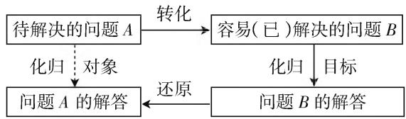
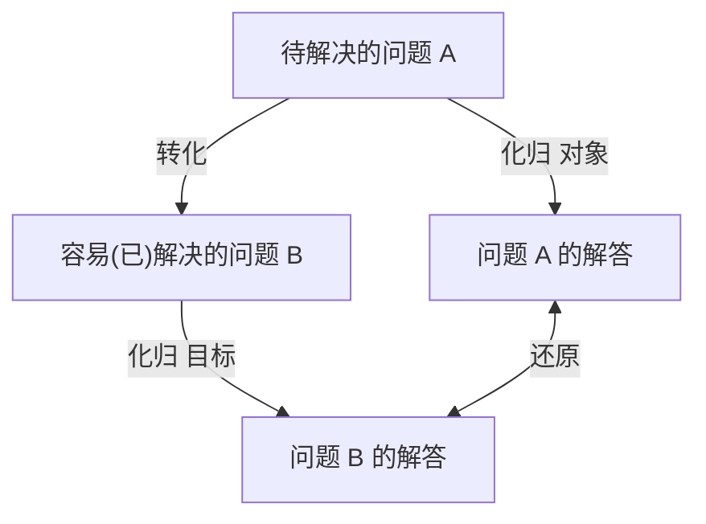
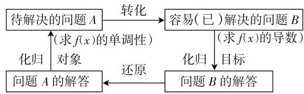

# 解题教学应显化化归过程

—— 以 2020 年全国卷 I（理）函数压轴题求解为例

江西师范大学数学与统计学院 熊玲  
- 江西师范大学数学与统计学院 刘锡光

# 一、引言

数学解题过程就是不断寻找实现化归的过程. 实际教学过程中, 师生往往只重视机械模仿训练, 而忽视寻找解题方法的过程, 因此弱化了解题教学的意义价值, 导致学生在解题的过程中没有思路. 基于此, 本文以 2020 年高考数学全国卷 I (理) 函数压轴题求解为例, 阐述化归的内涵, 分析化归思想在高中数学解题过程中的应用.

# 二、化归的要义

所谓化归, 就是在解决有关数学问题时采用某种变换手段将问题转化, 进而达到问题解决的一种举措. 一般总是将复杂问题通过变换化归为简单问题; 将难求解的问题化归为容易求解的问题; 将未解决的问题通过变换化归为已解决的问题. 其过程和本质, 用图 1 表示.



<details>
<summary>flowchart</summary>


</details>

图1

由图可见,化归的过程就是将一个未解决的问题A进行变换,使其归结为另一个已解决的问题B,由问题B的解决,再经过还原即可得到问题A的答案.

# 三、试题再现

已知函数 $f(x) = \mathrm{e}^{x} + ax^{2} - x.$

(1) 当 a=1 时, 讨论 $f(x)$ 的单调性;  
(2) 当 $x \geqslant 0$ 时, $f(x) \geqslant \frac{1}{2} x^3 + 1$ , 求 $a$ 的取值范围.

# 四、化归过程的显化

(1) 当 $a = 1, f(x) = \mathrm{e}^{x} + x^{2} - x$ .

待解决的问题 A: 讨论 $f(x)$ 的单调性.

第一次化归: 函数单调性转化为导数问题, 对 $f(x)$ 求导得 $f'(x)=\mathrm{e}^{x}+2x-1$ .

第二次化归: 导数问题转化为导函数的零点问题, 令 $f'(x)=0$ , 即 $e^{x}+2x-1=0$ , 解得 x=0. 当 x>0 时, $f'(x)>0$ ; 当 x<0 时, $f'(x)<0$ . 所以 $f(x)$ 在 $(0,+\infty)$ 上单调递增, 在 $(-∞,0)$ 上单调递减.

点评:上述化归求解过程中,是将待解决的问题A转化成容易解决的问题B,通过求解得到化归目标,进而还原待解决的问题A,具体化归步骤如图2所示.



<details>
<summary>flowchart</summary>

```mermaid
graph TD
    A["待解决的问题 A"] -->|转化| B["容易(已)解决的问题 B"]
    A -->|化归| C["问题 A 的解答"]
    C -->|还原| D["问题 B 的解答"]
    B -->|化归| D
    D -->|目标| B
    A -->|(求 f(x) 的单调性)| C
    B -->|(求 f(x) 的导数)| D
```
</details>

图2

(2) 方法一: 当 $x \geqslant 0$ 时, $f(x) \geqslant \frac{1}{2}x^{3} + 1$ 恒成立, 求 a 的取值范围. (待解决的问题 A) 对 x 进行分类讨论:

① 当 x=0 时, $a \in R.$

第一次化归,将待解决的问题 A 转化成容易解决的问题 B: 分离参数 a, 将不等式问题转化成函数问题, 构造辅助函数.

② 当 x > 0 时，即 $a \geqslant \frac{\frac{1}{2}x^{3} + x + 1 - e^{x}}{x^{2}}$ 恒成立，记 $h(x) = \frac{\frac{1}{2}x^{3} + x + 1 - e^{x}}{x^{2}}$ ,

第二次化归,将问题B转化成易解决的问题C:求解 $h(x)_{\max}$ .于是, $a\geqslant h(x)_{\max}$ .

第三次化归, 将问题 C 转化成易解决的问题 D: 求 $h'(x)$ 并判断函数 $h(x)$ 的单调性. 于是, $h'(x) = \frac{(2 - x)\left(\mathrm{e}^{x} - \frac{1}{2}x^{2} - x - 1\right)}{x^{3}}$ .

第四次化归, 将问题 D 转化成易解决的问题 E: 构造辅助函数 $g(x)$ , 判断函数 $g(x)$ 值的正负. 记 $g(x)=\left(\mathrm{e}^{x}-\frac{1}{2}x^{2}-x-1\right)$ .

第五次化归，将问题 $E$ 转化成易解决的问题 $F$ ：求 $g^{\prime}(x),g^{\prime \prime}(x)$ .因为当 $x\geqslant 0$ 时， $g^{\prime \prime}(x) = \mathrm{e}^{x} - 1\geqslant 0$ 恒成立， $g^{\prime}(x) = \mathrm{e}^{x} - x - 1$ ，所以 $g^{\prime}(x)$ 在 $(0, + \infty)$ 上单调递增，所以 $[g'(x)]_{\min} = g'(0) = 0$ ，所以 $g(x) > 0$

第六次化归，将问题 $C$ 转化成易解决的问题 $G$ ：讨论 $(2 - x)$ 值的正负，判断 $h^{\prime}(x)$ 的正负.令 $h^\prime (x) = 0$ ，可得 $x = 2$ ，当 $x\in (0,2)$ 时， $h^{\prime}(x) > 0,h(x)$ 在(0，2)上单调递增，当 $x\in (2, + \infty)$ 时， $h^\prime (x) <   0,h(x)$ 在 $(2, + \infty)$ 上单调递减.所以 $[h(x)]_{\max} = h(2) =$ $\frac{7 - \mathrm{e}^2}{4}$ ，所以 $a\geqslant \frac{7 - \mathrm{e}^2}{4}$

综上， $a$ 的取值范围为 $\left[\frac{7 - \mathrm{e}^2}{4}, + \infty\right]$

方法二：要证 $f(x)\geqslant \frac{1}{2} x^3 +1$ ，等价于证明 $\left(\frac{1}{2} x^3 -ax^2 +x + 1\right)\mathrm{e}^{-x}\leqslant 1.$ 第一次化归，将待解决的问题 $A$ 转化成容易解决的问题 $B$ ：证明 $\left(\frac{1}{2} x^3 -ax^2 +x + 1\right)\mathrm{e}^{-x}\leqslant 1.$

第二次化归，将待解决的问题 $B$ 转化成容易解决的问题 $C$ ：构造辅助函数 $g(x)$ ，证明 $g(x)_{\max} < 1$ .设函数 $g(x) = \left(\frac{1}{2} x^3 -ax^2 +x + 1\right)\mathrm{e}^{-x}(x\geqslant 0)$ ，于是证明 $g(x) < 1\Rightarrow g(x)_{\max} < 1.$

第三次化归,将待解决的问题 C 转化成容易解决的问题 D: 求解 $g'(x)$ , 则

$$
\begin{array}{l} g ^ {\prime} (x) = - \left(\frac {1}{2} x ^ {3} - a x ^ {2} + x + 1 - \frac {3}{2} x ^ {2} + 2 a x - 1\right) \mathrm{e} ^ {- x} \\ = - \frac {1}{2} x [ x ^ {2} - (2 a + 3) x + 4 a + 2 ] \mathrm{e} ^ {- x} \\ = - \frac {1}{2} x (x - 2 a - 1) (x - 2) \mathrm{e} ^ {- x}. \\ \end{array}
$$

第四次化归,将待解决的问题 D 转化成容易解决的问题 E: 求解导函数 $g'(x)$ 在定义域上值的正负,从而判断 $g(x)$ 的单调性.

① 若 $2a + 1 \leqslant 0$ ，即 $a \leqslant -\frac{1}{2}$ ，则当 $x \in (0,2)$ 时， $g'(x) > 0, g(x)$ 在 $(0,2)$ 上单调递增，而 $g(0) = 1$ ，故 $x \in (0,2)$ 时， $g(x) > 1$ ，不合题意.

② 若 $0 < 2a + 1 < 2$ ，即 $-\frac{1}{2} < a < \frac{1}{2}$ ，当 $x \in$

$(0,2a + 1)\cup (2, + \infty)$ 时， $g^{\prime}(x) <   0,g(x)$ 在 $(0,2a$ $+1),(2, + \infty)$ 上单调递减，当 $x\in (2a + 1,2)$ 时， $g^{\prime}(x) > 0,g(x)$ 在 $(2a + 1,2)$ 上单调递增.因为 $g(0) =$ 1，所以 $g(x)\leqslant 1$ ，当且仅当 $g(2) = (7 - 4a)\mathrm{e}^{-2}\leqslant 1$ ，即 $a\geqslant \frac{7 - \mathrm{e}^2}{4}$ 所以当 $\frac{7 - \mathrm{e}^2}{4}\leqslant a <   \frac{1}{2}$ 时， $g(x)\leqslant 1.$

③ $2a+1\geqslant2$ 时，即 $a\geqslant\frac{1}{2}$ ，则 $g(x)\leqslant\left(\frac{1}{2}x^{3}+x+1\right)e^{-x}$ ，由于 $0\in\left[\frac{7-e^{2}}{4},\frac{1}{2}\right)$ ，所以由
②可得 $\left(\frac{1}{2}x^{3}+x+1\right)e^{-x}\leqslant1.$ 故当 $a\geqslant\frac{1}{2}$ 时， $g(x)\leqslant1.$

综上， $a$ 的取值范围为 $\left[\frac{7 - \mathrm{e}^2}{4}, + \infty\right]$

点评: 上述化归求解过程中, 方法一, 第一次化归, 将不等式问题转化成函数问题, 利用函数模型进行求解, 考查学生的数学建模能力. 第二次化归, 将函数问题转化为最值问题, 求解函数最值是学生熟悉的问题, 一般利用求导以及函数的单调性, 再结合函数端点值即可得出原函数的最值. 第三次化归, 将函数最值问题转化成求导问题, 得到化归目标 $h'(x) = \frac{(2 - x)\left(\mathrm{e}^{x} - \frac{1}{2}x^{2} - x - 1\right)}{x^{3}}$ , 观察其特点, 发现主要矛盾为 $\left(\mathrm{e}^{x} - \frac{1}{2}x^{2} - x - 1\right)$ , 着重于分析主要矛盾. 第四次化归, 将问题转化为对主要矛盾函数值的正负情况分析. 第五次化归, 将函数问题转化成求导问题, 结合函数的单调性, 即可解决主要矛盾. 第六次化归, 将问题转化为解决问题的次要矛盾 $(2 - x)$ . 整个解题过程进行了六次化归, 将复杂问题简单化, 直到问题能够解决, 最后将答案逐步还原求得待解决的问题 A. 同时, 整个解题过程, 涉及了分类讨论思想、函数与方程思想、整体思想等.

方法二,第一次化归,将含参问题转化为证明不等式恒成立问题,不等式恒成立问题的本质就是求函数最值问题.因此,进行第二次化归,构造辅助函数 $g(x)$ ,求解函数 $g(x)$ 的最大值.第三次转化,将函数的最值问题转化成函数的求导问题.通过转化,得到目标函数 $g'(x)=-\frac{1}{2}x(x-2a-1)(x-2)e^{-x}$ .第四次化归,将导函数的问题转化成对函数值的正负分析.整个解题过程进行了四次化归,将函数与导数的综合题用化归方法逐步转化成学生(下转第57页)

有3个极大值点；② $f(x)$ 在 $(0,2\pi)$ 有且仅有2个极大值点；③ $f(x)$ 在 $\left(0,\frac{\pi}{10}\right)$ 上单调递增；④w的取值范围是 $\left[\frac{12}{5},\frac{29}{10}\right)$ ，其中所有正确结论的编号是（）

A. ①④

B.②③

C.①②③

D.①③④

分析：在五点描图法中，函数 $f(x) = \sin \left( wx + \frac{\pi}{5}\right) (w > 0)$ 的图像的第一个起始点为 $\left(\frac{-\pi}{5w}, 0\right)$ . 因为 $w > 0$ ，所以 $\frac{-\pi}{5w} < 0$ ，画好一个周期的图像后，继续往右再画两个周期，如图1所示.


<details>
<summary>text_image</summary>

y
-π/5w O x₁ x₂ 2π x
</details>

图1

从图中可以观察出:要使得 $f(x)$ 在 $[0,2\pi]$ 有且仅有 5 个零点, 则 $x_{1} \leqslant 2\pi < x_{2}$ . 又因为 $wx_{1} + \frac{\pi}{5} = 5\pi, wx_{2} + \frac{\pi}{5} = 6\pi$ , 得 $x_{1} = \frac{24\pi}{5w}, x_{2} = \frac{29\pi}{5w}$ , 所以 $\frac{24\pi}{5w} \leqslant 2\pi < \frac{29\pi}{5w}$ , 所以 $\frac{12}{5} \leqslant w < \frac{29}{10}$ .

此时只需要判断 ③ 是否正确就可以了(方法略).

本题难度较大,重点考查学生应用所学知识分析问题和解决问题的能力.如果学生只停留在记结论解决问题的层面,没有很好地理解五点作图法,没有真正理解三角函数图像的变换和性质,面对这种复杂的含参问题,考查三角函数的性质及参数范围,就会束手无策.

# 四、教学思考

从上面的运用举例不难看出：“以表助形”“为数配形”“以形助数”在解决 $f(x) = A \sin (\omega x + \varphi)$ 图像性质问题时，发挥着重要的作用。“五点作图法”形象直观，图像性质一目了然，容易被学生所接受。数形结合的方法不仅可以淡化特殊技巧、降低运算步骤繁多带来的错误率，而且在解决问题的过程中少了很多注意的细节（如 $A$ 是否为负， $\omega$ 是否为负等），从而使问题处理起来更加简洁。在应用图像解决问题的同时，培养了学生的观察能力和应用数形结合的方法解决问题的能力。

所以在平时的教学中,我们应当重视学生对数学本质的理解和掌握,而不是一味地只总结结论,让学生用结论解题就可以了,这样会导致学生对知识本质缺乏认识,理解不够透彻,数学解题能力得不到提升.教学中只有重视知识的形成过程,教会学生弄清问题的本质,追本溯源,不但要“知其然”,更要“知其所以然”,学生才能举一反三、融会贯通,提高分析问题和解决问题的能力.教师在教学中应当为学生创造更多实践探究的机会,逐步培养学生的关键能力,达成发展素质教育的目标.

# 参考文献：

[1] 曹刚, 李小燕. 三角函数的性质 [J]. 中学数学教学参考 (上), 2019(1/2).  
[2] 张小凯. 三角恒等变换 [J]. 中学数学教学参考 (上), 2019(1/2). F

(上接第55页) 熟悉的、简单的子问题,通过解决一个个子问题,最终问题得以解决.具体化归过程如图3所示.

# 五、结束语

化归思想方法不仅是一种重要的思维策略，也是一种重要的数学解题思想。本题第二小问的解答方法有多种，本人选择两种具有代表性化归的解法，通过把难解的题转化为某个易解的题或者是已经解决的题，可以提高学生的解题效率。深刻学习和运用化归思想，在提高学生解题能力方面具有重要作用，能否运用好化归思想，也直接影响学生高考的数学成绩。F


<details>
<summary>flowchart</summary>

```mermaid
graph TD
    A["待解决的问题 A: h(x) ≥ 1/2 x³ + 1 (x ≥ 0), 求 a 的取值范围"] --> B["转化 1"]
    B --> C["容易解决的问题 B: 证明 (1/2 x³ - ax² + x + 1) e⁻ˣ ≤ 1"]
    C --> D["转化 2"]
    D --> E["容易解决的问题 C: 构造辅助函数 g(x), 证 g(x)ₘₐₓ ≤ 1"]
    E --> F["转化 3"]
    F --> G["容易解决的问题 D: 求 g'(x) 并判断 g(x) 的单调性"]
    G --> H["转化 4"]
    H --> I["容易解决的问题 E: 对参数 a 讨论, 求解 g(x)ₘₐₓ ≤ 1 时, a 的取值范围"]
    I --> J["化归对象"]
    J --> K["问题 A 的答案: [7 - e²/4, +∞"]]
    K --> L["还原"]
    K --> M["问题 B 的答案"]
    M --> N["还原"]
    M --> O["问题 C 的答案"]
    O --> P["还原"]
    O --> Q["问题 D 的答案"]
    Q --> R["还原"]
    Q --> S["问题 E 的答案"]
    S --> T["化归目录"]
```
</details>

图3