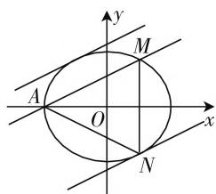

# 链接教材,看“形”算“数”

# 广东省佛山市高明区高明实验中学 何惠琼

高中数学教材是历年高考命题之源，典例之根，母题之库，很多的高考真题都能在高中数学教材中觅得踪影，找到相关的背景、面孔、变形、拓展与提升等，真正是源于教材意料之外，植于教材情理之中，高于教材能力之上.

# 一、真题呈现

【高考真题】(2020年新高考海南卷第21题)已知椭圆 $C:\frac{x^{2}}{a^{2}}+\frac{y^{2}}{b^{2}}=1(a>b>0)$ 过点 $M(2,3)$ ，点A为其左顶点，且AM的斜率为 $\frac{1}{2}$ .

(1) 求 C 的方程;  
(2) 点 $N$ 为椭圆上任意一点, 求 $\triangle AMN$ 的面积的最大值.

# 二、链接教材

此类问题归根结底就是曲线上的点到直线距离的最值问题,在现行教材中多有出现,见于多本数学教材中的不同章节部分:平面解析几何初步、导数及其应用、圆锥曲线与方程以及坐标系与参数方程等章节:

(1) 普通高中课程标准实验教科书《数学·选修2—1·A版》(人民教育出版社, 2007年2月第2版) 第47页例7:

【问题】已知椭圆 $\frac{x^{2}}{25}+\frac{y^{2}}{9}=1$ ，直线 $l:4x-5y+40=0$ 。椭圆上是否存在一点，它到直线l的距离最小？最小距离是多少？

(2) 普通高中课程标准实验教科书《数学·选修4—4·A版》(人民教育出版社, 2007年1月第2版) 第28页例1:

【问题】在椭圆 $\frac{x^2}{9} +\frac{y^2}{4} = 1$ 上求一点 $M$ ，使点 $M$ 到直线 $x + 2y - 10 = 0$ 的距离最小，并求出最小距离.

以上真题只是在该高中数学教材的相关例题的基础上加以合理的深入与拓展，借助椭圆上点到直线的距离的最值，并通过弦长的求解，结合三角形的面积公式来确定对应三角形的面积的最值问题。教材上的例题求解的是椭圆上的点到直线的最小距离（此时直线与椭圆相离），高考真题求解的是椭圆上的点到直线的最大距离（此时直线与椭圆相交）。挖掘两者之间的共同点，关键是求解椭圆上的点到直线的距离的最值，切入点多样，方法各异，合理应用，深入拓展。

# 三、真题破解

解析:(1)由题意可知,直线AM的方程为:y-3= $\frac{1}{2}(x-2)$ ,即x-2y=-4,当y=0时,解得x=-4,所以a=4.又椭圆 $C:\frac{x^{2}}{a^{2}}+\frac{y^{2}}{b^{2}}=1(a>b>0)$ 过点 $M(2,3)$ ,可得 $\frac{4}{16}+\frac{9}{b^{2}}=1$ ,解得 $b^{2}=12$ ,所以椭圆C的方程为 $\frac{x^{2}}{16}+\frac{y^{2}}{12}=1$ .

(2) 方法 1: (判别式法) 设与直线 AM 平行的直线方程为: x - 2y = m, 如图 1 所示, 当直线与椭圆相切时, 与 AM 距离比较远的直线与椭圆的切点为 N, 此时 $\triangle AMN$ 的面积取得最大值, 将直线方程 x - 2y =

text_image

y
M
A
O
x
N

图1

m 代入椭圆方程 $\frac{x^{2}}{16} + \frac{y^{2}}{12} = 1$ ，整理化简可得： $16y^{2} + 12my + 3m^{2} - 48 = 0$ ，所以判别式 $\Delta = 144m^{2} - 4 \times 16 \times (3m^{2} - 48) = 0$ ，即 $m^{2} = 64$ ，解得 $m = \pm 8$ ，与 AM 距离比较远的直线方程：x - 2y = 8，而点 N 到直线 AM 的距离即两平行线之间的距离，利用平行线之间的距离公式可得 $d = \frac{8 + 4}{\sqrt{1 + 4}} = \frac{12\sqrt{5}}{5}$ ，由两点之间距离公式可得 $|AM| = \sqrt{(2 + 4)^{2} + 3^{2}} = 3\sqrt{5}$ ，所以 $\triangle AMN$ 的面积的最大值为 $\frac{1}{2} \times 3\sqrt{5} \times \frac{12\sqrt{5}}{5} = 18$ 。

点评:根据条件设出与直线 AM 平行的直线方程,与椭圆方程联立,利用函数与方程的转化,利用判别式法来确定参数值,结合两平行线之间的距离来确定点到直线的最大距离,结合两点间的距离公式求解弦长,进而利用三角形的面积公式即可确定三角形的面积的最大值.

方法2:(三角换元法)可设 $x=4\cos\theta,y=2\sqrt{3}\sin\theta,\theta\in[0,2\pi)$ ，则点N到直线AM的距离为 $d=\frac{\left|4\cos\theta-4\sqrt{3}\sin\theta+4\right|}{\sqrt{1+4}}=\frac{\left|8\cos\left(\theta+\frac{\pi}{3}\right)+4\right|}{\sqrt{5}}$ ，当 $\cos\left(\theta+\frac{\pi}{3}\right)=1$ 时，即 $\theta=\frac{5\pi}{3}$ ，此时 $x=4\cos\theta=2,y=2\sqrt{3}\sin\theta=-3$ ，即点N的坐标为 $(2,-3),d_{\max}=\frac{12}{\sqrt{5}}=\frac{12\sqrt{5}}{5}$ ，由两点之间距离公式可得 $|AM|=\sqrt{(2+4)^{2}+3^{2}}=3\sqrt{5}$ ，所以 $\triangle AMN$ 的面积的最大值为 $\frac{1}{2}\times3\sqrt{5}\times\frac{12\sqrt{5}}{5}=18.$

点评:根据条件把相应的椭圆方程转化为参数方程,利用点到直线的距离公式,并通过辅助角公式的转化,利用三角函数的图像与性质来确定相应距离的最大值,结合两点间的距离公式求解弦长,进而利用三角形的面积公式即可确定三角形的面积的最大值.

方法3:(切线方程法)设切点 $N(m,n)(m>0,n<0)$ ，则有 $\frac{m^{2}}{16}+\frac{n^{2}}{12}=1$ 。根据切线方程的性质，可得过切点N的椭圆C的切线l的方程为 $\frac{mx}{16}+\frac{ny}{12}=1$ ，其对应的斜率 $k=-\frac{3m}{4n}$ 。由于直线 $l//AM$ ，可得 $-\frac{3m}{4n}=\frac{1}{2}$ ，代入 $\frac{m^{2}}{16}+\frac{n^{2}}{12}=1$ ，解得m=2，代入方程可得n=-3，即 $N(2,-3)$ ，而点N到直线AM的距离为 $d=\frac{|2-2\times(-3)+4|}{\sqrt{1+4}}=\frac{12\sqrt{5}}{5}$ ，由两点之间距离公式可得 $|AM|=\sqrt{(2+4)^{2}+3^{2}}=3\sqrt{5}$ ，所以 $\triangle AMN$ 的面积的最大值为 $\frac{1}{2}\times3\sqrt{5}\times\frac{12\sqrt{5}}{5}=18$ 。

点评:根据条件设出切点 N 的坐标,结合过曲线上点的切线方程的性质建立对应的切线方程,进而求解对应的斜率,利用切线与已知直线 AM 平行的条件建立关系式,与椭圆方程联立得到切点 N 的坐标,进而通过点到直线的距离公式确定其最大距离,结合两点间的距离公式求解弦长,进而利用三角形的面积公式即可确定三角形的面积的最大值.

方法4:(导数法)设切点 $N(m,n)(m>0,n<0)$ ，则有 $\frac{m^{2}}{16}+\frac{n^{2}}{12}=1$ ，而由 $\frac{x^{2}}{16}+\frac{y^{2}}{12}=1$ ，可得 $y=-\sqrt{12-\frac{3}{4}x^{2}}$ ，求导可得 $y'=\frac{3x}{4\sqrt{12-\frac{3}{4}x^{2}}}$ ，则过切点N的椭圆C的切线l的斜率为 $k=\frac{3m}{4\sqrt{12-\frac{3}{4}m^{2}}}$ 。
由于直线 $l \parallel AM$ ，可得 $\frac{3m}{4\sqrt{12-\frac{3}{4}m^{2}}}=\frac{1}{2}$ ，解得m=2，代入方程可得n=-3，即 $N(2,-3)$ ，而点N到直线AM的距离为 $d=\frac{|2-2\times(-3)+4|}{\sqrt{1+4}}=\frac{12\sqrt{5}}{5}$ 。由两点之间距离公式可得 $|AM|=\sqrt{(2+4)^{2}+3^{2}}=3\sqrt{5}$ ，所以△AMN的面积的最大值为 $\frac{1}{2}\times3\sqrt{5}\times\frac{12\sqrt{5}}{5}=18$ 。

点评:根据条件设出切点 N 的坐标,利用椭圆方程的转化,并结合求导,借助导数的几何意义确定切线的斜率,利用切线与已知直线 AM 平行的条件建立关系式,得到切点 N 的坐标,进而通过点到直线的距离公式确定其最大距离,结合两点间的距离公式求解弦长,进而利用三角形的面积公式即可确定三角形的面积的最大值.

# 四、解后反思

苏联数学教育家奥加涅相说过：“必须重视很多习题潜在着进一步扩展其教学功能、发展功能和教育功能的可行性。”现在的新课标高考命题越来越强调高中数学教材的应用，命题背景、知识、方法等都在高中数学教材中追根溯源，同时源于教材又高于教材。因而，在实际的数学教学与数学学习过程中，要充分从高中数学教材入手，以本为本，构建起高中数学相关知识的网络体系与知识框架，挖掘数学知识的本源，渗透数学相关的思想方法和核心素养，让数学教学与数学学习真正为高考提供有效的动力与能力支持。F