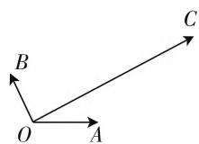
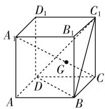
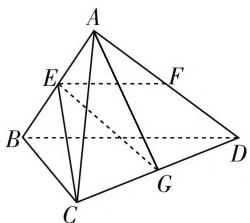

# 高考数学中向量考点分析研究

# ● 江苏省如东高级中学 熊丽丽

向量是高中数学教学的重要组成部分,也是高考数学的热门考点. 向量具有较强的工具性,能够与多个知识相结合,是几何和代数之间的桥梁,对学生今后的数学学习意义重大. 向量部分中的平面向量,可以用来解决平面几何的相关问题,空间向量则可以用来解决立体几何的相关问题,如何灵活使用向量来实现快捷解题,是高中学生数学学习的重要环节.

# 一、高考数学中的向量概述

向量是高考数学的重点,也是必考点.在每年的高考数学试卷中,都会看到向量的影子,所占的分值也较大,并且从2015年开始,高考数学全国卷中向量所占的分值逐年增加.鉴于向量在高考数学中的重要地位,我们需要了解向量在高考数学中的常考点、热门题型,从而提升自身应对向量问题的能力.通过对近些年高考数学向量问题的统计分析不难发现:对于平面向量的考查主要通过选择题和填空题实现,而在解答题中经常考查的知识点为圆锥曲线;对于空间向量的考查,主要以二面角的计算、空间直线与平面位置关系的证明和空间直线与平面所成角的计算为主.

# 二、高考数学向量部分问题分析

# （一）高考数学中平面向量考点分析研究

1. 向量基本概念类问题

例 1 以下说法中正确的是( ).

A. 长度相等的向量叫做相等向量  
B. 共线向量一定在同一条直线上  
C. 零向量的长度是 0   
D. $\overrightarrow{AB} \parallel \overrightarrow{CD}$ 也可以说是它们两个所在的直线相互平行

问题分析:关于相等向量的定义中明确提出,只有长度相等、方向相同的两个向量才称为相等向量.关于共线向量的定义中明确提出,方向相同或相反的非零向量均可称为共线向量.在选项D中“ $\overrightarrow{AB}$ // $\overrightarrow{CD}$ 也可以说是他们两个所在的直线相互平行”还有可能是两个向量所在的直线是重合的. 在解决这类题型的时候需要注意, 要与函数图像的移动区别开来.

2. 向量的线性运算类问题

例 2 已知 A, B, C 为不共线的三点，并且 $\overrightarrow{OA} + \overrightarrow{OB} + \overrightarrow{OC} = 0$ ，那么以下说法正确的是（）.

A. $\overrightarrow{OA} = -\frac{1}{3}\overrightarrow{AB} +\frac{2}{3}\overrightarrow{BC}$   
B. $\overrightarrow{OA} = -\frac{2}{3}\overrightarrow{AB} -\frac{1}{3}\overrightarrow{BC}$   
C. $\overrightarrow{OA} = -\frac{1}{3}\overrightarrow{AB} -\frac{2}{3}\overrightarrow{BC}$   
D. $\overrightarrow{OA} = -\frac{2}{3}\overrightarrow{AB} +\frac{1}{3}\overrightarrow{BC}$

问题分析:在进行向量线性运算的时候,首先要将目标向量转化到平行四边形或者三角形中,利用首尾相接或者同一顶点出发的向量来进行运算,其中相等向量、相反向量和线段比例是我们常用的知识点.此外,三角形的中位线、重心、相似三角形等知识,也可以用于向量线性运算当中.在本题中,因为 $\overrightarrow{OA}+\overrightarrow{OB}+\overrightarrow{OC}=\mathbf{0}$ ,所以O点为 $\triangle ABC$ 的重心,最终就可以完成求解.

3. 平面向量的基本定理及其应用类问题

例3 如图1所示,在一平面内有 $\overrightarrow{OA},\overrightarrow{OB},\overrightarrow{OC}$ 三个向量,其中 $\overrightarrow{OA},\overrightarrow{OB}$ 的夹角为 $120^{\circ},\overrightarrow{OA},\overrightarrow{OC}$ 的夹角为 $30^{\circ}$ ,其中 $|\overrightarrow{OA}|=|\overrightarrow{OB}|=1,|\overrightarrow{OC}|=2\sqrt{3}$ .如果 $\overrightarrow{OC}=\lambda\overrightarrow{OA}+\mu\overrightarrow{OB}(\lambda,\mu\in\mathbf{R})$ ,那么 $\lambda+\mu=$ \_\_\_\_.

  
图1

问题分析:在解决这类问题的时候需要注意,平面向量基本定理明确提出,基底必须是两个不共线的向量,学生在选择基底的时候要注意这一点,这是解决这类问题的关键.如果基底选择恰当,在解题的过程中就会事半功倍.在该题中,可以以 $\lambda\overrightarrow{OA}$ 和 $\mu\overrightarrow{OB}$ 为邻边构造平行四边形 $OB_{1}CA_{1}$ ,那么 $\overrightarrow{OC}=\overrightarrow{OB_{1}}+\overrightarrow{OA_{1}}$ .又因为“ $\overrightarrow{OA},\overrightarrow{OB}$ 的夹角为 $120^{\circ},\overrightarrow{OA},\overrightarrow{OC}$ 的夹角为 $30^{\circ}$ ，那么 $\angle B_{1}OC = 90^{\circ}$ ，所以 $|\overrightarrow{OC}| = 2\sqrt{3}$ $|\overrightarrow{OB_1}| = 2,|\overrightarrow{B_1C}| = 4,\overrightarrow{OC} = 4\overrightarrow{OA} +2\overrightarrow{OB}$ ，那么 $\lambda +\mu$ $= 6.$

# （二）高考数学中空间向量考点分析研究

# 1. 空间向量共线与共面类问题

空间向量共线与共面问题是常见题型,是学生需要掌握的重要知识之一.

例 4 如图 2 所示, 在正方体 $ABCD-A_{1}B_{1}C_{1}D_{1}$ 中, 棱长为 a, G 为三角形 $BC_{1}D$ 的重心.

text_image

D₁
C₁
A₁
B₁
G
D
C
A
B

图2

(1) 求证: $A_{1}, B, C$ 三点在一条线上;

(2) 求证: $A_{1}C \perp$ 平面 $BC_{1}D$ ;

(3) 求点 C 到平面 $BC_{1}D$ 的距离.

问题分析:在空间图形中,借助平行向量的相关知识,能够解决三点共线和线线平行的问题,其中的关键在于空间向量基底的选择上.在整个解题过程中,利用基底来表示已知条件和问题中数量关系的过程就是解决问题的过程.在正方体 $ABCD-A_{1}B_{1}C_{1}D_{1}$ 中, $\overrightarrow{CA_{1}}=\overrightarrow{CA}+\overrightarrow{AA_{1}}=\overrightarrow{CB}+\overrightarrow{CD}+\overrightarrow{CC_{1}}$ ,又因为G为 $\triangle BC_{1}D$ 的重心,所以 $\overrightarrow{CG}=\frac{1}{3}(\overrightarrow{CB}+\overrightarrow{CD}+\overrightarrow{CC_{1}})=\frac{1}{3}\overrightarrow{CA_{1}}$ ,所以 $\overrightarrow{CG}\parallel\overrightarrow{CA_{1}}$ ,那么 $A_{1},B,C$ 三点在一条线上.另外,通过向量的数量积运算可以完成垂直类问题的证明.设 $\overrightarrow{CB}=b,\overrightarrow{CD}=c,\overrightarrow{CC_{1}}=d$ ,那么 $|b|=|c|=|d|,b\cdot c=b\cdot d=c\cdot d=0$ .又因为 $\overrightarrow{CA_{1}}=\overrightarrow{CB}+\overrightarrow{CD}+\overrightarrow{CC_{1}}=b+c+d,\overrightarrow{BC_{1}}=\overrightarrow{BC}+\overrightarrow{CC_{1}}=d-b$ .所以 $\overrightarrow{CA_{1}}\cdot\overrightarrow{BC_{1}}=(b+c+d)(d-b)=a^{2}-a^{2}=0$ ,所以 $\overrightarrow{CA_{1}}\perp\overrightarrow{BC_{1}}$ ,即 $CA_{1}\perp BC_{1}$ .同理 $CA_{1}\perp BD$ .又因为 $BC_{1}\cap BD=B$ ,那么 $CA_{1}\perp$ 平面 $BC_{1}D$ .

# 2. 异面直线所成角的问题

异面直线所成角类的问题也是向量问题中较为常见的种类.

例 5 如图 3 所示, 在空间四边形 ABCD 中, 它的每一条边长为 1, 对角线的长度也为 1, 其中 E, F, G 分别是 AB, AD, CD 的中点.

text_image

Geometric diagram of a pyramid with labeled vertices and internal points, used for spatial geometry problems.

图3

(1) 求 $\overrightarrow{EF} \cdot \overrightarrow{BA}$ 的值；  
(2) 求 EG 的长度;  
(3) 求异面直线 AG 和 CE 所成角的余弦值.

试题分析:在解决异面直线构成角的余弦值类问题时,可以利用向量的数量积来求值.在本题中,我们就可以求出 $\overrightarrow{AG}\cdot\overrightarrow{CE}$ 和 $|\overrightarrow{AG}|\cdot|\overrightarrow{CE}|$ 的值,然后根据 $\cos\langle\overrightarrow{AG},\overrightarrow{CE}\rangle=\frac{\overrightarrow{AG}\cdot\overrightarrow{CE}}{|\overrightarrow{AG}||\overrightarrow{CE}|}$ 来求出 $\overrightarrow{AG}$ 和 $\overrightarrow{CE}$ 夹角的余弦值.需要注意的是,这样的计算结果并不一定是最终结果,因为异面直线构成的角的取值范围是 $\left(0,\frac{\pi}{2}\right]$ ,所以当遇到负值的时候就需要对其取绝对值.在本题中,最后结果会出现负值,就需要取其绝对值了.设 $\overrightarrow{AB}=a,\overrightarrow{AC}=b,\overrightarrow{AD}=c$ ,那么 $|a|=|b|=|c|=1,\langle a,b\rangle=\langle c,a\rangle=60^{\circ}$ .

(1) $\overrightarrow{EF} = \frac{1}{2}\overrightarrow{BD} = \frac{1}{2}\pmb {c} - \frac{1}{2}\pmb {a},\overrightarrow{BA} = -\pmb {a}$ ，那么

$$
\overrightarrow {E F} \cdot \overrightarrow {B A} = \left(\frac {1}{2} c - \frac {1}{2} a\right) \cdot (- a) = \frac {1}{4}.
$$

(2) $\overrightarrow{EG} = \overrightarrow{EB} +\overrightarrow{BC} +\overrightarrow{CG} = \frac{1}{2}\pmb {a} + \pmb {b} - \pmb {a} + \frac{1}{2}\pmb {c}-$   
$\frac{1}{2}b=-\frac{1}{2}a+\frac{1}{2}b+\frac{1}{2}c,\left|\overrightarrow{EG}\right|^{2}=\frac{1}{2},$ 那么 $\left|\overrightarrow{EG}\right|=$ $\frac{\sqrt{2}}{2}.$   
(3) $\overrightarrow{AG} = \frac{1}{2}\pmb{b} + \frac{1}{2}\pmb{c},\overrightarrow{CE} = \overrightarrow{CA} +\overrightarrow{AE} = -\pmb {b} + \frac{1}{2}\pmb{a},$

$$
\cos \langle \overrightarrow {A G}, \overrightarrow {C E} \rangle = \frac {\overrightarrow {A G} \cdot \overrightarrow {C E}}{| \overrightarrow {A G} | | \overrightarrow {C E} |} = - \frac {2}{3}.
$$

# 三、小结

向量是高中数学教学的重要组成部分,其内容结构复杂,抽象性较强,对高中生来说理解起来难度较大,是高中数学教学的难点,但又是高考数学考查的重点.在高中数学向量知识的教学中,教师要结合高考向量的考点,对向量知识进行分类,并引导学生结合自己的理解去总结解题方法,做到触类旁通、举一反三,这样才能够提升自身解决高考向量问题的能力,才能够获得最佳的学习效果.

# 参考文献：

[1] 戴佳珉. 普通高中课程标准数学高考考情解读 [M]. 北京: 北京师范大学; 2011.  
[2] 俞飞, 吴燕. 关注题型, 积累方法——以“平面向量问题”高考复习为例 [J]. 中学数学 (上), 2017(3). W