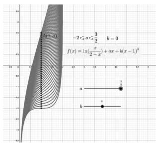
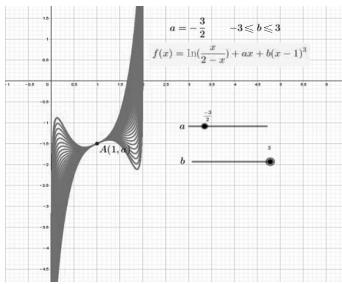
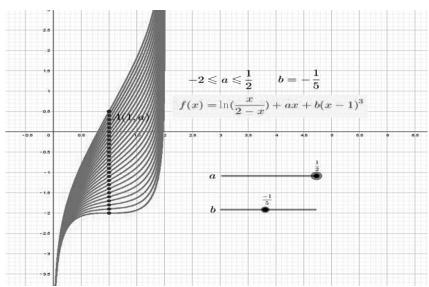
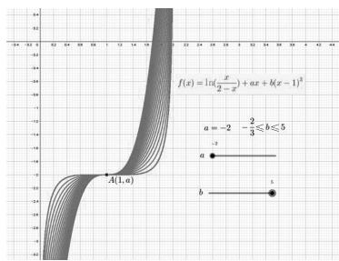
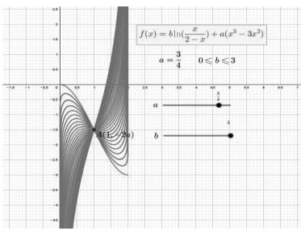
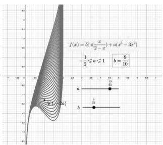
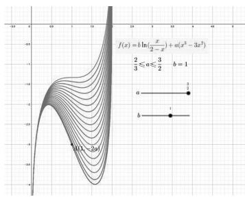
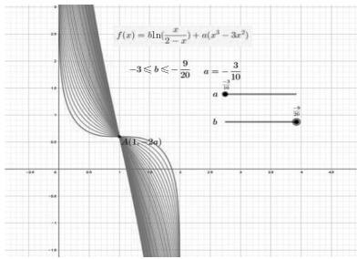

# 2024 年新高考 I 卷第 18 题深度解析与拓展研究

——结合 Geogebra 图象绘制

# 洪 凯

(广东省中山市东区中学, 广东 中山 528403)

摘 要:本文对2024年全国新高考Ⅰ卷第18题进行了深度解析与拓展研究,通过详细解析题目,深入探讨了函数的性质、导数的应用以及恒成立问题的解决策略.结合Geogebra图象绘制工具,直观地展示了函数在不同参数下的变化趋势,帮助学生更好地理解函数性质,并对题目进行了拓展研究,探讨了类似问题的解题方法和思路,为学生提供了更广阔的解题视角.

关键词: 高考数学试题; Geogebra 软件; 试题解析; 拓展

中图分类号：G632

文献标识码：A

文章编号:1008-0333(2025)09-0011-04

2024 年全国新高考 I 卷第 18 题是一道极具考验性的数学难题,它巧妙地将多个数学领域的核心知识点与解题策略融为一体. 此题不仅是对学生基础知识扎实程度的一次全面检验,更是对其逻辑思维、问题剖析及解决问题能力的一次深度挑战. 要想解决这道题目,学生需要在纷繁复杂的数学信息中抽丝剥茧,灵活运用所学,方能找到通往正确答案的钥匙.

# 1 试题讲解

题目（2024年全国新高考Ⅰ卷第18题）已知函数 $f(x) = \ln \frac{x}{2 - x} + ax + b(x - 1)^3$ .

(1) 若 b=0，且 $f'(x) \geqslant 0$ ，求 a 的最小值；  
(2) 证明: 曲线 $y = f(x)$ 是中心对称图形;  
(3) 若 $f(x) > -2$ 当且仅当 1 < x < 2，求 b 的取值范围.

解析 (1) 当 $b = 0$ 时, $f(x) = \ln \frac{x}{2 - x} + ax$ , 其中

函数的定义域为(0,2)，则 $f'(x)=\frac{2-x}{x}\cdot(\frac{x}{2-x})'$ $+a=\frac{2}{x(2-x)}+a,x\in(0,2).$

因为 $x(2-x) \leqslant \left(\frac{2-x+x}{2}\right)^{2} = 1$ ，当且仅当 x = 1 时等号成立，故 $f'(x)_{\min} = 2 + a$ 。又因为 $f'(x) \geqslant 0$ 恒成立，所以 $a + 2 \geqslant 0$ 。即 $a \geqslant -2$ 。

故 $a$ 的最小值为-2.

利用 Geogebra 软件绘制函数 $f(x) = \ln \frac{x}{2 - x} + ax + b(x - 1)^{3}$ 图象(图 1 和图 2) $^{[1]}$ .

(2) 函数 $f(x) = \ln \frac{x}{2 - x} + ax + b(x - 1)^{3}$ 的图象关于点 $(1, a)$ 成中心对称图形，当且仅当函数 y  
$= f(x + 1) - a$ 是奇函数，即 $y = f(x + 1) - a$   
$= \ln \frac{x + 1}{2 - (x + 1)} + a(x + 1) + b[(x + 1) - 1]^3 - a$   
$= \ln \frac{x + 1}{1 - x} + ax + bx^3.$

text_image

A(1,a)
-2≤a≤3/2 b=0
f(x)=ln(x/2-x)+ax+b(x-1)³
a
b

图1 当 $b = 0, a$ 在 $[-2, \frac{3}{2}]$ 中变化时，函数 $f(x)$ 图象动态演示  

text_image

a = -\frac{3}{2} -3 \leqslant b \leqslant 3
f(x) = \ln(\frac{x}{2-x}) + ax + b(x-1)^3
A(1,a)

图2 当 $a = -\frac{3}{2}, b$ 在 $[-3, 3]$ 中变化时，函数 $f(x)$ 图象动态演示

不妨设 $g(x)=\ln\frac{x+1}{1-x}+ax+bx^{3},x\in(-1,1)$ ,
显然定义域关于原点对称，则 $g(-x)=\ln\frac{-x+1}{1-(-x)}+a(-x)+b(-x)^{3}=-(\ln\frac{1+x}{1-x}+ax+bx^{3})=-g(x)$ . 故 $g(x)$ 为奇函数. 所以函数 $y=f(x+a)-b$ 是奇函数. 则函数 $f(x)=\ln\frac{x}{2-x}+ax+b(x-1)^{3}$ 的图象关于点 $(1,a)$ 呈中心对称图形.

利用 Geogebra 软件绘制函数 $f(x) = \ln \frac{x}{2 - x} + ax + b(x - 1)^{3}$ 图象(图 3 和图 4).

text_image

-2 \u00b1 a \u00b1 \u00b1 \u00b1 b = -\frac{1}{5}
f(x) = \ln(\frac{x}{2-x}) + ax + b(x-1)^3
a
b
-1

图3 当 $b = -\frac{1}{5}, a$ 在 $[-2, \frac{1}{2}]$ 中变化时，函数 $f(x)$ 图象动态演示

(3)由于函数 $f(x)$ 的图象关于点 $(1,a)$ 成中心对称图形,故当0<x<1时, $f(x)<-2$ .

故 $f(1)=-2$ ，即 $\ln1+a+0=-2$ 。所以a=-2。

line

| x    | y      |
| ---- | ------ |
| -∞   | -∞     |
| 0    | -∞     |
| 1    | -∞     |
| 2    | -∞     |
| 3    | -∞     |
| 4    | -∞     |
| 5    | -∞     |
| 6    | -∞     |
| 7    | -∞     |
| 8    | -∞     |
| 9    | -∞     |
| 10   | -∞     |
| 11   | -∞     |
| 12   | -∞     |
| 13   | -∞     |
| 14   | -∞     |
| 15   | -∞     |
| 16   | -∞     |
| 17   | -∞     |
| 18   | -∞     |
| 19   | -∞     |
| 20   | -∞     |
| 21   | -∞     |
| 22   | -∞     |
| 23   | -∞     |
| 24   | -∞     |
| 25   | -∞     |
| 26   | -∞     |
| 27   | -∞     |
| 28   | -∞     |
| 29   | -∞     |
| 30   | -∞     |
| 31   | -∞     |
| 32   | -∞     |
| 33   | -∞     |
| 34   | -∞     |
| 35   | -∞     |
| 36   | -∞     |
| 37   | -∞     |
| 38   | -∞     |
| 39   | -∞     |
| 40   | -∞     |
| 41   | -∞     |
| 42   | -∞     |
| 43   | -∞     |
| 44   | -∞     |
| 45   | -∞     |
| 46   | -∞     |
| 47   | -∞     |
| 48   | -∞     |
| 49   | -∞     |
| 50   | -∞     |
| 51   | -∞     |
| 52   | -∞     |
| 53   | -∞     |
| 54   | -∞     |
| 55   | -∞     |
| 56   | -∞     |
| 57   | -∞     |
| 58   | -∞     |
| 59   | -∞     |
| 60   | -∞     |
| 61   | -∞     |
| 62   | -∞     |
| 63   | -∞     |
| 64   | -∞     |
| 65   | -∞     |
| 66   | -∞     |
| 67   | -∞     |
| 68   | -∞     |
| 69   | -∞     |
| 70   | -∞     |
| 71   | -∞     |
| 72   | -∞     |
| 73   | -∞     |
| 74   | -∞     |
| 75   | -∞     |
| 76   | -∞     |
| 77   | -∞     |
| 78   | -∞     |
| 79   | -∞     |
| 80   | -∞     |
| 81   | -∞     |
| 82   | -∞     |
| 83   | -∞     |
| 84   | -∞     |
| 85   | -∞     |
| 86   | -∞     |
| 87   | -∞     |
| 88   | -∞     |
| 89   | -∞     |
| 90   | -∞     |
| 91   | -∞     |
| 92   | -∞     |
| 93   | -∞     |
| 94   | -∞     |
| 95   | -∞     |
| 96   | -∞     |
| 97   | -∞     |
| 98   | -∞     |
| 99   | -∞     |
| 100  | -∞     |

图4 当 $a = -2, b$ 在 $[- \frac{2}{3}, 5]$ 中变化时，函数 $f(x)$ 图象动态演示

当 1 < x < 2 时, $f(x) > -2$ 恒成立,

即 $\ln\frac{x}{2-x}-2(x-1)+b(x-1)^{3}>0$ 在 $(1,2)$ 上恒成立.

不妨设 t = x - 1，由 $x \in (1, 2)$ ，则 $t \in (0, 1)$ ，原不等式变形为 $h(t) = \ln \frac{t + 1}{1 - t} - 2t + bt^{3} > 0$ .

此时 $h'(t)=\frac{2}{(1+t)(1-t)}-2+3bt^{2}$

$$
= \frac {t ^ {2} [ 3 b (1 - t ^ {2}) + 2 ]}{1 - t ^ {2}}.
$$

①当 $b \geqslant 0$ 时, $h'(t) > 0$ , 即 $h(t)$ 在 $[0,1)$ 上单调递增. 故 $h(t) > h(0) = 0$ .  
②当 $-\frac{2}{3} \leqslant b < 0$ 时, $3b(1 - t^{2}) + 2 \geqslant 3$ $\times (-\frac{2}{3})(1 - t^{2}) + 2 = 2t^{2} > 0$ , 所以 $h'(t) > 0$ . 即 $h(t)$ 在 [0,1) 上单调递增. 故 $h(t) > h(0) = 0$ .  
③当 $b < -\frac{2}{3}$ 时, $h'(t) > 0$ , 即 $3b(1 - t^2) + 2 > 0$ . 因为 $t \in (0,1)$ , 所以 $t > \sqrt{\frac{3b + 2}{3b}}$ .

同理 $h'(t) < 0$ ，得到 $t < \sqrt{\frac{3b + 2}{3b}}$ 。即 $h(t)$ 在 $[0, \sqrt{\frac{3b + 2}{3b}})$ 上单调递减，在 $[\sqrt{\frac{3b + 2}{3b}}, 1)$ 上单调递增。故 $h(\sqrt{\frac{3b + 2}{3b}}) < h(0) = 0$ ，不合题意，舍去。

综上, $f(x)>-2$ 在 $(1,2)$ 上恒成立时 $b\geqslant-\frac{2}{3}$ .

反之, 当 $b \geqslant -\frac{2}{3}$ 时, $h(t)$ 在 $(0,1)$ 上单调递增, 故 $h(t) > 0, t \in (0,1)$ .

2024 年全国新高考 I 卷第 18 题第(2)问的证明,巧妙引用了教材必修第一册第 87 页第 13 题的结论,彰显了教材在备考中的关键作用 $^{[2]}$ . 教材不仅是学生学习数学基础知识的主要来源,也是高考命题的重要依据. 考生须具备出色的知识迁移能力,将教材中的知识点灵活应用于高考解题中. 这不仅要求考生深入理解每个知识点,还要能在不同情境中灵活运用. 基于此,笔者结合本题与教材必修第一册第 87 页第 13 题改编一道新题.

变式题 已知函数 $f(x) = b\ln \frac{x}{2 - x} + a(x^3 - 3x^2)$

(1) 证明: 曲线 $y = f(x)$ 是中心对称图形;  
(2) 若 b=1，函数 $y=f(x)$ 存在极值点，求 a 的取值范围；  
(3) 若 $f(x) > \frac{3}{5}$ ，当且仅当 0 < x < 1，求 b 的取值范围.

解析 (1) 函数 $y = f(x)$ 定义域为(0,2)，

$$
\text {又} f (x) + f (2 - x) = b \ln {\frac {x}{2 - x}} + a (x ^ {3} - 3 x ^ {2})
$$

$+b\ln\frac{2-x}{2-(2-x)}+a[(2-x)^{3}-3(2-x)^{2}]=b\ln\frac{x}{2-x}$ $+a(x^{3}-3x^{2})+b\ln\frac{2-x}{x}+a(-x^{3}+3x^{2}-4)=-4a$ , 故
函数 $f(x)=b\ln\frac{x}{2-x}+a(x^{3}-3x^{2})$ 的图象关于
(1,-2a)成中心对称图形. 利用 Geogebra 软件绘制函数 $f(x)=b\ln\frac{x}{2-x}+a(x^{3}-3x^{2})$ 图象(图5和图6).

text_image

f(x) = b\ln(\frac{x}{2-x}) + a(x^3 - 3x^2)
a = \frac{3}{4}    0 \leqslant b \leqslant 3
A(1-2s)

图5 当 $a = \frac{3}{4}, b$ 在[0,3]中变化时，函数 $f(x)$ 图象动态演示

(2) 当 b = 1 时, 函数 $y = f(x)$ 图象关于 $(1, -2a)$ 成中心对称, 所以 $f(x) = \ln \frac{x}{2 - x} + a(x^{3})$

text_image

f(x) = bln(x/2 - x) + a(x^3 - 3x^2)
- (1/2) ≤ a ≤ 1
b = 9/10
a
b
(a)
(b)

图6 当 $b = \frac{9}{10}, a$ 在 $[- \frac{1}{2}, 1]$ 中变化时，函数 $f(x)$ 图象动态演示 $-3x^2$ )存在两个不同的极值点.

即 $f'(x)=\frac{2}{x(2-x)}+3ax(x-2)=0$ 有两个不同的零点，即 $\frac{1}{x(2-x)}[2-3ax^{2}(2-x)^{2}]=0$ 有两个不同的解，即 $2-3ax^{2}(2-x)^{2}=0$ 有两个不同的解.

则 $a = \frac{2}{3(2x - x^2)^2}$ . 令 $y = 2x - x^2$ , 当 $0 < x < 2$ 时, $y \in (0,1]$ , 此时 $a > \frac{2}{3}$ .

综上所述,若 b=1, 函数 $y=f(x)$ 存在极值点, a 的取值范围为 $\left(\frac{2}{3}, +\infty\right)$ .

利用 Geogebra 软件绘制函数 $f(x) = \ln \frac{x}{2 - x} + a(x^{3} - 3x^{2})$ 图象(图7).

line

| x    | f(x) = b ln(x/2 - x) + a(x² - 3x²) |
| ---- | ---------------------------------- |
| 0    | -4                                 |
| 10   | -2                                 |
| 20   | 0                                  |
| 30   | 2                                  |
| 40   | 4                                  |

图7 当 $b = 1, a$ 在 $\left[\frac{2}{3}, \frac{3}{2}\right]$ 中变化时，函数 $f(x)$ 图象动态演示

(3)由于函数 $f(x)$ 的图象关于点 $(1,-2a)$ 成中心对称图形,即当1<x<2时, $f(x)<\frac{3}{5}$ .故 $f(1)=\frac{3}{5},\ln1+a(1-3)=\frac{3}{5}$ .所以 $a=-\frac{3}{10}$ .当0<x<1时, $f(x)>\frac{3}{5}$ 恒成立,即 $b\ln\frac{x}{2-x}-\frac{3}{10}(x^{3}-3x^{2})-\frac{3}{5}>0$ 在 $(0,1)$ 上恒成立.

设 $g(x) = b\ln \frac{x}{2 - x} -\frac{3}{10}\left(x^3 -3x^2\right) - \frac{3}{5},$ 即证$g(x)>0$ 在 $(0,1)$ 上恒成立. 又 $g'(x)=\frac{2b}{x(2-x)}$ $-\frac{3}{10}(3x^{2}-6x)=\frac{1}{x(2-x)}\left[2b+\frac{9}{10}(2x-x^{2})^{2}\right]$ ,

①当 $b\geqslant0$ 时, $2b+\frac{9}{10}(2x-x^{2})^{2}\geqslant0$ , $g'(x)>0$ ,故 $g(x)$ 在 $(0,1)$ 上单调递增, $\forall x\in(0,1)$ ,都有 $g(x)<g(1)=0$ ,即 $f(x)<\frac{3}{5}$ ,故 $b\geqslant0$ 不满足条件.  
②当 $-\frac{9}{20} < b < 0$ 时，由 $2b + \frac{9}{10}(2x - x^2)^2 > 0$ 得 $1 - \sqrt{1 - \sqrt{\frac{-20b}{9}}} < x < 1 + \sqrt{1 - \sqrt{\frac{-20b}{9}}}$ .

又 $x \in (0,1), 1 + \sqrt{1 - \sqrt{\frac{-20b}{9}}} > 1$ ，故 $g(x)$ 在 $(1 - \sqrt{1 - \sqrt{\frac{-20b}{9}}}, 1)$ 上单调递增。由 $2b + \frac{9}{10} \cdot (2x - x^2)^2 < 0$ 得 $x < 1 - \sqrt{1 - \sqrt{\frac{-20b}{9}}}$ 或 $x > 1 + \sqrt{1 - \sqrt{\frac{-20b}{9}}}$ 。又 $x \in (0,1), 1 + \sqrt{1 - \sqrt{\frac{-20b}{9}}} > 1$ ，故 $g(x)$ 在 $(0,1 - \sqrt{1 - \sqrt{\frac{-20b}{9}}})$ 上单调递减。

此时 $x = 1 - \sqrt{1 - \sqrt{\frac{-20b}{9}}}$ 为 $g(x)$ 的极小值点， $g(1 - \sqrt{1 - \sqrt{\frac{-20b}{9}}}) < g(1) = 0.$

故 $-\frac{9}{20}<b<0$ 不满足条件.

③当 $b \leqslant -\frac{9}{20}$ 时, $2b + \frac{9}{10}(2x - x^2)^2 < 2b + \frac{9}{10} < 0$ , 故 $g(x)$ 在 $(0,1]$ 上单调递减, 故 $g(x) > g(1) = 0$ . 故 $f(x) > \frac{3}{5}$ 在 $(0,1)$ 上恒成立时 $b \leqslant -\frac{9}{20}$ .

反之，当 $b \leqslant -\frac{9}{20}$ 时，即 $g'(x) = \frac{2b}{x(2 - x)} - \frac{3}{10}(3x^2 - 6x) = \frac{1}{x(2 - x)}[2b + \frac{9}{10}(2x - x^2)^2]$ .

故 $g'(x) < \frac{1}{x(2-x)} (2b + \frac{9}{10}) < 0.$ 所以 $g(x)$ 在 $(0,1]$ 上单调递减. 故 $g(x) > g(1) = 0.$

综上所述, $f(x)>\frac{3}{5}$ 当且仅当0<x<1,此时b的取值范围为 $(-∞,-\frac{9}{20}]$ .

利用 Geogebra 软件绘制函数 $f(x)=b\ln\frac{x}{2-x}+a(x^{3}-3x^{2})$ 图象(图8).

line

| x    | y      |
| ---- | ------ |
| -3   | 0.5    |
| 3    | 0.5    |
| 4    | 0.7    |

图8当 $a = -\frac{3}{10}, b$ 在 $[-3, -\frac{9}{20}]$ 中变化时，函数 $f(x)$ 图象动态演示

# 2 备考策略

针对 2024 年全国新高考 I 卷第 18 题及自编题的解析,备考策略如下:(1)重视基础.深入研读教材,扎实掌握函数、导数等核心概念与性质.(2)精练提升.通过针对性练习,提高解题效率与精度,特别是面对复杂函数问题.(3)开阔思路.锻炼逻辑思维,学习多样化解题路径,灵活迁移知识解决问题.

# 3 结束语

本文通过对 2024 年全国新高考 I 卷第 18 题的深度分析, 结合 Geogebra 图象绘制, 揭示了题目的本质及其解题路径. 同时, 笔者自编了一道类似题目, 不仅巩固了知识点, 还提升了学生解决实际问题的能力. 本研究对高中数学教学及备考策略具有积极的指导意义, 希望广大师生能够从中受益, 共同提高数学教学及备考水平.

# 参考文献：

[1] 王贵军. GeoGebra 与数学实验 [M]. 北京: 清华大学出版社, 2017.  
[2] 中华人民共和国教育部. 普通高中数学课程标准(2017年版)[M]. 北京: 人民教育出版社, 2017. [责任编辑: 李慧娇]