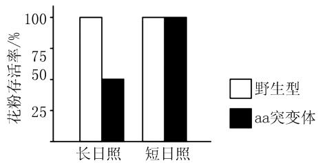
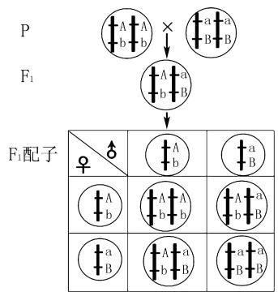
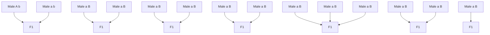
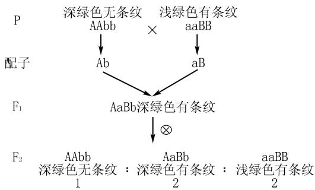
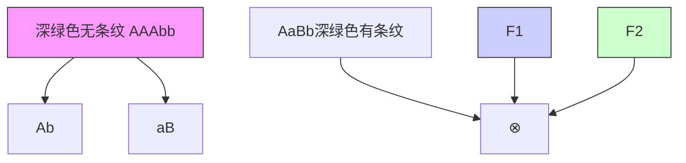

# 基于科学思维培养的高中生物学 解题思路和方法探究

章小寅

(福建省龙岩第一中学, 福建 龙岩 364000)

摘 要:基于科学思维培养高中学生生物学解题思路和方法的研究及应用,是教育改革推进的内在需求.教育改革要求教师根据学生现有的知识及解题水平,培养学生运用科学思维解题,形成科学分析问题的意识及科学解决问题的方法,从而提升学生的实际解题能力.本文以遗传类题型的解题思路为例,分析科学思维视域下高中生物学解题思路和方法的培养策略.

关键词: 科学思维; 高中生物学; 解题思路和方法

中图分类号：G632

文献标识码：A

文章编号:1008-0333(2025)09-0140-03

在新课程改革的形势下,教师应基于“科学思维”的理念,仔细研究并解读题目,总结科学的解题思路和方法,为培养学生科学的解题思维夯实基础.新课程改革重视对学生实践及创新能力的培养,教师应引导学生利用科学思维与方法理解生命科学的本质,构建系统的生物学知识框架,并将其灵活应用在题目的解答过程中 $^{[1]}$ .

# 1 夯实基础,联系生产实践,解决实际问题

生物学试题的求解需要具备扎实的基础理论知识,在解题过程中也可以很好地培养学生解决实际生产问题的能力.例如在开展“孟德尔杂交实验”的教学过程中,教师就可有效整合遗传学实验现象、理论知识和生产实践,使学生通过解题训练,加深对遗传定律的认识,解决实际问题.教师需帮助学生掌握遗传的基本定律,夯实基础知识,应用相关的知识分析问题,归纳总结相应的解题思路及方法,确保学生能够准确求解题目.同时将所学理论知识用于解决实际问题,培养学生的科学思维、科学探究能力和社会责任 $^{[2]}$ .

例 1 （2024 年福建省 4 月诊断性质量检测 19 题节选）雄性不育是水稻育种过程中的重要性状，研究者在不同水稻品种中鉴定出 A 基因和 B 基因, 它们都是调控光周期敏感性的雄性育性基因, 负责在花药发育过程中将糖由叶片运往花药. 回答下列问题:

(1)雄性不育水稻花粉不育,在杂交过程中只能作为\_\_\_\_,其在杂交过程中的优势是\_\_\_\_.  
(2)研究发现,A 基因主要在长日照条件下表达. 经检测,aa 突变体在长日照和短日照条件下的花粉存活情况如图 1 所示. 由图可知,aa 突变体在长日照和短日照条件下的花粉育性表现分别为 \_\_\_\_.

bar

| 时间 | 野生型 (%) | aa突变体 (%) |
|---|---|---|
| 长日照 | 100 | 48 |
| 短日照 | 100 | 100 |

图 1 花粉存活率

分析 （1）学生掌握了课本基础知识“供应花粉的植株叫作父本”，根据题干信息“花粉不育”，即该水稻不能产生正常可育的花粉，那么杂交过程中就不能作为父本，只能作为母本。根据孟德尔的人工异花传粉(杂交)过程，两性花植物(豌豆、水稻等)作为母本时应该去雄，该水稻花粉不育，因此不用进

收稿日期:2024-12-25

作者简介:章小寅,研究生,一级教师,从事高中生物教学研究.

行去雄操作,在实际工作中可以节省人力,从而提高经济效益.(2)分析坐标图可以发现,野生型在长日照和短日照下花粉存活率均达到100%.aa突变体在长日照下花粉存活率只有50%,在短日照下花粉存活率也达到100%.

# 2 避免经验主义,准确分析题目信息,寻找正确的解题方法

高中生物学对遗传理论知识的考查,通常涉及细胞核(质)遗传、伴性遗传、基因分离和自由组合等多个知识点,很多高考试题的背景资料往往都是来自教材中学生熟悉的素材,侧重于考查学生分析问题和解决问题的能力.学生在做题时容易因为机械记忆,未经详细分析而直接套用已有知识,从而造成解题方向的错误.因此在解题时应避免经验主义,准确分析题干中所提供的信息,寻找正确的解题方向和方法 $^{[3]}$ .

例 2 （2023 年全国卷 34 题节选）果蝇常被用作遗传学研究的实验材料。果蝇翅型的长翅和截翅是一对相对性状，眼色的红眼和紫眼是另一对相对性状，翅型由等位基因 T/t 控制，眼色由等位基因 R/r 控制。某小组以长翅红眼、截翅紫眼果蝇为亲本进行正反交实验，杂交子代的表型及其比例分别为，长翅红眼雌蝇：长翅红眼雄蝇 = 1:1（杂交①的实验结果）；长翅红眼雌蝇：截翅红眼雄蝇 = 1:1（杂交②的实验结果）。根据杂交结果可以判断，属于伴性遗传的性状是 \_\_\_\_，判断的依据是 \_\_\_\_。

分析:本题中关于“果蝇眼色”这对相对性状,学生在课堂上学习到的基础理论知识是“控制红眼和白眼的基因在X染色体上,而Y染色体上不含它的等位基因”.学生很容易出于经验主义而直接判定此题中的果蝇眼色(红眼和紫眼)位于X染色体上.造成解题方向和思路的错误.分析题意可知实验①和实验②为正反交实验,两组实验中翅型在子代雌雄果蝇中的表现不同,即正反交实验结果不同,说明控制该性状的基因位于性染色体上.分析实验结果可以进一步推出,控制翅型的相关基因位于X染色体,且长翅为显性;而眼色的正反交结果相同,说明该基因位于常染色体,且红眼为显性.

# 3 强调解题的逻辑性推导,培养学生的解题思路

高中生物学的遗传学题目具备较强的逻辑性,对遗传学知识的运用能力提出了较高要求.教师在教学过程中可以引导学生利用演绎推理进行解题,培养学生的逻辑思维能力和科学思维 $^{[4]}$ .

例 3 已知豌豆的豆荚饱满对不饱满为显性,由等位基因 A/a 控制;花色中红花对白花为显性,由等位基因 B/b 控制,两对等位基因独立遗传.现有基因型为 AaBb 的豌豆亲本进行自交,则下列叙述错误的是().

A. 若亲本产生的雄配子可育数是不育数的 2 倍, 则含 a 的花粉 50% 不育  
B. 若含 a 的花粉 50% 不育, 则 $F_{1}$ 中与亲本基因型相同的概率为 1/4  
C. 若含 A 和 a 的花粉均 50% 不育, 则自交后代表现型及比例仍为 9:3:3:1  
D. 不管亲本含 a 的花粉育性如何, $F_{1}$ 中红花植株所占比例均是 3/4

分析 本题可采用假说演绎法进行分析. 假设含 a 的花粉 50% 不育, 则基因型为 AaBb 的亲本进行自交, 产生的雌配子为: AB: Ab: aB: ab = 1:1:1:1, 而雄配子为: AB: Ab: aB: ab = 2:2:1:1, 由此可以推出雄配子可育数(6)是不育数(2)的 3 倍. 根据图 2

<table><tr><td>♀♂</td><td>1/4 AB</td><td>1/4 Ab</td><td>1/4 aB</td><td>1/4 ab</td></tr><tr><td>1/3AB</td><td></td><td></td><td></td><td>1/12 AaBb</td></tr><tr><td>1/3Ab</td><td></td><td></td><td>1/12 AaBb</td><td></td></tr><tr><td>1/6aB</td><td></td><td>1/24 AaBb</td><td></td><td></td></tr><tr><td>1/6ab</td><td>1/24AaBb</td><td></td><td></td><td></td></tr></table>

图 2 演绎推理过程

的演绎推理过程, $F_{1}$ 中与亲本基因型(AaBb)相同的概率为 $(1/24+1/24+1/12+1/12)$ 1/4. 若含A和a的花粉均50%不育,则产生的雄配子种类和比例为仍然为AB:Ab:aB:ab=1:1:1:1,因此自交后代表现型及比例仍为9:3:3:1. 根据题干信息,可将两对等位基因独立分析,即基因型为 Bb 的亲本进行自交, $F_{1}$ 中红花植株(B)所占比例为 3/4.

# 4 巧妙利用遗传图解,提升学生的解题能力

遗传图解以其独特的符号和语言,成为学习遗传学的重要推理工具.在分析和梳理真实情景中的问题时,巧妙地将文字信息转化为遗传图解,不仅可以更快、更准确地找到解题思路和方向,同时也能促进学生归纳、演绎和推理等科学思维的发展.教师在指导学生进行遗传学类型题目的专项训练时,引导学生准确分析题目信息、规范书写遗传图解、运用遗传图解进行演绎推理,从而优化解题思路,提升解题技巧,发展科学思维.

例 4 （2023 年福建卷节选）甜瓜幼果果皮有深绿色和浅绿色之分，为探究甜瓜幼果果皮颜色的遗传规律，科研人员进行了相关研究，发现幼果果皮颜色由 4 号染色体上的等位基因 A/a 控制。将深绿色甜瓜与浅绿色甜瓜杂交， $F_{1}$ 幼果为深绿色。已知甜瓜果皮有条纹基因 B 与无条纹基因 b 也位于 4 号染色体上。现有两个纯合甜瓜品种，幼果深绿色无条纹和幼果浅绿色有条纹，设计一个杂交实验证明控制甜瓜果皮两对性状的基因位于同一对染色体上。（用遗传图解表示，不考虑染色体互换）

分析 幼果果皮颜色和条纹性状由两对等位基因 A/a 和 B/b 控制, 欲证明 A/a 和 B/b 位于同一对染色体上, 题干中仅提供了两个纯合甜瓜品种: 幼果深绿色无条纹 (AAbb) 和幼果浅绿色有条纹 (aaBB). 因此, 设计的实验第一步是将这两个纯合亲本杂交, 得到的 $F_{1}$ 基因型为 AaBb. 为证明这两对等位基因位于一对同源染色体上, 根据孟德尔两对相对性状的杂交实验过程, 将 $F_{1}$ (AaBb) 自交, 若 A/a 和 B/b 位于同一对同源染色体上, 则 $F_{2}$ 的表现型及比例为: 深绿色无条纹 (AAbb): 深绿色有条纹 (AaBb): 浅绿色有条纹 (aaBB) = 1:2:1 (图 3), 由此得出遗传图解 (图 4).

# 5 结束语

综上所述,基于科学思维培养学生的解题能力,首先应夯实生物学基础知识,以便在解题时得

flowchart

图 3 棋盘法推导过程  

flowchart

图 4 遗传图解

以应用. 读题时应仔细研究题目所提供的已知、关键条件, 准确分析题目信息, 避免经验主义, 寻找正确的解题方向和方法. 解题时应综合运用各种技巧, 进行科学的逻辑性推导, 巧妙利用遗传图解, 正确解题. 科学思维在高中生物学中的应用是十分广泛的, 它不仅有助于学生理解和掌握相关的生物学知识, 更有助于培养学生的独立思考能力和解决问题能力, 因此科学思维对于学生的成长具有非常重要的意义.

# 参考文献：

[1] 肖正清. 基于科学思维培养目标的高中生物学教学策略探究 [J]. 考试周刊, 2023(11): 145-148.  
[2] 郑少丹. 2022 年全国卷遗传试题的特点及命题建议 [J]. 教学考试, 2023(6): 32-35.  
[3] 吴志强. 果蝇红、紫眼色的遗传和教学启示: 以2023年新课标理论卷第34项为例[J]. 生物学教学, 2023, 48(11):70-71.  
[4] 赵燕. 高考遗传试题中的“演绎推理”[J]. 教学考试, 2023(42): 51-57.

[责任编辑:季春阳]