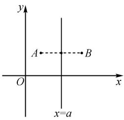
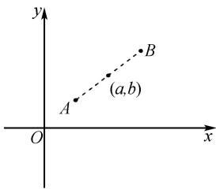

# 强调“四基” 回归本质 以不变应万变

——以“函数的周期性和对称性”复习模块为例

# 杨 萃 孙小刚

(甘肃省嘉峪关市第一中学, 甘肃 嘉峪关 735100)

摘 要:“四基”是学生形成和发展数学学科核心素养的有效载体,而强调“四基”就是要把握数学知识的本质.函数的周期性和对称性一直是学生学习的难点,结论表达式较多且容易混淆,但只要回归本质,就能拨云见日,以不变应万变.文章在考点回顾部分梳理了周期性与对称性的本质,并以此推出了一些常见结论,通过典例剖析将理论应用于实践.

关键词：“四基”; 函数性质; 周期性; 对称性; 高考复习

中图分类号：G632

文献标识码：A

文章编号:1008-0333(2025)09-0015-04

函数是高中数学四条主线之一,熟练掌握其性质是解决相关问题的关键.本文通过回归函数周期性与对称性的本质,推导出常见的结论表达式,并借助例题展示了如何运用数学知识本质解决问题,从而有效提升学生的解题能力和数学素养.

# 1 考点回顾

# 1.1 周期性

周期函数:一般地,设函数 $f(x)$ 的定义域为 D, 如果存在一个非零常数 T, 使得对每一个 $x \in D$ 都有 $x + T \in D$ 且 $f(x) = f(x + T)$ , 那么函数 $y = f(x)$ 叫做周期函数, T 叫做函数的一个周期.

周期函数的本质是自变量增大或减小某个数时, 函数值不变, 即 $f(O + T) = f(O)$ , 圆圈中可填定义域内的所有实数. 填入 $x + T$ , 得 $f(x + 2T) = f(x + T) = f(x)$ , 2T 是函数的周期; 填入 $x + (k - 1)T$ (k 是正整数), 得 $f(x + kT) = f[x + (k - 1)T] = \cdots = f(x)$ ,

$kT(k$ 是正整数 $)$ 是函数的周期;填入 $x-T$ ,得 $f(x)=f(x-T),-T$ 是函数的周期,因此 $-kT(k$ 是正整数 $)$ 也是函数的周期.

综上所述,若函数 $y=f(x)$ 周期为 T, 则 kT 也是函数的周期, 即有 $f(x+kT)=f(x)$ (k 是非零整数).

常用结论:(1)若 $f(x+a)=c-f(x)$ (c是常数,a是非零常数),则T=2a.(2)若 $f(x+a)=\frac{c}{f(x)}$ (c,a是非零常数),则T=2a.

# 1.2 对称性

轴对称的性质:对称点连线段的中垂线是对称轴.

中心对称的性质: 对称点连线段的中点是对称中心.

若点 $A(x_{1},y_{1})$ ，点 $B(x_{2},y_{2})$ 关于 x=a 对称，如
图 1 所示, 则有 $\left\{\begin{aligned}\frac{x_{1}+x_{2}}{2}&=a,\\ y_{1}&=y_{2}.\end{aligned}\right.$ ①

收稿日期:2024-12-25

作者简介:杨萃,硕士,一级教师,从事中学数学教学研究;

孙小刚,本科,高级教师,从事中学数学教学研究.

基金项目:甘肃省教育科学“十四五”规划“普通高中数学新课程实验跟踪与质量检测教改实验项目”2023年度专项课题“嘉峪关市高中数学新教材使用研究”(项目编号:GS[2023]GHBZX0022).

text_image

y
A •••••B
O
x=a

图1 关于 $x = a$ 对称  

text_image

y
A
(a,b)
B
O
x

图2 关于点 $(a,b)$ 对称

若点 $A(x_{1},y_{1})$ ，点 $B(x_{2},y_{2})$ 关于点 $(a,b)$ 对称，如图 2 所示, 则有 $\left\{\begin{aligned}\frac{x_{1}+x_{2}}{2}&=a,\\ \frac{y_{1}+y_{2}}{2}&=b.\end{aligned}\right.$ ②

对称的本质即上述两式,下文中出现的①式、②式均指这两个式子.

# 1.2.1 函数自身对称性

(1) 若函数 $y = f(x)$ 的图象关于 $x = a$ 对称, 则图象上的每一对对称点关于 $x = a$ 对称, 设点 $A(x, f(x))$ 、点 $B(m, f(m))$ , 代入①式, 得

$$
f (2 a - x) = f (x).
$$

(2) 若函数 $y = f(x)$ 的图象关于 $(a, b)$ 对称，则图象上的每一对对称点关于 $(a, b)$ 对称，设点 $A(x, f(x))$ 、点 $B(m, f(m))$ ，代入②式，得

$$
\frac {f (2 a - x) + f (x)}{2} = b.
$$

(3) 若函数 $y = f(x + a) - b$ 是奇函数 $\Leftrightarrow$ 函数 $f(x)$ 的图象关于 $(a, b)$ 对称.

这个结论的本质是图象变换：

$$
\begin{array}{l} y = f (x + a) - b \xrightarrow [ \text {右平移} a \text {个单位} ]{x - a} y = f (x) \\ - b \xrightarrow [ \text {上平移} b \text {个单位} ]{y + b} y = f (x) \\ \end{array}
$$

奇函数 $y=f(x+a)-b$ 图象的对称中心 $(0,0)$ 随图象平移之后得到函数 $y=f(x)$ 图象的对称中心为 $(a,b)$ .

另一条思路的本质是奇函数的定义, $f(x+a)-b=-f(-x+a)+b$ ,整理得 $f(x+a)+f(-x+a)=2b$ ,具有②式的形式,得函数 $y=f(x)$ 图象的对称中心为 $(a,b)$ .

(4) 同理, 若函数 $y = f(x + a) - b$ 是偶函数 $\Rightarrow$ 函数 $f(x)$ 的图象关于直线 x = a 对称.  
(5) 若函数 $f(x)$ 的图象关于 $(a, b)$ 对称 $\Rightarrow$ 其导函数 $f'(x)$ 的图象关于直线 x = a 对称.  
(6) 若函数 $f(x)$ 的图象关于直线 x = a 对称 $\Rightarrow$ 其导函数 $f'(x)$ 的图象关于点 $(a, 0)$ 对称.

# 1.2.2 双对称的周期性(类比 $y = \sin x$ 记忆)

(1) 若函数 $y = f(x)$ 的图象关于 $x = a, x = b (a \neq b)$ 对称，则 $T = 2 |a - b|$ .  
(2) 若函数 $y = f(x)$ 的图象关于 $(a, c), (b, c) (a \neq b)$ 对称，则 $T = 2|a - b|$ .  
(3) 若函数 $y = f(x)$ 的图象关于 $x = a, (b, c)$ ( $a \neq b$ ) 对称，则 $T = 4 |a - b|$ .

分析 函数周期性的核心是得到 $f(x)=f(x+T)$ ，因此需不断求中间量的函数值建立新的等量关系，直到出现 $f(x)=f(x+T)$ 的形式.

由函数 $y=f(x)$ 的图象关于 $x=a,(b,c)(a\neq c)$ 对称, 得 $f(x)=f(2a-x), f(x)=2c-f(2b-x)$ .

将第2个式子中的x换成2a-x,得

$$
f (2 a - x) = 2 c - f (2 b - 2 a + x).
$$

等量替换,得 $f(x)=2c-f(2b-2a+x)$ .

再将 x 换成 $2b - 2a + x$ ，得

$$
f (2 b - 2 a + x) = 2 c - f (2 b - 2 a + 2 b - 2 a + x).
$$

整理,得 $f(x)=f(4b-4a+x)$ .

一般考虑函数的最小正周期,因此取 $T=4|a-b|$ .

# 1.2.3 两个函数的对称性

(1) 函数 $y = f(m + x)$ 的图象与 $y = f(n - x)$ 的图象关于 $x = \frac{n - m}{2}$ 对称.

特别地, 当 m = n = 0 时, 函数 $y = f(x)$ 的图象与 $y = f(-x)$ 的图象关于 y 轴对称.

证明 设任意一对对称点 $A(x_{1}, f(m + x_{1}))$ ， $B(x_{2}, f(n - x_{2}))$ 分别在函数 $y = f(m + x)$ 与 $y = f(n - x)$ 的图象上，

若两个函数图象呈轴对称,则有

$$
\left\{ \begin{array}{l} \frac {x _ {1} + x _ {2}}{2} = a, \\ f (m + x _ {1}) = f (n - x _ {2}). \end{array} \right.
$$

要使对于任意 $x_{1}, f(m + x_{1}) = f(n - 2a + x_{1})$ 恒成立，则有 $m + x_{1} = n - 2a + x_{1}$ ，求得 $a = \frac{x_{1} + x_{2}}{2} = \frac{n - m}{2}$ .

若两个函数图象呈中心对称,则有

$$
\left\{ \begin{array}{l} \frac {x _ {1} + x _ {2}}{2} = a, \\ \frac {f (m + x _ {1}) + f (n - x _ {2})}{2} = b. \end{array} \right.
$$

此时 b 无法是常数, 因此两函数图象不呈中心对称.

(2) 函数 $y = f(m + x)$ 的图象与 $y = c - f(n - x)$ 的图象关于 $\left(\frac{n - m}{2}, \frac{c}{2}\right)$ 对称.

特别地, 当 m = n = c = 0 时, 函数 $y = f(x)$ 的图象与 $y = -f(-x)$ 的图象关于原点对称. 证明与上类似.

(3) 函数 $y = f(x)$ 的图象与 $y = c - f(x)$ 的图象关于直线 $y = \frac{c}{2}$ 对称.

特别地, 当 c = 0 时, 函数 $y = f(x)$ 的图象与 $y = -f(x)$ 的图象关于 x 轴对称.

证明 设任意一对对称点 $A(x_{1},f(x_{1}))$ ， $B(x_{2},c - f(x_{2}))$ 分别在函数 $y = f(x)$ 与 $y = c - f(x)$ 的图象上，代入①式，②式，均无法使式子恒成立，但观察发现当 $x_{1} = x_{2}$ 时， $f(x_{1}) + c - f(x_{2})$ 是常数，由此想到对称轴是一条水平线，两图象关于直线 $y = \frac{c}{2}$ 对称.

(4) 互为反函数的两个函数图象关于直线 $y = x$ 对称.

# 2 典例剖析

例 1 （2021 年全国甲卷理）设函数 $f(x)$ 的定义域为 R, $f(x+1)$ 为奇函数, $f(x+2)$ 为偶函数, 当 $x \in [1,2]$ 时, $f(x) = ax^{2} + b$ . 若 $f(0) + f(3) = 6$ , 则 $f(\frac{9}{2}) = (\quad)$

A. $-\frac{9}{4}$

B. $-\frac{3}{2}$

C. $\frac{7}{4}$

D. $\frac{5}{2}$

解法 1 （奇偶性定义）由于 $f(x+1)$ 为奇函数，所以 $f(x+1) = -f(-x+1)$ ，x 换成 x-1 整理得 $f(x) = -f(-x+2)$ ，具有②式形式，代入得 $\frac{x-x+2}{2} = 1, \frac{f(x) + f(-x+2)}{2} = 0$ ，所以函数 $f(x)$ 的图象关于点 $(1,0)$ 对称， $f(1) = -f(1)$ .

所以 $f(1)=a+b=0.$

又 $f(x+2)$ 为偶函数,所以 $f(x+2)=f(-x+2)$ ,整理得 $f(x)=f(-x+4)$ ,具有①式形式,代入得 $\frac{x-x+4}{2}=2$ ,所以函数 $f(x)$ 的图象关于直线x=2对称.由双对称,得周期为4,即 $f(x+4k)=f(x)$ .

借助整理得到的两个式子,得

$$
f (0) = - f (2), f (3) = f (1) = 0.
$$

代入 $f(0)+f(3)=6$ ,得

$$
- f (2) + f (1) = - 4 a - b = 6.
$$

由 $a + b = 0$ , 得 a = -2, b = 2.

即 $f(x) = -2x^{2} + 2$ . 利用周期函数的性质 $f(x + 4k) = f(x)$ ( $k$ 为非零整数) 找到与 $f(\frac{9}{2})$ 相等的自变量较小的函数值, $f(\frac{9}{2}) = f(\frac{9}{2} - 4) = f(\frac{1}{2})$ , 再代入两个整理得到的式子中, 观察哪一个能将自变量转换到已知区间上, 最终得 $f(\frac{9}{2}) = f(\frac{1}{2}) = -f(\frac{3}{2}) = \frac{5}{2}$ .

解法 2 （图象变换） $y = f(x + 1)$ $\xrightarrow{x-1}y=f(x)$ ，因此函数 $f(x)$ 的图象关于点 $(1,0)$ 对称，且 $f(1)=0$ ，即 $a+b=0$ 。

又 $y=f(x+2)\xrightarrow[x-2]{右平移2个单位}y=f(x)$ ，因此函数 $f(x)$ 的图象关于直线 x=2 对称，由双对称，得周期为 4，即 $f(x+4k)=f(x)$ .

题目中已知 $x \in [1,2]$ 的解析式,通过数形结合借助对称性将 $f(0)$ 与 $f(3)$ 转化到已知区间上,根据②式 $f(0) = -f(2)$ , 根据①式, $f(3) = f(1)$ , 代入 $f(0) + f(3) = 6$ , 得

$$
- f (2) + f (1) = - 4 a - b = 6.
$$

由 $a + b = 0$ ，得 $a = -2, b = 2.$ 即 $f(x) = -2x^{2} + 2.$ 所以 $f\left(\frac{9}{2}\right) = f\left(\frac{9}{2} - 4\right) = -f\left(\frac{3}{2}\right) = \frac{5}{2}.$

技巧 函数 $f(x)$ 表达式中的 x 可以替换为定义域内的任意解析式, 解题时可根据所需灵活处理或构造新的关系式, 注意关系式中所有的 x 要同时进行替换. 判断出函数的对称性可画出对称轴和对称中心, 借助图象快速找到对称点.

例 2 （2022 年新高考Ⅱ卷）若函数 $f(x)$ 的定义域为 R，且 $f(x + y) + f(x - y) = f(x)f(y)$ ， $f(1) = 1$ ，则 $\sum_{k=1}^{22} f(k) = (\quad)$ .

A.-3

B.-2

C. 0

D. 1

解析 要求 $\sum_{k=1}^{22}f(k)$ ，函数值一定会呈现一定的规律性，所以可以根据条件中抽象函数的性质，给 x, y 赋值，得到一些函数值后寻找规律。为了尽快找到函数 $f(x)$ 的性质，可以通过赋值让等式中只保留变量 x，要使左边只有 x，令 y=0，得到

$2f(x)=f(x)f(0)$ ，所以 $f(0)=2$ .

再让右边只保留 x, 令 y = 1, 得

$$
f (x + 1) + f (x - 1) = f (x).
$$

此时函数 $f(x)$ 的性质还很隐蔽,因此,我们利用上式继续构造

$$
f (x + 2) + f (x) = f (x + 1),
$$

联立,得 $f(x+2)+f(x-1)=0$ .

一眼看去它好像具有②式的形式,但此时 $\frac{x+2+x-1}{2}$ 并非常数,因此它不具有对称性,所以考虑将x换成 $x+1$ ,得 $f(x)=-f(x+3)$ ,根据周期性的常用结论得T=6.

根据上述结论,可得

$$
\begin{array}{l} f (2) = - 1, f (3) = - f (0) = - 2, f (4) = - f (1) \\ = - 1, f (5) = - f (2) = 1, f (6) = - f (3) = 2. \\ \end{array}
$$

即 $f(1) + f(2) + \cdots + f(6) = 0.$

根据周期性质知

$$
f (1 9) = f (3 \times 6 + 1) = f (1),
$$

$$
f (2 0) = f (3 \times 6 + 2) = f (2),
$$

同理 $f(21)=f(3)$ , $f(22)=f(4)$ .

所以 $\sum_{k=1}^{22}f(k)=3\times0+f(1)+f(2)+f(3)$

$$
+ f (4) = 1 - 1 - 2 - 1 = - 3.
$$

技巧 关于抽象函数 $f(x)$ 的等量关系式, x 前系数相同可推得函数的周期性, x 前系数相反可推得函数的对称性, 简记为“同周期反对称”.

例 3 设 $f(x)$ 是定义在 R 上的奇函数, 且对任意实数 x, 恒有 $f(x+2) = -f(x)$ . 当 $x \in [0,2]$ 时, $f(x) = 2x - x^{2}$ . 求 $x \in [2,4]$ 时函数 $f(x)$ 的解析式.

解析 由 $f(x)$ 是定义在 $\mathbf{R}$ 上的奇函数可知 $f(x) = -f(-x)$ 且 $f(0) = 0$ . 由 $f(x) = -f(x + 2)$ , 得 $f(x + 2) = -f(x + 4)$ , 整理为 $f(x) = f(x + 4)$ .

所以函数 $f(x)$ 的周期为4,可得

$f(x+4k)=f(x)$ (k 是非零整数).

由奇函数的性质可将自变量变为相反数,由周期性可给自变量加4k,首先假设 $2\leqslant x\leqslant4$ ,对自变量实施 $\times(-1)$ 和 $+4k$ 的运算,使其范围转化到已知区间上,得 $-2\leqslant x-4\leqslant0,0\leqslant4-x\leqslant2$ ,代入解析式得

$$
f (4 - x) = 2 (4 - x) - (4 - x) ^ {2} = - x ^ {2} + 6 x - 8.
$$

由奇函数性质知

$$
f (x - 4) = - f (4 - x) = x ^ {2} - 6 x + 8.
$$

又周期为 4, 所以 $f(x) = f(x - 4) = x^{2} - 6x + 8$ .

技巧 设 $x \in$ 待求区间, 通过对 x 实施 $\times (-1)$ 和 +kT 的运算将自变量转化到已知区间上, 代入求出新解析式, 根据奇偶性与周期性变形得到待求区间上的函数解析式.

# 3 结束语

《普通高中数学课程标准(2017年版2020年修订)》提出发展学生数学学科核心素养[1]，而“四基”是学生形成和发展数学学科核心素养的有效载体，强调“四基”就要把握数学知识的本质。因此，熟练掌握函数周期性与对称性的关键在于结合函数图象，吃透周期性和对称性的定义，理解其真正内涵，悟透周期性和对称性的内在联系，明白利用周期性可以“窥一斑而见全豹”，用好对称性便可“知一半而知全部”。

# 参考文献：

[1] 中华人民共和国教育部. 普通高中数学课程标准(2017年版2020年修订)[M]. 北京: 人民教育出版社, 2020. [责任编辑: 李慧娇]