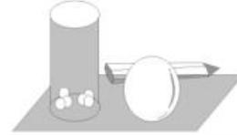

natural_image

Illustration of a person in business attire standing beside stacked books (no text or symbols visible)

# 一元二次函数、方程和不等式核心考点强化训练

# ■刘大鸣(特级教师)

# 一、选择题

1. 已知 $a > b$ ，且 $ab \neq 0, c \in \mathbb{R}$ ，则下列不等式中一定成立的是（ ）。

A. $a^2 > b^2$

B. $\frac{1}{a} < \frac{1}{b}$

C. $\frac{a+b}{2}\geqslant\sqrt{ab}$

D. $\frac{a}{c^2 + 1} >\frac{b}{c^2 + 1}$

2. 若 $x > y > 1$ ，则下列四个数中最小的是（ ）。

A. $\frac{x+y}{2}$

B. $\frac{2xy}{x+y}$

C. $\sqrt{x}$

D. $\frac{1}{2}\left(\frac{1}{x} +\frac{1}{y}\right)$

3. 若关于 $x$ 的不等式 $\frac{4x}{a} + \frac{1}{x - 2} \geqslant 4$ 对任意 $x > 2$ 恒成立, 则正实数 $a$ 的最大值是( )。

A. 4

B. 3

C. 2

D. 1

4. 若不等式 $a(1 + x) \leqslant x^2 + 3$ 对于 $x \in [0, +\infty)$ 恒成立，则实数 $a$ 的取值范围是（ ）。

A. $[0,3]$

B. $[0,2]$

C. $(-∞,2]$

D. $(-∞,3]$

5. 当 a > 0, b > 0 时, 不等式 $-b < \frac{1}{x} < a$ 的解集是( )。

A. $\left\{x\mid x <   - \frac{1}{b}\text{或} x > \frac{1}{a}\right\}$

B. $\left\{x\mid -\frac{1}{a} <  x <   \frac{1}{b}\right\}$

C. $\left\{x\mid x <   - \frac{1}{a}\text{或} x > \frac{1}{b}\right\}$

D. $\left\{x\mid -\frac{1}{b} < x < 0\right.$ 或 $0 <   x <   \frac{1}{a}\Bigg\}$

6. 当 $1 \leqslant x \leqslant 4$ 时, 不等式 $x^{2} - (m + 1)x + 9 \leqslant 0$ 有解, 则实数 m 的最小值为( )。

A. 9

B. 5

C. 6

D. $\frac{21}{4}$

7. 若两个正实数 $x, y$ 满足 $\frac{1}{x} + \frac{4}{y} = 1$ ,

且不等式 $x + \frac{y}{4} < m^{2} - 3m$ 有解，则实数 m 的取值范围是（）。

A. $\{m\mid -1 <   m <   4\}$

B. $\{m \mid m < 0 \text{ 或 } m > 3\}$

C. $\{m\mid -4 <   m <   1\}$

D. $\{m\mid m <   - 1$ 或 $m > 4\}$

8. 已知 $p: 2a + 3 < 0$ ，且 $q: \exists x \in \mathbf{R}, x^2 - (2a - 1)x + 1 < 0$ 为真命题，则 $p$ 是 $q$ 的（ ）。

A. 充分不必要条件

B. 必要不充分条件

C. 充要条件

D. 既不充分也不必要条件

9. 若不等式 $(a-3)x^{2}+2(a-2)x-4<0$ 对于一切 $x\in R$ 恒成立，则实数a的取值范围是()。

A. $\{a \mid a \leqslant 2\}$

B. $\{a\mid -2\sqrt{2}\leqslant a\leqslant 2\sqrt{2}\}$

C. $\{a\mid -2\sqrt{2} <  a <   2\sqrt{2}\}$

D. $\{a\mid a <   2\}$

10. 对任意 x 满足 $-1 \leqslant x \leqslant 2$ ，不等式 $x^{2} - 2x + a < 0$ 成立的一个必要不充分条件是（）。

A. $a < -3$

B. $a < -4$

C. $a <   0$

D. $a > 0$

11.(多选题)对于给定实数 a, 关于 x 的一元二次不等式 $(ax-1)(x+1)<0$ 的解集可能是()。

A. $\left\{x\mid -1 <   x <   \frac{1}{a}\right\}$

B. $\{x \mid x \neq -1\}$

C. $\left\{x\mid \frac{1}{a} <  x <   - 1\right\}$

D. $\mathbf{R}$

12.(多选题)下列命题中的真命题是( )。

A. 当 x > 1 时， $x + \frac{1}{x - 1}$ 的最小值是 3  
B. $\frac{x^{2}+5}{\sqrt{x^{2}+4}}$ 的最小值是2  
C. 当 0 < x < 10 时， $\sqrt{x(10-x)}$ 的最大值是 5  
D. 若正实数 $x, y$ 满足 $x + 2y = 3xy$ , 则 $2x + y$ 的最大值为 3

13.(多选题)已知 a, b 为正实数, 且 $ab + 2a + b = 16$ , 则()。

A. $ab$ 的最大值为 8  
B. $2a + b$ 的最小值为 8  
C. $a + b$ 的最小值为 $6\sqrt{2} - 3$   
D. $\frac{1}{a + 1} +\frac{1}{b + 2}$ 的最小值为 $\frac{\sqrt{2}}{2}$

14.(多选题)在 R 上定义运算: $\begin{vmatrix} a & b \\ c & d \end{vmatrix} = ad - bc$ , 若不等式 $\begin{vmatrix} x - 1 & a - 2 \\ a + 1 & x \end{vmatrix} \geqslant 1$ 对任意实数 x 恒成立, 则实数 a 的可能取值为( )。

A. -1

B. $-\frac{3}{2}$

C. $\frac{1}{2}$

D. $\frac{3}{2}$

15.(多选题)已知 $a, b \in R$ ，且 ab > 0，则下列不等式成立的是()。

A. $\frac{a + b}{2} \geqslant \sqrt{ab}$

B. $ab \leqslant \frac{a^2 + b^2}{2}$

C. $\frac{b}{a} +\frac{a}{b}\geqslant 2$

D. $\frac{2ab}{a+b}\leqslant\frac{a+b}{2}$

16.(多选题)若 x>0, y>0, $x+2y=1$ ，则下列说法正确的是()。

A. xy 的最大值是 $\frac{1}{8}$   
B. $\frac{2}{x}+\frac{1}{y}$ 的最小值是8  
C. $4x^{2} + y^{2}$ 的最小值为 $\frac{1}{2}$   
D. $\frac{(x+1)(2y+1)}{\sqrt{xy}}$ 的最小值是4

17.(多选题)已知关于 x 的一元二次不等式 $ax^{2}-(2a-1)x-2>0$ ，其中 a<0，则该不等式的解集可能是()。

A. ∅

B. $\left\{x\mid 2 <   x <   - \frac{1}{a}\right\}$   
C. $\left\{x\mid x <   - \frac{1}{a}\text{或} x > 2\right\}$   
D. $\left\{x\left|- \frac{1}{a}<x<2\right.\right\}$

18.(多选题)若关于 x 的不等式 $ax^{2}-bx+c>0$ 的解集是 $\{x\mid-1<x<2\}$ ，则下列选项正确的是()。

A. b<0 且 c>0   
B. $a - b + c > 0$   
C. $a + b + c > 0$   
D. 不等式 $ax^2 + bx + c > 0$ 的解集是 $\{x \mid -2 < x < 1\}$

# 二、填空题

19. 若关于 x 的不等式 $ax^{2} + 2ax - 1 < 0$ 的解集为 R，则实数 a 的取值范围是 \_\_\_\_。  
20. 设 $a \in R$ ，若关于 x 的不等式 $x^{2} - ax + 1 \geqslant 0$ 在 $1 \leqslant x \leqslant 2$ 上有解，则实数 a 的取值范围为 \_\_\_\_。  
21. 关于 x 的不等式 $x^{2}-4x+4a \geqslant a^{2}$ 在 [1,6] 内有解，则 a 的取值范围为 \_\_\_\_。  
22. 对任意 $A, B \subseteq \mathbf{R}$ , 记 $A \oplus B = \{x \mid x \in A \cup B$ , 且 $x \notin A \cap B\}$ , 并称 $A \oplus B$ 为集合 $A, B$ 的对称差。已知集合 $A = \{x \mid ax^2 + bx - 3 \geqslant 0\} = \{x \mid 1 \leqslant x \leqslant 3\}$ , 集合 $B = \left\{x \left| \frac{bx - 8}{ax} > 0 \right\}, \text{则 } A \oplus B = \_$ 。

# 三、解答题

23. 设命题 $p$ : 方程 $x^{2} + (2m - 4)x + m = 0$ 有两个不相等的实数根; 命题 $q$ : 对所有的 $2 \leqslant x \leqslant 3$ , 不等式 $x^{2} - 4x + 13 \geqslant m^{2}$ 恒成立。

(1) 若命题 p 为真命题, 求实数 m 的取值范围。  
(2) 若命题 p, q 一真一假, 求实数 m 的取值范围。

24.(1)若关于 x 的不等式 $ax^{2}-2x+3\leqslant0$ 在 $x\in R$ 上有解, 求实数 a 的取值范围。  
(2)若关于 x 的不等式 $-2 \leqslant ax^{2} - 2x + 3 \leqslant 2$ 恰有一个实数解, 求实数 a 的值(或取值范围)。  
25. 已知正数 $x, y$ 满足 $x + 2y = 1$ 。若

$\frac{1}{x}+\frac{2}{y}\geqslant3^{a}$ 恒成立，求实数 a 的取值范围。

26. 已知\_\_\_\_。① $x + \frac{1}{x - 1} (x > 1)$ 的最小值是 $a$ ; ②不等式 $(1 - a)x^{2} - 4x + 6 > 0$ 的解集是 $\{x \mid -3 < x < 1\}$ 。

从上述条件①、条件②中任选一个,补充在上面的横线上作为已知条件,并解答下面的问题。

(1) 解不等式 $2x^{2}+(2-a)x-a>0$ 。

(2) 若 $ax^{2} + bx + 3 \geqslant 0$ 的解集为 R，求实数 b 的取值范围。

# 参考答案与提示

# 一、选择题

1. 提示: 当 a=1, b=-2 时, 1>-2, $1^{2}<(-2)^{2}=4$ , $\frac{1}{1}>\frac{1}{-2}$ , $\sqrt{ab}$ 无意义, A, B, C 错误。因为 $c^{2}+1>0$ , 所以 $\frac{a}{c^{2}+1}>\frac{b}{c^{2}+1}$ , D 正确。应选 D。

2. 提示: 因为 x > y > 1, 所以 $\frac{x + y}{2} > \frac{1 + 1}{2} = 1$ , $\frac{2xy}{x + y} = \frac{2}{\frac{1}{y} + \frac{1}{x}} > \frac{2}{1 + 1} = 1$ , $\sqrt{x} > 1$ , $\frac{1}{2}\left(\frac{1}{x} + \frac{1}{y}\right) < \frac{1}{2}\left(\frac{1}{1} + \frac{1}{1}\right) = 1$ , 所以四个数中最小的是 $\frac{1}{2}\left(\frac{1}{x} + \frac{1}{y}\right)$ 。应选 D。

3. 提示: 因为 x > 2, 所以 x - 2 > 0。因为 $\frac{4x}{a} + \frac{1}{x - 2} \geqslant 4$ 对任意 x > 2 恒成立, 所以 $\frac{4(x - 2)}{a} + \frac{1}{x - 2} + \frac{8}{a} \geqslant 4$ 对任意 x > 2 恒成立, 所以 $\left[\frac{4(x - 2)}{a} + \frac{1}{x - 2} + \frac{8}{a}\right]_{\min} \geqslant 4$ 。而 $\frac{4(x - 2)}{a} + \frac{1}{x - 2} \geqslant 2 \sqrt{\frac{4(x - 2)}{a} \cdot \frac{1}{x - 2}} = \frac{4}{\sqrt{a}}$ , 当且仅当 $\frac{4(x - 2)}{a} = \frac{1}{x - 2}$ 时取等号, 所以原问题转化为 $\frac{4}{\sqrt{a}} + \frac{8}{a} \geqslant 4$ , 即 $4\sqrt{a} + 8 \geqslant 4a$ , 解这个关于 $\sqrt{a}$ 的一元二次不等式, 并注意到 a > 0, 可得 $0 < a \leqslant 4$ , 所以正实数 a 的最

大值是 4。应选 A。

4. 提示: 原不等式可化为 $a \leqslant \frac{x^{2} + 3}{x + 1}$ 恒成立。设函数 $f(x) = \frac{x^{2} + 3}{x + 1}$ ，则函数 $f(x) = \frac{(x + 1)^{2} - 2x - 2 + 4}{x + 1} = x + 1 + \frac{4}{x + 1} - 2 \geqslant 2\sqrt{(x + 1) \cdot \frac{4}{x + 1}} - 2 = 2$ ，当且仅当 $x + 1 = \frac{4}{x + 1}$ ，即 x = 1 时等号成立，所以函数 $f(x)$ 有最小值 2。因为 $a \leqslant f(x)$ 恒成立，所以 $a \leqslant 2$ 。应选 C。

5. 提示: 由 $\frac{1}{x} < a (a > 0)$ , 可得 $\frac{ax - 1}{x} > 0$ , 所以 $x(ax - 1) > 0$ , 所以 $x > \frac{1}{a}$ 或 $x < 0$ 。由 $-b < \frac{1}{x} (b > 0)$ , 可得 $x(bx + 1) > 0$ , 所以 $x > 0$ 或 $x < -\frac{1}{b}$ 。故不等式 $-b < \frac{1}{x} < a$ 的解集是 $\left\{x \mid x > \frac{1}{a} \text{或 } x < -\frac{1}{b}\right\}$ 。应选 A。

6. 提示: 当 $1 \leqslant x \leqslant 4$ 时, 不等式 $x^{2} - (m + 1)x + 9 \leqslant 0$ 有解, 即 $m + 1 \geqslant x + \frac{9}{x}$ 有解。因为 $x + \frac{9}{x} \geqslant 2\sqrt{x \cdot \frac{9}{x}} = 6$ , 当且仅当 $x = \frac{9}{x}$ , 即 x = 3 时取等号, 所以当 $1 \leqslant x \leqslant 4$ 时, $x + \frac{9}{x}$ 的最小值为 6, 所以 $m + 1 \geqslant 6$ , 即 $m \geqslant 5$ 。故实数 m 的最小值为 5。应选 B。

7. 提示: 已知正实数 x, y 满足 $\frac{1}{x} + \frac{4}{y} = 1$ ，所以 $x + \frac{y}{4} = \left(\frac{1}{x} + \frac{4}{y}\right)\left(x + \frac{y}{4}\right) = 2 + \frac{4x}{y} + \frac{y}{4x} \geqslant 2 + 2\sqrt{\frac{4x}{y} \cdot \frac{y}{4x}} = 4$ ，当且仅当 $\left\{\frac{4x}{y} = \frac{y}{4x}, \frac{1}{x} + \frac{4}{y} = 1,\right.$ 即 x = 2, y = 8 时等号成立，所以 $x + \frac{y}{4}$ 取得最小值 4。因为 $x + \frac{y}{4} < m^{2} - 3m$ 有解，所以 $m^{2} - 3m > 4$ ，解得 m > 4 或 m < -1。应选 D。

8. 提示: 由 $2a + 3 < 0$ 得 $a < -\frac{3}{2}$ , 即 $p: a < -\frac{3}{2}$ 。由“ $\exists x \in \mathbf{R}, x^2 - (2a - 1)x + 1 < 0$ ”为真命题, 可得 $\Delta = (2a - 1)^2 - 4 > 0$ , 即 $(2a + 1)(2a - 3) > 0$ , 解得 $a > \frac{3}{2}$ 或 $a < -\frac{1}{2}$ , 即 $q: a > \frac{3}{2}$ 或 $a < -\frac{1}{2}$ 。所以 $p$ 是 $q$ 的充分不必要条件。应选 A。

9. 提示: 当 a-3=0, 即 a=3 时, 不等式可化为 2x-4<0, 解得 x<2, 不满足题意; 当 $a-3 \neq 0$ , 即 $a \neq 3$ 时, 需满足 $\left\{\begin{aligned}a-3&<0,\\ \Delta&=4(a-2)^{2}-4\times(a-3)\times(-4)<0,\end{aligned}\right.$ 解得 $-2\sqrt{2}<a<2\sqrt{2}$ 。综上可得, 实数 a 的取值范围是 $\{a|-2\sqrt{2}<a<2\sqrt{2}\}$ 。应选 C。

10. 提示: 对任意 $x \in [-1, 2]$ , $x^{2} - 2x + a < 0$ 成立, 所以 $a < (-x^{2} + 2x)_{\min}$ 。因为 $-1 \leqslant x \leqslant 2$ , 所以 $-x^{2} + 2x = -(x - 1)^{2} + 1 \geqslant -3$ , 所以 a < -3。所以“对任意 x 满足 $-1 \leqslant x \leqslant 2$ , 不等式 $x^{2} - 2x + a < 0$ 恒成立的必要不充分条件”只有 C 适合。应选 C。

11. 提示: 当 a > 0 时, 解得 $-1 < x < \frac{1}{a}$ ; 当 a = 0 时, 解得 x > -1; 当 -1 < a < 0 时, 解得 $x < \frac{1}{a}$ 或 x > -1; 当 a = -1 时, 解得 $x \neq -1$ ; 当 a < -1 时, 解得 x < -1 或 $x > \frac{1}{a}$ 。应选 AB。

12. 提示: 对于 A, 因为 x > 1, 所以 x - 1 > 0, 所以 $x + \frac{1}{x - 1} = (x - 1) + \frac{1}{x - 1} + 1 \geqslant 2\sqrt{(x - 1) \cdot \frac{1}{x - 1}} + 1 = 3$ , 当且仅当 x - 1 = $\frac{1}{x - 1}$ , 即 x = 2 时等号成立, A 正确。对于 B, 因为 $\frac{x^{2} + 5}{\sqrt{x^{2} + 4}} = \frac{x^{2} + 4 + 1}{\sqrt{x^{2} + 4}} = \sqrt{x^{2} + 4} + \frac{1}{\sqrt{x^{2} + 4}} \geqslant 2$ , 等号成立的条件是 $x^{2} = -3$ , 显然不成立, 所以最小值不是 2。令 $t = \sqrt{x^{2} + 4} \geqslant 2$ , 则 $y = t + \frac{1}{t}$ 在 $[2, +\infty)$ 上单调

递增,所以当 t=2 , 即 x=0 时取得最小值 $\frac{5}{2}$ , B 错误。对于 C, 因为 0<x<10, 所以 10-x>0, 所以 $\sqrt{x(10-x)}\leqslant\frac{x+(10-x)}{2}=5$ , 当且仅当 x=10-x, 即 x=5 时等号成立, C 正确。对于 D, 由 $x+2y=3xy$ , 可得 $\frac{1}{3y}+\frac{2}{3x}=1$ , 所以 $2x+y=(2x+y)\times\left(\frac{1}{3y}+\frac{2}{3x}\right)=\frac{2x}{3y}+\frac{2y}{3x}+\frac{1}{3}+\frac{4}{3}\geqslant2\sqrt{\frac{2x}{3y}\cdot\frac{2y}{3x}}+\frac{5}{3}=\frac{9}{3}=3$ , 当且仅当 $\frac{2x}{3y}=\frac{2y}{3x}$ , 即 x=y 时取等号, 即 $2x+y$ 的最小值为 3, D 错误。应选 AC。

13. 提示: 因为 $16 = ab + 2a + b \geqslant ab + 2\sqrt{2ab}$ ，当且仅当 2a = b 时取等号，所以 $0 < \sqrt{ab} \leqslant 2\sqrt{2}$ ，即 $ab \leqslant 8$ ，所以 ab 的最大值为 8，A 正确。因为 $16 = ab + 2a + b$ ，所以 $b = \frac{16 - 2a}{a + 1} = \frac{18}{a + 1} - 2$ ，所以 $2a + b = 2a + \frac{16 - 2a}{a + 1} = 2(a + 1) + \frac{18}{a + 1} - 4 \geqslant 2\sqrt{2(a + 1) \cdot \frac{18}{a + 1}} - 4 = 8$ ，当且仅当 $2(a + 1) = \frac{18}{a + 1}$ ，即 a = 2 时取等号，此时取得最小值 8，B 正确。 $a + b = a + \frac{18}{a + 1} - 2 = a + 1 + \frac{18}{a + 1} - 3 \geqslant 6\sqrt{2} - 3$ ，当且仅当 $a + 1 = \frac{18}{a + 1}$ ，即 $a = 3\sqrt{2} - 1$ 时取等号，C 正确。 $\frac{1}{a + 1} + \frac{1}{b + 2} \geqslant 2\sqrt{\frac{1}{a + 1} \cdot \frac{1}{b + 2}} = 2\sqrt{\frac{1}{ab + 2a + b + 2}} = \frac{\sqrt{2}}{3}$ ，当且仅当 $a + 1 = b + 2$ ，即 $a = b + 1$ 时取等号，此时 $\frac{1}{a + 1} + \frac{1}{b + 2}$ 取得最小值 $\frac{\sqrt{2}}{3}$ ，D 错误。应选 ABC。

14. 提示: 不等式 $\left|\begin{matrix}x-1 & a-2 \\ a+1 & x\end{matrix}\right| \geqslant 1$ 对任意实数 x 恒成立，则 $(x-1)x-(a+1)(a-2) \geqslant 1$ 恒成立，即 $x^{2}-x-a^{2}+a+1 \geqslant 0$ 恒成立，所以 $\Delta = 1 + 4a^{2} - 4a - 4 = 4a^{2} - 4a -$

$3 \leqslant 0$ ，解得 $-\frac{1}{2} \leqslant a \leqslant \frac{3}{2}$ 。应选CD。

15. 提示: 对于 A, 已知 ab > 0, 当 a < 0, b < 0 时, 不等式 $\frac{a + b}{2} \geqslant \sqrt{ab}$ 不成立, A 不正确。对于 B, 因为 ab > 0, 所以 $ab \leqslant \frac{a^{2} + b^{2}}{2}$ 恒成立, 当且仅当 a = b 时等号成立, B 正确。对于 C, 因为 ab > 0, 所以 $\frac{a}{b} > 0, \frac{b}{a} > 0$ , 则 $\frac{b}{a} + \frac{a}{b} \geqslant 2\sqrt{\frac{b}{a} \cdot \frac{a}{b}} = 2$ , 当且仅当 a = b 时等号成立, C 正确。对于 D, 易得 $a^{2} + b^{2} \geqslant 2ab$ , 即 $(a + b)^{2} \geqslant 4ab$ , 当 a < 0, b < 0 时满足 ab > 0, 但 $a + b < 0$ , 此时 $\frac{a + b}{2} \leqslant \frac{2ab}{a + b}$ , D 不正确。应选 BC。

16. 提示: 由 $1 = x + 2y \geqslant 2\sqrt{2xy}$ , 可得 $xy \leqslant \frac{1}{8}$ , 当且仅当 $\left\{ \begin{array}{l} x + 2y = 1, \\ x = 2y, \end{array} \right.$ 即 $x = \frac{1}{2}, y = \frac{1}{4}$ 时等号成立, A 正确。 $\frac{2}{x} + \frac{1}{y} = \left(\frac{2}{x} + \frac{1}{y}\right)(x + 2y) = 4 + \frac{4y}{x} + \frac{x}{y} \geqslant 4 + 2\sqrt{4} =$

8, 当且仅当 $\left\{\frac{4y}{x}=\frac{x}{y},\quad$ 即 $x=\frac{1}{2}, y=\frac{1}{4}$ 时 $x+2y=1,$ 等号成立，B 正确。 $4x^{2} + y^{2} = 4(1 - 2y)^{2} + y^{2} = 17y^{2} - 16y + 4 = 17\left(y - \frac{8}{17}\right)^{2} + \frac{4}{17} \geqslant \frac{4}{17}$ ,
当且仅当 $y = \frac{8}{17}$ 时等号成立，C 错误。 $\frac{(x+1)(2y+1)}{\sqrt{xy}}=\frac{2xy+2}{\sqrt{xy}}=2\left(\sqrt{xy}+\frac{1}{\sqrt{xy}}\right)\geqslant$

4, 当且仅当 $xy = 1$ 时等号成立, 而 $0 < xy \leqslant \frac{1}{8}$ , 所以不等式的等号不成立, D 错误。应选 AB。

17. 提示: 由 $ax^{2}-(2a-1)x-2>0$ , 可得 $(x-2)(ax+1)>0$ 。因为 a<0, 所以 $(x-2)\left(x+\frac{1}{a}\right)<0$ 。当 $a=-\frac{1}{2}$ 时, 不等式的解集为 $\varnothing$ ; 当 $a<-\frac{1}{2}$ 时, 解得 $-\frac{1}{a}<x<2$ , 即不等式的解集为 $\left\{x\left|-\frac{1}{a}<x<2\right.\right\}$ ; 当

$-\frac{1}{2} < a < 0$ 时, 解得 $2 < x < -\frac{1}{a}$ , 即不等式的解集为 $\left\{x \mid 2 < x < -\frac{1}{a}\right\}$ 。所以该不等式的解集可能是 A, B, D。应选 ABD。

18. 提示: 对于 A, 由题意得 a < 0, 且 -1, 2 是方程 $ax^{2} - bx + c = 0$ 的两个根, 所以 $-1 + 2 = \frac{b}{a}, -1 \times 2 = \frac{c}{a}$ , 所以 b = a, c = -2a, 所以 b < 0, c > 0, A 正确。对于 B, 由题意可知, 当 x = 1 时, 不等式成立, 即 $a - b + c > 0$ , B 正确。对于 C, 由题意知 x = -1 是方程 $ax^{2} - bx + c = 0$ 的根, 所以 $a + b + c = 0$ , C 错误。对于 D, 不等式 $ax^{2} + bx + c > 0$ 可化为 $ax^{2} + ax - 2a > 0$ , 因为 a < 0, 所以 $x^{2} + x - 2 < 0$ , 解得 -2 < x < 1, 所以不等式 $ax^{2} + bx + c > 0$ 的解集是 $\{x \mid -2 < x < 1\}$ , D 正确。应选 ABD。

# 二、填空题

19. 提示: 当 a=0 时, 不等式 $ax^{2}+2ax-1<0$ 可化为 -1<0, 解集为 R, 符合题意; 当 $a\neq0$ 时, 不等式 $ax^{2}+2ax-1<0$ 的解集为 R, 应满足 $\left\{\begin{aligned}&a<0,\\ &\Delta=4a^{2}-4a\times(-1)<0,\end{aligned}\right.$ 解得 -1<a<0。综上可得, 实数 a 的取值范围是 $\{a|-1<a\leqslant0\}$ 。

20. 提示: 由 $x^{2}-ax+1 \geqslant 0$ 在 $1 \leqslant x \leqslant 2$ 上有解, 可得 $\frac{x^{2}+1}{x} \geqslant a$ 在 $1 \leqslant x \leqslant 2$ 上有解, 所以 $a \leqslant \left(\frac{x^{2}+1}{x}\right)_{\max}$ 。因为 $\frac{x^{2}+1}{x}=x+\frac{1}{x}$ , 而 $x+\frac{1}{x}$ 在 $1 \leqslant x \leqslant 2$ 上单调递增, 所以当 x=2 时, $x+\frac{1}{x}$ 取得最大值 $\frac{5}{2}$ , 所以 $a \leqslant \frac{5}{2}$ , 即实数 a 的取值范围为 $\left(-\infty, \frac{5}{2}\right]$ 。

21. 提示: 因为 $x^{2}-4x+4a \geqslant a^{2}$ 在 [1, 6] 内有解, 所以 $a^{2}-4a \leqslant (x^{2}-4x)_{\max}$ , 其中 $x \in [1,6]$ 。设函数 $y = x^{2} - 4x (1 \leqslant x \leqslant 6)$ , 则当 x = 6 时, $y_{\max} = 36 - 24 = 12$ , 所以 $a^{2} - 4a \leqslant 12$ , 解得 $-2 \leqslant a \leqslant 6$ , 即实数 a 的取值范围为 [-2, 6]。

22. 提示: 因为 $A=\{x \mid ax^{2}+bx-3 \geqslant 0\}$

$= \{x\mid 1\leqslant x\leqslant 3\}$ ，所以 $1 + 3 = -\frac{b}{a},1\times 3 =$ $\frac{-3}{a}$ ，解得 $a = -1,b = 4$ ，所以 $B =$ $\left\{x\left|\frac{4x - 8}{-x} >0\right\} ,\text{所以} x(4x - 8) <   0,\text{所以}\right.$ $B = \{x\mid 0 <   x <   2\}$ ，所以 $A\cup B = (0,3],A\cap$ $B = [1,2)$ ，所以 $A\oplus B = \{x\mid x\in A\cup B$ 且 $x\notin A\cap B\} = (0,1)\cup [2,3]$ 。

# 三、解答题

23. 提示: (1) 若命题 p 为真命题, 即方程 $x^{2}+(2m-4)x+m=0$ 有两个不相等的实数根, 则 $\Delta=(2m-4)^{2}-4m=4m^{2}-20m+16>0$ , 解得 m<1 或 m>4, 所以实数 m 的取值范围为 $\{m|m<1\text{ 或 }m>4\}$ 。

(2)若命题 $q$ 为真命题, 则对所有的 $2 \leqslant x \leqslant 3$ , 不等式 $x^{2} - 4x + 13 \geqslant m^{2}$ 恒成立。设 $y = x^{2} - 4x + 13$ , 只需当 $2 \leqslant x \leqslant 3$ 时, $m^{2} \leqslant y_{\min}$ 即可。因为 $y = x^{2} - 4x + 13 = (x - 2)^{2} + 9, 2 \leqslant x \leqslant 3$ , 所以 $y_{\min} = 9$ , 所以 $m^{2} \leqslant 9$ , 解得 $-3 \leqslant m \leqslant 3$ 。所以当命题 $q$ 为真命题时, 实数 $m$ 的取值范围为 $\{m \mid -3 \leqslant m \leqslant 3\}$ 。

已知命题 p, q 一真一假, 若命题 p 为真命题, 命题 q 为假命题, 则解得 m < -3 或 m > 4; 若命题 p 为假命题, 命题 q 为真命题, 则解得 $1 \leqslant m \leqslant 3$ 。

综上所述, 当命题 p, q 一真一假时, 实数 m 的取值范围为 $\{m \mid m < -3$ 或 $1 \leqslant m \leqslant 3$ 或 $m > 4\}$ 。

24. 提示: (1) ① 当 a = 0 时, 由 $-2x + 3 \leqslant 0$ , 解得 $x \geqslant \frac{3}{2}$ , 满足题意; ② 当 a < 0 时, 令 $y = ax^{2} - 2x + 3$ , 则此二次函数的图像开口向下, 满足题意; ③ 当 a > 0 时, 由 $\Delta = 4 - 12a \geqslant 0$ , 解得 $a \leqslant \frac{1}{3}$ 。

综上所述, 实数 a 的取值范围为 $\left\{a \mid a \leqslant \frac{1}{3}\right\}$ 。

(2) 当 $a = 0$ 时, $-2 \leqslant -2x + 3 \leqslant 2$ , 即 $\frac{1}{2} \leqslant x \leqslant \frac{5}{2}$ , 不满足条件。

当 $a \neq 0$ 时，令 $y = ax^2 - 2x + 3$ ，若 $a > 0$ ，则函数 $y = ax^2 - 2x + 3$ 的图像开口向上，

可知函数的最小值为 2, 所以 $\frac{12a - 4}{4a} = 2$ , 即 $a = 1$ 。当 $a < 0$ 时, 函数 $y = ax^2 - 2x + 3$ 的图像开口向下, 则函数的最大值为 -2 , 所以 $\frac{12a - 4}{4a} = -2$ , 可得 $a = \frac{1}{5}$ , 不满足条件。

综上所述,实数 a 的值为 1。

25. 提示: 要使 $\frac{1}{x} + \frac{2}{y} \geqslant 3^{a}$ 恒成立, 只需 $\left(\frac{1}{x} + \frac{2}{y}\right)_{\min} \geqslant 3^{a}$ 。因为正数 x, y 满足 $x + 2y = 1$ , 所以 $\frac{1}{x} + \frac{2}{y} = \left(\frac{1}{x} + \frac{2}{y}\right)(x + 2y) = 1 + 4 + \frac{2y}{x} + \frac{2x}{y} \geqslant 5 + 2\sqrt{\frac{2y}{x} \cdot \frac{2x}{y}} = 9$ , 当且仅当 $\frac{2y}{x} = \frac{2x}{y}$ , 即 $x = y = \frac{1}{3}$ 时等号成立, 所以 $9 \geqslant 3^{a}$ , 解得 $a \leqslant 2$ , 即实数 a 的取值范围是 $(-∞, 2]$ 。

26. 提示: (1) 选条件①。因为 x > 1, 所以 x - 1 > 0, 所以 $x + \frac{1}{x - 1} = x - 1 + \frac{1}{x - 1} + 1 \geqslant 2\sqrt{(x - 1) \cdot \frac{1}{x - 1}} + 1 = 3$ , 当且仅当 x - 1 = $\frac{1}{x - 1}$ , 即 x = 2 时等号成立, 所以 a = 3。

选条件②。由题意知-3和1是方程 $(1 - a)x^{2} - 4x + 6 = 0$ 的两个根。由题意知 $1 - a < 0$ ，即 $a > 1$ 。由韦达定理得 $\left\{ \begin{array}{l} -2 = \frac{4}{1 - a}, \\ -3 = \frac{6}{1 - a}, \end{array} \right.$ 解得 $a = 3$ 。

不等式 $2x^{2} + (2 - a)x - a > 0$ ，即 $2x^{2}- x - 3 > 0$ ，解得 $x < -1$ 或 $x > \frac{3}{2}$ ，故不等式的解集为 $(- \infty, -1) \cup \left(\frac{3}{2}, +\infty\right)$ 。

(2)由(1)知 $a = 3$ 。不等式 $ax^2 + bx + 3 \geqslant 0$ ，即 $3x^{2} + bx + 3 \geqslant 0$ 。因为不等式的解集为 $\mathbf{R}$ ，所以 $\Delta = b^{2} - 4 \times 3 \times 3 \leqslant 0$ ，解得 $-6 \leqslant b \leqslant 6$ ，故实数 $b$ 的取值范围为[-6，6]。

作者单位:陕西省洋县中学

(责任编辑 郭正华)