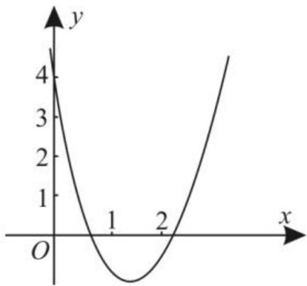

# 一元二次函数、方程和不等式经典题型赏析

# ■宋永刚

# 张文伟

# 题型一:作差法比较大小

作差法比较大小,只需判断差的符号,通常将差化为完全平方的形式或多个因式的积的形式。友情提醒:比较两个正值的大小,可采用作商的方法,比较商与1的大小,对于某些问题也可采用取中间值的方法比较大小。

例1（1）比较 $2x^{2} + 5x + 3$ 与 $x^{2} + 4x + 2$ 的大小。

(2)已知 $x \leqslant 1$ ，比较 $3x^{3}$ 与 $3x^{2} - x + 1$ 的大小。

解:(1) $(2x^{2}+5x+3)-(x^{2}+4x+2)=$ $x^{2}+x+1=\left(x+\frac{1}{2}\right)^{2}+\frac{3}{4}$ 。因为 $\left(x+\frac{1}{2}\right)^{2}$ $\geqslant0$ ，所以 $\left(x+\frac{1}{2}\right)^{2}+\frac{3}{4}\geqslant\frac{3}{4}>0$ ，所以 $(2x^{2}+5x+3)-(x^{2}+4x+2)>0$ ，即 $2x^{2}+5x+3>x^{2}+4x+2$ 。

(2) $3x^{3}-(3x^{2}-x+1)=(3x^{3}-3x^{2})+(x-1)=3x^{2}(x-1)+(x-1)=(3x^{2}+1)\cdot(x-1)$ 。由 $x\leqslant1$ ，可得 $x-1\leqslant0$ 。结合 $3x^{2}+1>0$ ，可得 $(3x^{2}+1)(x-1)\leqslant0$ ，所以 $3x^{3}\leqslant3x^{2}-x+1$ 。

跟踪训练 1: (1) 比较 $(x+3)(x+7)$ 和 $(x+4)(x+6)$ 的大小。

(2) 已知 $a > 0, b > 0$ ，比较 $a^3 + b^3$ 与 $ab^2 + a^2b$ 的大小。

提示:(1) 因为 $(x+3)(x+7)-(x+4)(x+6)=(x^{2}+10x+21)-(x^{2}+10x+24)=-3<0$ ，所以 $(x+3)(x+7)<(x+4)(x+6)$ 。

(2) 易得 $a^3 + b^3 - (ab^2 + a^2b) = a^3 + b^3 - ab^2 - a^2b = a^3 - ab^2 + b^3 - a^2b = a(a^2 - b^2) + b(b^2 - a^2) = (a^2 - b^2)(a - b) = (a + b)(a - b)^2$ 。

因为 $a > 0, b > 0$ ，所以 $(a + b)(a - b)^2 \geqslant 0$ ，所以 $a^3 + b^3 - (ab^2 + a^2b) \geqslant 0$ ，所以 $a^3 + b^3 \geqslant ab^2 + a^2b$ 。

# 题型二:作差法证明不等式

作差法是证明不等式的一种常用方法，一般要将不等式转化为两个式子差的形式，再通过恰当的等价变形确定差的符号，从而证明原不等式成立。

例 2 已知 $x, y \in R$ ，求证： $x^{2} + 2y^{2} \geqslant 2xy + 2y - 1$ 。

证明: 因为 $x^{2}+2y^{2}-(2xy+2y-1)=x^{2}+2y^{2}-2xy-2y+1=(x^{2}-2xy+y^{2})+(y^{2}-2y+1)=(x-y)^{2}+(y-1)^{2}\geqslant0$ ，当且仅当 x=y=1 时等号成立，所以 $x^{2}+2y^{2}\geqslant2xy+2y-1$ 成立。

跟踪训练 2: 已知 a > 0, 求证: $a + \frac{1}{a} \geqslant 2$ 。

提示: 因为 $a + \frac{1}{a} - 2 = (\sqrt{a})^{2} + \left(\frac{1}{\sqrt{a}}\right)^{2} - 2 = \left(\sqrt{a} - \frac{1}{\sqrt{a}}\right)^{2} \geqslant 0$ ，所以 $a + \frac{1}{a} \geqslant 2$ ，当且仅当 $\sqrt{a} = \frac{1}{\sqrt{a}}$ ，即 a = 1 时等号成立，所以 $a + \frac{1}{a} \geqslant 2$ 成立。

# 题型三: 利用不等式的性质判断命题的真假

利用不等式的性质判断命题真假的两个注意点:要注意不等式成立的条件,不要弱化条件,尤其是不能想当然地随意捏造性质;采用特殊值法排除选项时,注意取值一定要遵循两个原则,一是满足题设条件,二是取值要简单,便于验证计算。

例 3 （多选题）已知实数 a, b, c, d 满足 a > b > c > d，则下列选项中不正确的是（）。

A. $a + d > b + c$

B. $a + c > b + d$

C. ${ad} > {bc}$

D. ${ac} > {bd}$

解:不妨设 a=2, b=1, c=0, d=-1, 此时 $a+d=b+c=1$ , ad=-2<bc=0, A 错误, C 错误。设 a=-3, b=-4, c=-5, d=-6, 则 $ac = 15 < bd = 24$ , D 错误。由 $a > b$ , $c > d$ , 结合不等式的性质得 $a + c > b + d$ , B 正确。应选 ACD。

跟踪训练 3: (多选题) 下列四个命题中的假命题是( )。

A. 若 $a > b, c > d$ ，则 $a - d > b - c$

B. 若 $a > b$ ，则 $\frac{1}{a} < \frac{1}{b}$

C. 若 $a < |b|$ , 则 $a^2 > b^2$

D. 若 $a > b, c > d$ ，则 $ac > bd$

提示:对于 A, 由 c>d 得 -d>-c, 结合 a>b, 可得 a-d>b-c, A 为真命题。对于 B, 若 a>b, 且 a>0, b<0, 则 $\frac{1}{a}>0, \frac{1}{b}<0$ , 此时 $\frac{1}{a}>\frac{1}{b}$ , B 为假命题。对于 C, 若 a=-1, b=2, 则 $a^{2}=1<b^{2}=4$ , C 为假命题。对于 D, 若 a=5, b=1, 而 c=-1, d=-4, 则 ac=-5<bd=-4, D 为假命题。应选 BCD。

# 题型四: 利用不等式的性质证明不等式

利用不等式的性质对不等式的证明,其实质就是利用性质对不等式进行变形,变形要等价,同时要注意不等式的性质适用的前提条件。

例 4 已知 c > a > b > 0，求证： $\frac{a}{c - a} > \frac{b}{c - b}$ 。

证明:(方法1)因为c>a>b>0,所以0<c-a<c-b,所以 $(c-a)(c-b)>0$ ,所以 $0<\frac{1}{(c-a)(c-b)}\cdot(c-a)<\frac{1}{(c-a)(c-b)}\cdot(c-b)$ ,即 $0<\frac{1}{c-b}<\frac{1}{c-a}$ ,也即 $\frac{1}{c-a}>\frac{1}{c-b}>0$ 。又因为a>b>0,所以 $\frac{a}{c-a}>\frac{b}{c-b}$ 。

(方法 2) 因为 a > b > 0，所以 $\frac{1}{a} < \frac{1}{b}$ 。因为 c > 0，所以 $\frac{c}{a} < \frac{c}{b}$ ，所以 $\frac{c}{a} - 1 < \frac{c}{b} - 1$ ，即 $\frac{c - a}{a} < \frac{c - b}{b}$ 。

又因为 $c > a > b > 0$ ，所以 $c - a > 0, c - b > 0$ ，所以 $\frac{a}{c - a} > \frac{b}{c - b}$ 。

（方法3）易得 $\frac{a}{c - a} -\frac{b}{c - b} =$ $\frac{c(a - b)}{(c - a)(c - b)}$ 。因为 $c > a > b > 0$ ，所以 $a-$ $b > 0,c - a > 0,c - b > 0$ ，所以 $\frac{c(a - b)}{(c - a)(c - b)}$ $>0$ ，所以 $\frac{a}{c - a} >\frac{b}{c - b}$

跟踪训练 4: 已知 a > b > 0, c < 0, 证明: $\frac{c}{a}>\frac{c}{b}$ 。

提示:(方法1) $\frac{c}{a}-\frac{c}{b}=\frac{c(b-a)}{ab}$ 。由a>b>0,c<0,可得ab>0,b-a<0,c(b-a)>0,所以 $\frac{c(b-a)}{ab}>0$ ,即 $\frac{c}{a}>\frac{c}{b}$ 。

(方法 2) 由 a > b > 0，可得 $\frac{1}{b} > \frac{1}{a} > 0$ 。
因为 c < 0，所以 $\frac{c}{b} < \frac{c}{a}$ ，即 $\frac{c}{a} > \frac{c}{b}$ 。

# 题型五: 利用不等式的性质求代数式的取值范围

解答这类问题,关键是建立待求式与已知式的关系,结合不等式的性质,即可求得代数式的取值范围。友情提醒:同向不等式的两边可以相加,这种转化不是等价变形,如果在解题过程中多次使用这种转化,就有可能扩大其取值范围。

例 5 已知 -6 < a < 8, 2 < b < 3, 求 $2a + b$ , a - b 及 $\frac{a}{b}$ 的取值范围。

解:由-6<a<8,2<b<3,可得-12<2a<16,所以-10<2a+b<19。

由 $-3 < -b < -2$ ，可知 $-9 < a - b < 6$ 。

对 a 分类后求 $\frac{a}{b}$ 的取值范围。①当 $0 \leqslant a < 8$ 时，则 $0 \leqslant \frac{a}{b} < 4$ ; ②当 -6 < a < 0 时，0 < -a < 6，则 $0 < -\frac{a}{b} < 3$ ，即 $-3 < \frac{a}{b} < 0$ 。由①②得 $-3 < \frac{a}{b} < 4$ 。

跟踪训练 5: 已知 $1 < a < 6, 3 < b < 4$ , 则 $a - b$ 的取值范围是 \_\_\_\_; $\frac{a}{b}$ 的取值范围是 \_\_\_\_。

提示:由 3<b<4, 可得 -4<-b<-3, 所以 -3<a-b<3。

因为 $\frac{1}{4}<\frac{1}{b}<\frac{1}{3}$ ，所以 $\frac{1}{4}<\frac{a}{b}<2$ 。

# 题型六:配凑法求最值

配凑法的实质在于代数式的灵活变形，其中配系数、凑常数是关键。利用配凑法求最值应注意三个方面：配凑的技巧以整式为基础，注意系数的变化及等式中常数的调整，做到等价转化；代数式的变形以配凑出和或积的定值为目标；拆项、添项应注意检验利用基本不等式的前提。

例 6 （1）若 x<2，则 $x+\frac{4}{x-2}$ 的最大值是（）。

A. 4

B. 5

C.-2

D. 2

(2) 若 $0 < x < \frac{1}{3}$ ，则 $2x(1 - 3x)$ 的最大值是 \_\_\_\_。

解:(1)由 x<2, 可得 2-x>0, 所以 $x+\frac{4}{x-2}=x-2+\frac{4}{x-2}+2=-\left(2-x+\frac{4}{2-x}\right)+2\leqslant-2\sqrt{(2-x)\cdot\frac{4}{2-x}}+2=-2$ ,
当且仅当 $2 - x = \frac{4}{2 - x}$ ，即 x = 0 时等号成立，所以 $x + \frac{4}{x - 2}$ 的最大值是 -2。应选 C。

(2)由 $0 < x < \frac{1}{3}$ ，可得 3x > 0, $1 - 3x > 0$ ，所以 $2x(1 - 3x) = \frac{2}{3} \times 3x(1 - 3x) \leqslant \frac{2}{3} \times \left(\frac{3x + 1 - 3x}{2}\right)^{2} = \frac{1}{6}$ ，当且仅当 3x = 1 - 3x，即 $x = \frac{1}{6}$ 时等号成立，所以 $2x(1 - 3x)$ 的最大值是 $\frac{1}{6}$ 。

跟踪训练 6: 已知实数 x > 1，则 $2 - x - \frac{1}{x - 1}$ 的（）。

A. 最小值为 1

B. 最大值为 1

C. 最小值为 -1

D. 最大值为 -1

提示:由 x>1, 可得 x-1>0。2-x- $\frac{1}{x-1}=1+1-x-\frac{1}{x-1}=1-\left[(x-1)+\right.$

$\left.\frac{1}{x-1}\right]\leqslant1-2\sqrt{(x-1)\cdot\frac{1}{x-1}}=1-2=$ -1, 当且仅当 $\frac{1}{x-1}=x-1$ ，即 x=2 时取等号，
所以 $2-x-\frac{1}{x-1}$ 的最大值为 -1。应选 D。

# 题型七:巧用“1”的代换求最值

常数代换法解题的关键是通过代数式的变形,构造和式或积式为定值,然后利用基本不等式求最值。应用此种方法求最值时,应把“1”的表达式与所求最值的表达式相乘求积或相除求商。

例7 若 $x > 0, y > 0$ ，且 $\frac{1}{x} + \frac{9}{y} = 1$ ，求 $x + y$ 的最小值。

解:由 $\frac{1}{x}+\frac{9}{y}=1,x>0,y>0$ ,可得 $x+y=\left(\frac{1}{x}+\frac{9}{y}\right)(x+y)=10+\frac{9x}{y}+\frac{y}{x}\geqslant10+2\sqrt{\frac{9x}{y}\cdot\frac{y}{x}}=16$ ,当且仅当 $\frac{9x}{y}=\frac{y}{x}$ ,即x=4,y=12时等号成立,所以 $x+y$ 的最小值为16。

跟踪训练 7: 已知 x > 0, y > 0, $x + 8y = xy$ , 求 $x + 2y$ 的最小值。

提示: 因为 x>0, y>0, $x+8y=xy$ ，所以 $\frac{8}{x}+\frac{1}{y}=1$ ，所以 $x+2y=\left(\frac{8}{x}+\frac{1}{y}\right)(x+2y)=10+\frac{x}{y}+\frac{16y}{x}\geqslant10+2\sqrt{\frac{x}{y}\cdot\frac{16y}{x}}=18$ ，当且仅当 $\frac{x}{y}=\frac{16y}{x}$ ，即 x=12, y=3 时等号成立，所以 $x+2y$ 的最小值为 18。

# 题型八: 分离消元法求最值

对含有多个变量的条件最值问题,若无法直接利用基本不等式求解,可尝试减少变量的个数,即用其中一个变量表示另一个变量,再代入代数式中转化为只含有一个变量的最值问题求解。

例8 已知 $x > 0, y > 0, x + 2y + 2xy = 8$ ，求 $x + 2y$ 的最小值。

解: 由 $x + 2y + 2xy = 8$ ，可得 $y = \frac{8 - x}{2 + 2x}$ 。因为 x > 0, y > 0，所以 0 < x < 8。

所以 $x + 2y = x + \frac{8 - x}{x + 1} = x + \frac{9 - 1 - x}{x + 1}$

$$
\begin{array}{l} {= x + \frac {9}{x + 1} - 1 = x + 1 + \frac {9}{x + 1} - 2 \geqslant 2 \sqrt {9} -} \\ {2 = 4, \text {当且仅当} x + 1 = \frac {9}{x + 1}, \text {即} x = 2 \text {时等}} \\ {\text {号成立，所以} x + 2 y \text {的最小值为} 4 _ {\circ}} \end{array}
$$

跟踪训练 8: 已知 a > 0, b > 0, 且 $2a + b = ab - 1$ , 则 $a + 2b$ 的最小值为 \_\_\_\_。

提示:由 $2a+b=ab-1$ , 可得 $a=\frac{b+1}{b-2}$ 。

因为 a>0, b>0，所以 $a=\frac{b+1}{b-2}>0$ ，所以 b>2。

因为 $a + 2b = \frac{b + 1}{b - 2} + 2b = \frac{(b - 2) + 3}{b - 2} +$

$$
2 (b - 2) + 4 = 2 (b - 2) + \frac {3}{b - 2} + 5 \geqslant
$$

$2\sqrt{2(b-2)\cdot\frac{3}{b-2}}+5=5+2\sqrt{6}$ ，当且仅当

$2(b-2)=\frac{3}{b-2}$ ，即 $b=2+\frac{\sqrt{6}}{2}$ 时等号成立，所以 $a+2b$ 的最小值为 $5+2\sqrt{6}$ 。

# 题型九:二次函数与一元二次方程、二次不等式间的关系及应用

一元二次不等式 $ax^2 + bx + c > 0 (a \neq 0)$ 的解集的端点值是一元二次方程 $ax^2 + bx + c = 0$ 的根，也是二次函数 $y = ax^2 + bx + c$ 的图像与 $x$ 轴交点的横坐标；二次函数 $y = ax^2 + bx + c$ 的图像在 $x$ 轴上方的部分，是由不等式 $ax^2 + bx + c > 0$ 的 $x$ 的值构成的，图像在 $x$ 轴下方的部分，是由不等式 $ax^2 + bx + c < 0$ 的 $x$ 的值构成的。二次函数与一元二次方程、二次不等式三者之间相互依存、相互转化。

例 9 已知关于 x 的不等式 $ax^{2} + bx + c > 0$ 的解集为 $\{x \mid 2 < x < 3\}$ ，求关于 x 的不等式 $cx^{2} + bx + a < 0$ 的解集。

解:由不等式 $ax^{2}+bx+c>0$ 的解集为 $\{x\mid2<x<3\}$ ，可知 a<0，且 2 和 3 是方程 $ax^{2}+bx+c=0$ 的两根。由根与系数的关系知 $\frac{b}{a}=-5,\frac{c}{a}=6$ ，所以 $\frac{b}{c}=-\frac{5}{6}$ 。由 a<0 知 c<0，所以不等式 $cx^{2}+bx+a<0$ ，即 $x^{2}+\frac{b}{c}x+\frac{a}{c}>0$ ，也即 $x^{2}-\frac{5}{6}x+\frac{1}{6}>0$ ，解

得 $x < \frac{1}{3}$ 或 $x > \frac{1}{2}$ 。

故不等式 $cx^2 + bx + a < 0$ 的解集为 $\left\{x \mid x < \frac{1}{3}\right.$ 或 $x > \frac{1}{2}\}$ 。

跟踪训练 9: 已知关于 x 的不等式 $x^{2} + ax + b < 0$ 的解集为 $\{x \mid 1 < x < 2\}$ ，求关于 x 的不等式 $bx^{2} + ax + 1 > 0$ 的解集。

提示:由 $x^{2}+ax+b<0$ 的解集为 $\{x\mid1<x<2\}$ ，可得方程 $x^{2}+ax+b=0$ 的两个根为 1，2。由根与系数的关系得 $\left\{\begin{aligned}-a&=1+2,\\ b&=1\times2,\end{aligned}\right.$ 解得 $\left\{\begin{aligned}a&=-3,\\ b&=2,\end{aligned}\right.$ 代入所求不等式得 $2x^{2}-3x+1>0$ ，解得 $x<\frac{1}{2}$ 或 x>1。所以不等式 $bx^{2}+ax+1>0$ 的解集为 $\left\{x\mid x<\frac{1}{2}或x>1\right\}$ 。

# 题型十:一元二次不等式在 R 上的恒成立问题

不等式 $ax^2 + bx + c > 0 (a \neq 0)$ 恒成立 $\Leftrightarrow$ $\left\{ \begin{array}{l} a > 0, \\ \Delta < 0, \end{array} \right.$ $ax^2 + bx + c < 0 (a \neq 0)$ 恒成立 $\Leftrightarrow$ $\left\{ \begin{array}{l} a < 0, \\ \Delta < 0, \end{array} \right.$ $ax^2 + bx + c \geqslant 0 (a \neq 0)$ 恒成立 $\Leftrightarrow$ $\left\{ \begin{array}{l} a > 0, \\ \Delta \leqslant 0, \end{array} \right.$ $ax^2 + bx + c \leqslant 0 (a \neq 0)$ 恒成立 $\Leftrightarrow$ $\left\{ \begin{array}{l} a < 0, \\ \Delta \leqslant 0, \end{array} \right.$ 友情提醒：若题目中未强调是一元二次不等式，且二次项系数含参数，则一定要讨论二次项系数是否为0的情况。

例 10 已知 $\forall x \in R$ ，不等式 $kx^{2} + 2kx - (k + 2) < 0$ 恒成立，求实数 k 的取值范围。

解: 当 k=0 时, 原不等式可化为 -2<0, 显然符合题意; 当 $k \neq 0$ 时, 令 $y = kx^{2} + 2kx - (k+2)$ , 由 y<0 恒成立, 可得其图像都在 x 轴的下方, 即图像的开口向下, 且与 x 轴无交点, 所以 $\left\{\begin{aligned}&k<0,\\ &4k^{2}+4k(k+2)<0,\end{aligned}\right.$ 解得 -1<k<0 。综上可得, 实数 k 的取值范围是 $\{k\mid-1<k\leqslant0\}$ 。

跟踪训练 10: 已知 $\forall x \in R$ ，不等式 $x^{2} + ax + 3 \geqslant a$ 恒成立，则实数 a 的取值范围

为\_\_\_\_。

提示:原不等式可化为 $x^{2}+ax+3-a\geqslant0$ 恒成立。由函数 $y=x^{2}+ax+3-a$ 的图像开口向上，可得 $\Delta=a^{2}-4(3-a)=a^{2}+4a-12\leqslant0$ ，即 $(a-2)(a+6)\leqslant0$ ，解得 $-6\leqslant a\leqslant2$ ，所以实数 a 的取值范围为 $\{a|-6\leqslant a\leqslant2\}$ 。

# 题型十一:在给定范围上的恒成立问题

当 $a > 0$ 时， $ax^2 + bx + c < 0$ 在 $x \in \{x \mid \alpha \leqslant x \leqslant \beta\}$ 上恒成立 $\Leftrightarrow y = ax^2 + bx + c$ 在 $x = \alpha$ 和 $x = \beta$ 处的函数值同时小于0。当 $a < 0$ 时， $ax^2 + bx + c > 0$ 在 $x \in \{x \mid \alpha \leqslant x \leqslant \beta\}$ 上恒成立 $\Leftrightarrow y = ax^2 + bx + c$ 在 $x = \alpha$ 和 $x = \beta$ 处的函数值同时大于0。

例11 当 $1 \leqslant x \leqslant 2$ 时，不等式 $x^{2} + mx + 4 < 0$ 恒成立，求实数 $m$ 的取值范围。

解: 令函数 $y = x^{2} + mx + 4$ 。

由 $y < 0$ 在 $1 \leqslant x \leqslant 2$ 上恒成立，可得 $y = 0$ 的根一个小于1，另一个大于2。

由题意画出函数 $y=x^{2}+mx+4$ 的大致图像, 如图 1 所示。

line

| x | y |
|---|---|
| 0 | 4 |
| 1 | 0 |
| 2 | 0 |
| 3 | 2 |
| 4 | 4 |

图1

结合图1得 $\left\{ \begin{array}{l} m + 5 < 0, \\ 4 + 2m + 4 < 0, \end{array} \right.$ 解得 $m < -5$ 所以实数 $m$ 的取值范围是 $\{m \mid m < -5\}$ 。

跟踪训练 11: 命题“ $\forall x \in \{x \mid 1 \leqslant x \leqslant 2\}, x^2 - a \leqslant 0$ ”为真命题的一个充分不必要条件是（）。

A. $a \geqslant 4$

B. $a \geqslant 5$

C. $a \leqslant 4$

D. $a \leqslant 5$

提示: 因为命题“ $\forall x\in\{x\mid1\leqslant x\leqslant2\}$ ， $x^{2}-a\leqslant0$ ”是真命题，所以当 $1\leqslant x\leqslant2$ 时， $a\geqslant x^{2}$ 恒成立，所以 $a\geqslant4$ 。结合选项知该命题为真命题的一个充分不必要条件是 $a\geqslant5$ 。应选B。

# 题型十二: 解决简单的能成立问题

解答这类问题,可结合二次函数的图像,将所求问题转化为端点值的问题来解决;对一些简单的问题,可转化为 $m > y_{\min}$ 或 $m < y_{\max}$ 的形式,通过求 y 的最小值与最大值,求得参数的取值范围。

例 12 当 1 < x < 2 时, 关于 x 的不等式 $x^{2} + mx + 4 > 0$ 有解, 则实数 m 的取值范围为 \_\_\_\_。

解: 记函数 $f(x)=x^{2}+mx+4$ 。

由二次函数的图像(图略)可知,不等式 $x^{2}+mx+4>0(1<x<2)$ 有解,则 $f(1)=m+5>0$ 或 $f(2)=2m+8>0$ ,解得m>-5,所以实数m的取值范围为 $(-5,+\infty)$ 。

跟踪训练 12: 若存在 $x \in R$ ，使得 $\frac{4x + m}{x^{2} - 2x + 3} \geqslant 2$ 成立，求实数 m 的取值范围。

提示: 因为 $x^{2}-2x+3=(x-1)^{2}+2>0$ ，所以 $4x+m\geqslant2(x^{2}-2x+3)$ 能成立，即 $m\geqslant2x^{2}-8x+6$ 能成立。又 $2x^{2}-8x+6=2(x-2)^{2}-2\geqslant-2$ ，所以 $m\geqslant-2$ ，即实数 m 的取值范围为 $\{m|m\geqslant-2\}$ 。

1. 已知 $x > 0, y > 0$ ，则 $\frac{3y}{x} + \frac{12x}{y}$ 的最小值为（ ）。

A. 15

B. 12

C. 8

D. 6

提示: 由基本不等式知 $\frac{3y}{x} + \frac{12x}{y} \geqslant 2\sqrt{\frac{3y}{x} \cdot \frac{12x}{y}} = 12$ , 当且仅当 $\frac{3y}{x} = \frac{12x}{y}$ , 即 $y = 2x$ 时等号成立, 所以 $\frac{3y}{x} + \frac{12x}{y}$ 的最小值为 12。应选 B。

2. 若 $0 < a < 2$ ，则 $\sqrt{(2 - a)a}$ 的最大值为 \_\_\_\_。

提示: 当 0 < a < 2 时, 2 - a > 0, 所以 $\sqrt{(2 - a)a} \leqslant \frac{(2 - a) + a}{2} = 1$ , 当且仅当 2 - a = a, 即 a = 1 时等号成立, 所以 $\sqrt{(2 - a)a}$ 的最大值为 1。

作者单位:河南省开封高级中学

(责任编辑 郭正华)

# 核心考点演练

19 集合与常用逻辑用语核心考点强化训练

刘中亮

26 一元二次函数、方程和不等式核心考点强化训练

刘大鸣

# 易错题归类剖析

32 集合与常用逻辑用语易错提醒

王佩其

33 集合概念中易忽视的几类问题

杜玉香

34 不等式问题易错点提醒

傅欣飞

# 创新题追根溯源

35 集合中的新定义问题“揭秘”

李根

36 例析不等式恒(能)成立中的参数范围问题

何美干 刘长柏

38 权方和不等式的探究及应用

程宗超

# 经典题突破方法

40 集合与常用逻辑用语典型考题赏析

李勇

44 一元二次函数、方程和不等式经典题型赏析

宋永刚 张文伟

封面刊名题字:华罗庚

顾问单位:中国数学会 中国物理学会 中国化学会

学术顾问:任子朝 韩家勋 李勇

委员:(按拼音排序) 陈进前 冯丽娟 公衍录 郭统福 侯有岐

胡东明 胡银伟 黄颖 蒋天林 李胜荣 李树祥 刘大鸣 刘树领

毛广文 孟卫东 隋俊礼 王国平 王后雄 王怀文 王玮琪 杨天才

余其权 余永安 袁竞成 岳庆先 张北春 张金生 赵剑涛

text_image

中学生数理化®
MATHS PHYSICS CHEMISTRY FOR MIDDLE SCHOOL STUDENTS SENIOR HIGH SCHOOL EDITION
全面配合教材，注重求实、创新、博学
全程备考理念，指点方法、技巧、思路
本期刊蝉联全国优秀科技期刊
河南省一级期刊
中国基础教育知识仓库来源期刊
中国邮政校园核心报刊
数学 高一
高中版
绿色印刷
2025年
第36期·总第1083期 9月

# 封面人物

宋永刚,河南省开封高级中学数学教师。先后荣获开封市优秀班主任、河南省优秀班主任、开封市骨干教师、高考优秀改卷老师等称号,曾获开封市优质课一等奖。参加多项省市级课题的研究工作。2024-2025学年所带的2516理科钱学森实验班成绩优异,其中代易瓒724分为河南省物理类第一名,齐越723分为河南省物理类第二名,得分在700分以上的有5人,全班平均分为670分。

# 版权声明

本刊所有文字和图片作品,未经许可,不得转载、摘编。凡投稿本刊,或允许本刊登载的作品,均视为已授权本刊在刊物、增刊、图书上使用,以及许可本刊授权合作网站(中国知网、万方数据库或维普资讯网等)以数字化方式复制、汇编、发行、信息网络传播本刊全文。本刊支付的稿酬,已包含授权费用。作者投稿给本刊即意味着同意上述约定,如有异议请与本刊签订书面协议。

本社根据《中华人民共和国广告法》等国家有关法律法规审查及刊登广告,若广告主有超过广告内容的后续行为,均与本社无关。