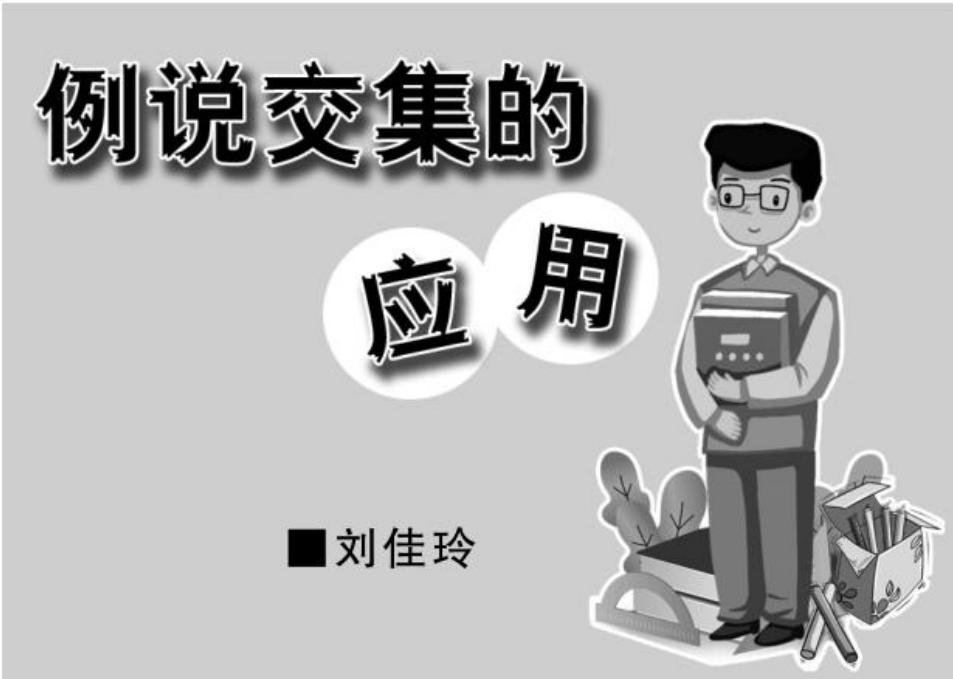
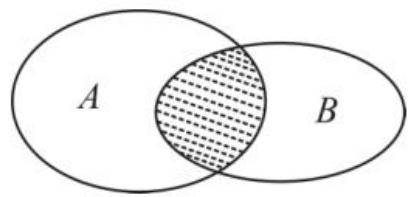
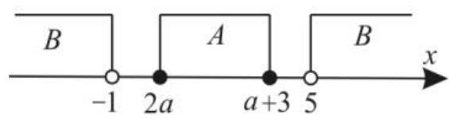
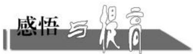

text_image

例说交集的
应用
■刘佳玲

由所有属于集合 A 且属于集合 B 的元素组成的集合, 称为 A 与 B 的交集, 即交集是两个集合中的公共元素组成的集合。下面举例说明交集的应用。

# 一、求集合

例 1 若集合 $A=\{x\in N \mid 1\leqslant x\leqslant10\}$ ， $B=\{x\in R \mid x^{2}+x-6=0\}$ ，则图 1 中阴影部分表示的集合为（）。

  
图1

A. $\{2\}$

B. $\{3\}$

C. $\{-3,2\}$

D. $\{-2,3\}$

解析:依题意得集合 $A=\{1,2,3,4,5,6,7,8,9,10\}$ , $B=\{-3,2\}$ 。由交集的定义可得，图中阴影部分表示的集合为 $A \cap B = \{2\}$ 。应选 A。

回味: Venn 图是表示集合的一种草图, 常用于展示不同事物群组(集合)之间的数学或逻辑关系。

# 二、根据交集求并集

例 2 已知集合 $M=\{0,x\},N=\{1,2\}$ ，若 $M\cap N=\{2\}$ ，则 $M\cup N=(\quad)$ 。

A. $\{0,1,2,x\}$

B. $\{0,1,2\}$

C. $\{0,2\}$

D. $\{1,2\}$

解析: 因为 $M \cap N = \{2\}$ ，所以 $2 \in M$ 。而 $M = \{0, x\}$ ，所以 x = 2，所以 $M = \{0, 2\}$ ，所以 $M \cup N = \{0, 1, 2\}$ 。应选 B。

回味:并集由所有属于集合 A 或属于集合 B 的元素组成的集合。解题时不要混淆交集与并集的定义。

# 三、求集合中元素的个数

例 3 已知集合 $A = \{2, -3\}$ , 集合 $B$ 满足 $B \cap A = B$ , 则符合条件的集合 $B$ 的个数是( )。

A. 1

B. 2

C. 3

D. 4

解析:由 $B \cap A = B$ ，可得 $B \subseteq A$ ，所以 B 是 A 的子集，所以符合条件的集合 B 一共有 4 个： $\varnothing, \{2\}, \{-3\}, \{2, -3\}$ 。应选 D。

回味: 注意区别 $B \cap A = B, B \cup A = B$ ，前者满足 $B \subseteq A$ ，后者满足 $A \subseteq B$ 。解题时不能漏掉空集的情况。

# 四、求参数的值

例 4 设集合 $A=\{a^{2},a+1,-3\}$ ， $B=\{a-3,2a-1,a^{2}+1\}$ ，且 $A\cap B=\{-3\}$ ，则实数 a 的值为 \_\_\_\_。

解析: 因为 $A \cap B = \{-3\}$ ，所以 $-3 \in B$ 。又因为 $a^{2} + 1 \geqslant 1$ ，所以 $a^{2} + 1 \neq -3$ ，所以 a - 3 = -3 或 2a - 1 = -3。

①若 $a - 3 = -3$ ，则 $a = 0$ ，此时 $A = \{0, 1, -3\}$ ， $B = \{-3, -1, 1\}$ ，可得 $A \cap B = \{1, -3\}$ ，这与已知 $A \cap B = \{-3\}$ 矛盾，所以 $a = 0$ 不符合题意。

②若 $2a - 1 = -3$ ，则 $a = -1$ ，此时 $A = \{1,0,-3\}$ ， $B = \{-4,-3,2\}$ ，可得 $A \cap B = \{-3\}$ ，满足题意。

综上可知,实数 a = -1。

回味:集合中元素含有参数时,要注意参数的取值应满足集合元素的互异性。

# 五、根据两个集合的关系求参数的取值范围

例 5 （1）集合 $A=\{x \mid x^{2}-3x+2=0\}$ ， $B=\{x\mid x^{2}-2x+a-1=0\}$ ，且 $A \cap B = B$ ，则实数 a 的取值范围为 \_\_\_\_。

(2)已知集合 $A = \{x\mid 2a\leqslant x\leqslant a + 3\}$ ， $B = \{x\mid x < -1$ 或 $x > 5\}$ ，若 $A\cap B = \emptyset$ ，则实数 $a$ 的取值范围为\_\_\_\_。

解析:(1)集合 $A=\{x \mid x^{2}-3x+2=0\}=\{1,2\}$ 。要使 $A \cap B = B$ ，需对集合 $B = \varnothing$ 或 $\{1\}$ 或 $\{2\}$ 或 $\{1,2\}$ 分情况讨论。

当 $B = \emptyset$ 时，由 $\Delta = (-2)^{2} - 4(a - 1) < 0$ ，解得 $a > 2$ ，满足题意；

当 $B = \{1\}$ 时，由 $1 - 2 + a - 1 = 0$ ，解得 $a = 2$ ，此时 $B = \{1\}$ ，符合题意；

当 $B = \{2\}$ 时，由 $4 - 4 + a - 1 = 0$ ，解得 $a = 1$ ，此时 $B = \{0,2\}$ ，不符合题意；

当 $B = \{1,2\}$ 时， $a$ 无解。

综上所述， $a\geqslant 2$ ，即 $a\in [2, + \infty)$ 。

(2)要使 $A \cap B = \varnothing$ ，需对 $A = \varnothing$ 或 $A \neq \varnothing$ 分情况讨论。

若 $A = \emptyset$ ，则 $2a > a + 3$ ，即 $a > 3$ ，此时满足 $A \cap B = \emptyset$ 。

若 $A \neq \emptyset$ ，结合题意画出数轴，如图2所示。

  
图2

要使 $A \cap B = \varnothing$ ，需满足 $\left\{ \begin{array}{l} 2a \geqslant -1, \\ a + 3 \leqslant 5, \\ 2a \leqslant a + 3, \end{array} \right.$ 得 $-\frac{1}{2} \leqslant a \leqslant 2$ 。

综上所述，a 的取值范围是 $\left\{a\mid-\frac{1}{2}\leqslant a\leqslant2$ 或 $a>3\right\}$ 。

回味:利用数轴求解集合问题,注意标明实心点或空心点。

# 六、根据两个集合中元素的个数求参数的取值范围

例 6 已知集合 $M=\{(x,y)\mid y=x^{2}+2x+5\}$ ， $N=\{(x,y)\mid y=ax+1\}$ 。若 $M\cap N$ 中有两个元素，则实数 a 的取值范围为 \_\_\_\_；若 $M\cap N$ 中仅有一个元素，则实数 a 的取值范围为 \_\_\_\_。

解析: 若 $M \cap N$ 中有两个元素, 则方程组 $\left\{\begin{aligned} y &= x^{2} + 2x + 5, \\ y &= ax + 1 \end{aligned}\right.$ 有两组解, 即一元二次方程 $x^{2} + (2 - a)x + 4 = 0$ 有两个不相等的实数根, 所以 $\Delta = (2 - a)^{2} - 16 = a^{2} - 4a - 12 > 0$ , 解得 a < -2 或 a > 6, 所以实数 a 的取值范围为 $\{a \mid a < -2 \text{ 或 } a > 6\}$ 。

若 $M \cap N$ 中仅有一个元素, 则方程组 $\left\{ \begin{array}{l} y = x^{2} + 2x + 5, \\ y = ax + 1 \end{array} \right.$ 只有一组解, 即一元二次方

程 $x^{2} + (2 - a)x + 4 = 0$ 有两个相等的实数根，所以 $\Delta = (2 - a)^{2} - 16 = a^{2} - 4a - 12 = 0$ 解得 $a = -2$ 或 $a = 6$ ，所以实数 $a$ 的取值范围为 $\{-2,6\}$ 。

回味:弄清集合元素的特征是解题的关键,本题中的集合元素是点的坐标。

# 七、与交集有关的数学文化问题

例 7 （多选题）中国古代重要的数学著作《孙子算经》下卷有题：今有物，不知其数，三三数之，剩二；五五数之，剩三；七七数之，剩二。问：物几何？现有如下表示：已知 $A=\{x \mid x=3n+2, n \in N^{*}\}$ ， $B=\{x \mid x=5n+3, n \in N^{*}\}$ ， $C=\{x \mid x=7n+2, n \in N^{*}\}$ ，若 $x \in (A \cap B \cap C)$ ，则下列选项中符合题意的整数 x 可以为（）。

A. 9

B. 23

C. 128

D. 233

解析:对于 A, $9 = 3 \times 3$ , 则 $9 \notin A$ , 所以 $9 \notin (A \cap B \cap C)$ , A 错误。对于 B, $23 = 3 \times 7 + 2 = 2 \times 2 \times 5 + 3$ , 满足集合 A, B, C 的描述, 则 $23 \in (A \cap B \cap C)$ , B 正确。对于 C, $128 = 3 \times 3 \times 2 \times 7 + 2 = 5 \times 25 + 3$ , 满足集合 A, B, C 的描述, 则 $128 \in (A \cap B \cap C)$ , C 正确。对于 D, $233 = 7 \times 3 \times 11 + 2 = 5 \times 46 + 3$ , 满足集合 A, B, C 的描述, 则 $233 \in (A \cap B \cap C)$ , D 正确。应选 BCD。

回味:数学文化主要涉及数学时事、数学名人、数学游戏、数学名著、数学命题、数学猜想、数学图形等。熟记被除数等于商乘以除数加上余数是解题的关键。

已知集合 $M = \{x\in \mathbf{Z}\mid 1\leqslant x\leqslant m\}$ ，若集合 $M$ 至少有8个子集，则实数 $m$ 的最小整数值为

提示:一个集合有 n 个元素,则这个集合有 $2^{n}$ 个子集。因为集合 M 至少有 8 个子集,所以 M 中至少有 3 个元素。又集合 $M=\{x\in\mathbf{Z}|1\leqslant x\leqslant m\}$ ,所以 $m\geqslant3$ ,则 m 的最小整数值为 3。

作者单位:湖北省巴东县第一高级中学

(责任编辑 王琼霞)