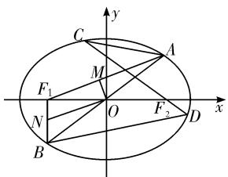
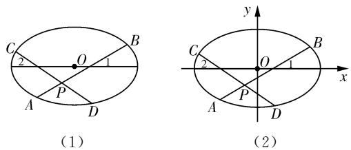
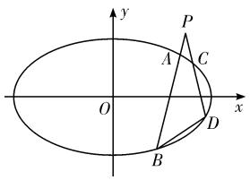
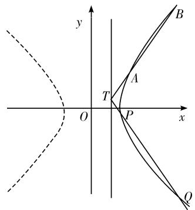

# 例谈圆锥曲线内接四边形性质及其应用

225600 江苏省高邮中学 黄桂君 黎小平 沈军

摘 要:有许多圆锥曲线问题,如果注意挖掘和利用其内接四边形的简单、有趣性质,就能揭示问题的实质,找到解决问题的突破口,化难为易,培养学生逻辑推理、数学建模、数学运算等核心素养.

关键词: 圆锥曲线; 内接四边形性质

# 一、圆锥曲线内接四边形的一个性质

四边形 ABCD 内接于椭圆 $\frac{x^{2}}{a^{2}} + \frac{y^{2}}{b^{2}} = 1 (a > b > 0)$ ，四个边及两条对角线所在直线 AB 与 CD，AD 与 BC，AC 与 BD 的斜率都存在。若三组直线中任意一组中的两条直线的斜率之和为 0（互为相反数），则另两组中的两条直线的斜率之和也为 0（互为相反数）。

证明: 设直线 AB 的方程为 $y = kx + m$ ，由 $\left\{\begin{aligned}y &= kx + m \\ b^{2}x^{2} + a^{2}y^{2} &= a^{2}b^{2}\end{aligned}\right.$ ，得 $(a^{2}k^{2} + b^{2})x^{2} + 2a^{2}kmx + a^{2}(m^{2} - b^{2}) = 0$ ，由 $\Delta = (2a^{2}kmx)^{2} - 4a^{2}(a^{2}k^{2} + b^{2})(m^{2} - b^{2}) = 4a^{2}b^{2}(a^{2}k^{2} + b^{2} - m^{2}) > 0$ ，得 $a^{2}k^{2} + b^{2} > m^{2}$ 。不妨记 $A(x_{1}, y_{1}), B(x_{2}, y_{2})$ ，则有

$$
x _ {1} = \frac {- a ^ {2} k m x + a b \sqrt {a ^ {2} k ^ {2} + b ^ {2} - m ^ {2}}}{a ^ {2} k ^ {2} + b ^ {2}},
$$

$$
y _ {1} = \frac {b ^ {2} m + a b k \sqrt {a ^ {2} k ^ {2} + b ^ {2} - m ^ {2}}}{a ^ {2} k ^ {2} + b ^ {2}};
$$

$$
x _ {2} = \frac {- a ^ {2} k m x - a b \sqrt {a ^ {2} k ^ {2} + b ^ {2} - m ^ {2}}}{a ^ {2} k ^ {2} + b ^ {2}},
$$

$$
y _ {2} = \frac {b ^ {2} m - a b k \sqrt {a ^ {2} k ^ {2} + b ^ {2} - m ^ {2}}}{a ^ {2} k ^ {2} + b ^ {2}}.
$$

又设直线 $CD$ 的方程为 $y = -kx + n$ ，记 $C(x_{3}, y_{3}), D(x_{4}, y_{4})$ ，同样（用 $-k$ 代换 $k$ ，用 $n$ 代换 $m$ )，可得

$$
x _ {3} = \frac {a ^ {2} k n + a b \sqrt {a ^ {2} k ^ {2} + b ^ {2} - n ^ {2}}}{a ^ {2} k ^ {2} + b ^ {2}},
$$

$$
y _ {3} = \frac {b ^ {2} n - a b k \sqrt {a ^ {2} k ^ {2} + b ^ {2} - n ^ {2}}}{a ^ {2} k ^ {2} + b ^ {2}};
$$

$$
x _ {4} = \frac {a ^ {2} k n - a b \sqrt {a ^ {2} k ^ {2} + b ^ {2} - n ^ {2}}}{a ^ {2} k ^ {2} + b ^ {2}},
$$

$y_{4}=\frac{b^{2}n+abk\sqrt{a^{2}k^{2}+b^{2}-n^{2}}}{a^{2}k^{2}+b^{2}}$ ，其中 $a^{2}k^{2}+b^{2}>n^{2}$ .

为简化书写，令 $\delta_{1} = \sqrt{a^{2}k^{2} + b^{2} - m^{2}}$ ， $\delta_{2} = \sqrt{a^{2}k^{2} + b^{2} - n^{2}}$ ，则 $\delta_1^2 -\delta_2^2 = n^2 -m^2.$

$\frac{y_{4}-y_{2}}{x_{4}-x_{2}}+\frac{y_{3}-y_{1}}{x_{3}-x_{1}}=\frac{b^{2}(n-m)+abk(\delta_{1}+\delta_{2})}{a^{2}k(n+m)+ab(\delta_{1}-\delta_{2})}+\frac{b^{2}(n-m)-abk(\delta_{1}+\delta_{2})}{a^{2}k(n+m)-ab(\delta_{1}-\delta_{2})}$ ，通分后的分子为 $a^{2}b^{2}k(n^{2}-m^{2})-ab^{3}(n-m)(\delta_{1}-\delta_{2})+a^{3}bk^{2}(n+m)(\delta_{1}+\delta_{2})-a^{2}b^{2}k(\delta_{1}^{2}-\delta_{2}^{2})+a^{2}b^{2}k(n^{2}-m^{2})-a^{3}bk^{2}(n+m)(\delta_{1}+\delta_{2})+ab^{3}(n-m)(\delta_{1}-\delta_{2})-a^{2}b^{2}k(\delta_{1}^{2}-\delta_{2}^{2})=0$ ，所以 $k_{AC}+k_{BD}=0$ 。

同理可得 $\frac{y_3 - y_2}{x_3 - x_2} +\frac{y_4 - y_1}{x_4 - x_1} = 0$ ，即 $k_{BC} + k_{AD} =$ 0.

同样,由椭圆上四点的一般性可证:

若 $k_{BC} + k_{AD} = 0$ ，则 $k_{AB} + k_{CD} = 0, k_{AC} + k_{BD} = 0$ ;

若 $k_{AC} + k_{BD} = 0$ ，则 $k_{AB} + k_{CD} = 0, k_{BC} + k_{AD} = 0.$

在圆、双曲线和抛物线中有同样的结论.其中圆、椭圆、双曲线的标准方程可统一设为 $\frac{x^{2}}{m}+\frac{y^{2}}{n}=1$ （或 $mx^{2}+ny^{2}=1$ ，其中m，n不同时为负数），抛物线可选择 $y^{2}=ax(a\neq0)$ .（证明此处从略）

圆锥曲线内接四边形的这个性质已成为教材的例题、高中数学竞赛试题、高考数学试题以及各省或地区高考数学解析几何模拟试题的命题来源或背景.

# 二、性质的应用案例

# (一)性质的直接迁移应用

例 1 在平面直角坐标系 xOy 中, 设椭圆 E: $\frac{x^{2}}{a^{2}} + \frac{y^{2}}{b^{2}} = 1 (a > b > 0)$ 的左、右焦点分别为 $F_{1}, F_{2}$ ，且 $F_{1}F_{2} = 2$ ，直线 y = kx 与椭圆 E 交于 A, B 两点，如图 1 所示.

(1) 设 $AF_{1}$ 的中点为 M, $BF_{1}$ 的中点为 N, 若 $\overrightarrow{OM} \cdot \overrightarrow{ON} = -\frac{1}{8}$ , 求 AB 的长;

(2) 过 $F_{2}$ 作斜率为 $-k (k \neq 0)$ 的直线, 与椭圆 E 交于 C, D 两点. 若椭圆

text_image

C
y
A
M
F₁
O
F₂
x
N
B
D

图1

E 的长轴长为 $2\sqrt{2}$ ，求证：直线 AC, BD 的斜率之和为定值.

简解:(1)设 $A(x_{0},kx_{0})$ ，则 $B(-x_{0},-kx_{0})$ ， $M\left(\frac{-1+x_{0}}{2},\frac{kx_{0}}{2}\right)$ ， $N\left(\frac{-1-x_{0}}{2},\frac{-kx_{0}}{2}\right)$ ，由 $\overrightarrow{OM}\cdot\overrightarrow{ON}=-\frac{1}{8}$ ，可得 $(k^{2}+1)x_{0}^{2}=\frac{3}{2}$ ，所以 $|AB|=2|OA|=2\sqrt{x_{0}^{2}+k^{2}x_{0}^{2}}=\sqrt{6}$ .

(2) 将直线 $CD$ 的方程 $y = -k(x - 1)$ 代入 $b^2 x^2 + a^2 y^2 = a^2 b^2$ ，整理得 $(a^2 k^2 + b^2)x^2 - 2a^2 k^2 x + a^2 (k^2 - b^2) = 0$ ，记 $C(x_1, y_1), D(x_2, y_2)$ ，则 $k_{AC} + k_{BD} = \frac{kx_0 - y_1}{x_0 - x_1} + \frac{kx_0 + y_2}{x_0 + x_2} = k\left[\frac{(x_0 + x_1) - 1}{x_0 - x_1} + \frac{(x_0 - x_2) + 1}{x_0 + x_2}\right]$ .

因为 $(x_0 + x_1)(x_0 + x_2) - (x_0 + x_2) + (x_0 - x_1)(x_0 - x_2) + (x_0 - x_1) = 2x_0^2 + 2x_1x_2 - (x_1 + x_2) = 2\cdot \frac{a^2(k^2x_0^2) + b^2x_0^2 - a^2b^2}{a^2k^2 + b^2} = 0$ ，所以 $k_{AC} + k_{BD} = 0.$ （定值）

# (二)性质在教材、竞赛、高考中的体现

例 2(2007 年人教版选修 4-4 P.38-39 例 4) 如图 2(1) 所示, AB, CD 是中心为点 O 的椭圆的两条相交弦, 交点为 P. 两弦 AB, CD 与椭圆长轴的夹角分别为 $\angle 1, \angle 2$ , 且 $\angle 1 = \angle 2$ . 求证: $|PA| \cdot |PB| = |PC| \cdot |PD|$ .

  
图2

证明:如图 2(2), 建立平面直角坐标系, 设椭圆的长轴、短轴的长分别为 2a, 2b, 则椭圆的方程为 $\frac{x^{2}}{a^{2}} + \frac{y^{2}}{b^{2}} = 1$ .

设 $\angle 1 = \theta$ ，点 $P$ 的坐标为 $(x_0, y_0)$ ，则直线 $AB$ 的参数方程为 $\left\{ \begin{array}{l} x = x_0 + t\cos \theta \\ y = y_0 + t\sin \theta \end{array} \right.$ （ $t$ 为参数）. 将其代入

椭圆方程并整理，得到 $(b^{2}\cos^{2}\theta + a^{2}\sin^{2}\theta)t^{2} + 2(b^{2}x_{0}\cos\theta + a^{2}y_{0}\sin\theta)t + (b^{2}x_{0}^{2} + a^{2}y_{0}^{2} - a^{2}b^{2}) = 0.$ 由于 $b^{2}\cos^{2}\theta + a^{2}\sin^{2}\theta \neq 0$ ，又已知直线AB与椭圆有两个交点，所以上述方程有两个根，设这两个根分别为 $t_1, t_2$ ，由根与系数的关系容易得到 $|PA|\cdot |PB| = |t_1|\cdot |t_2| = |t_1t_2| = \left|\frac{b^2x_0^2 + a^2y_0^2 - a^2b^2}{b^2\cos^2\theta + a^2\sin^2\theta}\right|$ .

同理,对于直线 CD, 将 $\theta$ 换为 $\pi-\theta$ , 即可得到:

$$
\begin{array}{l} \mid P C \mid \cdot \mid P D \mid \\ = \left| \frac {b ^ {2} x _ {0} ^ {2} + a ^ {2} y _ {0} ^ {2} - a ^ {2} b ^ {2}}{b ^ {2} \cos^ {2} (\pi - \theta) + a ^ {2} \sin^ {2} (\pi - \theta)} \right| \\ = \left| \frac {b ^ {2} x _ {0} ^ {2} + a ^ {2} y _ {0} ^ {2} - a ^ {2} b ^ {2}}{b ^ {2} \cos^ {2} \theta + a ^ {2} \sin^ {2} \theta} \right|. \\ \end{array}
$$

故得到 $|PA|\cdot|PB|=|PC|\cdot|PD|$ .

解析:(1)教材还给出了“探究——如果把椭圆改为双曲线,是否会有类似的结论?”事实上,如果把椭圆改为双曲线、抛物线,也有类似的结论.(证明略)

(2)例 2 的条件与结论常以不同形式出现在题目中.如:若直线 AC,BD 的倾斜角分别为 $\angle3,\angle4$ , 则 $\angle3$ 与 $\angle4$ 有何关系? 或设问: 直线 AC,BD 的斜率有什么关系?(易特殊化猜想得到)等等.

例 3(2018 高中数学奥林匹克竞赛江苏省复赛) 在平面直角坐标系 xOy 中, 已知椭圆 $M: \frac{x^{2}}{6} + \frac{y^{2}}{3} = 1$ , 过点 $P(2,2)$ 作直线 $l_{1}, l_{2}$ 与椭圆 M 分别交于 A, B 和 C, D, 且直线 $l_{1}, l_{2}$ 的斜率互为相反数.

(1) 证明: $|PA| \cdot |PB| = |PC| \cdot |PD|$ ;

(2) 记直线 AC, BD 的斜率分别为 $k_{1}, k_{2}$ ，求证： $k_{1} + k_{2}$ 为定值.

简解:(1)如图3,证明同例2,或另证(详见例4).

text_image

y
P
A
C
O
x
B
D

图3

(2) 定值为 $0(k_{1}$ 与 $k_{2}$ 互为相反数). 证明见例 1, 或性质的证明.

解析:有其他教师类比圆,把例2和例3的结论称为“椭圆的圆幂定理”.事实上,只要将圆的相交弦 $AB\cap CD=P(P$ 在圆的内部)或圆的两条相交割线(P在圆的外部),朝着 $\angle APC$ 内角平分线所在的直线进行垂直方向的圆的仿射变换,就可得到这个结论.这一结论在双曲线、抛物线中也成立.

例 4(2021 普通高等学校招生全国统一考试数学 I 卷-21) 在平面直角坐标系 xOy 中, 已知点

$F_{1}(-\sqrt{17},0)$ , $F_{2}(\sqrt{17},0)$ ，点 M 满足 $\left|MF_{1}\right|-\left|MF_{2}\right|=2$ 。记 M 的轨迹为 C.

(1) 求 C 的方程;

(2)设点 T 在直线 $x=\frac{1}{2}$ 上, 过 T 的两条直线分别交 C 于 A, B 两点和 P, Q 两点, 且 $|TA| \cdot |TB| = |TP| \cdot |TQ|$ , 求直线 AB 的斜率与直线 PQ 的斜率之和.

简解:(1)根据双曲线的定义或待定系数法可求得 C 的方程为 $x^{2}-\frac{y^{2}}{16}=1(x \geqslant 1)$ .

(2)如图4，记直线TA的斜率为 $k_{1}$ ，直线TP的斜率为 $k_{2}$ ，依题意 $k_{1}$ 与 $k_{2}$ 均存在， $k_{1} \neq k_{2}$ .设 $T\left(\frac{1}{2}, t\right)$ ，将 $y - t = k_{1}\left(x - \frac{1}{2}\right)$ 即 $y = k_{1}x + \left(t - \frac{1}{2} k_{1}\right)$ 代入 $16x^{2} - y^{2} = 16$ ，并整理得（ $16 - k_{1}^{2})x^{2} - k_{1}(2t - k_{1})x - \left(t - \frac{k_{1}}{2}\right)^{2} - 16 = 0.$ 首先 $\left\{ \begin{array}{l}16 - k_1^2\neq 0\\ \Delta >0 \end{array} \right.$ ，记该方程的两个根为 $x_{1},x_{2}$ ，由题意不妨设 $x_{2} > x_{1}\geqslant 1$ ，则 $\mid TA\mid \cdot \mid TB\mid = \sqrt{1 + k_1^2}$

$$
\begin{array}{l} \left(x _ {1} - \frac {1}{2}\right) \cdot \sqrt {1 + k _ {1} ^ {2}} \cdot \left(x _ {2} - \frac {1}{2}\right) = (1 + k _ {1} ^ {2}) \\ \left[ x _ {1} x _ {2} - \frac {1}{2} \left(x _ {1} + x _ {2}\right) + \frac {1}{4} \right] = (1 + k _ {1} ^ {2}) \cdot \\ \left[ \frac {- \left(t - \frac {k _ {1}}{2}\right) ^ {2} - 1 6}{1 6 - k _ {1} ^ {2}} - \frac {k _ {1} (2 t - k _ {1})}{2 (1 6 - k _ {1} ^ {2})} + \frac {1}{4} \right] = (1 + k _ {1} ^ {2}) \cdot \end{array}
$$

$\frac{t^2 + 12}{k_1^2 - 16}$ ; 同理可得 $|TP| \cdot |TQ| = (1 + k_2^2) \cdot \frac{t^2 + 12}{k_2^2 - 16}$ . 所以有 $\frac{1 + k_1^2}{k_1^2 - 16} = \frac{1 + k_2^2}{k_2^2 - 16}, 17(k_1^2 - k_2^2) = 0, (k_1 + k_2)(k_1 - k_2) = 0$ , 因为 $k_1 \neq k_2$ , 得 $k_1 + k_2 = 0$ , 即直线 $AB$ 的斜率与直线 $PQ$ 的斜率之和为 0.

text_image

y
B
A
T
O
P
x
Q

图4

解析:例 4 的小问(2)也可进一步设计为“求直线 AP 的斜率与直线 BQ 的斜率之和”;或设计为“证明直线 AQ 的斜率与直线 PB 的斜率之和为定值”; 或设计为存在性探索性命题; 等等. 由于性质中的条件“ $\angle1=\angle2$ ”过于简单, 因而以其为背景的试题往往给出“ $|TA|\cdot|TB|=|TP|\cdot|TQ|$ ”等作为已知条件, 以增加隐蔽性和难度.

# 三、性质的特殊情形

圆锥曲线内接四边形这一有趣性质可通过四边形 ABCD 的特殊形状甚至极端情形探索猜想而得到,或借助几何画板演示得出.

特殊情形: 圆的内接等腰梯形(两个底垂直于 y 轴)等.

极端情形: C, D 重合为点 P 时(四边形 ABCD 退化为 $\triangle PAB$ ), 就会得到高中数学中常见的问题.

例 5(2022 普通高等学校招生全国统一考试数学 I 卷-21) 已知点 A(2,1) 在双曲线 C: $\frac{x^{2}}{a^{2}} - \frac{y^{2}}{a^{2} - 1} = 1 (a > 1)$ 上，直线 l 交 C 于 P, Q 两点，直线 AP, AQ 的斜率之和为 0.

(1) 求 l 的斜率;

(2) 若 $\tan \angle PAQ = 2\sqrt{2}$ , 求 $\triangle PAQ$ 的面积.

简解:(1)由 $\frac{4}{a^{2}}-\frac{1}{a^{2}-1}=1$ ,得 $(a^{2}-2)^{2}=0$ ,所以C的方程为 $\frac{x^{2}}{2}-y^{2}=1$ .设直线AP的方程为y-1=k(x-2)(不妨k>0),代入 $x^{2}-2y^{2}=2$ 整理得 $(1-2k^{2})x^{2}-4k(2k-1)x-2(2k-1)^{2}-2=0$ ,首先 $\left\{\begin{aligned}1-2k^{2}\neq0\\ \Delta>0\end{aligned}\right.$ ,由 $x_{A}x_{P}&=\frac{2(2k-1)^{2}+2}{2k^{2}-1}$ ,得 $x_{P}=\frac{(2k-1)^{2}+1}{2k^{2}-1}$ .用-k代替k得直线AQ的方程为 $y-1=-k(x-2)$ , $x_{Q}=\frac{(2k+1)^{2}+1}{2k^{2}-1}$ .这样 $k_{PQ}=\frac{y_{P}-y_{Q}}{x_{P}-x_{Q}}=\frac{kx_{P}+(1-2k)+kx_{Q}-(1+2k)}{x_{P}-x_{Q}}=\frac{k(x_{P}+x_{Q})-4k}{x_{P}-x_{Q}}=\frac{-k(8k^{2}+4+4-8k^{2})}{2\cdot4k}=-1.$

(2) $\triangle PAQ$ 的面积为 $S=\frac{16\sqrt{2}}{9}$ . (过程略)

解析:例 4、例 5 分别是 2021 年、2022 年高考数学 I 卷解析几何大题, 它们具有相同的背景、特殊的关联. 事实上, 例 5 中 l 的斜率即为双曲线以 A 为切点的切线斜率的相反数. ( $y = f(x) = \sqrt{\frac{x^{2}}{2} - 1}$ , $f'(x) = \frac{x}{2\sqrt{\frac{x^{2}}{2} - 1}}$ , $k_{A\text{切}} = f'(2) = 1$ )

表 2

<table><tr><td>解法序号</td><td>基于某点</td><td>原解法</td><td>引申解法</td></tr><tr><td>1</td><td>点G</td><td>过点G作BC的垂线</td><td>过点G作AF的垂线</td></tr><tr><td>3</td><td>点B</td><td>过点B作AF的平行线</td><td>过点B作CG的平行线</td></tr><tr><td>4</td><td>点E</td><td>过点E作CG的平行线</td><td>过点E作AG的平行线</td></tr><tr><td>5</td><td>点F</td><td>过点F作AG的平行线</td><td>过点F作BC的平行线</td></tr></table>

励学生在遇到困难时具有挑战和质疑的精神，不畏艰难，大胆假设，不惧试错；当正面难以直接获取解题思路时，不妨引导学生进行反向思考、反向假设，培养学生的批判性思维。此外，教师应当在解题教学中，对学生提出的不同解题思路进行及时点评和反馈，肯定他们正确的、有创造性的地方，同时指出需要改进的部分。

子曰:学而不思则罔,思而不学则殆.在完成解题后,进行基本数学知识和基本数学思想方法的反思概括是有必要的.反思在解题过程中遇到困难时是如何突破难点的,运用了什么数学思想方法,这样的数学思想方法在今后能如何运用到其他问题中.同时,教师可以让学生展开交流讨论,请持不同思路的学生上台板演展示,鼓励并帮助学生领略不同的解题思路,引导学生在不同思路之间找到共同或相似之处,分析不同解题思路的优点,这有助于学生更迅速地寻求出最优解题思路,并将多种思路和解题思想方法进行记录和整理,便于今后遇到同类型的题目时能够进行知识的迁移.

# 3.3 教师：“思”多维引导，“归”核心体系

教师在课堂中发挥着主导作用,教师的引导是否精准有序足以影响课堂效率的高低.教师引导的方式不是僵化的,所提出的引导问题没有固定答案,教师要做的不是“牵着学生的鼻子走”,而是在学生遇到困惑、需要帮助的时候,循序渐进地给予一些帮助.在一题多思、异途同归的课堂教学中,教师可以采用自主学习独立思考、小组讨论合作探究、师生互换翻转课堂等多维方法引导学生发散思维、总结“归一”.

波利亚认为,教师的首要职责之一是不能给学生留下数学题之间几乎没有什么联系,与其他事物也根本毫无联系的印象.在异途同归阶段,教师应当引导学生寻找知识之间的关联,从特殊情况归纳到一般解法,便于再次利用此类解题程序解决同类型的问题.比如,本文试题考查了多个章节的内容,在日常学习中,学生如果没有建立知识间的联系,形成数学的整体核心体系,可能难以解决此类综合性较强的题目.教师应引导学生透过题目看到知识的本质,再将本质相关联,达到知识的融会贯通,进而培养数学核心素养,形成数学核心体系.

# 参考文献

[1] 波利亚. 怎样解题: 数学思维的新方法 [M]. 涂泓, 冯承天, 译. 上海: 上海科技教育出版社, 2007.  
[2] 陈建超, 李卫星. 殊途难归到殊途同归 [J]. 中学数学研究, 2023(2).  
[3] 方俊. 一题多解 殊途同归——例谈与三角形中线有关问题的多个切入点 [J]. 高中数学教与学, 2023(21).  
[4] 王才军. 一题多解强能力, 一题多变提素养, 多题归一探本质 [J]. 中学数学, 2024(16).  
[5] 尹秋云, 莫兴展. 基于波利亚“怎样解题表”的中考试题教学实践研究——以 2023 年广东省中考数学第 23 题为例 [J]. 理科考试研究, 2024(14).  
[6] 熊春桥. 浅谈“一题多解”与“多题一解”在初中数学的应用 [J]. 数理天地 (初中版), 2024(15).

(上接第92页)

# 四、总结与反思

高中数学的学习与教学要夯实学生的学习基础,更要强化其思维能力的训练,拓展其思维的深度和广度,增强其解决问题的探索性、灵活性和提出问题的创新性、开放性,努力提升其数学核心素养.

# 欢迎订阅《上海中学数学》