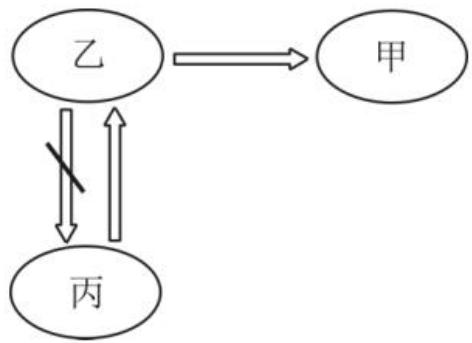
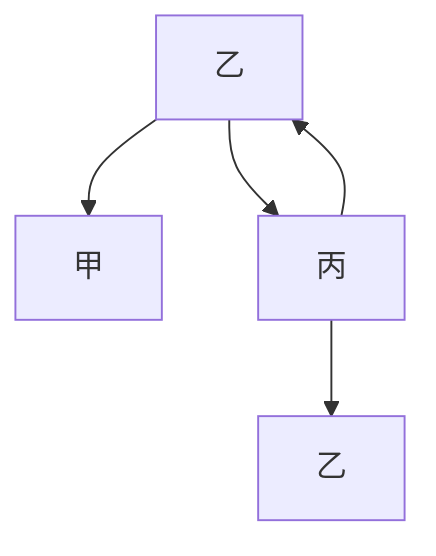
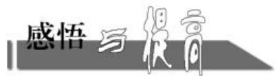

natural_image

Illustration of a child sitting at a desk with a thought bubble showing question marks (no text or symbols present)

# 充要条件中的数学思想

# ■何静芳

数学思想是数学的精髓, 是知识转化为能力及解决数学问题的桥梁。为了提高同学们的数学思维能力, 下面举例说明充要条件中的数学思想, 供大家学习与参考。

# 一、函数与方程思想

函数与方程思想是通过建立函数与方程的关系,把所研究的问题转化为讨论函数与方程的有关性质,从而达到解决问题的目的。

例 1 求证: 关于 x 的方程 $x^{2} + bx + 1 = 0$ 有两个负实根的充要条件是 $b \geqslant 2$ 。

证明:(充分性)由 $b \geqslant 2$ , 可得 $\Delta = b^{2} - 4 \geqslant 0$ , 可知方程 $x^{2} + bx + 1 = 0$ 有实根。设两根分别为 $x_{1}, x_{2}$ , 由一元二次方程根与系数的关系得 $x_{1}x_{2} = 1 > 0$ , 所以两根 $x_{1}, x_{2}$ 同号。由 $x_{1} + x_{2} = -b \leqslant -2 < 0$ , 可得两根 $x_{1}, x_{2}$ 均为负数, 所以方程 $x^{2} + bx + 1 = 0$ 有两$A \cap B = B$ 时, 一定要注意 $B$ 为空集的情况, 否则容易造成错解。

# 四、等价转化思想的运用

例 4 设集合 $U=\{(x,y)\mid x\in\mathbf{R},y\in\mathbf{R}\}$ ， $A=\{(x,y)\mid2x+y-m>0\}$ ， $B=\{(x,y)\mid x-y-n\leqslant0\}$ ，点 $P(2,3)\in A\cap(\complement_{U}B)$ ，求 m,n 的取值范围。

解: 点 $P(2,3) \in A \cap (\complement_{U} B)$ 等价于点 $P(2,3) \in A$ 且点 $P(2,3) \in \complement_{U} B$ ，即点 $P(2,3) \in A$ 且点 $P(2,3) \notin B$ 。

将点 $P(2,3)$ 代入 $2x + y - m > 0$ ，可得 $m < 7$ 。

由 $\complement_{U}B = \{(x,y)|x - y - n > 0\}$ ，可将点 $P(2,3)$ 代入 $x - y - n > 0$ ，解得 $n <   - 1$ 。

故 $m, n$ 的取值范围分别为 $(- \infty, 7)$ , $(- \infty, -1)$ 。

评注:若先求出集合 $A \cap (\complement_{U} B)$ ，再将点 $P(2,3)$ 代入，则解题显然受阻。这里运用等价转化思想解题，但要注意转化的等价性。

个负实根的充分条件是 $b \geqslant 2$ 。

（必要性）由方程 $x^{2} + bx + 1 = 0$ 有两个负实根 $x_{1}, x_{2}$ ，且 $x_{1}x_{2} = 1$ ，可得 $\Delta = b^{2} - 4 \geqslant 0$ 且 $x_{1} + x_{2} = -b < 0$ ，所以 $b \geqslant 2$ ，所以方程 $x^{2} + bx + 1 = 0$ 有两个负实根的必要条件是 $b \geqslant 2$ 。

综上可得,方程 $x^{2}+bx+1=0$ 有两个负实根的充要条件是 $b\geqslant2$ 。

点评:证明充要条件关键是要弄清充分性是由条件推结论,必要性是由结论推条件。

# 二、转化与化归思想

转化与化归思想是在遇到一些直接求解较为困难的问题时,通过观察、分析、类比、联想等思维过程,将原问题转化为一个新问题(相对来说,比较熟悉的问题),通过求解新问题,达到解决原问题的目的。

# 五、数形结合思想的运用

例 5 已知集合 $A = \{x \mid x > 5$ 或 $x < -1\}$ , $B = \{x \mid a < x < a + 8\}$ , 若 $A \cup B = \mathbf{R}$ , 则实数 $a$ 的取值集合是（ ）。

A. $\{a \mid -3 < a < -1\}$

B. $\{a \mid 1 < a < 2\}$

C. $\{a\mid -3\leqslant a\leqslant -1\}$

D. $\{a\mid 1\leqslant a\leqslant 2\}$

解:由题意画出数轴,如图1所示。

  
图1

要使 $A \cup B = \mathbf{R}$ , 需满足 $\left\{ \begin{array}{l} a + 8 > 5, \\ a < -1, \end{array} \right.$ 解得 $-3 < a < -1$ 。应选 A。

评注:数轴是求解集合问题的直观工具,对于涉及含参数不等式的集合问题,常常借助数轴来解决。

作者单位:辽宁省大连市瓦房店市实验高级中学

(责任编辑 王琼霞)

例 2 已知命题 $p:a^{2}-b^{2}+2a-4b-3\neq0$ ，命题 $q:a-b\neq1$ ，则 p 是 q 的（）。

A. 充分不必要条件

B. 必要不充分条件

C. 充要条件

D.既不充分也不必要条件

解:若直接判断“ $a^{2}-b^{2}+2a-4b-3\neq0$ ”是“ $a-b\neq1$ ”的什么条件,则思维受阻。因为原命题和它的逆否命题是等价命题,所以所求问题等价于判断“a-b=1”是“ $a^{2}-b^{2}+2a-4b-3=0$ ”的什么条件。

由 a-b=1，可得 $a^{2}-b^{2}+2a-4b-3=(a+b)(a-b)+2(a-b)-2b-3=a+b+2-2b-3=a-b-1=0$ 。但当 a=1, b=-4 时， $a^{2}-b^{2}+2a-4b-3=0, a-b\neq1$ 。所以 “a-b=1” 是 “ $a^{2}-b^{2}+2a-4b-3=0$ ” 的充分不必要条件，即 “ $a^{2}-b^{2}+2a-4b-3\neq0$ ” 是 “ $a-b\neq1$ ” 的充分不必要条件。应选 A。

点评:解答本题的关键是利用原命题和它的逆否命题是等价命题进行转化求解。

# 三、数形结合思想

数形结合思想的实质是代数问题与图形之间的相互转化,它可以使代数问题几何化,也可以使几何问题代数化。

例 3 已知甲、乙、丙三个条件, 其中甲是乙的必要条件, 丙是乙的充分不必要条件, 那么丙是甲的( )。

A. 充分不必要条件

B. 必要不充分条件

C. 充要条件

D. 既不充分也不必要条件

解:根据题意,画出甲、乙、丙三个条件的递推关系,如图1所示。

flowchart

图 1

由图可知,丙能推出甲,但甲不能推出丙,所以丙是甲的充分不必要条件。应选 A。

点评:解答本题的关键是依据图形,结合 定义直观求解。

# 四、分类讨论思想

利用分类讨论思想解题的关键是依据同一标准分类,且做到不重不漏。

例 4 求方程 $ax^{2}+2x+1=0$ 至少有一个负实根的充要条件。

解: 当 a=0 时, 原方程为一元一次方程,
其负实根为 $x=-\frac{1}{2}$ , 符合要求。

当 $a \neq 0$ 时，原方程为一元二次方程，它有实根的充要条件是 $\Delta \geqslant 0$ ，即 $4 - 4a \geqslant 0$ ，可得 $a \leqslant 1$ 。设方程 $ax^2 + 2x + 1 = 0$ 的两根分别为 $x_1, x_2$ ，则 $x_1 + x_2 = -\frac{2}{a}, x_1x_2 = \frac{1}{a}$ 。

方程 $ax^2 + 2x + 1 = 0$ 只有一个负实根的充要条件是 $\left\{ \begin{array}{l} a \leqslant 1, \\ \frac{1}{a} < 0, \end{array} \right.$ 解得 $a < 0$ ; 方程 $ax^2 + 2x + 1 = 0$ 有两个负实根的充要条件是

$$
\left\{ \begin{array}{l} a \leqslant 1, \\ - \frac {2}{a} <   0, \text {解得} 0 <   a \leqslant 1 _ {\circ} \\ \frac {1}{a} > 0, \end{array} \right.
$$

综上可得,方程 $ax^{2}+2x+1=0$ 至少有一个负实根的充要条件是 $a\leqslant1$ 。

点评:方程 $ax^{2}+2x+1=0(a\neq0)$ 至少有一个负实根包含两种情况:只有一个负实根;两个根都为负实根。

王昌龄的《从军行》中有两句诗“黄沙百战穿金甲，不破楼兰终不还”，则“攻破楼兰”是“返回家乡”的（）。

A. 充分不必要条件

B. 必要不充分条件

C. 充要条件

D. 既不充分也不必要条件

提示:“不破楼兰终不还”的等价命题为“若返回家乡,则攻破楼兰”,所以“攻破楼兰”是“返回家乡”的必要条件。应选 B。

作者单位:江苏省怀仁中学

(责任编辑 王琼霞)