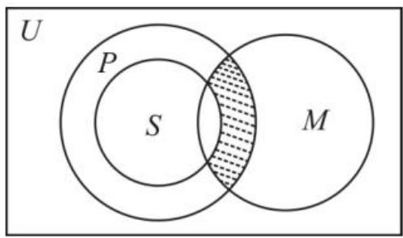
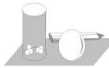

# 集合与常用逻辑用语核心考点强化训练

# ■刘中亮(特级教师)

# 一、选择题

1. 设全集 $U = \{1, 2, 3, 4, 5\}$ , 集合 $M$ 满足 $\complement_U M = \{1, 3\}$ , 则（ ）。

A. $2 \in M$

B. $3 \in M$

C. $4 \notin M$

D. $5 \notin M$

2. 已知命题 $p$ ：“某班所有的男生都爱踢足球”，则命题 $\neg p$ 为（ ）。

A. 某班至多有一个男生爱踢足球

B. 某班至少有一个男生不爱踢足球

C. 某班所有的男生都不爱踢足球

D. 某班所有的女生都爱踢足球

3. 设集合 $A = \{x \mid x^2 - 3x + 2 = 0\}$ , 则满足 $A \cup B = \{0, 1, 2\}$ 的集合 $B$ 的个数是（ ）。

A. 1

B. 3

C. 4

D. 6

4. 若集合 $A = \{1, m^2\}$ , $B = \{3, 9\}$ , 则 “ $m = 3$ ” 是 “ $A \cap B = \{9\}$ ” 的（）。

A. 充分不必要条件

B. 必要不充分条件

C. 充要条件

D. 既不充分也不必要条件

5. 如图 1, U 为全集, M, P, S 是 U 的三个子集, 则阴影部分所表示的集合是( )。

text_image

U
P
S
M

图1

A. $(M\cap P)\cap S$

B. $(M\cap P)\cup S$

C. $(M\cap P)\cap (\complement_{U}S)$

D. $(M\cap P)\cup (\complement_U S)$

6. 下列命题中是全称量词命题, 且为假命题的是( )。

A. 所有能被 6 整除的正数都是偶数

B. 存在三角形的一个内角, 其余弦值为 $\frac{\sqrt{3}}{2}$

C. $\exists m\in \mathbf{N},x^2 +mx + 2 = 0$ 无解

D. $\forall x\in \mathbf{N},x^3 >x^2$

7. 若“ $\exists x \in M, |x| > x$ ”为真命题，“ $\exists x \in M, x > 3$ ”为假命题，则集合 $M$ 可以是（）。

A. $\{x \mid x \leqslant 3\}$

B. $\{x \mid x < -1\}$

C. $\{x \mid 0 < x < 3\}$

D. $\{x \mid x > 3\}$

8. 定义: 若一个 n 位正整数的所有数位上数字的 n 次方和等于这个数本身, 则称这个数是自恋数。已知集合 $A = \{4, 26, 81, 153, 370\}$ , $B = \{x \in A \mid x \text{ 是自恋数}\}$ , 则 B 的子集个数为( )。

A. 16

B. 8

C. 4

D. 2

9. 设集合 $A = \{x \mid x (4 - x) \geqslant 3\}$ , $B = \{x \mid x > a\}$ , 若 $A \cap B = A$ , 则 $a$ 的取值范围是 ( )。

A. $(-∞,1]$

B. $(-∞,1)$

C. $(-∞,3]$

D. $(-∞,3)$

10. 一元二次方程 $ax^2 + 2x + 1 = 0 (a \neq 0)$ 有一个正根和一个负根的充分不必要条件是（ ）。

A. $(-∞,0)$

B. $(0, +\infty)$

C. $(-∞,-1)$

D. $(1, +\infty)$

11. 已知集合 $U = \{x \in \mathbf{N} \mid 0 < x < 8\}$ , $A = \{1, 2, 3\}, B = \{3, 4, 5, 6\}$ , 则下列结论错误的是（ ）。

A. $A \cap B = \{3\}$

B. $A \cup B = \{1, 2, 3, 4, 5, 6\}$

C. $C_{U}A=\{4,5,6,7,8\}$

D. $C_{U}B=\{1,2,7\}$

12. 以下选项中, p 是 q 的充要条件的是 ( )。

A. $p:3x+2>5, q:-2x-3>-5$

B. p:a>2,b<2,q:a>b

C. p: 四边形的两条对角线互相垂直平分, q: 四边形是正方形

D. $p:a \neq 0, q$ : 关于 x 的方程 ax = 1 有唯一解

13. 下列四个命题中的真命题是( )。

A. $\forall n\in \mathbf{R},n^2\geqslant n$

B. $\exists n\in R,\forall m\in R,m\cdot n=m$

C. $\forall n\in R,\exists m\in R,m^{2}<n$

D. $\forall n\in R,n^{2}<n$

14. 对于非空数集 M，定义 $f(M)$ 表示该集合中所有元素的和。给定集合 $S=\{1,2,3,4\}$ ，定义集合 $T=\{f(A)\mid A\subseteq S,A\neq\varnothing\}$ ，则集合 T 中元素的个数是（）。

A. 1

B. 10

C. 11

D. 15

15. 设 S 是实数集 R 的一个非空子集, 如果对于任意的 $a, b \in S$ (a 与 b 可以相等, 也可以不相等), $a + b \in S$ 且 $a - b \in S$ , 则称 S 是“和谐集”, 则下列命题中为假命题的是()。

A. 存在一个集合 S, 它既是“和谐集”, 又是有限集

B. 集合 $S=\{x \mid x=\sqrt{3}k, k \in Z\}$ 是“和谐集”

C. 若 $S_{1}, S_{2}$ 都是“和谐集”，则 $S_{1} \cap S_{2} \neq \varnothing$

D. 对任意两个不同的“和谐集” $S_{1}, S_{2}$ ，总有 $S_{1} \cup S_{2} = R$

16.(多选题)下列说法正确的是()。

A. 命题“ $\forall x \in \mathbf{R}, x^{2} > -1$ ”的否定是“ $\exists x \in \mathbf{R}, x^{2} \leqslant -1$ ”

B. 命题 “ $\exists x \in \mathbf{R}, x^{2} \leqslant 2$ ” 的否定是 “ $\forall x \in \mathbf{R}, x^{2} > 2$ ”

C. 存在 $x \in Q$ ，使得 $2x^{2} + x + 1 = 0$ 是真命题

D. 若命题“ $\exists x \in \mathbf{R}, 4x^{2} + 2x + n = 0$ ”为假命题，则实数 $n$ 的取值范围是 $\left(\frac{1}{4}, +\infty\right)$

17.(多选题)若 $p: x^{2} + x - 6 = 0$ 是 q: $ax + 1 = 0$ 的必要不充分条件, 则实数 a 的值为()。

A. 2

B. $-\frac{1}{2}$

C. $\frac{1}{3}$

D. 3

18.(多选题)定义集合运算: $A\otimes B=\{z|z=(x+y)\times(x-y),x\in A,y\in B\}$ ，设集合 $A=\{\sqrt{2},\sqrt{3}\},B=\{1,\sqrt{2}\}$ ，则()。

A. 当 $x=\sqrt{2}$ , $y=\sqrt{2}$ 时, z=1

B. x 可取两个值, y 可取两个值, $z = (x + y) \times (x - y)$ 对应 4 个式子

C. $A \otimes B$ 中有 4 个元素

D. $A \otimes B$ 的真子集有 7 个

19.(多选题)已知集合 $A=\{x \mid x^{2}-2x-3<0\}$ ， $B=\{x \mid 2x-4<0\}$ ，则下列关系式正确的是()。

A. $A \cap B = \{x \mid -1 < x < 2\}$

B. $A \cup B = \{x \mid x \leqslant 3\}$

C. $A \cup (\complement_{\mathbb{R}} B) = \{x \mid x > -1\}$

D. $A \cap (\complement_{\mathbb{R}} B) = \{x \mid 2 \leqslant x < 3\}$

20.(多选题)设集合 $M=\{x \mid x=(a+1)^{2}+2, a \in \mathbf{Z}\}$ , $P=\{y \mid y=b^{2}-4b+6, b \in N^{*}\}$ , 则()。

A. $P \subset M$

B. $1 \notin P$

C. $M = P$

D. $M \cap P = \varnothing$

21.(多选题)已知全集 U=R, 集合 $A=\{x \mid -2 \leqslant x \leqslant 7\}$ , $B=\{x \mid m+1 \leqslant x \leqslant 2m-1\}$ , 则使 $A \subseteq C_{U}B$ 成立的实数 m 的取值范围可能是()。

A. $\{m\mid6\leqslant m\leqslant10\}$

B. $\{m\mid-2<m<2\}$

C. $\{m\mid -2 <   m <   - \frac{1}{2}\}$

D. $\{m \mid 5 < m \leqslant 8\}$

22.(多选题)对任意实数 a, b, c, 给出下列命题, 其中真命题是( )。

A. “a=b”是“ac=bc”的充要条件

B. “a > b”是“ $a^{2} > b^{2}$ ”的充分条件

C. “a<5”是“a<3”的必要条件

D.“ $a+5$ 是无理数”是“a 是无理数”的充要条件

23.(多选题)已知命题 $p: \forall x \in [0, \sqrt{3}], a \geqslant x^{2}$ ，命题 q: $\exists x \in R, x^{2} + 4x + a = 0$ ，若命题 p 与命题 q 均为真命题，则实数 a 的取值可能是()。

A. $\frac{7}{2}$

B. 5

C. $\sqrt{17}$

D. 4

24.(多选题)下列说法正确的是( )。

A. 命题“ $\forall x \in \mathbf{R}, x^2 > -1$ ”的否定是“ $\exists x \in \mathbf{R}, x^2 \leqslant -1$ ”

B.“ $|x|>|y|$ ”是“x>y”的必要条件

C.“ $m < 0$ ”是“关于 $x$ 的方程 $x^{2} - 2x+$ $m = 0$ 有一正一负两个根”的充要条件

D. 已知集合 $A = \{x \mid x^2 + x - 6 = 0\}$ , $B = \{x \mid mx - 1 = 0\}$ , 全集 $U = \mathbf{R}$ , 若 $A \cup (\complement_U B) = \mathbf{R}$ , 则实数 $m$ 的取值集合为 $\left\{\frac{1}{2}, -\frac{1}{3}\right\}$ .

# 二、填空题

25. 设集合 $S = \{x \mid x < -1$ 或 $x > 5\}$ , $T = \{x \mid a < x < a + 8\}$ , $S \cup T = \mathbf{R}$ , 则实数 $a$ 的取值范围是 \_\_\_\_。

26. 已知集合 $A = \{x \mid -1 < x < 2\}$ , $B = \{x \mid -1 < x < m + 1\}$ , 若 $x \in A$ 是 $x \in B$ 成立的一个充分不必要条件, 则实数 $m$ 的取值范围是 \_\_\_\_。

27. 若集合 $A = \{-1, 1\}$ , $B = \{x \mid ax = 1\}$ , 且 $B \subseteq A$ , 则实数 $a$ 取值的集合为 \_\_\_\_。

28. 已知 $M, N$ 为 $\mathbf{R}$ 的子集, 若 $M \cap (\complement_{\mathbb{R}} N) = \emptyset, N = \{1, 2\}$ , 则满足题意的集合 $M$ 的个数为 \_\_\_\_。

29. 已知不等式 $2x - m \leqslant 3$ 成立的一个充分不必要条件是 $-5 < x < 4$ , 则实数 $m$ 的取值范围是 \_\_\_\_。

30. 设集合 $M = \{1, 2, 3, 4, 6\}$ ， $S_{1}$ ， $S_{2}, \cdots, S_{k}$ 都是 M 的含有两个元素的子集，则 k = \_\_\_\_。若集合 A 是由 $S_{1}, S_{2}, \cdots, S_{k}$ 中的若干个组成的集合，且满足：对任意的 $S_{i} = \{a_{i}, b_{i}\}$ ， $S_{j} = \{a_{j}, b_{j}\} (i \neq j, i, j \in \{1, 2, 3, \cdots, k\})$ ，都有 $a_{i} < b_{i}, a_{j} < b_{j}$ ，且 $\frac{a_{i}}{b_{i}} \neq \frac{a_{j}}{b_{j}}$ ，则 A 中元素个数的最大值是 \_\_\_\_。

# 三、解答题

31. 已知全集 $U = \{1, 2, 3, 4, 5, 6, 7, 8\}$ , 集合 $A = \{x \mid x^2 - 3x + 2 = 0\}$ , $B = \{x \in \mathbf{Z} \mid 1 \leqslant x \leqslant 5\}$ , $C = \{x \in \mathbf{Z} \mid 2 < x < 9\}$ 。

(1) 求 $A \cup (B \cap C)$ 。

(2) 求 $(\complement_U B) \cup (\complement_U C)$ 。

32. 已知 $a$ 为实数, 集合 $A = \{x \mid 9 - \frac{x}{3} \geqslant 8\}$ , $B = \{x \mid 2 - a \leqslant x \leqslant 2a - 1\}$ 。

(1) 若 $a = 2$ ，求 $A \cap B, \complement_A B$ 。

(2) 若 $A \cap B = B$ , 求实数 $a$ 的取值范围。

33. 已知集合 $A = \{x \mid x^2 - x - 6 \leqslant 0\}$ , $B = \{x \mid a - 2 < x < 3a\}$ , 全集 $U = \mathbf{R}$ 。

(1) 若 $a = 2$ ，求 $A \cap (\complement_U B)$ 。

(2) 若 $B \subseteq A$ , 求实数 $a$ 的取值范围。

34. 已知集合 $A = \{x \in \mathbf{N} \mid 3x^2 - 13x + 4 < 0\}$ , $B = \{x \mid ax - 1 \geqslant 0\}$ 。

(1) 当 $a=\frac{1}{2}$ 时, 求 $A \cap B$ 。

(2)若\_\_\_\_,求实数a的取值范围。

请从① $A \cup B = B$ ，② $A \cap B = \varnothing$ ，③ $A \cap (\complement_{\mathbb{R}} B) \neq \varnothing$ ，这三个条件中选一个填入(2)中的横线处，并完成(2)问的解答。

35. 设集合 $A = \{x \mid x^2 + ax - 3 = 0\}$ , $B = \{x \mid x^2 - 4x + b = 0\}$ , $A \cap B = \{1\}$ , $C = \{-3, 2\}$ 。

(1) 求 a, b 的值及集合 A, B。

(2) 求 $(A \cup C) \cap (B \cup C)$ 。

36. 已知集合 $A = \{x \mid -3 \leqslant x \leqslant 6\}$ , $B = \{x \mid 2a - 1 \leqslant x \leqslant a + 1\}$ 。

(1) 若 $a = -2$ ，求 $A \cup B$ 。

(2) 若 $A \cap B = B$ ，求实数 a 的取值范围。

37. 已知 $a, b$ 是实数，求证： $a^4 - b^4 - 2b^2 = 1$ 成立的充要条件是 $a^2 - b^2 = 1$ 。

38. 已知集合 $A = \{x \mid x = m^2 - n^2, m \in \mathbf{Z}, n \in \mathbf{Z}\}$ 。

(1) 判断 8,9,10 是否属于集合 A。

(2)若集合 $B=\{x \mid x=2k+1, k \in Z\}$ ，证明：“ $x \in A$ ”的充分不必要条件是“ $x \in B$ ”。

(3)写出所有满足集合 A 的偶数构成的集合。

# 参考答案与提示

# 一、选择题

1. 提示: 由题意知 $M = \{2, 4, 5\}$ , 所以

$2 \in M$ 。应选A。

2. 提示: 命题 p: “某班所有的男生都爱踢足球”是一个全称量词命题, 它的否定是一个存在量词命题, 即命题 $\neg p$ 为“某班至少有一个男生不爱踢足球”。应选 B。

3. 提示: 易知 $A=\{1,2\}$ 。因为 $A \cup B = \{0,1,2\}$ ，所以集合 B 可以是 $\{0\}, \{0,1\}, \{0,2\}, \{0,1,2\}$ ，共 4 个。应选 C。

4. 提示: 若 $m = 3$ , 则 $A = \{1, 9\}, B = \{3, 9\}, A \cap B = \{9\}$ , 所以“ $m = 3$ ”是“A $\cap$ B = $\{9\}$ ”的充分条件。若 $A \cap B = \{9\}$ , 则 $m^2 = 9$ , 即 $m = \pm 3$ , 所以 $A \cap B = \{9\} \neq m = 3$ , 所以“ $m = 3$ ”是“A $\cap$ B = $\{9\}$ ”的充分不必要条件。应选 A。

5. 提示: 图中的阴影部分是 $M \cap P$ 的子集, 且不属于集合 S, 但属于集合 S 的补集, 即是 $C_{U}S$ 的子集, 所以阴影部分所表示的集合是 $(M \cap P) \cap (C_{U}S)$ 。应选 C。

6. 提示: A 为全称量词命题, 所有能被 6 整除的正数一定能被 2 整除, 都是偶数, A 不符合题意。B, C 为存在量词命题, B, C 不符合题意。对于 D, 当 x = 0 时, $x^{3} > x^{2}$ 不成立, D 符合题意。应选 D。

7. 提示: 若“ $\forall x \in M, |x| > x$ ”为真命题, 则此时 $x < 0$ ; 又“ $\exists x \in M, x > 3$ ”为假命题, 则此时 $x \leqslant 3$ 。综上可得, 集合 $M$ 满足 $M \subseteq \{x \mid x < 0\}$ , B 正确, A, C, D 错误。应选 B。

8. 提示: 因为 $4^{1}=4$ , 所以 4 是自恋数。因为 $2^{2}+6^{2}=40\neq26$ , 所以 26 不是自恋数。因为 $8^{2}+1^{2}=65\neq81$ , 所以 81 不是自恋数。因为 $1^{3}+5^{3}+3^{3}=153$ , 所以 153 是自恋数。因为 $3^{3}+7^{3}+0^{3}=370$ , 所以 370 是自恋数。所以 $B=\{4,153,370\}$ , 则 B 的子集的个数为 $2^{3}=8$ 。应选 B。

9. 提示: 由 $x(4 - x) \geqslant 3$ , 即 $x^2 - 4x + 3 \leqslant 0$ , 解得 $1 \leqslant x \leqslant 3$ , 所以 $A = \{x \mid 1 \leqslant x \leqslant 3\}$ 。因为 $A \cap B = A$ , 且 $B = \{x \mid x > a\}$ , 所以 $A \subseteq B$ , 所以 $a < 1$ 。应选 B。

10. 提示: 因为一元二次方程 $ax^{2} + 2x + 1 = 0 (a \neq 0)$ 有一个正根和一个负根, 所以 $\left\{\begin{aligned}\Delta&=4-4a>0,\\ \frac{1}{a}<0,\end{aligned}\right.$ 解得 a<0 。所以一元二次方

程 $ax^2 + 2x + 1 = 0 (a \neq 0)$ 有一个正根和一个负根的充分不必要条件可以是 $a < -1$ 。应选 C。

11. 提示: 由题意知 $U = \{x \in \mathbb{N} \mid 0 < x < 8\} = \{1, 2, 3, 4, 5, 6, 7\}, A = \{1, 2, 3\}, B = \{3, 4, 5, 6\}$ , 所以 $A \cap B = \{3\}, A \cup B = \{1, 2, 3, 4, 5, 6\}, \complement_U A = \{4, 5, 6, 7\}, \complement_U B = \{1, 2, 7\}$ 。应选 C。

12. 提示: 对于 A, 由 $3x + 2 > 5$ 得 $x > 1$ , 由 $-2x - 3 > -5$ 得 $x < 1$ , 所以 $p \nRightarrow q, q \nRightarrow p$ , 所以 $p$ 是 $q$ 的既不充分也不必要条件。对于 B, 由 $a > 2, b < 2$ 得 $a > b$ , 故 $p \Rightarrow q$ 。当 $a = 1, b = 0$ 时, 满足 $a > b$ , 但不满足 $a > 2$ , 故 $q \nRightarrow p$ 。所以 $p$ 是 $q$ 的充分不必要条件。对于 C, 易知 $p \nRightarrow q, q \Rightarrow p$ , 故 $p$ 是 $q$ 的必要不充分条件。对于 D, 若 $a \neq 0$ , 则关于 $x$ 的方程 $ax = 1$ 有唯一解。若关于 $x$ 的方程 $ax = 1$ 有唯一解, 则 $a \neq 0$ 。所以 $p \Leftrightarrow q$ , 即 $p$ 是 $q$ 的充要条件。应选 D。

13. 提示: 对于 A, 令 $n = \frac{1}{2}$ , 则 $\left(\frac{1}{2}\right)^{2} = \frac{1}{4} < \frac{1}{2}$ , A 错误。对于 B, 令 n = 1, 则 $\forall m \in R, m \times 1 = m$ 成立, B 正确。对于 C, 令 n = -1, 则 $m^{2} < -1$ , 显然无实数解, C 错误。对于 D, 令 n = -1, 则 $(-1)^{2} < -1$ , 显然不成立, D 错误。应选 B。

14. 提示: 由题意知 A 是 S 的非空子集。当 A 中的元素个数为 1 时, $f(A)$ 可取 1, 2, 3, 4; 当 A 中的元素个数为 2 时, $f(A)$ 可取 3, 4, 5, 6, 7; 当 A 中的元素个数为 3 时, $f(A)$ 可取 6, 7, 8, 9; 当 A 中的元素个数为 4, 即 A = S 时, $f(A) = 10$ 。综上所述, $T = \{1, 2, 3, 4, 5, 6, 7, 8, 9, 10\}$ , 即集合 T 中有 10 个元素。应选 B。

15. 提示: 如 $S = \{0\}$ , 既是“和谐集”, 又是有限集, A 是真命题。设 $x_{1} = \sqrt{3} k_{1}, x_{2} = \sqrt{3} k_{2}, k_{1}, k_{2} \in \mathbf{Z}$ , 则 $x_{1} + x_{2} = \sqrt{3} (k_{1} + k_{2}) \in S$ , 且 $x_{1} - x_{2} = \sqrt{3} (k_{1} - k_{2}) \in S$ , 所以 $S = \{x \mid x = \sqrt{3} k, k \in \mathbf{Z}\}$ 是“和谐集”, B 是真命题。任意“和谐集”中一定含有 0 , 所以 $S_{1} \cap S_{2} \neq \emptyset$ , C 是真命题。取 $S_{1} = \{x \mid x = 2k, k \in \mathbf{Z}\}$ ,

$S_{2}=\{x\mid x=3k,k\in\mathbf{Z}\}$ ，则 $S_{1},S_{2}$ 均是“和谐集”，但 $5\notin S_{1},5\notin S_{2}$ ，可知 $S_{1}\cup S_{2}$ 不等于实数集R，D是假命题。应选D。

16. 提示: 原命题的否定是“ $\exists x \in \mathbf{R}$ , $x^2 \leqslant -1$ ”, A 正确。原命题的否定是“ $\forall x \in \mathbf{R}$ , $x^2 > 2$ ”, B 正确。因为 $\Delta = 1 - 8 = -7 < 0$ ，即方程 $2x^2 + x + 1 = 0$ 无实数解，也无有理数解，故为假命题，C 错误。若命题“ $\exists x \in \mathbf{R}$ , $4x^2 + 2x + n = 0$ ”为假命题，则命题“ $\forall x \in \mathbf{R}$ , $4x^2 + 2x + n \neq 0$ ”为真命题，即 $4x^2 + 2x + n = 0$ 无实数解，则 $\Delta = 4 - 16n < 0$ ，解得 $n > \frac{1}{4}$ ，D 正确。应选 ABD。

17. 提示: 由 $x^{2}+x-6=0$ , 可得 x=2 或 x=-3。对于 $ax+1=0$ , 当 a=0 时, 方程无解; 当 $a\neq0$ 时, 方程的解为 $x=-\frac{1}{a}$ 。由题意知 $p\nRightarrow q, q\nRightarrow p$ , 可得 $a\neq0$ , 此时应有 $-\frac{1}{a}=2$ 或 $-\frac{1}{a}=-3$ , 解得 $a=-\frac{1}{2}$ 或 $a=\frac{1}{3}$ 。综上可得, $a=-\frac{1}{2}$ 或 $a=\frac{1}{3}$ 。应选 BC。

18. 提示: 当 $x=\sqrt{2}$ , $y=\sqrt{2}$ 时, $z=(\sqrt{2}+\sqrt{2})\times(\sqrt{2}-\sqrt{2})=0$ , A 错误。x 可取 $\sqrt{2}$ , $\sqrt{3}$ , y 可取 $1,\sqrt{2}$ , 则 z 对应 $(\sqrt{2}+1)\times(\sqrt{2}-1)=1$ , $(\sqrt{2}+\sqrt{2})\times(\sqrt{2}-\sqrt{2})=0$ , $(\sqrt{3}+1)\times(\sqrt{3}-1)=2$ , $(\sqrt{3}+\sqrt{2})\times(\sqrt{3}-\sqrt{2})=1$ , B 正确。由选项 B 知 $A\otimes B=\{0,1,2\}$ , 共 3 个元素, C 错误。由 $A\otimes B=\{0,1,2\}$ 知 $A\otimes B$ 的真子集有 $2^{3}-1=7$ (个), D 正确。应选 BD。

19. 提示: 由 $x^{2} - 2x - 3 < 0$ , 即 $(x - 3)(x + 1) < 0$ , 解得 $-1 < x < 3$ , 所以 $A = \{x \mid -1 < x < 3\}$ 。由 $2x - 4 < 0$ , 解得 $x < 2$ , 所以 $B = \{x \mid x < 2\}$ 。对于 A, $A \cap B = \{x \mid -1 < x < 2\}$ , A 正确。对于 B, $A \cup B = \{x \mid x < 3\}$ , B 错误。对于 C, $\complement_{R} B = \{x \mid x \geqslant 2\}$ , A $\cup (\complement_{R} B) = \{x \mid x > -1\}$ , C 正确。对于 D, 由选项 C 知 $\complement_{R} B = \{x \mid x \geqslant 2\}$ , 所以 A $\cap (\complement_{R} B) = \{x \mid 2 \leqslant x < 3\}$ , D 正确。应选 ACD。

20. 提示: 因为 $a \in Z$ ，所以 $a + 1 \in Z$ ，且 $(a + 1)^{2} + 2 \geqslant 2$ ，所以 $M = \{x \in N^{*} \mid x \geqslant 2\}$ 。因为 $b \in N^{*}, b^{2} - 4b + 6 = (b - 2)^{2} + 2 \geqslant 2$ ，所

以 $P = \{y\in \mathbf{N}^{*}\mid y\geqslant 2\}$ ，所以 $1\notin P$ 且 $M = P$ 。应选BC。

21. 提示: 当 $B = \varnothing$ 时, 由 $m + 1 > 2m - 1$ , 可得 m < 2, 此时 $C_{U}B = R$ , 符合题意。当 $B \neq \varnothing$ 时, 由 $m + 1 \leqslant 2m - 1$ , 可得 $m \geqslant 2$ 。易得 $C_{U}B = \{x \mid x < m + 1 \text{ 或 } x > 2m - 1\}$ 。因为 $A \subseteq C_{U}B$ , 所以 $m + 1 > 7$ 或 2m - 1 < -2, 解得 m > 6 或 $m < -\frac{1}{2}$ 。因为 $m \geqslant 2$ , 所以 m > 6。综上可得, m 的取值范围为 $\{m \mid m < 2 \text{ 或 } m > 6\}$ 。应选 BC。

22. 提示: 对于 A, 当 a = b 时, ac = bc 成立, 当 ac = bc, c = 0 时, a = b 不一定成立, 所以“a = b”是“ac = bc”的充分不必要条件, A 不是真命题。对于 B, 当 a = -1, b = -2 时, a > b, $a^{2} < b^{2}$ , 当 a = -2, b = 1 时, $a^{2} > b^{2}$ , a < b, 所以“a > b”是“ $a^{2} > b^{2}$ ”的既不充分也不必要条件, B 不是真命题。对于 C, 当 a < 3 时, 一定有 a < 5 成立, 当 a < 5 时, a < 3 不一定成立, 所以“a < 5”是“a < 3”的必要条件, C 是真命题。对于 D, 易知“a + 5 是无理数”是“a 是无理数”的充要条件, D 是真命题。应选 CD。

23. 提示: 对于命题 p, 由 $\forall x \in [0, \sqrt{3}]$ , $a \geqslant x^{2}$ , 可得 $a \geqslant (x^{2})_{\max} = 3$ , 所以 $a \geqslant 3$ 。对于命题 q, 由 $\exists x \in R, x^{2} + 4x + a = 0$ , 可得 $\Delta = 4^{2} - 4a \geqslant 0$ , 解得 $a \leqslant 4$ 。若命题 p 与命题 q 均为真命题, 则 $3 \leqslant a \leqslant 4$ 。应选 AD。

24. 提示: 对于 A, 命题“ $\forall x \in \mathbf{R}, x^2 > -1$ ”的否定是“ $\exists x \in \mathbf{R}, x^2 \leqslant -1$ ”, A 正确。对于 B, 由 $x > y$ 不一定得到 $|x| > |y|$ , 如 $x = -2, y = -3$ , 所以“ $|x| > |y|$ ”不是“ $x > y$ ”的必要条件, B 错误。对于 C, 若方程 $x^2 - 2x + m = 0$ 有一正一负两个根, 则 $\left\{ \begin{array}{l} \Delta = 4 - 4m > 0, \\ m < 0, \end{array} \right.$ 解得 $m < 0$ , 所以“ $m < 0$ ”是 “关于 $x$ 的方程 $x^2 - 2x + m = 0$ 有一正一负两个根”的充要条件, C 正确。对于 D, $A = \{x \mid x^2 + x - 6 = 0\} = \{-3, 2\}$ , 要使 $A \cup (\complement_U B) = \mathbf{R}$ , 需满足 ( $\complement_U A) \subseteq (\complement_U B)$ , 即 $B \subseteq A$ , 所以 $B = \emptyset$ 或 $B = \{-3\}$ 或 $B = \{2\}$ 。当 $B = \emptyset$ 时, 符合题意, 此时 $m = 0$ ; 当 $B =$

$\{-3\}$ 时，由 $-3m - 1 = 0$ ，可得 $m = -\frac{1}{3}$ ，符合题意；当 $B = \{2\}$ 时，由 $2m - 1 = 0$ ，可得 $m = \frac{1}{2}$ ，符合题意。所以实数 $m$ 的取值集合为 $\left\{\frac{1}{2},0, - \frac{1}{3}\right\}$ ，D错误。应选AC。

# 二、填空题

25. 提示: 由 $S \cup T = \mathbf{R}$ 得 $\left\{ \begin{array}{l} a < -1, \\ a + 8 > 5, \end{array} \right.$ 解得 $-3 < a < -1$ , 所以实数 $a$ 的取值范围是 $\{a \mid -3 < a < -1\}$ 。

26. 提示: 由 $x \in A$ 是 $x \in B$ 成立的一个充分不必要条件, 可得 $A \subsetneqq B$ , 所以 $\left\{\begin{aligned}m+1&>-1,\\ m+1&>2,\end{aligned}\right.$ 解得 m>1, 所以实数 m 的取值范围是 $\{m|m>1\}$ 。

27. 提示: 因为 $B \subseteq A$ ，所以集合 B 可以是 $\{-1\}, \{1\}, \varnothing$ 。当 $B = \{-1\}$ 时，由 -a = 1，可得 a = -1；当 $B = \{1\}$ 时，可得 a = 1；当 $B = \varnothing$ 时，可得 a = 0。所以实数 a 的取值集合为 $\{-1, 1, 0\}$ 。

28. 提示: 因为 $M \cap (\complement_{\mathbb{R}} N) = \emptyset$ , 所以 $M \subseteq N$ 。又 $N = \{1, 2\}$ , 所以 $M = \{1\}$ 或 $M = \{2\}$ 或 $M = \{1, 2\}$ 或 $M = \emptyset$ 。故满足题意的集合 $M$ 的个数为 4。

29. 提示: 由 $2x - m \leqslant 3$ 得 $x \leqslant \frac{3 + m}{2}$ 。由题意知 $\{x \mid -5 < x < 4\} \subsetneqq \left\{x \mid x \leqslant \frac{3 + m}{2}\right\}$ , 所以 $\frac{3 + m}{2} \geqslant 4$ , 解得 $m \geqslant 5$ , 所以实数 $m$ 的取值范围是 $\{m \mid m \geqslant 5\}$ 。

30. 提示: 集合 M 的含有两个元素的子集为 $\{1,2\}$ , $\{1,3\}$ , $\{1,4\}$ , $\{1,6\}$ , $\{2,3\}$ , $\{2,4\}$ , $\{2,6\}$ , $\{3,4\}$ , $\{3,6\}$ , $\{4,6\}$ , 共 10 个, 则 k=10。

因为 $\frac{a_{i}}{b_{i}}\neq\frac{a_{j}}{b_{j}}$ ，所以 $\{1,2\},\{2,4\},\{3,6\}$ 中只能取一个， $\{1,3\},\{2,6\}$ 中只能取一个， $\{2,3\},\{4,6\}$ 中只能取一个，所以A中元素个数的最大值为6。

# 三、解答题

31. 提示: (1) 依题意知 $A = \{1, 2\}$ , $B =$

$\{1,2,3,4,5\}$ , $C=\{3,4,5,6,7,8\}$ ，所以 $B\cap C=\{3,4,5\}$ ，所以 $A\cup(B\cap C)=\{1,2\}\cup\{3,4,5\}=\{1,2,3,4,5\}$ 。

(2) 由 $\complement_U B = \{6,7,8\}$ , $\complement_U C = \{1,2\}$ , 可得 $(\complement_U B) \cup (\complement_U C) = \{6,7,8\} \cup \{1,2\} = \{1,2,6,7,8\}$ 。

32. 提示: (1) 已知 $a = 2$ , 由 $9 - \frac{x}{3} \geqslant 8$ , 可得 $x \leqslant 3$ , 所以 $A = \{x \mid x \leqslant 3\}$ , $B = \{x \mid 0 \leqslant x \leqslant 3\}$ , 所以 $A \cap B = \{x \mid x \leqslant 3\} \cap \{x \mid 0 \leqslant x \leqslant 3\} = [0, 3]$ , $\complement_A B = (-\infty, 0)$ 。

(2) 因为 $A \cap B = B$ ，所以 $B \subseteq A$ 。

由(1)知 $A = \{x\mid x\leqslant 3\}$ 。

当 $B = \emptyset$ 时，由 $2a - 1 < 2 - a$ ，解得 $a < 1$

当 $B \neq \emptyset$ 时，由 $\left\{ \begin{array}{l} 2a - 1 \geqslant 2 - a, \\ 2a - 1 \leqslant 3, \end{array} \right.$ 解得 $1 \leqslant a \leqslant 2$ 。

综上所述,实数 a 的取值范围是 $(-∞, 2]$ 。

33. 提示: (1) 因为 $A = \{x \mid x^{2} - x - 6 \leqslant 0\}$ ，所以 $(x - 3)(x + 2) \leqslant 0$ ，解得 $-2 \leqslant x \leqslant 3$ ，所以集合 $A = [-2, 3]$ 。

当 $a = 2$ 时， $B = (0,6)$ ， $\complement_U B = (-\infty, 0] \cup [6, +\infty)$ ，所以 $A \cap (\complement_U B) = [-2,0]$ 。

(2)由 $B \subseteq A$ ，可对集合 B 分两种情况讨论求解。

当 $B = \emptyset$ 时，由 $a - 2\geqslant 3a$ ，可得 $a\leqslant -1$

当 $B \neq \emptyset$ 时，由 $\left\{ \begin{array}{l} a - 2 < 3a, \\ a - 2 \geqslant -2, \\ 3a \leqslant 3, \end{array} \right.$ 解得 $0 \leqslant a \leqslant 1$ 。

综上可得,实数 a 的取值范围为 $(-∞, -1]∪[0,1]$ 。

34. 提示: (1) 由题意可得, 集合 $A = \{x \in \mathbb{N} \mid \frac{1}{3} < x < 4\} = \{1, 2, 3\}$ 。当 $a = \frac{1}{2}$ 时, 集合 $B = \{x \mid \frac{1}{2}x - 1 \geqslant 0\} = \{x \mid x \geqslant 2\}$ , 所以 $A \cap B = \{2, 3\}$ 。

(2)选择①,即 $A \cup B = B$ 。因为 $A \cup B = B$ ,所以 $A \subseteq B$ 。当 a = 0 时, $B = \varnothing$ ,不满足 $A \subseteq B$ ，舍去。当 $a > 0$ 时， $B = \left\{x \mid x \geqslant \frac{1}{a}\right\}$ ，要使 $A \subseteq B$ ，需满足 $\frac{1}{a} \leqslant 1$ ，解得 $a \geqslant 1$ 。当 $a < 0$ 时， $B = \left\{x \mid x \leqslant \frac{1}{a}\right\}$ ，此时 $\frac{1}{a} < 0$ ，则 $A \cap B = \varnothing$ ，舍去。综上可得，实数 $a$ 的取值范围为 $[1, +\infty)$ 。

选择②, 即 $A \cap B = \varnothing$ 。当 $a = 0$ 时, $B = \varnothing$ , 满足 $A \cap B = \varnothing$ ; 当 $a > 0$ 时, $B = \left\{x \mid x \geqslant \frac{1}{a}\right\}$ , 要使 $A \cap B = \varnothing$ , 需满足 $\frac{1}{a} > 3$ , 解得 $0 < a < \frac{1}{3}$ ; 当 $a < 0$ 时, $B = \left\{x \mid x \leqslant \frac{1}{a}\right\}$ , 此时 $\frac{1}{a} < 0$ , 显然 $A \cap B = \varnothing$ 。综上可得, 实数 $a$ 的取值范围为 $\left(-\infty, \frac{1}{3}\right)$ 。

选择③, 即 $A \cap (\complement_{\mathbb{R}} B) \neq \emptyset$ 。当 $a = 0$ 时, $B = \emptyset$ , $A \cap (\complement_{\mathbb{R}} B) = A \neq \emptyset$ , 满足题意; 当 $a > 0$ 时, $B = \left\{x \mid x \geqslant \frac{1}{a}\right\}$ , $\complement_{\mathbb{R}} B = \left\{x \mid x < \frac{1}{a}\right\}$ , 要使 $A \cap (\complement_{\mathbb{R}} B) \neq \emptyset$ , 则 $\frac{1}{a} > 1$ , 解得 $0 < a < 1$ ; 当 $a < 0$ 时, $B = \left\{x \mid x \leqslant \frac{1}{a}\right\}$ , $\complement_{\mathbb{R}} B = \left\{x \mid x > \frac{1}{a}\right\}$ , 此时 $A \cap (\complement_{\mathbb{R}} B) = A \neq \emptyset$ , 满足题意。综上可得, 实数 $a$ 的取值范围为 $(- \infty, 1)$ 。

35. 提示: (1) 因为 $A=\{x \mid x^{2}+ax-3=0\}$ , $B=\{x \mid x^{2}-4x+b=0\}$ , $A \cap B=\{1\}$ , 所以 $\left\{\begin{aligned}&1+a-3=0,\\ &1-4+b=0,\end{aligned}\right.$ 解得 a=2, b=3。

所以集合 $A = \{x\mid x^2 +2x - 3 = 0\} = \{1,$ $-3\} ,B = \{x\mid x^2 -4x + 3 = 0\} = \{1,3\}$ 。

(2)由(1)知集合 $A = \{1, -3\}, B = \{1, 3\}$ 。因为 $C = \{-3, 2\}$ ，所以 $A \cup C = \{1, 2, -3\}, B \cup C = \{1, 2, 3, -3\}$ ，所以 $(A \cup C) \cap (B \cup C) = \{-3, 1, 2\}$ 。

36. 提示: (1) 当 a = -2 时, 集合 $B = \{x \mid -5 \leqslant x \leqslant -1\}$ 。因为 $A = \{x \mid -3 \leqslant x \leqslant 6\}$ , 所以 $A \cup B = \{x \mid -5 \leqslant x \leqslant 6\}$ 。

(2)由 $A \cap B = B$ ，可得 $B \subseteq A$ 。

当 $B = \emptyset$ 时，满足 $B \subseteq A$ ，此时 $2a - 1 > a + 1$ ，解得 $a > 2$

当 $B \neq \emptyset$ 时，要使 $B \subseteq A$ ，需满足 $\left\{ \begin{array}{l} 2a - 1 \leqslant a + 1, \\ 2a - 1 \geqslant -3, \\ a + 1 \leqslant 6, \end{array} \right.$ 解得 $-1 \leqslant a \leqslant 2$ 。

综上所述,实数 a 的取值范围是 $\{a \mid a \geqslant -1\}$ 。

37. 提示: (充分性) 若 $a^{2}-b^{2}=1$ ，则 $a^{4}-b^{4}-2b^{2}=(a^{2}-b^{2})(a^{2}+b^{2})-2b^{2}=a^{2}+b^{2}-2b^{2}=a^{2}-b^{2}=1$ ，充分性成立。

（必要性）若 $a^4 - b^4 - 2b^2 = 1$ ，则 $a^4 - b^4 - 2b^2 - 1 = 0$ ，即 $a^4 - (b^4 + 2b^2 + 1) = 0$ ，可得 $a^4 - (b^2 + 1)^2 = 0$ ，所以 $(a^2 + b^2 + 1)(a^2 - b^2 - 1) = 0$ 。由 $a^2 + b^2 + 1 \neq 0$ ，可得 $a^2 - b^2 - 1 = 0$ ，即 $a^2 - b^2 = 1$ ，必要性成立。

综上可得, $a^{4}-b^{4}-2b^{2}=1$ 成立的充要条件是 $a^{2}-b^{2}=1$ 。

38. 提示: (1) 由 $8 = 3^{2} - 1, 9 = 5^{2} - 4^{2}$ ，可得 $8 \in A, 9 \in A$ 。

若 $10 = m^2 - n^2, m, n \in \mathbf{Z}$ , 则 $(|m| + |n|)(|m| - |n|) = 10$ , 且 $|m| + |n| > |m| - |n| > 0$ 。

由 $10 = 1 \times 10 = 2 \times 5$ ，可得 $\left\{ \begin{array}{l} |m| + |n| = 10, \\ |m| - |n| = 1 \end{array} \right.$ 或 $\left\{ \begin{array}{l} |m| + |n| = 5, \\ |m| - |n| = 2, \end{array} \right.$ 显然 $m$ ， $n$ 均无整数解，所以 $10 \notin A$ 。

(2)由 $2k+1=(k+1)^{2}-k^{2}, k \in \mathbf{Z}$ ，可得 $2k+1 \in A$ ，即一切奇数都属于集合 A。

因为 $8 \in A$ ，但 $8 \notin B$ ，所以“ $x \in A$ ”的充分不必要条件是“ $x \in B$ ”。

(3)由 $m^{2}-n^{2}=(m+n)(m-n)$ ，下面对 m, n 分情况讨论。

当 m, n 同奇或同偶时, $m + n$ , m - n 均为偶数, $(m + n)(m - n)$ 为 4 的倍数;

当 m, n 一奇一偶时, $m + n$ , m - n 均为奇数, $(m + n)(m - n)$ 为奇数。

综上可得,所有满足集合 A 的偶数构成的集合为 $\{x \mid x = 4k, k \in Z\}$ 。

作者单位:河南省开封市第十中学

(责任编辑 郭正华)