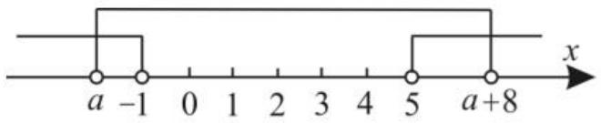

# 一、认清集合的代表元素

例 1 （1） $\forall a\in N^{*}$ ，且 $a\geqslant2$ ，集合 $A=\{y\mid y=a^{x},x\in N^{*}\},B=\{y\mid y=(a+1)x+b,x\in N^{*}\}$ ，试问在区间 $[1,a]$ 上是否存在实数 b，使 $C=A\cap B\neq\varnothing$ 。若存在，求出 b 的一切可能的取值及相应的集合 C；若不存在，请说明理由。

(2) $\forall a \in \mathbb{N}^*$ , 且 $a \geqslant 2$ , 集合 $A = \{y \mid y = a^x, x \in \mathbb{N}^*\}$ , $B = \{(x, y) \mid y = (a + 1)x + b, x \in \mathbb{N}^*\}$ , 试问在区间 $[1, a]$ 上是否存在实数 $b$ , 使 $C = A \cap B \neq \emptyset$ 。若存在, 求出 $b$ 的一切可能的取值及相应的集合 $C$ ; 若不存在, 请说明理由。

解:(1)集合 A 和 B 的代表元素不同,但它们都是数集,可以进行集合运算。

假设存在实数 $b \in [1, a]$ ，使 $C = A \cap B \neq \emptyset$ 。

设 $m \in C$ ，则 $m \in A$ 且 $m \in B$ 。又设 $m = a^{t}(t \in \mathbf{N}^{*})$ ， $m = (a + 1)s + b (s \in \mathbf{N}^{*})$ ，则 $a^{t} = (a + 1)s + b$ ，所以 $s = \frac{a^{t} - b}{a + 1} (s \in \mathbf{N}^{*})$ 。因为 $a, t, s \in \mathbf{N}^{*}$ ，且 $a \geqslant 2$ ，所以 $a^{t} - b$ 能被 $a + 1$ 整除。

①当 t=1 时， $s=\frac{a-b}{a+1}\notin N^{*}$ 。

②当 $t = 2n (n \in \mathbf{N}^{*})$ 时， $s = \frac{a^{2n} - b}{a + 1}$ ，当且仅当 $b = 1$ 时，使得 $a^{t} - b = a^{2n} - 1 = (a^{n} - 1)(a^{n} + 1)$ 能被 $a + 1$ 整除；当 $t = 2n + 1 (n \in \mathbf{N}^{*})$ 时， $s = \frac{a(a^{2n} - \frac{b}{a})}{a + 1}$ ，当且仅当 $\frac{b}{a} = 1$ ，即 $b = a$ 时，使得 $a^{t} - b = a(a^{2n} - 1) = a(a^{n} - 1)(a^{n} + 1)$ 能被 $a + 1$ 整除。

综上可知，在 $[1, a]$ 上存在实数 $b$ ，使 $C = A \cap B \neq \emptyset$ 成立。当 $b = 1$ 时， $C = \{y \mid y = a^{2x}, x \in \mathbf{N}^*\}$ ；当 $b = a$ 时， $C = \{y \mid y = a^{2x+1}, x \in \mathbf{N}^*\}$ 。

(2) 因为集合 A 是一个数集, 集合 B 是一个点集, 这两个集合无公共元素, 所以 $A \cap B = \varnothing$ , 所以不存在实数 b, 使 $C = A \cap B \neq \varnothing$ 。

评注:解决集合运算问题,先看集合的代表元素,根据它们的共同特征确定集合的本

# 集合问题常见 求解思路点拨

■李媛

质，再进行集合的运算。

# 二、重视集合元素的互异性

例 2 已知集合 $A=\{0,a\}$ , $B=\{-a^{3}, a^{5}, a^{2}-1\}$ ，且 $A \subseteq B$ ，求 a 的值。

解:由集合元素的互异性知 $a \neq 0$ ，所以 $-a^{3} \neq 0, a^{5} \neq 0$ 。

因为 $A \subseteq B$ ，所以 $a^{2}-1=0$ ，可得 $a=\pm1$ 。

当 a=1 时， $A=\{0,1\}$ ， $B=\{1,0,-1\}$ ，满足 $A\subseteq B$ ；当 a=-1 时， $A=\{0,-1\}$ ， $B=\{1,0,-1\}$ ，满足 $A\subseteq B$ 。

综上可知， $a=\pm1$ 。

评注:集合中的元素有三个特性,即无序性、确定性和互异性。同学们要注意集合元素的三个特性,特别是集合元素的互异性。

# 三、重视空集的特殊性

例 3 设集合 $A=\{x \mid x^{2}-3x+2=0\}$ ， $B=\{x \mid 2x^{2}-ax+2=0\}$ ，若 $A \cup B = A$ ，求 a 的值组成的集合。

解:由 $A=\{x \mid x^{2}-3x+2=0\}$ ，可得 $A=\{1,2\}$ 。由 $A \cup B = A$ ，可得 $B \subseteq A$ 。

当 $B = \varnothing$ 时，由 $\Delta = a^{2} - 8 < 0$ ，可得 -4 < a < 4，符合题意；

当 $1 \in B$ 时，由 $2x^{2} - ax + 2 = 0$ ，可得 $4 - a = 0$ ，即 $a = 4$ ，此时方程的解为 $x = 1$ ，符合题意；

当 $2 \in B$ 时，由 $2x^{2} - ax + 2 = 0$ ，可得 $10 - 2a = 0$ ，即 $a = 5$ ，此时方程的解为 $x = 2$ 或 $x = \frac{1}{2}$ ，不符合题意。

当 $1 \in B$ 且 $2 \in B$ 时，则 $\left\{ \begin{array}{l} 4 - a = 0, \\ 10 - 2a = 0, \end{array} \right.$ 此时无解。

综上可得，a 的值组成的集合为 $\{a \mid -4 < a \leqslant 4\}$ 。

评注:对于集合问题,当 $A \cup B = A$ 或

natural_image

Illustration of a child sitting at a desk with question marks above their head, indicating confusion or inquiry (no text or symbols present)

# 充要条件中的数学思想

# ■何静芳

数学思想是数学的精髓, 是知识转化为能力及解决数学问题的桥梁。为了提高同学们的数学思维能力, 下面举例说明充要条件中的数学思想, 供大家学习与参考。

# 一、函数与方程思想

函数与方程思想是通过建立函数与方程的关系,把所研究的问题转化为讨论函数与方程的有关性质,从而达到解决问题的目的。

例 1 求证: 关于 x 的方程 $x^{2} + bx + 1 = 0$ 有两个负实根的充要条件是 $b \geqslant 2$ 。

证明:(充分性)由 $b \geqslant 2$ , 可得 $\Delta = b^{2} - 4 \geqslant 0$ , 可知方程 $x^{2} + bx + 1 = 0$ 有实根。设两根分别为 $x_{1}, x_{2}$ , 由一元二次方程根与系数的关系得 $x_{1}x_{2} = 1 > 0$ , 所以两根 $x_{1}, x_{2}$ 同号。由 $x_{1} + x_{2} = -b \leqslant -2 < 0$ , 可得两根 $x_{1}, x_{2}$ 均为负数, 所以方程 $x^{2} + bx + 1 = 0$ 有两$A \cap B = B$ 时, 一定要注意 $B$ 为空集的情况, 否则容易造成错解。

# 四、等价转化思想的运用

例 4 设集合 $U=\{(x,y)\mid x\in\mathbf{R},y\in\mathbf{R}\}$ ， $A=\{(x,y)\mid2x+y-m>0\}$ ， $B=\{(x,y)\mid x-y-n\leqslant0\}$ ，点 $P(2,3)\in A\cap(\complement_{U}B)$ ，求 m,n 的取值范围。

解: 点 $P(2,3) \in A \cap (\complement_{U} B)$ 等价于点 $P(2,3) \in A$ 且点 $P(2,3) \in \complement_{U} B$ ，即点 $P(2,3) \in A$ 且点 $P(2,3) \notin B$ 。

将点 $P(2,3)$ 代入 $2x + y - m > 0$ ，可得 $m < 7$ 。

由 $\complement_{U}B = \{(x,y)|x - y - n > 0\}$ ，可将点 $P(2,3)$ 代入 $x - y - n > 0$ ，解得 $n <   - 1$ 。

故 $m, n$ 的取值范围分别为 $(- \infty, 7)$ , $(- \infty, -1)$ 。

评注:若先求出集合 $A \cap (\complement_{U} B)$ ，再将点 $P(2,3)$ 代入，则解题显然受阻。这里运用等价转化思想解题，但要注意转化的等价性。

个负实根的充分条件是 $b \geqslant 2$ 。

(必要性)由方程 $x^{2}+bx+1=0$ 有两个负实根 $x_{1}, x_{2}$ ，且 $x_{1}x_{2}=1$ ，可得 $\Delta=b^{2}-4\geqslant0$ 且 $x_{1}+x_{2}=-b<0$ ，所以 $b\geqslant2$ ，所以方程 $x^{2}+bx+1=0$ 有两个负实根的必要条件是 $b\geqslant2$ 。

综上可得,方程 $x^{2}+bx+1=0$ 有两个负实根的充要条件是 $b\geqslant2$ 。

点评:证明充要条件关键是要弄清充分性是由条件推结论,必要性是由结论推条件。

# 二、转化与化归思想

转化与化归思想是在遇到一些直接求解较为困难的问题时,通过观察、分析、类比、联想等思维过程,将原问题转化为一个新问题(相对来说,比较熟悉的问题),通过求解新问题,达到解决原问题的目的。

# 五、数形结合思想的运用

例 5 已知集合 $A = \{x \mid x > 5$ 或 $x < -1\}$ , $B = \{x \mid a < x < a + 8\}$ , 若 $A \cup B = \mathbf{R}$ , 则实数 $a$ 的取值集合是（ ）。

A. $\{a \mid -3 < a < -1\}$

B. $\{a \mid 1 < a < 2\}$

C. $\{a\mid -3\leqslant a\leqslant -1\}$

D. $\{a\mid 1\leqslant a\leqslant 2\}$

解:由题意画出数轴,如图1所示。

  
图1

要使 $A \cup B = \mathbf{R}$ , 需满足 $\left\{ \begin{array}{l} a + 8 > 5, \\ a < -1, \end{array} \right.$ 解得 $-3 < a < -1$ 。应选 A。

评注:数轴是求解集合问题的直观工具,对于涉及含参数不等式的集合问题,常常借助数轴来解决。

作者单位:辽宁省大连市瓦房店市实验高级中学

(责任编辑 王琼霞)