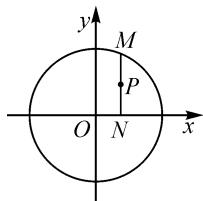

# “参数方程”的高三数学第一轮专题复习课例

# 上海市南汇第一中学 杨玉灿

摘要：“参数方程”是高中数学理科的重点内容，也是理科数学高考的考查内容之一；考试题目出现在试卷第22题（选做题），分值为10分。高考考查的知识点主要包括直线、圆和椭圆的参数方程，在第一轮复习时，要研究高考命题的难度和类型，有针对性地展开复习。

关键词: 参数方程; 高三数学; 第一轮复习; 课例

# 1 考点分析

参数方程是理科数学选修 4-4 的内容,主要包括:参数方程的概念、直线的参数方程、圆的参数方程、椭圆的参数方程等.同时,参数方程也是高考数学理科考查的内容,题目出现在高考试卷的第 22 题.笔者对新疆 2018 年至 2022 年高考数学试卷中有关“坐标系与参数方程”考查的知识点列表(表 1)统计如下:

表 1

<table><tr><td>年份</td><td>题号</td><td>分值</td><td>考查的知识点</td><td>考试内容</td></tr><tr><td>2018</td><td>22</td><td>10</td><td>直线的参数方程和椭圆的参数方程</td><td>12</td></tr><tr><td>2019</td><td>22</td><td>10</td><td>圆的参数方程</td><td>2</td></tr><tr><td>2020</td><td>22</td><td>10</td><td>圆和双曲线的参数方程</td><td>24</td></tr><tr><td>2021</td><td>22</td><td>10</td><td>圆的参数方程</td><td>2</td></tr><tr><td>2022</td><td>22</td><td>10</td><td>抛物线的参数方程(一段)</td><td>5</td></tr></table>

备注:①直线的参数方程;②圆的参数方程;③椭圆的参数方程;④双曲线的参数方程;⑤抛物线的参数方程.

新疆高考所用的试卷为新课标全国卷Ⅱ或全国乙卷.笔者研究了近五年的高考理科数学试卷第22题(1)(2)，其中(1)考查曲线(包括直线)的参数方程，(2)考查曲线的极坐标方程.通过2018年至2022年五年的考卷，分析试卷的命题方向及其解题类型与方法，旨在为加高三第一轮复习提供帮助.

# 2 题型总结

在高三第一轮复习这部分内容时,一方面要了解参数的几何意义,另一方面还要掌握参数方程的形式及其基本应用.笔者根据自己多年的教学经验,总结出参数方程的基本应用有如下6种类型,仅供读者参考.

# 2.1 类型 1: 参数方程与普通方程的互化

例 1 填空(参数方程化为普通方程):

(1)曲线 $C_1: \begin{cases} x = 4\cos \theta, \\ y = 4\sin \theta \end{cases}$ ( $\theta$ 为参数)的普通方程

为\_\_\_\_；

(2)曲线 $C_{2}:\left\{\begin{aligned}x=t+\frac{1}{t},\\ y=t-\frac{1}{t}\end{aligned}\right.$ (t 为参数)的普通方程为 \_\_\_\_.

分析:本题为2020年高考第22题的改编,直接消去参数即可得普通方程.

解析:(1)曲线 $C_{1}:\left\{\begin{aligned}x=4\cos\theta,\\ y=4\sin\theta\end{aligned}\right.$ ( $\theta$ 为参数)方程组中的两个式子两边平方后相加,得 $x^{2}+y^{2}=16$ , 即曲线 $C_{1}$ 的普通方程.

(2) 曲线 $C_{2}:\left\{\begin{aligned}x &= t + \frac{1}{t},\\ y &= t - \frac{1}{t}\end{aligned}\right.$ (t 为参数) 中的两个式子两边平方后相减，得 $x^{2} - y^{2} = 4$ ，即曲线 $C_{2}$ 的普通方程.

例 2 把下列的普通方程化为参数方程：

(1) $x^{2}+y^{2}=9;$   
(2) $\frac{x^{2}}{a^{2}}+\frac{y^{2}}{b^{2}}=1(a>b>0).$

解析:(1)曲线 $C_{1}:\begin{cases}x=3\cos\alpha,\\y=3\sin\alpha\end{cases}$ ( $\alpha$ 为参数).

(2) 曲线 $C_{2}:\left\{\begin{aligned}x&=a\cos\alpha,\\ y&=b\sin\alpha\end{aligned}\right.$ (a>b>0, $\alpha$ 为参数).

点评:参数方程与普通方程两种形式的互化体现了等价转化的数学思想.

# 2.2 类型 2: 求直线与曲线的参数方程

例 3 如图 1, 设 O 为坐标原点, M 是圆 $O: x^{2} + y^{2} = 1$ 上的任意一点, 过点 M 作 x 轴的垂线, 垂足为 N, 试求线段 MN 中点 P 的轨迹的参数方程, 并指出它是什么曲线.

text_image

y
M
P
O N x

图1

分析:本题可以利用求曲线方程的“五步法”求出

曲线的参数方程.

解析: 设 $P(x, y)$ , $M(x_{0}, y_{0})$ ，则 $N(x_{0}, 0)$ . 由点 P 为线段 MN 的中点，可得 $\left\{\begin{aligned} x &= x_{0}, \\ y &= \frac{y_{0}}{2}. \end{aligned}\right.$

因为 M 是圆 O 上的任意一点，又圆 $O: x^{2} + y^{2} = 1$ 的参数方程为 $\left\{\begin{aligned} x &= \cos \theta, \\ y &= \sin \theta \end{aligned}\right.$ ( $\theta$ 为参数)，所以 $\left\{\begin{aligned} x_{0} &= \cos \theta, \\ y_{0} &= \sin \theta. \end{aligned}\right.$

所以点 P 的参数方程为 $\left\{\begin{aligned} x &= \cos \theta, \\ y &= \frac{1}{2} \sin \theta \end{aligned}\right.$ ( $\theta$ 为参数)，普通方程为 $x^{2} + 4y^{2} = 1$ ，点 P 的轨迹为焦点在 x 轴上的椭圆.

点评:本题是求曲线的参数方程,结合所给的图形,设出参数 $\theta$ ,建立关于参数 $\theta$ 的方程,体现了数形结合的数学思想.

# 2.3 类型 3: 利用参数方程解决函数的最值问题

例 4 已知实数 x, y 满足 $(x-2)^{2}+(y-1)^{2}=1$ ，试求：(1) $S=x+y$ 的最值；(2) $T=x^{2}+y^{2}$ 的最值.

解析:(1)将 $(x-2)^{2}+(y-1)^{2}=1$ 化为参数方程 $\left\{\begin{aligned}x&=2+\cos\alpha,\\ y&=1+\sin\alpha\end{aligned}\right.$ ( $\alpha$ 为参数, $\alpha\in[0,2\pi)$ ),代入S=x+y,得

$$
\begin{array}{l} S = (2 + \cos \alpha) + (1 + \sin \alpha) \\ = 3 + \sqrt {2} \sin \left(\alpha + \frac {\pi}{4}\right). \\ \end{array}
$$

所以，当 $\alpha=\frac{\pi}{4}$ 时，S 取得最大值 $3+\sqrt{2}$ ；当 $\alpha=\frac{5\pi}{4}$ 时，S 取得最小值 $3-\sqrt{2}$ .

(2)结合(1)中的参数方程,得

$$
\begin{array}{l} T = x ^ {2} + y ^ {2} \\ = (2 + \cos \alpha) ^ {2} + (1 + \sin \alpha) ^ {2} \\ = 6 + 2 \sqrt {5} \sin (\alpha + \varphi). \\ \end{array}
$$

由于 $\tan \varphi = 2$ ，因此当 $\sin \alpha = \frac{\sqrt{5}}{5},\cos \alpha = \frac{2\sqrt{5}}{5}$ 时， $T$ 取得最大值 $6 + 2\sqrt{5}$ ，当 $\sin \alpha = -\frac{\sqrt{5}}{5},\cos \alpha = -\frac{2\sqrt{5}}{5}$ 时， $T$ 取得最小值 $6 - 2\sqrt{5}$

点评:本题是利用圆的参数方程,通过“三角换元”转化为三角函数的最值问题.这也是我们求最值常用的三角换元法.对于(2)也可以用“几何法”求解,式子 $x^{2}+y^{2}$ 的几何意义是原点到圆 $(x-2)^{2}+(y-1)^{2}=1$ 上点的距离的平方.

# 2.4 类型 4: 利用参数方程解决曲线上的点到直线距离的最值问题

例 5 在椭圆 $C: \frac{x^{2}}{9} + \frac{y^{2}}{4} = 1$ 上求一点 M，使其到直线 $l: x + 2y - 10 = 0$ 的距离最短，并求出这个最短

距离.

解析: 利用椭圆 C 的参数方程可设点 M 的坐标为 $(3\cos \alpha, 2\sin \alpha)$ ，则点 M 到直线 l 的距离

$$
d = \frac {\left| 3 \cos \alpha + 4 \sin \alpha - 1 0 \right|}{\sqrt {5}} = \sqrt {5} | \sin (\alpha + \varphi) - 2 |.
$$

当 $\sin(\alpha+\varphi)=1$ 时，点 M 到直线 l 的距离最短。由于 $\tan\varphi=\frac{3}{4}$ ，因此 $\sin\alpha=\frac{4}{5}$ ， $\cos\alpha=\frac{3}{5}$ 时，点 $M\left(\frac{9}{5},\frac{8}{5}\right)$ ，最短距离为 $\sqrt{5}$ 。

点评:先把椭圆的普通方程化为参数方程,再把点M到直线l的距离转化为关于参数的三角函数的最值问题.本题也可以采用平移相切法来处理.本题采用三角换元法解题,体现了数学的化归思想.

# 2.5 类型 5: 利用参数方程解决弦长问题

例6 求直线 $C_1: \begin{cases} x = 1 + t\cos 60^\circ, \\ y = t\sin 60^\circ \end{cases}$ (t 为参数) 被圆 $C_2: x^2 + y^2 = 1$ 所截得的弦长.

解析: 将直线 $C_{1}:\left\{\begin{aligned}x&=1+t\cos60^{\circ},\\ y&=t\sin60^{\circ}\end{aligned}\right.$ (t为参数)代入 $x^{2}+y^{2}=1$ ，整理，得 $t^{2}+t=0$ ，解得 $t_{1}=0,t_{2}=-1$ 。所以，截得的弦长为 $\left|t_{2}-t_{1}\right|=1$ 。

点评:根据参数 t 的几何意义, $|t|$ 为直线上的点到点(1,0)的距离,可知 $|t_{2}-t_{1}|$ 为直线被圆截得的弦长.

# 2.6 类型 6: 曲线(包括直线)的参数方程的综合性应用问题

例 7 已知曲线 C 的参数方程为 $\left\{\begin{aligned} x &= 1 + 2t \\ y &= at^{2} \end{aligned}\right.$ ，(其中 t 为参数， $a \in R$ )，点 $M(5,4)$ 在曲线 C 上.

(1)求常数 a 的值; (2)写出曲线 C 的普通方程.

解析:(1)曲线 C 的参数方程 $\left\{\begin{aligned}x&=1+2t,\\ y&=at^{2}\end{aligned}\right.$ (t 为参数) 可化为普通方程 $4y=a(x-1)^{2}$ .

由点 $M(5,4)$ 在曲线 C 上，得 $4 \times 4 = a (5 - 1)^{2}$ ，即 a = 1.

(2)由(1)知,曲线 C 的普通方程为 $(x-1)^{2}=4y$ .

例8 已知直线 $C_1: \begin{cases} x = 1 + t\cos \alpha, \\ y = t\sin \alpha \end{cases}$ （ $t$ 为参数），圆 $C_2: \begin{cases} x = \cos \theta, \\ y = \sin \theta \end{cases}$ （ $\theta$ 为参数）.

(1) 当 $\alpha = \frac{\pi}{3}$ 时, 求 $C_1$ 与 $C_2$ 的交点的直角坐标;

(2) 过原点 O 作直线 $C_{1}$ 的垂线, 垂足为 A, P 为 OA 的中点, 当角 $\alpha$ 发生变化时, 试求动点 P 的轨迹.

解析:(1)当 $\alpha=\frac{\pi}{3}$ 时, 可得直线 $C_{1}$ 的普通方程 $y=\sqrt{3}(x-1)$ . 圆 $C_{2}:\left\{\begin{aligned}&x=\cos\theta,\\ &y=\sin\theta\end{aligned}\right.$ ( $\theta$ 为参数) 的普通方

程为 $x^{2}+y^{2}=1$ .

由 $\left\{\begin{aligned}x^{2}+y^{2}=1,\\ y=\sqrt{3}(x-1)\end{aligned}\right.$ ，解得 $\left\{\begin{aligned}x_{1}&=\frac{1}{2},\\ y_{1}&=-\frac{\sqrt{3}}{2},\end{aligned}\right.$ 或 $\left\{\begin{aligned}x_{2}&=1,\\ y_{2}&=0.\end{aligned}\right.$ 所以 $C_{1}$ 与 $C_{2}$ 的交点坐标为 $\left(\frac{1}{2}, -\frac{\sqrt{3}}{2}\right)$ 和 $(1,0)$ .

(2) 因为 $C_{1}$ 的普通方程为

$$
x \sin \alpha - y \cos \alpha - \sin \alpha = 0, \tag {①}
$$

所以过坐标原点且垂直于 $C_{1}$ 的直线方程为

$$
x \cos \alpha + y \sin \alpha = 0. \tag {②}
$$

联立①②，可得 $A(\sin^{2}\alpha, -\sin\alpha\cos\alpha)$ .

当角 $\alpha$ 发生变化时, 点 P 的轨迹的参数方程为

$$
\left\{ \begin{array}{l} x = \frac {1}{2} \sin^ {2} \alpha , \\ y = - \frac {1}{2} \sin \alpha \cos \alpha \end{array} (\alpha \text {为参数}). \right.
$$

消去参数 $\alpha$ ，可得点 P 的轨迹的普通方程

$$
\left(x - \frac {1}{4}\right) ^ {2} + y ^ {2} = \frac {1}{1 6}.
$$

故点 P 的轨迹是圆心为 $\left(\frac{1}{4},0\right)$ ，半径为 $\frac{1}{4}$ 的圆.

点评:本题考查了直线与圆的参数方程以及直线与圆的位置关系.

# 3 结束语

本课例列举了参数方程的六种题型,通过本节课的教学,帮助学生厘清参数方程的题型特征与解题方法,学会分析与思考解参数方程相关问题的通性与通法.本文中根据近五年高考第22题列表统计与分析,帮助老师和学生了解高考有关参数方程命题的方向,另外,通过对这些题型的探究与解析,帮助学生学会分析其他数学难题,拓展参数方程的应用范围.由于“参数方程”在高考数学中特殊而重要的地位,因此在第一轮复习时,要研究高考命题的难度和类型,从而有针对性地进行第一轮复习,且要注意复习的实效性,切实让学生弄懂学会,在应对高考或“模考”时,信心满满,游刃有余!并在此过程中培养学生的数学运算与逻辑推理等核心数学素养.Z

# (上接第82页)

# 4 推广探究

推广 1 已知椭圆 $C: \frac{x^{2}}{a^{2}} + \frac{y^{2}}{b^{2}} = 1 (a > b > 0)$ ， $A(-a, 0)$ ，过点 $D(-a, b)$ 的直线交椭圆于 P, Q 两点，直线 AP, AQ 和 y 轴分别交于点 M, N，则直线 MN 的中点恒为 $(0, b)$ .

推广 2 （横向推广）已知椭圆 $C: \frac{x^{2}}{a^{2}} + \frac{y^{2}}{b^{2}} = 1$ $(a > b > 0)$ , $A(-a, 0)$ ，过直线 x = -a 上任一点 D （非点 A）作椭圆的两条切线切于点 A, B，过点 D 作一条直线交椭圆于 P, Q 两点，设直线 AB, AP, AQ 的斜率分别为 $k_{0}, k_{1}, k_{2}$ ，则 $k_{1} + k_{2} = 2k_{0}$ .

推广3（纵向推广）已知双曲线 $E: \frac{x^2}{a^2} - \frac{y^2}{b^2} = 1$ $(a > 0, b > 0)$ , $A(-a, 0)$ , 过直线 $x = -a$ 上任一点 $D$ (非点 $A$ ) 作双曲线的两条切线切于点 $A, B$ , 过点 $D$ 作一条直线交双曲线于 $P, Q$ 两点, 设直线 $AB, AP, AQ$ 的斜率分别为 $k_0, k_1, k_2$ , 则 $k_1 + k_2 = 2k_0$ .

推广 4 （纵向推广）已知抛物线方程： $y^{2}=2px$ (p>0)，A 为坐标原点，过 y 轴上任一点 D（非点 A）作抛物线的两条切线切于点 A，B，过点 D 作一条直线交抛物线于 P，Q 两点，设直线 AB，AP，AQ 的斜率分别为 $k_{0}$ ， $k_{1}$ ， $k_{2}$ ，则 $k_{1}+k_{2}=2k_{0}$ 。

# 5 结束语

通过上述多角度探究、思考与推广探究，真题本质也逐渐被揭开，同时，也启示我们在日常教学中要抓住问题的本质。教师在教学中可以适当补充一些一类问题的本源，尤其是经常作为高考真题的命制背景问题；学生也可以适当总结问题的本质，从而提高核心素养，提高数学解题能力。

# 参考文献：

[1]周威.探讨高观点下试题命制 提升教师专业素养——从极点极线视角下两道模考题的演变探究与改编谈起[J].中学教研(数学),2021(2):33-36.  
[2] 李鸿昌. 二次曲线系在圆锥曲线四点共圆问题中的应用 [J]. 数理化解题研究, 2022(7): 92-94. Z