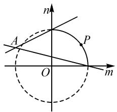

# 一道三角最值题的破解与拓展探究

# 浙江省杭州市萧山区第三高级中学 傅小燕

三角函数的最值或取值范围等综合问题,一直是高考中三角函数知识模块的重点与难点之一,可以很好融合三角函数的基本概念、基本公式、三角函数的图象与性质等,以及函数与方程、函数与导数、不等式及其应用等相关知识,思维视角多样,方法技巧多变,是全面考查数学“四基”与数学能力、展示知识交汇与体现方法多样性的一个重要场所,倍受各方关注.

# 1 问题呈现

问题（湖北省武汉市武昌区2023届高三年级5月质量检测数学试卷·14）已知函数 $f(x) = \frac{1 + \sin x}{2\cos x + \sin x}, x \in \left[0, \frac{\pi}{2}\right]$ ，则函数 $f(x)$ 的最小值为 \_\_\_\_.

根据题设条件中三角函数解析式的结构特征,往往可以从三角函数思维、解析几何思维以及函数与导数思维等切入,结合不同的数学思维与技巧策略,以及三角函数的基本知识与基本方法等的分析与应用,呈现精彩纷呈、灵活多变的技巧方法.在此题设条件下,巧妙变式拓展,达到“一题多思”与“一题多变”,实现“一题多得”的目的.

# 2 问题破解

# 2.1 三角函数思维

方法 1: 二倍角公式法.

解析:依题意,结合三角函数中的二倍角公式有

$$
\begin{array}{l} f (x) = \frac {1 + \sin x}{2 \cos x + \sin x} \\ = \frac {\sin^ {2} \frac {x}{2} + 2 \sin \frac {x}{2} \cos \frac {x}{2} + \cos^ {2} \frac {x}{2}}{2 \cos^ {2} \frac {x}{2} - 2 \sin^ {2} \frac {x}{2} + 2 \sin \frac {x}{2} \cos \frac {x}{2}} \\ = \frac {\tan^ {2} \frac {x}{2} + 2 \tan \frac {x}{2} + 1}{2 - 2 \tan^ {2} \frac {x}{2} + 2 \tan \frac {x}{2}}. \\ \end{array}
$$

令 $\tan \frac{x}{2} = t \in [0,1]$ , 则有

$$
y = g (t) = - \frac {1}{2} \times \frac {t ^ {2} + 2 t + 1}{t ^ {2} - t - 1} = - \frac {1}{2} \times \frac {(t + 1) ^ {2}}{t ^ {2} - (t + 1)} =
$$

$$
- \frac {1}{2} \times \frac {1}{\left(\frac {1}{t + 1}\right) ^ {2} - \frac {3}{t + 1} + 1} = - \frac {1}{2} \times \frac {1}{\left(\frac {1}{t + 1} - \frac {3}{2}\right) ^ {2} - \frac {5}{4}}.
$$

当 t=0 时, $g(t)$ 有最小值 $\frac{1}{2}$ , 所以函数 $f(x)$ 的最小值为 $\frac{1}{2}$ . 故填答案: $\frac{1}{2}$ .

方法 2: 万能公式法.

解析:依题意,结合三角函数中的万能公式有

$$
\begin{array}{l} f (x) = \frac {1 + \sin x}{2 \cos x + \sin x} \\ 1 + \frac {2 \tan \frac {x}{2}}{1 + \tan^ {2} \frac {x}{2}} \\ 2 \times \frac {1 - \tan^ {2} \frac {x}{2}}{1 + \tan^ {2} \frac {x}{2}} + \frac {2 \tan \frac {x}{2}}{1 + \tan^ {2} \frac {x}{2}} \\ = \frac {\tan^ {2} \frac {x}{2} + 2 \tan \frac {x}{2} + 1}{2 - 2 \tan^ {2} \frac {x}{2} + 2 \tan \frac {x}{2}}. \\ \end{array}
$$

接下来部分同方法1.

解后反思: 回归三角函数本质, 利用三角函数思维, 借助三角恒等变换中的二倍角公式或万能公式转化对应的关系式, 进而利用二次函数确定相应的最值问题. 三角函数思维是最本能的一种思维方式, 借助三角函数思维来分析与处理, 公式变形与数学运算比较繁杂, 确有一定的难度.

# 2.2 解析几何思维

方法 3: 数形结合法.

解析:依题意,得 $f(x)=\frac{1}{1+2\times\frac{\cos x-\frac{1}{2}}{\sin x+1}}$ .

而代数式 $\frac{\cos x - \frac{1}{2}}{\sin x + 1}$ 表示的是平面直角坐标系 $mOn$ 中定点 $A\left(-1, \frac{1}{2}\right)$ 与动点 $P(\sin x, \cos x)$ 的连线的斜率，动点 $P$ 在单位圆 $m^2 + n^2 = 1$ 上运动，且满足$m, n \in [0,1]$ , 如图 1 所示. 数形结合可知, 当动点 $P$ 的坐标为 $(0,1)$ 时, 直线 $PA$ 的斜率取得最大值,此时代数式 $\frac{\cos x-\frac{1}{2}}{\sin x+1}$ 的最大值为 $\frac{1-\frac{1}{2}}{0+1}=\frac{1}{2}$ ，从而 $f(x)$ 取得最小值 $\frac{1}{2}$ .

故填答案: $\frac{1}{2}$ .

text_image

n
A
P
O
m

图1

解后反思:结合分式型函数的最值情境,合理联想到直线的斜率模型,利用解析几何思维加以数形结合,直观分析,是解决此类问题中比较常用的一种方法.在数形结合直观处理此类问题时,要注意对分式型函数进行必要的变形与转化,并确定变量的取值范围,这样“数”与“形”之间才能实现无缝链接.

# 2.3 导数思维

方法 4: 导数法.

解析:依题意,得 $f'(x)=\frac{2\sin x-\cos x+2}{(2\cos x+\sin x)^{2}}$ .

由 $x \in \left[0, \frac{\pi}{2}\right]$ , 可得 $f'(x) > 0$ .

所以，函数 $f(x)$ 在区间 $\left[0, \frac{\pi}{2}\right]$ 上单调递增，则有 $f(x)_{\min} = f(0) = \frac{1 + \sin 0}{2\cos 0 + \sin 0} = \frac{1}{2}$ .

所以函数 $f(x)$ 的最小值为 $\frac{1}{2}$ . 故填答案: $\frac{1}{2}$ .

解后反思: 回归本源, 三角函数作为函数中的一种特殊类型, 涉及最值问题的求解往往都可以利用导数思维. 借助函数求导处理来确定函数的单调性, 是破解此类问题中的一种“巧技妙法”. 利用导数思维解决最值问题时, 思维比较常规, 步骤比较熟悉, 问题的解决更加简单快捷.

# 3 变式拓展

# 3.1 同阶变形

保留题设条件中自变量的范围,改变设问方式来合理变式.

变式 1 已知函数 $f(x)=\frac{1+\sin x}{2\cos x+\sin x}, x \in \left[0, \frac{\pi}{2}\right]$ ，则函数 $f(x)$ 的最大值为 \_\_\_\_.

变式2 已知函数 $f(x) = \frac{1 + \sin x}{2\cos x + \sin x}, x \in$

$\left[0, \frac{\pi}{2}\right]$ , 则函数 $f(x)$ 的取值范围为 \_\_\_\_.

# 3.2 高阶变形

保留题设条件中的函数解析式,取消对自变量范围的限制,实现问题的综合变式.

变式 3 已知函数 $f(x)=\frac{1+\sin x}{2\cos x+\sin x}$ ，则函数 $f(x)$ 的取值范围为 \_\_\_\_.

解析: 待定系数法.

令 $\frac{1+\sin x}{2\cos x+\sin x}=t$ ，整理可得

$$
(t - 1) \sin x + 2 t \cos x = 1.
$$

根据辅助角公式,可得

$1=(t-1)\sin x+2t\cos x=\sqrt{(t-1)^{2}+(2t)^{2}}\cdot\sin(x+\varphi)\leqslant\sqrt{(t-1)^{2}+(2t)^{2}}=\sqrt{5t^{2}-2t+1}$ ，即 $\sqrt{5t^{2}-2t+1}\geqslant1$ ，解得 $t\leqslant0$ ，或 $t\geqslant\frac{2}{5}$ 。所以函数 $f(x)$ 的取值范围为 $(-∞,0]∪\left[\frac{2}{5},+∞\right)$ 。

故填答案: $(-∞,0]∪\left[\frac{2}{5},+∞\right)$ .

# 4 教学启示

# 4.1 不同思维切入,技巧方法对比

在解决此类涉及给定区间的三角函数关系式的取值范围(或最值)问题时,回归三角函数思维是破解问题中最为常用的技巧方法,利用三角恒等变换公式加以转化与应用,合理变形成一个可以判断范围的三角关系式来求解;借助三角函数关系式的结构特征,合理构建与之相吻合的模型——直线的斜率公式,是利用解析几何思维解决问题的关键;而回归函数的本质,利用导数思维来解决对应函数的取值范围(或最值),是解决此类函数问题中最为基本的一种方法,有时只是运算量比较大而已.不同的思维视角与技巧方法,各有各的特点,可以结合自身的理解与掌握情况来合理选择与巧妙应用.

# 4.2 倡导“一题多解”，开拓“一题多变”

涉及三角函数的最值或取值范围等综合应用问题,体现了多知识模块之间的交汇与融合.通过多知识交汇应用,结合多思维视角切入,实现多技巧方法破解,并加以深入分析、挖掘、探究,达到“一题多思”“一题多解”的目的.在此基础上加以不断提升,实现“一题多变”“一题多拓”“一题多得”等,充分复习、巩固、总结数学相关知识和数学思想方法等,全面考查学生的数学思想与数学能力,为学生养成良好的思维习惯、优良的数学品质以及数学核心素养等方面都做了有益的尝试.Z