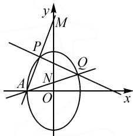
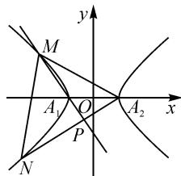
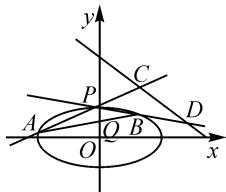

# 不平移齐次化方法在圆锥曲线问题中的应用

# ● 浙江省杭州学军中学海创园校区 陶勇胜 徐小芳

圆锥曲线问题,由于其侧重考查学生的数学运算、逻辑推理、直观想象等核心素养,是高考数学中一个重要的考点,其中一类以直线的斜率之和或者之积为背景的圆锥曲线问题更是近几年高考中考查的热点.运用平移齐次化方法求解圆锥曲线问题,具有简化计算、提高解题效率的作用,但此法需要平移圆锥曲线或者平移整个坐标系,因此,先要重新绘制图形,且在计算过程中需要左、右或者上、下平移,计算结束后再平移回原来位置,实际书写也有很多不便.正因为上述不便,所以对平移齐次化方法进行改进显得很有意义且很有必要.如果不平移圆锥曲线或者不平移整个坐标系而直接采用齐次化方法,是否可以解决这类圆锥曲线问题?本文中先用不平移齐次化方法对几个常见的模型进行推导,然后总结该方法的一般步骤和适用范围,并运用该方法探究2022年和2023年圆锥曲线高考题,以期优化解决此类问题的思维策略.

# 1 探究不平移齐次化方法

引例 已知 $A(x_{0}, y_{0})$ 是椭圆 $E: \frac{x^{2}}{a^{2}} + \frac{y^{2}}{b^{2}} = 1$ $(a > b > 0)$ 上一个定点， $B(x_{1}, y_{1}), C(x_{2}, y_{2})$ 是椭圆上异于 A 的两点，可得以下性质：

性质 1: 若 $k_{AB} + k_{AC} = \lambda$ ，则当 $\lambda \neq 0$ 时，直线 BC 过定点 $\left(x_{0} - \frac{2y_{0}}{\lambda}, -y_{0} - \frac{2x_{0}b^{2}}{\lambda a^{2}}\right)$ ；当 $\lambda = 0$ 时，则直线 BC 的斜率为定值 $\frac{x_{0}b^{2}}{y_{0}a^{2}}$ .

性质 2: 若 $k_{AB} \cdot k_{AC} = \lambda (\lambda \neq 0)$ ，则当 $\lambda \neq \frac{b^{2}}{a^{2}}$ 时，直线 BC 过定点 $\left(\frac{\lambda a^{2} + b^{2}}{\lambda a^{2} - b^{2}} x_{0}, -\frac{\lambda a^{2} + b^{2}}{\lambda a^{2} - b^{2}} y_{0}\right)$ ；当 $\lambda = \frac{b^{2}}{a^{2}}$ 时，直线 BC 的斜率为定值 $-\frac{y_{0}}{x_{0}}$ .

下面用不平移齐次化方法进行证明.

证明：将椭圆 $E: \frac{x^2}{a^2} + \frac{y^2}{b^2} = 1$ 等价变形为 $\frac{(x - x_0)^2}{a^2} + \frac{(y - y_0)^2}{b^2} + 2\left(\frac{x_0}{a^2} x + \frac{y_0}{b^2} y - 1\right) = 0.$ 设直线 $BC$ 的方程为 $m(x - x_0) + n(y - y_0) = 1$ ，将椭圆 $E$ 和直线 $BC$ 的方程联立，得到 $a^2(1 + 2y_0n)(y - y_0)^2 + 2(b^2x_0n + a^2y_0m)(x - x_0)(y - y_0) + b^2(1 + 2x_0m)\cdot$

$$
(x - x _ {0}) ^ {2} = 0.
$$

将上式两边同时除以 $(x-x_{0})^{2}$ ，得到 $a^{2}(1+2y_{0}n)\cdot$

$$
\left(\frac {y - y _ {0}}{x - x _ {0}}\right) ^ {2} + 2 \left(b ^ {2} x _ {0} n + a ^ {2} y _ {0} m\right) \left(\frac {y - y _ {0}}{x - x _ {0}}\right) + b ^ {2} \cdot
$$

$(1+2x_{0}m)=0$ ，从而 $k_{AB}+k_{AC}=\frac{y_{1}-y_{0}}{x_{1}-x_{0}}+\frac{y_{2}-y_{0}}{x_{2}-x_{0}}=$

$$
- \frac {2 (b ^ {2} x _ {0} n + a ^ {2} y _ {0} m)}{a ^ {2} (1 + 2 y _ {0} n)}, k _ {A B} \cdot k _ {A C} = \frac {y _ {1} - y _ {0}}{x _ {1} - x _ {0}} \cdot \frac {y _ {2} - y _ {0}}{x _ {2} - x _ {0}} =
$$

$$
\frac {b ^ {2} \left(1 + 2 x _ {0} m\right)}{a ^ {2} \left(1 + 2 y _ {0} n\right)}.
$$

若 $k_{AB} + k_{AC} = \lambda (\lambda \neq 0)$ ，则 $-\frac{2(b^2x_0n + a^2y_0m)}{a^2(1 + 2y_0n)} =$ $\lambda$ ，化简得到 $-\frac{2y_0}{\lambda} m - \left(\frac{2b^2x_0}{\lambda a^2} +2y_0\right)n = 1$ ，直线BC过定点 $\left(x_0 - \frac{2y_0}{\lambda}, - y_0 - \frac{2x_0b^2}{\lambda a^2}\right).$

当 $\lambda=0$ 时，有 $k_{1}+k_{2}=-\frac{2(b^{2}x_{0}n+a^{2}y_{0}m)}{a^{2}(1+2y_{0}n)}=0$ ，即 $b^{2}x_{0}n+a^{2}y_{0}m=0$ ，此时，直线 BC 的斜率 $k_{BC}=-\frac{m}{n}=\frac{x_{0}b^{2}}{y_{0}a^{2}}$ .

点评:(1)不平移齐次化方法是一种根据定点的坐标,先分析斜率之和或之积的最终表示形式,再等价变形椭圆方程及构造直线方程,将二者联立之后,由韦达定理得到斜率之和或之积的形式.与平移齐次化方法相比,减少了左右、上下平移,解答过程简捷,书写方便且易理解.

(2)通过上述推导,以椭圆 $\frac{x^{2}}{a^{2}}+\frac{y^{2}}{b^{2}}=1(a>b>0)$ 为例,可归纳不平移齐次化方法步骤如下:

①根据定点的坐标 $A(x_0, y_0)$ ，将椭圆方程等价变形为 $\frac{[(x - x_0) + x_0]^2}{a^2} + \frac{[(y - y_0) + y_0]^2}{b^2} = 1$ ；

②构造直线方程 $m(x-x_{0})+n(y-y_{0})=1$ ;

③建立关于椭圆和直线方程的方程组,由韦达定理得到斜率之和的表示形式 $\frac{y_{1}-y_{0}}{x_{1}-x_{0}}+\frac{y_{2}-y_{0}}{x_{2}-x_{0}}$ 或之积的表示形式 $\frac{y_{1}-y_{0}}{x_{1}-x_{0}}\cdot\frac{y_{2}-y_{0}}{x_{2}-x_{0}}$ .

(3)不平移齐次化适用于已知定点的坐标及斜率之和或之积为定值,但不仅限于此(如例3).

(4) 性质 2 的证明可以仿照性质 1 的证明过程.

# 2 不平移齐次化方法在圆锥曲线中的应用

# 2.1 利用不平移齐次化方法求定点

例 1 （2023·全国数学理科乙卷第 20 题）已知椭圆 $C: \frac{y^{2}}{a^{2}} + \frac{x^{2}}{b^{2}} = 1 (a > b > 0)$ 的离心率为 $\frac{\sqrt{5}}{3}$ ，曲线 C 过点 A (-2, 0).

(1)求曲线 C 的方程;

(2) 过点 $(-2,3)$ 的直线交曲线 C 于 P, Q 两点，直线 AP, AQ 与 y 轴的交点分别为 M, N，证明：线段 MN 的中点为定点.

解:(1) $\frac{x^{2}}{4}+\frac{y^{2}}{9}=1;$

(2) 将椭圆 C 的方程变形为 $4y^{2} + 9(x + 2)^{2} - 36(x + 2) = 0$ . 如图 1 所示, 设直线 PQ 的方程为 $m(x + 2) + ny = 1$ , 直线 AM, AN 的斜率分别为 $k_{1}, k_{2}$ ,

text_image

y
M
P
Q
A
N
O
x

图1

$M(x_{1},y_{1}),N(x_{2},y_{2})$ ，因为直线 PQ 经过点 $(-2,3)$ ，
所以 $n=\frac{1}{3}$ ，则 PQ 的方程为 $m(x+2)+\frac{1}{3}y=1$ .
根据 $\left\{\begin{aligned}&4y^{2}+9(x+2)^{2}-36(x+2)=0,\\ &m(x+2)+\frac{1}{3}y=1,\end{aligned}\right.$ 整理可得 $4y^{2}-12(x+2)y+(9-36m)(x+2)^{2}=0$ ，等式两边同时除以 $(x+2)^{2}$ ，从而 $4\left(\frac{y}{x+2}\right)^{2}-12\left(\frac{y}{x+2}\right)+(9-36m)=0$ ，
所以 $k_{1}+k_{2}=\frac{y_{1}}{x_{1}+2}+\frac{y_{2}}{x_{2}+2}=3.$

由于直线 $AP$ 的方程为 $y = k_{1}(x + 2)$ ，令 $x = 0$ ，则 $y_{1} = 2k_{1}$ 。同理， $y_{2} = 2k_{2}$ 。所以线段 $MN$ 中点的纵坐标为 $\frac{y_1 + y_2}{2} = k_1 + k_2 = 3$ 。

故线段 MN 的中点为定点 $(0,3)$ .

点评:该题第(2)问是引例中性质1的模型,即“已知 $k_{AM}+k_{AN}$ 为定值,则直线MN过定点”,只是改变了其中的设问方式.本题的关键点是先将线段MN中点的纵坐标转化为直线AM和AN的斜率之和,并利用不平移齐次化方法得到 $k_{AM}+k_{AN}$ 为定值,整个解题过程较为简洁.实际上,2022年全国数学理科乙卷第20题与此题背景相似,也可以用不平移齐次化方法求解,读者可以尝试一下.

# 2.2 利用不平移齐次化方法求定直线

例 2 （2023·全国Ⅱ卷高考试题第 21 题）已知双曲线 C 的中心为坐标原点，左焦点为 $(-2\sqrt{5},0)$ ，离心率为 $\sqrt{5}$ .

(1) 求 C 的方程；

(2) 记 C 的左、右顶点分别为 $A_{1}, A_{2}$ ，过点 $(-4,0)$ 的直线与 C 的左支交于 M, N 两点，点 M 在第二象限，直线 $MA_{1}$ 与 $NA_{2}$ 交于点 P。证明：点 P 在定直线上。

解:(1) $\frac{x^{2}}{4}-\frac{y^{2}}{16}=1$ ;(2)将双曲线C的方程等价变形为 $y^{2}-4(x-2)^{2}-16(x-2)=0$ .如图2所示,设直线MN的方程为 $m(x-2)+ny=1$ , $M(x_{1},y_{1})$ , $N(x_{2},y_{2})$ .因为直线MN经过

text_image

y
M
A₁ O A₂ x
P
N

图 2

点 $(-4,0)$ ，则 $m=-\frac{1}{6}$ ，所以直线 MN 的方程为 $-\frac{1}{6}(x-2)+ny=1$ 。联立双曲线 C 和直线 MN 的方程，由 $\left\{\begin{aligned}y^{2}-4(x-2)^{2}-16(x-2)=0,\\ -\frac{1}{6}(x-2)+ny=1,\end{aligned}\right.$ 整理得到 $3y^{2}-$

$48n(x-2)y-4(x-2)^{2}=0$ ，等式两边同除以 $(x-2)^{2}$ ，得 $3\left(\frac{y}{x-2}\right)^{2}-48n\left(\frac{y}{x-2}\right)-4=0$ ，则 $k_{A_{1}M}k_{A_{2}N}=\frac{y_{1}}{x_{1}-2}\cdot\frac{y_{2}}{x_{2}-2}=-\frac{4}{3}$ 。由双曲线的第三定义 $k_{A_{1}M}\cdot k_{A_{2}M}=\frac{b^{2}}{a^{2}}=4$ ，所以 $k_{A_{1}M}=-3k_{A_{2}N}$ 。又因为直线 $A_{1}M$ 的方程为 $y=k_{A_{1}M}(x+2)$ ，直线 $A_{2}N$ 的方程为 $y=k_{A_{2}N}(x-2)$ ，联立直线 $A_{1}M$ 和 $A_{2}N$ 的方程，得到 $k_{A_{1}M}\cdot(x+2)=k_{A_{2}N}\cdot(x-2)$ ，解得x=-1，即 $x_{P}=-1$ ，故点P在定直线x=-1上。

点评:该题考查圆锥曲线中的热点——定直线问题,若用设线联曲和韦达定理构建交点坐标之间的关系,运算中会出现非对称韦达结构,转化非对称韦达结构是个难点.而本题采用不平移齐次化方法和双曲线第三定义巧妙得到了直线 $A_{1}M$ 和 $A_{2}N$ 的斜率之间的关系,联立二者的方程,简捷地得到其交点P的横坐标为定值,且避免了对非对称韦达结构的转化.

# 2.3 利用不平移齐次化方法求最值

例 3 （2022·浙江省数学高考试题第 21 题）如图 3，已知椭圆 $\frac{x^{2}}{12} + y^{2} = 1$ ，设 A, B 是椭圆上异于 $P(0, 1)$ 的两点，且点 $Q\left(0, \frac{1}{2}\right)$ 在线段 AB 上，直线

text_image

y
P
C
A
O
Q B
D
x

图3

$PA, PB$ 分别交直线 $y = -\frac{1}{2} x + 3$ 于 $C, D$ 两点.

(1)求点 P 到椭圆上点的距离的最大值；  
(2) 求 $\left| CD \right|$ 的最小值.

(下转第107页)

数学教育产生深刻影响.在数学教学中,信息技术是学生学习和教师教学的重要辅助手段,为师生交流、生生交流、人机交流搭建了平台,为学习和教学提供了丰富的资源.因此,教师应重视信息技术的运用,优化课堂教学,转变教学与学习方式.教师应注重信息技术与数学课程的深度融合,实现传统教学手段难以达到的效果.

但事实上,目前中小学数学教师的信息技术水平参差不齐,尤其高中数学新教材中对信息技术的要求相比以往更高,很多教师对于计算器、计算机与教材中的内容融合不好,不能较好地达到预期效果.

共同体邀请校信息中心计算机课程老师，以及青年教师中对信息技术掌握得较好的老师，对共同体成员作全员培训，进而普及到全体数学组教师。比如，对于不同版本中涉及到的 Geogebra, Excel, 几何画板等数学软件的使用，要么使用视频培训学习，要么外请专家，或请组内信息技术能手培训，使得大家在不断的摸索中能够熟练掌握信息技术与数学的融合。只有教师熟练掌握了信息技术，才能在学生学习过程中给予有效的帮助.

# 3 实践过程中的一点反思

学校在资源保障,包括工作场地、经费支持、时间支持、活动安排等方面给予大力的支持;学校分管部门与数学教研组沟通对接,事先对接好共同体前期相关准备工作.在沟通的过程中,将学校近期发展与教师个人专业发展意愿相结合,从而使得个人专业发展最终为学校教育教学的发展做出奉献.

以评价和述职反思为主要考核方式,依据教师专业发展的实践过程和成果,实行动态分级,一年度一评,保持对教师的持续性激励.在学校评价的过程中,主要以考核性评价与过程性评价为主,通过设置校中青年骨干教师、校学科带头人、校教学突出贡献奖等不同进阶荣誉称号,确保共同体成员有自发发展的愿望,又能得到自身专业发展的荣誉收获.共同体内主要以共同体成员的学期阶段述职和反思为主要内驱力激发源头,促进教师由要我专业发展到我要专业发展的转变.Z

(上接第97页)

解:(1) $\frac{12\sqrt{11}}{11}$ ;

(2) 将椭圆的方程 $\frac{x^{2}}{12} + y^{2} = 1$ 等价变形为 $12(y - 1)^{2} + x^{2} + 24(y - 1) = 0$ . 设直线 AB 的方程为 $mx + n(y - 1) = 1$ , 直线 PA, PB 的斜率分别为 $k_{1}$ , $k_{2}$ . 因为直线 AB 经过点 $Q\left(0, \frac{1}{2}\right)$ , 所以 n = -2, 则直线 AB 的方程为 $mx - 2(y - 1) = 1$ . 联立 $\left\{\begin{aligned}&12(y - 1)^{2} + x^{2} + 24(y - 1) = 0,\\ &mx - 2(y - 1) = 1,\end{aligned}\right.$ 得到 $36(y - 1)^{2} - 24mx(y - 1) - x^{2} = 0$ , 等式两边同时除以 $x^{2}$ , 得到 $36\left(\frac{y - 1}{x}\right)^{2} - 24m\left(\frac{y - 1}{x}\right) - 1 = 0$ , 从而 $k_{1} + k_{2} = \frac{2m}{3}$ , $k_{1}k_{2} = -\frac{1}{36}$ . 将直线 AP 和直线 CD 的方程联立, 由 $\left\{\begin{aligned}y &= k_{1}x + 1,\\ y &= -\frac{1}{2}x + 3,\end{aligned}\right.$ 得到点 $C\left(\frac{4}{2k_{1} + 1}, \frac{6k_{1} + 1}{2k_{1} + 1}\right)$ . 同理, 点 $D\left(\frac{4}{2k_{2} + 1}, \frac{6k_{2} + 1}{2k_{2} + 1}\right)$ . 由弦长公式以及柯西不等式, 可得 $|CD| = \sqrt{1 + \left(-\frac{1}{2}\right)^{2}} |x_{C} - x_{D}| = 2\sqrt{5} \times \left|\frac{1}{2k_{1} + 1} - \frac{1}{2k_{2} + 1}\right| = \frac{4\sqrt{5}|k_{2} - k_{1}|}{|4k_{1}k_{2} + 2(k_{1} + k_{2}) + 1|} =$

$$
\frac {6 \sqrt {5} \sqrt {(k _ {1} + k _ {2}) ^ {2} + \left(\frac {1}{3}\right) ^ {2}} \cdot \sqrt {1 ^ {2} + \left(\frac {4}{3}\right) ^ {2}}}{5 \left| k _ {1} + k _ {2} + \frac {4}{9} \right|} \geqslant \frac {6 \sqrt {5}}{5}, \text {当且}
$$

仅当 $k_{1}+k_{2}=\frac{1}{4}$ ，即 $m=\frac{3}{8}$ 时， $|CD|$ 取得最小值 $\frac{6\sqrt{5}}{5}$ .

点评:该题以两条直线的斜率之积是定值为背景求距离的最值,巧妙融合不等式、函数思想和解析几何,综合性较强.根据引例的性质2,得到“两条直线的斜率之积为定值”这一关键条件,消去线段 $|CD|$ 中的一个变量,从而将求线段 $|CD|$ 的多变量最值问题转化为单变量的函数最值问题,再利用柯西不等式或者二次函数的性质求解,体现了函数和转化思想.

从近几年高考中的圆锥曲线试题来看,基于引例中的性质命制的试题不在少数,命题不回避这一热点,且常考常新.教师可对其整理归纳,与学生一起探究这类试题的共同点,帮助学生实现“迁移数学知识、类比解题方法,从具体的教学情境中抽象出共性、方法和体系”.另一方面,从高考试题的研究出发的命题和解题教学,既能帮助教师把握命题逻辑的正确性,也能帮助教师从不同角度对高考试题进行引申、类比和拓展,把试题价值最大化,还可以帮助教师能从数学的本质出发,呈现知识的生成过程,使得复习备考真正做到“精准高效”.Z