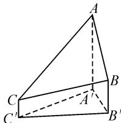
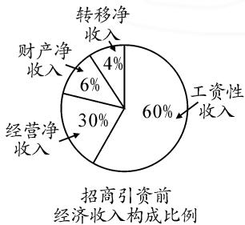
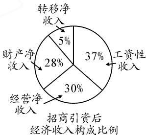

# 与时俱进时代特色,关注经济科技生产

——以几道相关试题为例

# - 江苏省宜兴市和桥高级中学 邢志伟

近年高考数学命题围绕“立德树人”的根本目标，在考查学生“四基”的基础上，坚持数学思想性、科学性与应用性等方面的融合与和谐统一。而数学命题的设置，可以在此精神指导下，创设一些具有创新教育意义的数学场景，融入数学知识与数学应用，利用高考“指挥棒”合理引导数学教学与数学学习，引导学生增强社会责任感与使命感，教育并引领学生树立正确的人生观、价值观、世界观。

# 1 关注科学进步与技术创新

2021 年高考数学甲卷理科第 8 题以科学与体育等各方面融合的场景来构建测量珠穆朗玛峰高程的基本方法，以“三角高程测量法”来创设试题，理论联系实际，试题情境真实，通过具体问题情境的分析、理解与转化，借助立体几何中的线线、线面、面面关系等的构建与应用，合理数学建模，构建立体几何模型，综合解三角形的相关知识来考查与应用等.

例 1 珠穆朗玛峰最新高程于2020年12月8日由中国和尼泊尔联合公布为8848.86(单位:m)，是三角高程测量法的新成果.图1是三角高程测量法的一个示意图，现有A,B,C三点，且A,B,C在同一水平面上的投影 $A', B', C'$ 满足 $\angle A'C'B' = 45^\circ$ , $\angle A'B'C' = 60^\circ$ . 由 $C$ 点测得 $B$ 点的仰角为 $15^\circ$ , $BB'$ 与 $CC'$ 的差为 100; 由 $B$ 点测得 $A$ 点的仰角为 $45^\circ$ , 则 $A$ , $C$ 两点到水平面 $A'B'C'$ 的高度差 $AA' - CC'$ 约为 ( ). ( $\sqrt{3} \approx 1.732$ ) (B)

text_image

Geometric diagram of a triangular pyramid with labeled vertices and internal points

图 1

A.346

B.373

C.446

D.473

分析:充分分析题目条件,理解仰角的概念,注意各点、线、面之间的关系,以及空间与平面的转化,会用解三角形思维处理相关三角形中的边、角等问题,并反馈到实际问题来确定两点之间的高度差.这当中结合图形直观与应用,巧妙借助辅助线,构建与之相吻合的几何图形.

试题借助实例剖析科学进步与技术创新,倡导学生为社会的科学进步与技术创新去努力,对于培养学生“立德树人”的品质非常有帮助.

# 2 关注脱贫攻坚和农村振兴

2021年高考数学甲卷文、理科第2题利用当今时代的社会背景合理创设问题情境，通过我国在脱贫攻坚工作取得全面胜利和乡村振兴的时代背景下，结合农村经济情况中的农户家庭年收入设置统计数据信息，以此设计问题，可以很好地考查概率与统计的相关知识，以及图表处理与数据处理等基本能力。

例 2 [2023 年湖北省武汉市数学调研试卷(4 月份)]（多选题）某贫困县 2022 年经过招商引资后，经济收入较前一年增加了一倍，实现翻番，为更好地了解该县的经济收入的变化情况，统计了该县招商引资前后的年经济收入构成比例，得到如图 2 的扇形图.

pie

招商引资前
经济收入构成比例
| 收入类型 | 占比 (%) |
| :--- | :--- |
| 工资性收入 | 60 |
| 经营净收入 | 30 |
| 财产净收入 | 6 |
| 转移净收入 | 4 |

pie

招商引资后经济收入构成比例
| 收入类型 | 占比 (%) |
|---|---|
| 转移净收入 | 5 |
| 财产净收入 | 28 |
| 经营净收入 | 30 |
| 工资性收入 | 37 |

图2

则下列结论中正确的是( ). (AD)

A. 招商引资后，工资性收入较前一年增加

B.招商引资后,转移净收入是前一年的1.25倍

C. 招商引资后, 转移净收入与财产净收入的总和超过了该年经济收入的 $\frac{2}{5}$

D.招商引资后,经营净收入较前一年增加了一倍

分析:根据题设条件,引入招商引资前与招商引资后的经济收入所对应的参数,根据两个扇形统计图中的数据信息结合各个选项加以逐个分析,进而得以正确分析与判断.

试题借助实例剖析脱贫攻坚和乡村振兴,倡导学生关注民生发展与全员小康，对于优化学生的品质有很好的导向，利于培养学生的“立德树人”的目标。

# 3 关注航天航空事业

2021年高考数学新高考Ⅱ卷第4题，关注当今时代，我国航空航天事业的全面高速发展，通过“北斗三号全球卫星导航系统”的建立来创设问题场景，通过卫星导航系统的创新定义与真实情境设置，利用地球静止同步轨道卫星信号覆盖的地球表面面积的创新定义加以设置，结合球及其几何性质、直线与平面所成的角、直线与圆相切、解直角三角形以及球的表面积等众多相关的知识，考查考生的空间想象能力和阅读理解、数学建模的素养.

例 3 （2023 届江苏省苏北七市一模数学试卷）中国神舟腾飞太空已经成为中国的一大科技亮点。设地球的半径为 R，若某飞船升空后的初始运行轨道是以地球的中心为一个焦点的椭圆，其远地点（长轴端点中离地面最远的点）、近地点（长轴端点中离地面最近的点）距地面分别为 $S_{1}, S_{2}$ ，则该椭圆的短轴长为（）。（D）

A. $\sqrt{S_1 S_2}$

B. $2\sqrt{S_{1}S_{2}}$

C. $\sqrt{(S_1 + R)(S_2 + R)}$

D. $2\sqrt{(S_1 + R)(S_2 + R)}$

分析:根据题设条件,结合数学文化与空间美术知识的创新设置,通过远地点与近地点对应概念的理解,借助椭圆的基本要素与关系式的构建以及椭圆中相关参数之间的关系,合理转化与应用,进而得以确定椭圆的短轴长问题.在此过程中,借助数学建模充分展示数学的古典美.

本题借助实例剖析航天航空事业,发展太空战略,开拓学生思维与发展目标,对于数学学科的育人价值有很好的导向作用.

# 4 关注身心健康情况

2021年高考数学甲卷理科第4题(文科第6题)，以社会普遍关注的青少年视力问题为背景设计，结合对数式的巧妙设计，全面考查对数与指数的互化与应用问题，特别重视数学运算与逻辑推理等能力.

例 4 [2023 年四川省雅安市部分学校高考数学联考试卷(4 月份)]住房的许多建材都会释放甲醛.甲醛是一种无色、有着刺激性气味的气体,对人体健康有着极大的危害.新房入住时,空气中甲醛浓度不能超过 $0.08 \, mg/m^{3}$ ,否则,该新房达不到安全入住的标准.若某套住房自装修完成后,通风 $x(x=1,2,3,\cdots,50)$ 周与室内甲醛浓度 y(单位: $mg/m^{3}$ )之间近似满足函

数关系式 $y=0.48-0.1f(x)(x\in\mathbf{N}^{*})$ ，其中 $f(x)=\log_{a}[k(x^{2}+2x+1)](k>0,\ x=1,2,3,\cdots,50)$ ，且 $f(2)=2,f(8)=3$ ，则该住房装修完成后要达到安全入住的标准，至少需要通风（）.(D)

A.17 周

B.24 周

C.28 周

D.26 周

分析:结合创新情境设置给出对应函数的关系式,利用已知数据通过对数运算与性质的转化,在参数值确定的基础上得到相应的函数解析式,借助不等式的构建解决对应的实际应用问题.

本题借助实例剖析身心健康情况,倡导学生身心健康,拥有一个健全的体魄,也为更好的生活、学习、工作等奠定基础.

# 5 关注“一带一路”

“一带一路”倡议是中国发展的一张名片，很多试卷可以通过其来设置问题，2021年高考数学新高考Ⅰ卷第18题以“一带一路”知识竞赛为背景，结合离散型随机变量及其分布列、期望与方差的计算等，考查了考生对概率统计基本知识的理解与应用。

例 5 成昆线复线是国家西部大开发重点工程建设项目, 是“一带一路”建设中连接南亚、东南亚国际贸易口岸的重要通道. 线路并行于既有成昆铁路, 全长约 860 公里, 设计时速 160 公里, 预计于 2022 年 12 月试运行. 结合科技知识, 声强 I (单位: W/m²) 表示的是声音在传播途径中每 1 平方米面积上声能流密度, 而声强级 L (单位: dB) 与声强 I 的之间存在函数关系: $L = 10 \lg \left( \frac{I}{10^{-12}} \right)$ . 若提速前列车的声强级是 100 dB, 提速后列车的声强级是 50 dB, 则普通列车的声强是高速列车声强的 ( ). (B)

A. $10^{6}$ 倍

B. $10^{5}$ 倍

C. $10^{4}$ 倍

D. $10^{3}$ 倍

分析:根据题目材料的中涉及“一带一路”的阅读与理解,利用函数模型的创设,求出对应的关系式,进而结合对数与指数的互化运算加以合理分析与求解,关键考查阅读理解能力与数学运算能力等.

试题借助实例剖析“一带一路”问题,发展中国的战略目标,从大环境来创设目标,实现学习目标与生活动力相结合.

近年高考数学试题中,通过数学学科基础性的强大功能,合理结合我国当下社会主义建设和科技发展的重大成就,结合学生的生活、学习实际等情况,将社会、学校、数学这三个主要的因素合理融合,创设数学情境试题,借助高考这一重要平台,合理引领并指导学生在学习的同时,合理关注时政与身边事,从中也融入学习与应用. Z