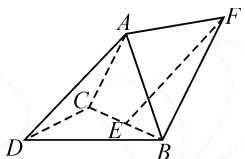
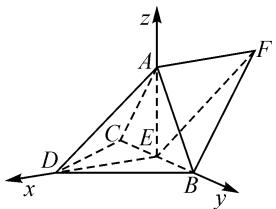
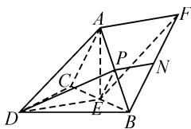
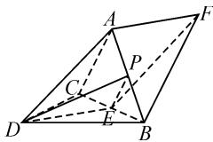
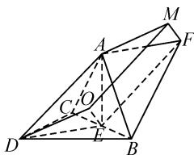
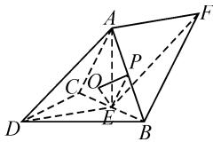
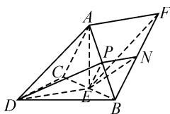

# 从一道 2023 年高考题谈二面角的求法

# 贵州省毕节市第二实验高中 张泽勇

摘要: 求二面角的大小是高数学中的一个重点和难点问题,也一直是历年高考的高频考点,重点考查逻辑推理、直观想象和数学运算等数学学科核心素养.但是大部分学生仍然畏惧这类题型或者解此类题的方法非常单一,本文中通过“一题多解”来探究二面角的求法,帮助学生掌握解决此类题的方法,领悟解题过程中蕴含的数学思想.

关键词:二面角;核心素养;数学思想

# 1 真题再现

题目（2023年新课标全国Ⅱ卷)如图1，三棱锥A-BCD中， $DA = DB = DC, BD\perp CD,$ $\angle ADB = \angle ADC = 60^{\circ},E$ 为 $BC$ 的中点.

text_image

Geometric diagram of a parallelogram with labeled vertices and internal points, including dashed lines indicating hidden edges.

图1

(1) 证明: $BC \perp DA$ ;   
(2) 点 F 满足 $\overrightarrow{EF} = \overrightarrow{DA}$ ，求二面角 D-AB-F 的正弦值.

# 2 解法探究

由于问题(1)只需先证明 $BC \perp$ 平面 ADE 即可得到结论,因此本文重点探究问题(2)中求解二面角的方法.

方法 1: 坐标法.

解: 设 DA = DB = DC = 2.

结合题意, 得 AC = AB = 2, DE = AE = $\sqrt{2}$ .

所以 $AE^{2}+DE^{2}=AD^{2}$ ，即 $AE\perp DE$ .

又 $AE \perp BC, DE \cap BC = E$ ，所以 $AE \perp$ 平面 BCD.

如图2,建立空间直角坐标系 E-xyz, 则 $D(\sqrt{2},0,0)$ , $A(0,0,\sqrt{2})$ , $B(0,\sqrt{2},0)$ , $E(0,0,0)$ .

设平面 DAB 与平面 ABF 的一个法向量分别为 $\boldsymbol{n}_{1}=(x_{1},y_{1},z_{1}),\boldsymbol{n}_{2}=(x_{2},y_{2},z_{2})$ .

text_image

z
A
F
C
E
D
x
y
B

图2

由 $\overrightarrow{EF} = \overrightarrow{DA} = (-\sqrt{2},0,\sqrt{2})$ ，可得 $F(-\sqrt{2},0,\sqrt{2})$ 所以 $\overrightarrow{AF} = (-\sqrt{2},0,0)$

又 $\overrightarrow{AB} = (0, \sqrt{2}, -\sqrt{2})$ ，则有

$$
\left\{ \begin{array}{l l} - \sqrt {2} x _ {1} + \sqrt {2} z _ {1} = 0, \\ \sqrt {2} y _ {1} - \sqrt {2} z _ {1} = 0, \end{array} \right. \quad \left\{ \begin{array}{l l} \sqrt {2} y _ {2} - \sqrt {2} z _ {2} = 0, \\ - \sqrt {2} x _ {2} = 0. \end{array} \right.
$$

易得 $\boldsymbol{n}_{1}=(1,1,1)$ , $\boldsymbol{n}_{2}=(0,1,1)$ .

设二面角 D-AB-F 的大小为 $\theta$ ，则

$$
| \cos \theta | = \frac {| \boldsymbol {n} _ {1} \cdot \boldsymbol {n} _ {2} |}{| \boldsymbol {n} _ {1} | | \boldsymbol {n} _ {2} |} = \frac {2}{\sqrt {3} \times \sqrt {2}} = \frac {\sqrt {6}}{3}.
$$

所以 $\sin \theta = \sqrt{1 - \frac{6}{9}} = \frac{\sqrt{3}}{3}$ .

故二面角 D-AB-F 的正弦值为 $\frac{\sqrt{3}}{3}$ .

归纳: 此方法是在能够建立空间直角坐标系的前提下, 通过分别求出两个平面的法向量的坐标, 进而求出二面角的余弦值, 然后求出二面角的正弦值.

方法 2: 基底法.

解: 设 DA = DB = DC = 2.

令 $\overrightarrow{DA}=a,\overrightarrow{DB}=b,\overrightarrow{DC}=c$ ，则

$$
\boldsymbol {a} \cdot \boldsymbol {b} = 2, \boldsymbol {a} \cdot \boldsymbol {c} = 2, \boldsymbol {b} \cdot \boldsymbol {c} = 0.
$$

设平面 ABD 的法向量为 $m = xa + yb + zc$ .

由 $\left\{\begin{aligned}&m\cdot\overrightarrow{DB}=0,\\ &m\cdot\overrightarrow{DA}=0,\end{aligned}\right.$ 得 $\left\{\begin{aligned}(xa+yb+zc)\cdot b=0,\\ (xa+yb+zc)\cdot a=0.\end{aligned}\right.$

令 y = -1，解得 $m = 2a - b - 3c$ ，则 $|m| = 2\sqrt{6}$ .

易证 $CA \perp$ 平面 $ABF$ , 所以 $\overrightarrow{CA}$ 是平面 $ABF$ 的一个法向量. 又 $\overrightarrow{CA} = a - c, |\overrightarrow{CA}| = 2$ , 所以

$$
\cos \langle \overrightarrow {C A}, m \rangle = \frac {\overrightarrow {C A} \cdot m}{| \overrightarrow {C A} | | m |} = \frac {8}{2 \times 2 \sqrt {6}} = \frac {\sqrt {6}}{3}.
$$

所以 $\sin\langle\overrightarrow{CA},m\rangle=\sqrt{1-\cos^{2}\langle\overrightarrow{CA},m\rangle}=\frac{\sqrt{3}}{3}.$

归纳: 此方法是在确定基底的前提下, 先求出两个平面的法向量(用基底表示), 进而求出二面角的余弦值.

点评:以上两种方法都是将几何问题转化为向量问题,将向量的运算结果翻译为几何结论,有效避免了寻找二面角的平面角,体现了化归与转化的思想,将“数”与“形”完美结合.但对学生计算能力的要求较高,这就需要在教学中加强对学生数学运算素养的培养.

方法 3: 定义法.

解: 如图 3, 取 AB 的中点 P, BF 的中点 N, 连接 AE, DE, PN, PE, DP, 则 PN // AF.

由 $\overrightarrow{EF} = \overrightarrow{DA}$ ，可知四边形 ADEF 为平行四边形，则 $DE \parallel AF$ ，所以 $DE \parallel PN$ 。

text_image

Geometric diagram of a parallelepiped with labeled vertices and internal points, used for spatial geometry problems.

图3

方法 1 中已证 $DE \perp AE$ .

又 $DE \perp BC, BC \cap AE = E$ ，所以 $DE \perp$ 平面 ABC，则 $DE \perp AB$ 。所以 $PN \perp AB$ 。

又在等边三角形 ABD 中 $PD \perp AB$ ，所以 $\angle DPN$ 是二面角 D-AB-F 的平面角。

设 $DA = DB = DC = 2$ ，又因为 $\angle DPN$ 与 $\angle PDE$ 互补， $\sin \angle DPN = \sin \angle PDE = \frac{PE}{DP} = \frac{\sqrt{3}}{3}$

归纳: 利用此方法求解二面角, 其实质就是在图中先确定二面角的平面角, 然后求出平面角的大小即二面角的大小. 所以利用定义法求解二面角最关键的步骤就是确定二面角的平面角.

方法 4: 分割法 $^{[1]}$ .

解:如图 4, 取 AB 的中点 P, 连接 DP, DE, PE. 在方法 3 中已证 $DE \perp$ 平面 ABC, $DE \parallel AF$ , 所以 $AF \perp$ 平面 ABC. 又 $AF \subset$ 平面 ABF, 则平面 $ABC \perp$ 平面 ABF，所以二面角 C-AB-F 为直二面角。在等边三角形 ABD 中， $AB \perp DP$ ，又 PE 是 DP 在平面 ABC 内的射影，由三垂线逆定理得 $AB \perp PE$ 。

text_image

Geometric diagram of a parallelepiped with labeled vertices and internal points, used for spatial geometry problems.

图4

所以 $\angle DPE$ 是二面角 D-AB-C 的平面角.

易得 $\cos\angle DPE=\frac{PE}{DP}=\frac{\sqrt{3}}{3}.$

因为平面 ABC 将二面角 D-AB-F 分割为二面角 D-AB-C 和直二面角 C-AB-F，设二面角 D-AB-F 的大小为 $\theta$ ，则 $\theta = \angle DPE + \frac{\pi}{2}$ ，所以

$$
\sin \theta = \sin \left(\angle D P E + \frac {\pi}{2}\right) = \cos \angle D P E = \frac {\sqrt {3}}{3}.
$$

方法 5: 三垂线法.

解:如图5,过点E作OE⊥平面ABD,垂足为O.设DA=DB=DC=2.结合题意,得EA=EB=DE= $\sqrt{2}$ ,则点O是等边三角形ABD的中心.过点O作OM//EF,使得OM=EF, 连接 MF, AM, DE, DO, 则四边形 OEFM 为平

text_image

Geometric diagram of a polyhedron with labeled vertices and internal points, including dashed lines indicating hidden edges.

图 5

行四边形, 得 $OE \parallel MF$ . 所以 $MF \perp$ 平面 ABD.

由 $\overrightarrow{EF} = \overrightarrow{DA}$ , 知 $EF \parallel AD$ , 且 $EF = AD$ , 则 $OM \parallel AD$ , 且 $OM = AD$ , 所以四边形 $ODAM$ 为平行四边形, 所以 $M \in$ 平面 $ABD$ , $AM$ 为斜线 $AF$ 在平面 $ABD$ 内的射影.

由方法3已证 $DE \perp AB, DE \parallel AF$ ，所以 $AB \perp AF$ . 由三垂线逆定理，得 $AB \perp AM$ .

所以 $\angle MAF$ （或其补角）为二面角 $D - AB - F$ 的平面角.

在等边三角形 ABD 中, $DO=\frac{2\sqrt{3}}{3}$ ;

在平行四边形 ODAM 中, $AM = DO = \frac{2\sqrt{3}}{3}$ ;

在 Rt△AMF 中， $MF = \sqrt{AF^{2} - AM^{2}} = \frac{\sqrt{6}}{3}$ .

所以 $\sin\angle MAF=\frac{MF}{AF}=\frac{\frac{\sqrt{6}}{3}}{\sqrt{2}}=\frac{\sqrt{3}}{3}.$

归纳: 方法 4 与方法 5 其实运用的都是垂线法, 两种解法都是在已经确定了其中一个半平面的垂线的前提下解题. 在解题中, 要确保垂线与两个平面的交点后, 才能找到解题的突破口. 在方法 3 中, 确定的垂线确实与两个平面都相交, 只是交点重合 (交点重合的情况必定是垂线与二面角的棱相交的时候), 此时可用分割法确定二面角的平面角. 方法 4 中, 无法确定其中一个平面的垂线与另一个平面, 则可通过平移垂线, 使平移后的垂线与两个平面都相交, 确定了交点后可根据三垂线法得到二面角的平面角 (或补角).

方法 6: 两个半平面的垂线所成角(或补角)的大小即为所求二面角的大小.

解: 如图 6, 过点 E 作 $OE \perp$ 平面 ABD, 垂足为 O, 取 AB 的中点 P, 连接 PE, OP, DE, EA, 则 $OE \perp OP$ .

  
图6

设 DA = DB = DC = 2，结

合题意得 $EA = EB = DE = \sqrt{2}$ ，则点 $O$ 是等边三角形ABD的中心。在方法4中已证明平面 $ABC \perp$ 平面ABF， $AB \perp PE$ ，又因为平面 $ABC \cap$ 平面 $ABF = AB$ ，所以 $PE \perp$ 平面ABF。

所以 $\angle OEP$ （或其补角）为二面角 $D - AB - F$ 的平面角. 又 $OP = \frac{1}{3} DP = \frac{\sqrt{3}}{3}, PE = \frac{1}{2} AC = 1$ ，则在 Rt△POE 中，有 sin∠OEP=OP/PE=√3.

归纳: 方法 6 其实与方法 1 和方法 2 的解题思想本质是一样的, 共同点是利用二面角中两个半平面垂线的夹角与二面角的平面角的关系,通过求解两垂线的夹角,进而确定二面角的大小.

方法 7: 垂面法.

解: 如图 7, 取 AB 的中点 P, BF 的中点 N, 连接 DE, PN, PE, EN, DP, 则 $PN \parallel AF$ , $EP \parallel AC$ .

text_image

Geometric diagram of a parallelepiped with labeled vertices and internal points, used for spatial geometry problems.

图7

由 $\overrightarrow{EF} = \overrightarrow{DA}$ ，可知四边形 ADEF 为平行四边形，则 $DE \parallel AF$ .

所以 $DE \parallel PN$ ，可知平面 $PDE$ 与平面 $PDEN$ 是同一平面。在方法3中已证 $AB \perp DE$ ，在方法4中已证 $AB \perp PE$ ，又 $PE \cap DE = E, PE, DE \subset$ 平面 $PDEN$ ，则 $AB \perp$ 平面 $PDEN$ 。

所以 $\angle DPN$ 是二面角 D-AB-F 的平面角.

设 DA=DB=DC=2.

由方法 3, 已计算 $\sin \angle DPN = \frac{\sqrt{3}}{3}$ .

归纳: 此方法是在确定了二面角的棱的垂面后, 此垂面与二面角的两个半平面的交线所成的角就是二面角的平面角. 如果垂面与二面角的两个半平面的交线无法确定, 可以通过延展平面或者平移平面来确定两交线.

点评: 方法 3～方法 7 都是根据二面角的平面角的作法, 利用判定定理和性质定理证明所作角即为所求角, 这些方法不仅要求学生对相应的知识非常熟悉, 而且要有较强的逻辑推理和直观想象能力.

以上7种方法都是通过挖掘题目中的隐含条件，虽然每种方法的侧重点不同，但是本质都是围绕二面角的定义直接或间接求解二面角，这也体现了数学中的转化与化归思想，所以“一题多解”的探究是有必要的。除了以上方法，其实还有一些其他求解二面角的方法，比如面积射影法、三面角公式法[2]，用这两种方法同样能解出此题。关于二面角的解法也许还有很多，解法的多样性更能考查学生的综合解题能力。本文中通过“一题多解”探究二面角的解法，帮助学生掌握解决此类题的方法，在知识与方法的整合中全面提升数学学科核心素养，并领悟解题过程中蕴含的数学思想。

# 参考文献：

[1]程宏咏.从一道调研试题谈二面角的求法[J].数学之友，2022(10):66-68.

[2] 张东. 从 2020 年一道高考题谈二面角的求法 [J]. 理科考试研究, 2021(17): 17-19. Z

# (上接第34页)

(1) $a^{r}a^{s}=a^{r+s}(a>0,r,s\in\mathbf{Q})$ ;   
(2) $(a^{r})s=a^{rs}(a>0,r,s\in\mathbf{Q})$ ;   
(3) $(ab)^{r}=a^{r}b^{r}(a>0,r\in\mathbf{Q})$ .

# 4.4 总结提升

师:本节课我们学习了哪些知识?你有哪些收获?你认为接下来我们还可以研究什么?

设计意图: 回顾学习过程, 揭示研究路径, 启发学生思考, 为接下来无理数指数幂的学习做铺垫.

# 5 教学反思

深度学习应关注不同学科之间、同学科内部的相互渗透和交融，多以真实情境为起点展开教学。从碳14的残留量引入，体现了学科交融，也体现了数学广泛的应用价值。从函数的观点思考一个数的 $n$ 次方根的情况，体现了学科内知识的前后联系，同时也有助于学生的进一步理解,发展了直观想象和逻辑推理素养.深度学习应突出深度思辨的思维指向,n次方根的性质涉及到分类讨论,学生在探究的过程中,经历了操作、猜想、思辨、联想,这比知识本身更有价值,同时发展了数学运算素养和逻辑推理素养,培养了学生实事求是、敢于质疑的科学态度.

# 参考文献：

[1]郭华.深度学习及其意义[J].课程·教材·教法,2016(11):25-32.  
[2]中华人民共和国教育部.普通高中数学课程标准(2017年版2020年修订)[S].北京:人民教育出版社,2020.  
[3]刘月霞.指向“深度学习”的教学改进:让学习真实发生[J].中小学管理,2021(5):13-17.  
[4]郭华.深度学习:消解二元对立,建立普遍联系——兼评俞正强“比的认识”一课[J].中国教师,2021(9),61-64.Z