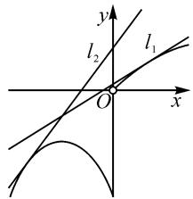

# 例谈不等式恒成立求参数范围问题的解题策略

# 湖南省永州市第一中学 周建权

摘要: 不等式恒成立求参数范围的问题是高考和各地模拟考试中的热点问题, 此类问题形式多样, 解决起来有一定困难, 本文中通过具体例子探讨此类题型的解题策略, 分析其中的思维逻辑.

关键词: 不等式恒成立; 参数范围; 解题策略

不等式恒成立求参数范围的问题能够充分联系不等式、函数与方程、导数等知识，有利于考查学生数学运算、逻辑推理、数学抽象等学科核心素养，是高考和各地模考的热点问题。此类问题形式多变、综合性强，学生往往捉摸不透，本文中结合具体例子谈谈此类问题的解题策略。

# 1 分离参数法

分离参数法就是对不等式变形,将参数与变量分离,构造无参数函数,进而研究该函数的最值.

例 1 （2020 年全国卷 I 理科第 21 题）已知函数 $f(x)=\mathrm{e}^{x}+ax^{2}-x$ . (1) 略. (2) 当 $x \geqslant 0$ 时, $f(x) \geqslant \frac{1}{2}x^{3} + 1$ , 求 a 的取值范围.

下面重点研究第(2)问的解题策略.

解法 1: 由题意, 知 $e^{x} + ax^{2} - x \geqslant \frac{1}{2}x^{3} + 1 (x \geqslant 0)$ .

当 x=0 时，不等式为 $1 \geqslant 1$ ，显然成立，符合题意。

当 x>0 时，分离参数 a，得 $a \geqslant \frac{\frac{1}{2}x^{3}+x+1-e^{x}}{x^{2}}$ .

令 $g(x) = \frac{\frac{1}{2}x^3 + x + 1 - \mathrm{e}^x}{x^2}$ ，则只需 $a \geqslant g(x)_{\max}$ .

对 $g(x)$ 求导, 得

$$
\begin{array}{l} g ^ {\prime} (x) = \frac {(2 - x) \mathrm{e} ^ {x} + \frac {1}{2} x ^ {3} - x - 2}{x ^ {3}} \\ = \frac {(2 - x) \mathrm{e} ^ {x} + \frac {1}{2} (x - 2) \left(x ^ {2} + 2 x + 2\right)}{x ^ {3}} \\ = - \frac {(x - 2) \left(\mathrm{e} ^ {x} - \frac {1}{2} x ^ {2} - x - 1\right)}{x ^ {3}}. \\ \end{array}
$$

令 $h(x)=\mathrm{e}^{x}-\frac{1}{2}x^{2}-x-1$ ，则 $h'(x)=\mathrm{e}^{x}-x-1$ .

令 $\varphi(x)=\mathrm{e}^{x}-x-1$ , 当 x>0 时有 $\varphi'(x)=\mathrm{e}^{x}-$ 1>0，则 $h'(x)$ 在 $(0,+\infty)$ 单调递增，所以 $h'(x)>h'(0)=0$ ，故 $h(x)$ 在 $(0,+\infty)$ 单调递增，因此 $h(x)>h(0)=0$ . 故当 $x\in(0,2)$ 时， $g'(x)>0$ ， $g(x)$ 单调递增；当 $x\in(2,+\infty)$ 时， $g'(x)<0$ ， $g(x)$ 单调递减. 因此， $g(x)_{\max}=g(2)=\frac{7-\mathrm{e}^{2}}{4}$ .

所以 a 的取值范围是 $\left[\frac{7-\mathrm{e}^{2}}{4},+\infty\right)$ .

评析:此类恒成立问题一般在参数容易分离且分离之后最值好求的情况下使用分离参数法,难度较大的恒成立问题分离参数后可能需要多次求导、使用洛必达法则、切线放缩等.如本题在研究 $g'(x)$ 的正负时,一个难点是将 $\frac{1}{2}x^{3}-x-2$ 分解成 $\frac{1}{2}(x-2)(x^{2}+2x+2)$ ,另一个难点是将 $e^{x}-\frac{1}{2}x^{2}-x-1$ 独立出来研究,判定其大于0.

# 2 不分离参数,构造函数

参变不易分离,或分离后函数结构复杂不易研究,则可不分离参数,将参数和变量放到不等式同一侧,直接构造含参函数.

# 2.1 直接分析最值

下面给出例 1 的解法 2.

解法 2: 当 $x \geqslant 0$ 时, $f(x) \geqslant \frac{1}{2}x^{3} + 1$ 恒成立, 等价于 $e^{x} \geqslant \frac{1}{2}x^{3} - ax^{2} + x + 1$ , 亦等价于

$$
\left(\frac {1}{2} x ^ {3} - a x ^ {2} + x + 1\right) \mathrm{e} ^ {- x} \leqslant 1.
$$

令 $g(x) = \left(\frac{1}{2} x^3 - ax^2 + x + 1\right)\mathrm{e}^{-x}, x \geqslant 0$ ，则

$$
\begin{array}{l} g ^ {\prime} (x) = - \left(\frac {1}{2} x ^ {3} - a x ^ {2} + x + 1 - \frac {3}{2} x ^ {2} + 2 a x - 1\right) \mathrm{e} ^ {- x} \\ = - \frac {1}{2} x (x - 2 a - 1) (x - 2) \mathrm{e} ^ {- x}. \\ \end{array}
$$

① 当 $2a + 1 \leqslant 0$ ，即 $a \leqslant -\frac{1}{2}$ 时，由 $g'(x) = 0$ ，得 $x = 0$ 或 $x = 2$ 。当 $x \in (0,2)$ 时， $g'(x) > 0, g(x)$ 单调递增。又 $g(0) = 1$ ，所以 $g(x) > 1$ ，不合题意。

②若 $0 < 2a + 1 < 2$ ，即 $-\frac{1}{2} < a < \frac{1}{2}$ 时，则当 $x \in (0, 2a + 1)$ 时， $g'(x) < 0, g(x)$ 单调递减；当 $x \in (2a + 1, 2)$ 时， $g'(x) > 0, g(x)$ 单调递增；当 $x \in (2, +\infty)$ 时， $g'(x) < 0, g(x)$ 单调递减。又 $g(0) = 1$ 所以 $g(x) \leqslant 1$ 恒成立只需 $g(2) \leqslant 1$ ，即 $(7 - 4a)e^{-2} \leqslant 1$ ，则 $a \geqslant \frac{7 - e^2}{4}$ 。所以当 $\frac{7 - e^2}{4} \leqslant a < \frac{1}{2}$ 时， $g(x) \leqslant 1$ 成立。

③当 $2a + 1 \geqslant 2$ ，即 $a \geqslant \frac{1}{2}$ 时， $g(x) = \left(\frac{1}{2} x^3 - ax^2 + x + 1\right) e^{-x} \leqslant \left(\frac{1}{2} x^3 + x + 1\right) e^{-x}$ . 又由②可知， $a = 0$ 时， $g(x) = \left(\frac{1}{2} x^3 + x + 1\right) e^{-x} \leqslant 1$ 恒成立，所以 $a \geqslant \frac{1}{2}$ 时，满足题意.

综上所述， $a$ 的取值范围是 $\left[\frac{7 - \mathrm{e}^2}{4}, + \infty\right)^{[1]}$

评析:同一个不等式可以等价变形构造出不同的函数,变形的目标应该是构造出易于研究的函数.如本题将原不等式变形为 $e^{x}-\frac{1}{2}x^{3}+ax^{2}-x-1\geqslant0$ , 构造 $m(x)=\mathrm{e}^{x}-\frac{1}{2}x^{3}+ax^{2}-x-1$ , 则不易研究.解法2通过变形对 $e^{x}$ 进行巧妙处理, 构造的函数 $g(x)$ 可以在求导后省去研究指数函数,有利于分类讨论.

# 2.2 必要性探路法

必要性探路法指的是利用不等式在一些特殊情况下成立,得到参数的一个取值范围,该范围是不等式恒成立的一个必要条件,如果能证明该范围也是不等成立的充分条件,则该范围即为所求,如果不是充分条件,也缩小了参数的范围.

# (1) 端点效应探路

端点效应: 记含参函数为 $f(x)$ (m 为参数), 若 $f(x) \geqslant 0$ 在 $[a, b]$ 上恒成立, 且 $f(a) = 0$ (或 $f(b) = 0$ ), 则 $f'(a) \geqslant 0$ (或 $f'(b) \leqslant 0$ ); 若 $f(x) \geqslant 0$ 在 $[a, b]$ 上恒成立, 且 $\left\{\begin{aligned} f(a) &= 0, \\ f'(a) &= 0, \end{aligned}\right.$ (或 $\left\{\begin{aligned} f(b) &= 0 \\ f'(b) &= 0 \end{aligned}\right.$ ), 则 $f''(a) \geqslant 0$ (或 $f''(b) \geqslant 0$ ) $^{[2]}$ .

例 2 （2022 年新高考Ⅱ卷第 22 题）已知函数 $f(x)=xe^{ax}-e^{x}$ . (1) 略. (2) 当 x>0 时, $f(x)<-1$ , 求 a 的取值范围.

解: 设 $h(x) = x \mathrm{e}^{ax} - \mathrm{e}^{x} + 1$ ，则当 x > 0 时，恒有 $h(x)<0$ .

注意到 $h'(x)=(1+ax)e^{ax}-e^{x}$ ，所以 $h'(0)=0$ .

设 $g(x) = (1 + ax)\mathrm{e}^{ax} - \mathrm{e}^x (x > 0)$ ，则 $g(0) = 0$ ，且

$$
g ^ {\prime} (x) = \left(2 a + a ^ {2} x\right) \mathrm{e} ^ {a x} - \mathrm{e} ^ {x}.
$$

若原不等式成立，则必有 $g'(0)=2a-1\leqslant0$ ，即 $a\leqslant\frac{1}{2}$ 。因为若 $g'(0)=2a-1>0$ ，则由于 $g'(x)$ 为连续函数，因此存在 $x_{0}\in(0,+\infty)$ ，使得 $\forall x\in(0,x_{0})$ ， $g'(x)>0$ ，故 $g(x)$ 在 $(0,x_{0})$ 为增函数。又 $g(0)=0$ ，所以 $g(x)>0$ ，即 $h'(x)>0$ ，故 $h(x)$ 在 $(0,x_{0})$ 为增函数，因此 $h(x)>h(0)=0$ ，与题设矛盾。

当 $0 < a \leqslant \frac{1}{2}$ 时，有

$$
h ^ {\prime} (x) = (1 + a x) \mathrm{e} ^ {a x} - \mathrm{e} ^ {x} = \mathrm{e} ^ {a x + \ln (1 + a x)} - \mathrm{e} ^ {x}.
$$

下证: 对任意 x > 0, 总有 $\ln(1 + x) < x$ 成立.

设 $S(x) = \ln (1 + x) - x(x > 0)$ ，则 $S'(x) = \frac{1}{1 + x} - 1 < 0$ ，所以 $S(x)$ 在 $(0, +\infty)$ 上为减函数.

故 x>0 时 $S(x)<S(0)=0$ ，即 $\ln(1+x)<x$ 成立.

由上述不等式, 当 $0 < a \leqslant \frac{1}{2}$ 时, 有

$$
\mathrm{e} ^ {a x + \ln (1 + a x)} - \mathrm{e} ^ {x} <   \mathrm{e} ^ {a x + a x} - \mathrm{e} ^ {x} = \mathrm{e} ^ {2 a x} - \mathrm{e} ^ {x} \leqslant 0,
$$

所以 $h'(x) \leqslant 0$ 总成立，则 $h(x)$ 在 $(0, +\infty)$ 上为减函数，故 $h(x) < h(0) = 0$ .

当 $a \leqslant 0$ 时，有 $h'(x) = \mathrm{e}^{ax} - \mathrm{e}^{x} + ax \mathrm{e}^{ax} < 1 - 1 + 0 = 0$ ，所以 $h(x)$ 在 $(0, +\infty)$ 上为减函数，故 $h(x) < h(0) = 0$ .

综上所述，a 的取值范围为 $\left(-\infty, \frac{1}{2}\right]$ .

评析:含参函数求最值时往往需要对参数进行分类讨论,分类标准的确定是难点和关键点.如本题仅从 $h'(x)=(1+ax)\mathrm{e}^{ax}-\mathrm{e}^{x}$ 的形式较难发现对a进行讨论的分类点,如果用端点效应来看,思路就比较清晰了.实际上,利用端点效应有助于确定参数分类讨论的标准.

# (2)其他特殊点探路

例 3 （2020 年新高考 I 卷第 21 题）已知函数 $f(x)=ae^{x-1}-\ln x+\ln a.$ (1) 略. (2) 若不等式 $f(x)\geqslant1$ 恒成立，求 a 的取值范围.

解法 1: 因为 $f(x) \geqslant 1$ 恒成立, 所以 $f(1) = a + \ln a \geqslant 1$ . 令 $g(a) = a + \ln a$ , 则 $g(a)$ 在 $(0, +\infty)$ 单调递增, 且 $g(1) = 1$ , 故由 $g(a) \geqslant 1$ , 得 $a \geqslant 1$ .

下面证明 $a \geqslant 1$ 时， $f(x) \geqslant 1$ 恒成立.

当 $a \geqslant 1$ 时， $f(x) = a \mathrm{e}^{x - 1} - \ln x + \ln a \geqslant \mathrm{e}^{x - 1} - \ln x.$

令 $\varphi(x)=\mathrm{e}^{x-1}-\ln x$ ，则 $\varphi'(x)=\mathrm{e}^{x-1}-\frac{1}{x}$ ， $\varphi'(x)$ 在 $(0,+\infty)$ 单调递增，且 $\varphi'(1)=0$ 。所以当 $x\in(0,1)$ 时， $\varphi'(x)<0,\varphi(x)$ 单调递减；当 $x\in(1,+\infty)$

时， $\varphi'(x) > 0, \varphi(x)$ 单调递增. 故 $\varphi(x) \geqslant \varphi(1) = 1$ ，因此 $a \geqslant 1$ 时， $f(x) \geqslant 1$ 得证.

综上所述，a 的取值范围是 $[1, +\infty)$ .

评析: 利用端点、定点、极点等特殊点探路, 需要对不等式结构有较强的观察分析能力, 需要有函数意识、数形结合意识. 通过必要性探路, 能够化繁为简, 理清讨论的思路, 同时也要注意, 有时我们找到的必要条件不一定刚好也是充分条件.

# 3 分离函数法

分离函数法,就是对不等式恒等变形,将一个复杂的含参不等式分解成不等号左右两边各一个函数的形式,进而研究这两个函数的关系.

# 3.1 构造同构式

下面给出例 3 的解法 2.

解法 2: 由 $f(x) \geqslant 1$ ，得 $a e^{x-1} - \ln x + \ln a \geqslant 1$ ，即 $e^{\ln a + x-1} + \ln a + x - 1 \geqslant \ln x + x$ ，而 $\ln x + x = e^{\ln x} + \ln x$ ，所以 $e^{\ln a + x-1} + \ln a + x - 1 \geqslant e^{\ln x} + \ln x$ 。

令 $h(m)=\mathrm{e}^{m}+m$ ，则有 $h(\ln a+x-1)\geqslant h(\ln x)$ .

因为 $h'(m)=\mathrm{e}^{m}+1>0$ ，所以 $h(m)$ 在 R 上单调递增，于是可得 $\ln a+x-1\geqslant\ln x$ ，因此只需 $\ln a\geqslant(\ln x-x+1)_{\max}$ .

令 $F(x)=\ln x-x+1$ ，则 $F'(x)=\frac{1}{x}-1=\frac{1-x}{x}$ 。所以当 $x\in(0,1)$ 时， $F'(x)>0$ ， $F(x)$ 单调递增；当 $x\in(1,+\infty)$ 时， $F'(x)<0$ ， $F(x)$ 单调递减。故以 $F(x)_{\max}=F(1)=0$ ，则 $\ln a\geqslant0$ ，即 $a\geqslant1$ 。

因此 a 的取值范围为 $[1, +\infty)$ .

评析:同构指的是结构或形式相同,一些不等式可以通过变形使不等式两侧呈现相同结构,将该结构抽象出来构造函数,利用所构造函数的单调性将结构复杂的恒成立问题转化为结构简单的恒成立问题.同构法在“指对混合不等式”出现时用得较多,对代数变形能力要求较高,体现了数学的和谐对称美,对培养数学抽象、数学运算等核心素养具有重要意义.

# 3.2 数形结合

例 4 已知函数 $f(x)=\left\{\begin{aligned}-x^{2}-2x-2,x&\leqslant0,\\ \ln(x+1),&x>0,\end{aligned}\right.$ 若关于 x 的不等式 $f(x)-ax-a+\frac{1}{2}\leqslant0$ 在 R 上恒成立，则实数 a 的取值范围是 \_\_\_\_.

解: $f(x)-ax-a+\frac{1}{2}\leqslant0$ 在 R 上恒成立等价于

$f(x)\leqslant ax+a-\frac{1}{2}$ 在 R 上恒成立，即函数 $f(x)$ 的图

象恒在直线 $l: y = ax + a - \frac{1}{2}$ 的下方, 如图 1 所示.

text_image

y
l₂
l₁
O
x

图1

直线 $y=ax+a-\frac{1}{2}$ 过定点 $\left(-1,-\frac{1}{2}\right)$ ，当直线 l 与曲线 y=$\ln(x+1)(x>0)$ 相切时，设切点 $P(x_{0},\ln(x_{0}+1))$ .

对 $y=\ln(x+1)$ 求导，可得 $y'=\frac{1}{x+1}$ . 由 $\frac{1}{x_{0}+1}=\frac{\ln(x_{0}+1)+\frac{1}{2}}{x_{0}+1}$ ，解得 $x_{0}=e^{\frac{1}{2}}-1$ ，此时直线 l 斜率为 $e^{-\frac{1}{2}}$ ，即 $a=e^{-\frac{1}{2}}$ .

当直线 l 与曲线 $y = -x^{2} - 2x - 2 (x \leqslant 0)$ 相切时，由 $ax + a - \frac{1}{2} = -x^{2} - 2x - 2$ ，得 $x^{2} + (a + 2)x + a + \frac{3}{2} = 0$ ，令 $\Delta = (a + 2)^{2} - 4a - 6 = 0$ ，得 $a = \sqrt{2}$ 或 $a = -\sqrt{2}$ （舍去），此时直线 l 斜率为 $\sqrt{2}$ .

结合图象, 可知 $e^{-\frac{1}{2}} \leqslant a \leqslant \sqrt{2}$ .

评析:数形结合法就是通过分离函数,将问题转化为两个函数图象位置关系的问题.分离出来的两个函数一般是“一直一曲”,便于研究位置关系.分离函数后正确画出函数的图象是解题的关键,需分析函数的定义域、值域、单调性、对称性、凹凸性、特殊点等.

# 4 解题感悟

对于不等式恒成立求参数范围的问题,从参变分离的程度来看,若参变完全分离,则构造的是无参数函数,能够避免对参数的讨论,但存在无参函数结构复杂,不易研究的情况;若参变不分离,则构造的是含参函数,对参数讨论标准的确定是难点所在,需对常见超越函数的性质有所积累,有时必要性探路法能提供思路;若参变部分分离,即分离函数法,有时能够巧妙避免函数结构复杂的情况和对参数的讨论,要明确分离的目标往往是构造同构式或便于数形结合的函数.

# 参考文献：

[1]牛伟.不等式恒成立求参数范围问题的探究[J].中学数学教学参考,2022(24):36-38.  
[2]郑灿基,韦才敏.不等式恒成立求参数范围的问题的解法总结与探究[J].中学数学研究(华南师范大学版),2022(12):20-23. Z