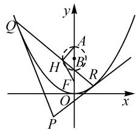

# 切点弦场景创设,定点与动点轨迹

——一道抛物线题的探究

● 江苏省苏州工业园区星海实验高级中学 卢闯

切点弦是二次曲线中一类比较特殊的弦,其是由二次曲线外的一点向二次曲线引两条切线,连接两切点的线段.特别对于抛物线中的切点弦问题,更是其中一个具有独特属性的知识点,备受关注.

# 1 问题呈现

问题（2024届广东四校高三第一次联考数学试卷·16）过 $P(m, -2)$ 向抛物线 $x^{2} = 4y$ 引两条切线 $PQ,PR$ ，切点分别为 $Q,R.$ 又点 $A(0,4)$ 在直线 $QR$ 上的射影为 $H$ ，则焦点 $F$ 与 $H$ 连线的斜率的取值范围是

# 2 问题剖析

此题以过定直线中的动点向抛物线引两条切线来设置问题场景,结合抛物线切点弦的构建,以及定点到切点弦上的射影的给出,确定焦点到对应射影的连线的斜率问题,以直线斜率的取值范围来构建问题.

本题涉及动点、切点、定点、射影、焦点等众多类型的点，切线、弦点弦、焦点与射影的连线等对应类型的直线，创设一个“动”“静”结合的和谐场景，以定直线上动点的变化带动切线的变化，引起切点弦的变化，进一步带动定点在切点弦上的射影的变化，最后直接关系到焦点与射影连线的斜率的变化，“定值”与“变量”的巧妙转化，构建一个动态情景，同时也为问题的解决提供切入点.

本题可以从众多类型的点入手加以设点法处理，也可以从众多类型的直线入手加以设线法处理，都可以很好达到解决问题的目的。若理解并掌握圆锥曲线切点弦公式的话，可直接利用“二级结论”快捷处理。

而对于该问题,当动点 $P(m,-2)$ 中 m=0 时,焦点 F 与点 H 的连线是一条怎样的直线,是否存在斜率呢?这也是该问题命制过程中的一个弊端所在,要加以合理的修正与改进,以保证命题的完善性.

# 3 问题破解

方法 1: 设点法——导数思维.

解析: 设 $Q(x_{1}, y_{1})$ , $R(x_{2}, y_{2})$ ，则有 $y_{1} = \frac{1}{4} x_{1}^{2}$ ,

$y_{2}=\frac{1}{4}x_{2}^{2}$ .依题 $y=\frac{1}{4}x^{2}$ ，求导可得 $y'=\frac{1}{2}x$ .

根据导数的几何意义可得,切线 PQ 的方程为 $y-\frac{1}{4}x_{1}^{2}=\frac{1}{2}x_{1}(x-x_{1})$ , 整理有 $y=\frac{1}{2}x_{1}x-y_{1}$ .

而点 $P(m,-2)$ 在切线 PQ 上，则有 $-2=\frac{1}{2}x_{1}m-y_{1}$ ，即 $x_{1}m-2y_{1}+4=0$ ，所以 $(x_{1},y_{1})$ 是方程 mx-2y+4=0 的解，即点 Q 是直线 mx-2y+4=0 上的点.

用 $x_{2}$ 替换 $x_{1}$ , 用 $y_{2}$ 替换 $y_{1}$ , 可知点 $R$ 也是直线 $mx - 2y + 4 = 0$ 上的点. 所以直线 $QR$ 的方程为 $mx - 2y + 4 = 0$ .

将上述方程变形, 得 $mx = 2(y - 2)$ , 从而直线 QR 过定点 B(0, 2).

而由于 $AH \perp BH, |AB| = 2$ ，则知点 A 在直线 QR 上的射影 H 的轨迹就是以 AB 为直径的圆，其方程为 $x^{2} + (y - 3)^{2} = 1$ .

当 FH 与该圆相切时, 结合平面几何性质可知, 直线 FH 的斜率分别为 $-\sqrt{3}, \sqrt{3}$ , 如图 1 所示.

故焦点 F 与 H 连线的斜率的取值范围是 $(-∞, -\sqrt{3}] ∪ [\sqrt{3}, +∞)$ .

text_image

y
Q
A
H
B'
F
R
O
x
P

图1

解后反思:通过设点法,结合导数的几何意义来确定圆锥曲线的切线方程,为进一步求解圆锥曲线的切点弦提供条件.这是圆锥曲线的切点弦方程求解的一种“通性通法”.而基于抛物线的切点弦方程,通过对直线过定点的挖掘,以及射影轨迹的判断,为数形结合确定对应直线斜率的极端情况打下基础.同时要注意直线斜率的取值范围以及图形之间的联系,不要出现混淆.

方法 2: 设线法——方程思维.

解析: 设切线 PQ, PR 的方程分别为

$$
y = k _ {1} (x - m) - 2, y = k _ {2} (x - m) - 2.
$$

联立 $\left\{\begin{aligned}y&=k_{1}x-k_{1}m-2,\\ x^{2}&=4y,\end{aligned}\right.$ 消去参数 y 并整理可得

$x^{2}-4k_{1}x+4k_{1}m+8=0$ ，由判别式 $\Delta=16k_{1}^{2}-4(4k_{1}m+8)=0$ ，化简有 $k_{1}^{2}-k_{1}m-2=0$ ，可得 $x_{1}=x_{2}=2k_{1}$ ，则 $Q(2k_{1},k_{1}^{2})$ ，

用 $k_{2}$ 替换 $k_{1}$ ，同理可得 $R(2k_{2}, k_{2}^{2})$ .

于是可知 $k_{1}, k_{2}$ 是方程 $k^{2} - km - 2 = 0$ 的两个根，利用韦达定理可得 $k_{1} + k_{2} = m, k_{1}k_{2} = -2$ .

而直线 QR 的方程为 $y - k_{1}^{2} = \frac{k_{2}^{2} - k_{1}^{2}}{2k_{2} - 2k_{1}} (x - 2k_{1})$ ，即 $y = \frac{k_{1} + k_{2}}{2} x - k_{1} k_{2}$ ，亦即 $y = \frac{m}{2} x + 2$ ，变形可得 $mx = 2(y - 2)$ ，从而直线 QR 过定点 B(0, 2).

以下部分同方法1(此略)，可知焦点 $F$ 与 $H$ 连线的斜率的取值范围是 $(-\infty, -\sqrt{3}] \cup [\sqrt{3}, +\infty)$ .

解后反思:通过设线法,结合方程的判别式来确定圆锥曲线的切点弦所在的直线方程,为进一步求解圆锥曲线的切点弦提供条件.这是圆锥曲线的切点弦方程求解的另一种“通性通法”.思维视角不同,对数学基础知识的理解与应用也有所侧重,关键是把握问题的内涵与实质,巧妙加以综合与应用.

方法 3: 性质法.

解析:由圆锥曲线的切点弦方程的“二级结论”可知,直线 QR 的方程为 $mx=4\times\frac{-2+y}{2}=2(y-2)$ ,从而直线 QR 过定点 B(0,2).

以下部分同方法1(此略)，可知焦点 $F$ 与 $H$ 连线的斜率的取值范围是 $(-\infty, -\sqrt{3}] \cup [\sqrt{3}, +\infty)$ .

解后反思:熟练掌握圆锥曲线的切点弦方程的“二级结论”——过曲线 $Ax^{2} + Cy^{2} + Dx + Ey + F = 0$ (A, C 不同时为零) 外一点 $M(x_{0}, y_{0})$ 作曲线的两条切线 MP, MQ, 切点分别为 P, Q, 则切点弦 PQ 所在的直线方程为 $Ax_{0}x + Cy_{0}y + D \cdot \frac{x_{0} + x}{2} + E \cdot \frac{y_{0} + y}{2} + F = 0$ . 作为课外拓展与提升知识, 供学有余力或参与竞赛的学生参考, 在把握“二级结论”的基础上, 解题更加简单快捷, 很好地提升解题效益.

# 4 问题辨析

在以上问题中，对于动点 $P(m,-2)$ ，若 m=0 时，此时点 $P(0,-2)$ ，过点 P 向抛物线 $x^{2}=4y$ 引两条切线 PQ, PR，利用抛物线的对称性可知，切点 Q, R 关于 y 轴对称，由此可得点 A(0,4) 在直线 QR 上的射影 H 在 y 轴上，而焦点 F(0,1) 也在 y 轴上，可知 FH 的方程为 x=0，此时，FH 的斜率不存在。

由以上问题的特殊场景分析可知,在原问题的设置中,应该把 m=0 这一特殊情况排除在外,由此对原问题进一步加以改进如下:

问题 过 $P(m,-2)(m\neq0)$ 向抛物线 $x^{2}=4y$ 引两条切线 PQ, PR, 切点分别为 Q, R. 又点 A(0,4) 在直线 QR 上的射影为 H, 则焦点 F 与 H 连线的斜率的取值范围是 \_\_\_\_.

这样修改后,问题更加合理与完善,不存在漏洞或不合理的地方,而具体的解析过程也更加合理有效.

# 5 变式拓展

借助原问题解析过程中的产物,可以得到一些相应的变式问题.

# 5.1 定点问题

变式 1 过 $P(m,-2)$ 向抛物线 $x^{2}=4y$ 引两条切线 PQ, PR, 切点分别为 Q, R, 则直线 QR 恒过的定点的坐标是 \_\_\_\_. (答案: (0,2).)

由此可得更加一般性的结论：

结论: 过 $P(m,a)(a<0)$ 向抛物线 $x^{2}=2py(p>0)$ 引两条切线 PQ, PR, 切点分别为 Q, R, 则直线 QR 恒过的定点的坐标是 $(0,-a)$ .

# 5.2 轨迹问题

变式 2 过 $P(m,-2)$ 向抛物线 $x^{2}=4y$ 引两条切线 PQ, PR, 切点分别为 Q, R. 又点 A(0,4) 在直线 QR 上的射影为 H, 则动点 H 的轨迹方程是 \_\_\_\_. (答案: $x^{2}+(y-3)^{2}=1$ .)

# 6 教学启示

二次曲线(圆、椭圆、双曲线与抛物线)中的切点弦问题,是平面解析几何中一类综合性较强的问题,解决这类问题的“通性道法”主要有两种:(1)结合函数与导数的应用,利用导数的几何意义确定对应的切线方程,进而加以深入综合与应用;(2)结合函数与方程的应用,利用方程的判别式确定对应的切线方程,同时为切点弦的确定提供条件.

而特殊的思维技巧就是借助二次曲线的切点弦方程的“二级结论”，直接利用公式确定切点弦方程，快速解决问题.

常规的技巧方法是我们必须理解并掌握的知识，也是对此类问题的基本要求，需要借助知识的学习与练习的训练加以掌握与应用；而特殊的思维技巧给我们的课外学习开辟了一个更加宽广的空间，提供了更加简单快捷的技巧与方法. Z