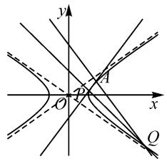
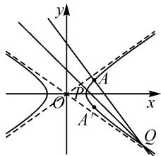
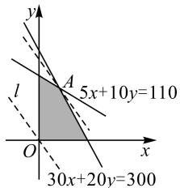

# 对一道解析几何试题的探究与拓展

● 浙江杭州第二中学钱江学校 周杭敏  
● 中国矿业大学 周胜炜

# 1 真题呈现

解析几何在全国新高考卷中分值占比较大,往往以2个客观题、1个解答题的形式出现,是考查的重点,备受关注.下面我们从一道高考真题说起.

已知点 $A(2,1)$ 在双曲线 $C: \frac{x^2}{a^2} - \frac{y^2}{a^2 - 1} = 1 (a > 1)$ 上，直线 $l$ 交 $C$ 于 $P, Q$ 两点，直线 $AP, AQ$ 的斜率之和为0.(1)求 $l$ 的斜率；(2)若 $\tan \angle PAQ = 2\sqrt{2}$ ，求 $\triangle PAQ$ 的面积.

这是2022年全国数学新高考I卷的第21题，主要考查双曲线的标准方程和几何性质、直线与双曲线的位置关系等知识，涉及数形结合、方程思想等.在情境“两直线的斜率之和为0”中融入了简单的“对称关系”，立足常规又超越常规，凸显了新高考基础性、综合性、应用性及创新性的要求.

# 2 一题多解

本题易得双曲线方程为 $\frac{x^{2}}{2}-y^{2}=1$ ，下面我们着重研究第(1)问.

# 2.1 立足常规,提升数学运算素养

解法 1: 线参法一, 设直线 PQ 的方程.

如图1, 显然直线 l 的斜率存在. 设 $l: y = kx + m, P(x_{1}, y_{1}), Q(x_{2}, y_{2})$ .

联立直线与双曲线方程,可得 $(2k^{2}-1)x^{2}+4kmx+2m^{2}+2=0.$

text_image

Mathematical diagram showing a hyperbola with foci and tangent lines in Cartesian coordinates

图1

所以 $x_{1} + x_{2} = -\frac{4km}{2k^{2} - 1},$ $x_{1}x_{2} = \frac{2m^{2} + 2}{2k^{2} - 1}.$

因此， $k_{AP} + k_{AQ} = \frac{y_1 - 1}{x_1 - 2} + \frac{y_2 - 1}{x_2 - 2} = \frac{kx_1 + m - 1}{x_1 - 2} +$

$$
\frac {k x _ {2} + m - 1}{x _ {2} - 2} = 0.
$$

整理，得

$$
2 k x _ {1} x _ {2} + (m - 1 - 2 k) \left(x _ {1} + x _ {2}\right) - 4 (m - 1) = 0.
$$

化简，得 $(k+1)(m+2k-1)=0$ .

而直线 l 不过点 A，即 $2k + m \neq 1$ ，故 k = -1。

评注:设直线 $l: y = kx + m$ 时还需考虑斜率不存在的情况,故还可设 $l: x = ty + n$ ,避免分类讨论.“设直线方程—联立方程组—消元—韦达定理……”,整个过程展现了利用坐标思想解决几何问题的一般程序,属于通性通法.目标明确,思路清晰,符合大部分学生的思维习惯.运用这种方法学生容易拿到部分过程分,但缺点是计算量大,计算结果易错,所以在平时教学中要注重培养学生的数学运算素养.

解法 2: 线参法二, 设直线 AP, AQ 的方程.

设直线 AP 的斜率为 k，则直线 AP 的方程为 $y-1=k(x-2)$ ，与双曲线方程联立，得

$$
(1 - 2 k ^ {2}) x ^ {2} + 4 (2 k ^ {2} - k) x - 4 + 8 k - 8 k ^ {2} = 0.
$$

设 $P(x_{1},y_{1}),Q(x_{2},y_{2})$ ，则 $2x_{1} = \frac{-4 + 8k - 8k^{2}}{1 - 2k^{2}}.$

所以 $x_{1} = \frac{-2 + 4k - 4k^{2}}{1 - 2k^{2}},y_{1} = \frac{2k^{2} - 4k + 1}{1 - 2k^{2}}.$

同理，得 $x_{2}=\frac{-2-4k-4k^{2}}{1-2k^{2}}$ , $y_{2}=\frac{2k^{2}+4k+1}{1-2k^{2}}$ .

所以 $k_{PQ}=\frac{y_{2}-y_{1}}{x_{2}-x_{1}}=-1.$

评注:在两条相关联的直线与圆锥曲线交汇生成的问题中,要会灵活运用同构运算,因为解题过程中常常有算理相同的运算.只要认真仔细地算准一个表达式,那么另一个表达式就可以通过同构替代,进而简化运算.例如,本题中根据两条直线斜率之和为0,可用-k代换k,快速得到 $x_{2},y_{2}$ .

另本题也可以不求 $y_{1}, y_{2}$ .

因为 AQ: $y=1-k(x-2)$ ，所以

$$
\begin{array}{l} k _ {P Q} = \frac {y _ {2} - y _ {1}}{x _ {2} - x _ {1}} \\ = \frac {1 - k \left(x _ {2} - 2\right) - \left[ 1 + k \left(x _ {1} - 2\right) \right]}{x _ {2} - x _ {1}} \\ = \frac {4 k - k (x _ {1} + x _ {2})}{x _ {2} - x _ {1}} \\ = - 1. \\ \end{array}
$$

解法 3: 直线参数方程法.

设 $AP, AQ$ 的倾斜角分别为 $\alpha, \pi - \alpha$ ，则直线 $AP$ 的参数方程为 $\left\{ \begin{array}{l} x = 2 + t \cos \alpha, \\ y = 1 + t \sin \alpha \end{array} \right.$ （ $t$ 为参数），代入双曲线方程，可得 $t_P = \frac{4(\sin \alpha - \cos \alpha)}{\cos^2 \alpha - 2 \sin^2 \alpha}$ .

同理，得 $t_{Q}=\frac{4(\sin\alpha+\cos\alpha)}{\cos^{2}\alpha-2\sin^{2}\alpha}$ .

所以 $y_{P} - y_{Q} = (t_{P} - t_{Q})\sin \alpha = \frac{-8\cos\alpha\sin\alpha}{\cos^{2}\alpha - 2\sin^{2}\alpha},$

$$
x _ {P} - x _ {Q} = \left(t _ {P} + t _ {Q}\right) \cos \alpha = \frac {8 \cos \alpha \sin \alpha}{\cos^ {2} \alpha - 2 \sin^ {2} \alpha}.
$$

故 $k_{PQ} = \frac{y_P - y_Q}{x_P - x_Q} = -1.$

评注: 引入参数, 利用直线参数方程中参数的几何意义, 搭建起题目中量与量之间的关系, 建立方程来求解, 减少了运算量, 这种方法在探究解析几何问题中有独特优势.

解法 4: 点差法.

设 $P(x_{1},y_{1}), Q(x_{2},y_{2})$ ，由 $k_{AP} + k_{AQ} = 0$ ，得

$$
\frac {y _ {1} - 1}{x _ {1} - 2} + \frac {y _ {2} - 1}{x _ {2} - 2} = 0. \tag {①}
$$

将点 A, P 的坐标代入双曲线方程, 利用点差法得 $\frac{y_{1}-1}{x_{1}-2} \cdot \frac{y_{1}+1}{x_{1}+2} = \frac{1}{2}$ , 将其代入①式得 $\frac{x_{1}+2}{2(y_{1}+1)} + \frac{y_{2}-1}{x_{2}-2} = 0$ , 整理得

$$
2 y _ {1} y _ {2} + x _ {1} x _ {2} - 2 \left(y _ {1} - y _ {2}\right) - 2 \left(x _ {1} - x _ {2}\right) - 6 = 0. \tag {②}
$$

同理考虑点 A, Q 得

$$
2 y _ {1} y _ {2} + x _ {1} x _ {2} + 2 \left(y _ {1} - y _ {2}\right) + 2 \left(x _ {1} - x _ {2}\right) - 6 = 0. \tag {③}
$$

③-②，得 $k_{PQ} = \frac{y_2 - y_1}{x_2 - x_1} = -1.$

评注: 维果茨基提出要在学生的“最近发展区”教学, 启发学生思考与交流。“点差法”是解决圆锥曲线问题的一种常用方法, 引导学生尝试从数学角度发现和提出问题、分析和解决问题, 在层层递进的学习中提炼方法, 积累数学活动经验.

# 2.2 转化化归, 提升逻辑推理素养

解法 5: 齐次化简法.

设 $PQ: m(x-2) + n(y-1) = 1, P(x_{1}, y_{1}), Q(x_{2}, y_{2})$ .

双曲线方程为 $\frac{x^{2}}{2}-y^{2}=1$ ，将其整理为

$$
(x - 2) ^ {2} - 2 (y - 1) ^ {2} + 4 (x - 2) - 4 (y - 1) = 0.
$$

联立，齐次化，得 $(x - 2)^{2} - 2(y - 1)^{2} + [4(x - 2) - 4(y - 1)][m(x - 2) + n(y - 1)] = 0.$

整理，得 $(-2-4n)(y-1)^{2}+(-4m+4n)$

$(x-2)(y-1)+(1+4m)(x-2)^{2}=0$ ，即

$(2 + 4n)\left(\frac{y - 1}{x - 2}\right)^2 +(4m - 4n)\times \frac{y - 1}{x - 2} -4m - 1 = 0.$

易知, $k_{AP}$ , $k_{AQ}$ 是上述方程的两个根,所以可得 $k_{AP}+k_{AQ}=\frac{4n-4m}{4n+2}=0$ ,则m=n.

所以 $PQ: m(x-2) + m(y-1) = 1$ . 故 $k_{PQ} = -1$ .

评注:利用 $\frac{y_{1}-1}{x_{1}-2}+\frac{y_{2}-1}{x_{2}-2}=0$ 寻找m,n的关系,所以构造以 $\frac{y_{1}-1}{x_{1}-2},\frac{y_{2}-1}{x_{2}-2}$ 为根的二次方程,进一步构造出关于y-1,x-2的齐次方程.因此将方程 $(x-2)^{2}-2(y-1)^{2}+4(x-2)-4(y-1)=0$ 中的 $4(x-2)-4(y-1)$ 进行升次,使得齐次化,这样的思考相对自然、合理,而且减少了计算量.

解法 6: 坐标平移法.

设 $P(x_{1},y_{1}), Q(x_{2},y_{2})$ ，令 $\left\{\begin{aligned} x^{\prime}=x-2, \\ y^{\prime}=y-1,\end{aligned}\right.$ 则

$$
k _ {P A} = \frac {y _ {1} - 1}{x _ {1} - 2} = \frac {y _ {1} ^ {\prime}}{x _ {1} ^ {\prime}}, k _ {Q A} = \frac {y _ {2} - 1}{x _ {2} - 2} = \frac {y _ {2} ^ {\prime}}{x _ {2} ^ {\prime}}.
$$

于是双曲线方程 $C':(x'+2)^{2}-2(y'+1)^{2}=2$ ，即

$$
x ^ {\prime 2} - 2 y ^ {\prime 2} + 4 x ^ {\prime} - 4 y ^ {\prime} = 0.
$$

设 $l:m(x-2)+n(y-1)=1$ ，即 $l:mx'+ny'=1$ ，故可得 $x'^{2}-2y'^{2}+(4x'-4y')(mx'+ny')=0$ 。

整理, 得 $1-2\left(\frac{y'}{x'}\right)^{2}+\left(4-\frac{4y'}{x'}\right)\left(m+\frac{ny'}{x'}\right)=0$ ,
则 $(4n+2)\left(\frac{y'}{x'}\right)^{2}+4(m-n)\frac{y'}{x'}-(4m+1)=0.$

因为 $k_{AP}, k_{AQ}$ 是该方程的两个根，所以 $k_{AP} + k_{AQ} = \frac{4(n - m)}{4n + 2} = 0$ ，则 m = n.

故 $k_{PQ} = -\frac{m}{n} = -1.$

评注: 解法 6 与解法 5 本质类似, 都是将问题由 “繁” 到 “简”, 化 “异” 为 “同”. 通过齐次化简, 进一步提升转化归能力, 发展学生的逻辑推理素养.

# 2.3 特值探路,提升直观想象素养

解法 7: 特值探路.

特值 1: 取点 P, Q, 使得 $k_{AP} = 1$ , $k_{AQ} = -1$ , 算出

点 P, Q 的坐标, 可得结论, 但解题速度不一定是最快的.

特值 2: 极限思想法. 如图 2 所示, 借助几何画板, 当点 P, Q 同时趋近于点 A 的对称点 $A'$ 时, $k_{AP} \rightarrow +\infty$ , $k_{AQ} \rightarrow -\infty$ , 满足 $k_{AP} +$ $k_{AQ}=0$ . 故此时直线 PQ 的斜率即为点 $A'$ 处切线的斜率, 易得 $k_{PQ}=-1$ .

text_image

y
O
A
x
Q

图 2

评注: 波利亚认为解题要注重联想, 提出解题需要预测和回忆, 上述特值法便是联想. 从特殊点或特殊位置入手, 大胆猜想结论, 从而找到证明目标, 是解决这类问题的策略之一. 先求得运算结果有助于优化运算方法, 提升学习信心; 之后再推理证明, 从特殊到一般, 充分体现解析几何“先用几何眼光观察, 再用代数方法证明”的学科思想. 这种以自主学习、探索为主的教学模式, 与杜威所倡导的“发现问题、提出假设、验证假设、形成结论”教学流程不谋而合.

多角度审视,可以看清问题的本质.一题多解,横纵衔接,有利于不同水平的学生作答,拓展思维,从而触类旁通.但方法越多,也越需要梳理,同时要研究适用对象,把握解析几何的本质,突出理性思维.

综上,研究解析几何试题,主要有“线参”和“点参”两种通法.在具体实践中,解法1与解法2为大多数考生所选用,思路清晰,能拿部分得分,但计算量大;解法3\~6对学生思维能力的考查要求较高,内涵丰富,且运算量相对减少,更适合尖子生脱颖而出,而解法7相较更适用于选择题或填空题.正如章建跃博士所说,高考命题的目标是“既要均值,也要方差”,不仅要兼顾基础,让多数学生学有所得,也要加大区分度,便于选拔出拔尖创新人才.

# 3 追本探源

数学家哈尔莫斯说：“The problem is the key.”此时教师及时提出以下问题：

(1)我们能够总结出解这道题的方法吗?  
(2)我们能否一起探究出这道试题背后蕴藏的机理？是否有相关性质或结论，便于后期快速解题？  
(3)我们是否可以尝试变式,并且运用已学的方法证明?  
(4)你是否在其他题目中也用到过这些方法?

# 3.1 试题背景

倾角互补,连线定角:当点 P 在曲线 C 上,过点 P 作两斜率互为相反数的直线,这两条直线与曲线 C 的两个交点分别为 A,B,则直线 AB 的斜率为定值.

该结论适用于椭圆、双曲线和抛物线.

# 3.2 二级结论

重现经典问题往往可得出一系列结论,让学生的数学思维走向深刻、走向深入,促进对问题的深度理解.学生独立思考,相互探讨,合作交流.

以椭圆为例,得到了以下4个二级结论:

设 $P(x_{0},y_{0})$ 为椭圆 $C:\frac{x^{2}}{a^{2}}+\frac{y^{2}}{b^{2}}=1(a>b>0)$ 上的定点，AB 是椭圆 C 的一条动弦.

(1) 若 $k_{PA} + k_{PB} = 0$ ，则 $k_{AB} = \frac{b^{2} x_{0}}{a^{2} y_{0}}$ 为定值；  
(2) 若 $k_{PA} + k_{PB} = \lambda (\lambda \neq 0)$ ，则直线 AB 过定点 $\left(x_{0} - \frac{2y_{0}}{\lambda}, -\frac{2b^{2}x_{0}}{\lambda a^{2}} - y_{0}\right)$ ;  
(3) 若 $k_{PA} \cdot k_{PB} = \frac{b^{2}}{a^{2}} (x_{0} \neq 0)$ ，则 $k_{AB} = -\frac{y_{0}}{x_{0}}$ 为定值；  
(4) 若 $k_{PA} \cdot k_{PB} = \lambda \left(\lambda \neq \frac{b^2}{a^2}\right)$ , 则直线 $AB$ 过定点 $\left(\frac{x_0(\lambda a^2 + b^2)}{\lambda a^2 - b^2}, -\frac{y_0(\lambda a^2 + b^2)}{\lambda a^2 - b^2}\right)$ .

类比椭圆,双曲线、抛物线也有类似的二级结论,此处不作具体论述.

# 4 一题多变

# 4.1 变式研究

变式 1 已知点 A(2,1) 在曲线 $C: \frac{x^{2}}{a^{2}} - \frac{y^{2}}{a^{2} - 1} = 1$ (a > 1) 上，斜率为 -1 的直线 l 交双曲线 C 于 P, Q 两点. 求证：直线 AP, AQ 的倾斜角互补。（当条件和结论互换，仍成立）

变式 2 已知点 A(2,1) 在曲线 $C: \frac{x^{2}}{a^{2}} - \frac{y^{2}}{a^{2} - 1} = 1$ (a > 1) 上，斜率为 -1 的直线 l 交双曲线 C 于 P, Q 两点. 求证： $\triangle APQ$ 内切圆的圆心在一条定直线上.（同一个结论的另一种表述，考查学生的转化能力.）

变式 3 已知点 A(2,1) 在曲线 $C: \frac{x^{2}}{a^{2}} - \frac{y^{2}}{a^{2} - 1} = 1$ (a > 1) 上，直线 l 交双曲线 C 于 P, Q 两点，直线 AP, AQ 的斜率之和为 -1. 求证：直线 l 过定点。（斜率之和为非零常数，则直线 PQ 过定点。）

变式 4 已知点 A(2,1) 在曲线 $C: \frac{x^{2}}{a^{2}} - \frac{y^{2}}{a^{2} - 1} = 1$ (a > 1) 上，直线 l 交双曲线 C 于 P, Q 两点，直线 AP, AQ 互相垂直. 求证：直线 l 过定点.（斜率之积为定值，则直线 PQ 过定点.）

变式 5 已知双曲线 $E: \frac{x^{2}}{2}-y^{2}=1$ ，过点 $(1,1)$ 作斜率互为相反数的直线 AC, BD，分别交双曲线 E 于点 A, C 和 B, D。求证：A, C, B, D 四点共圆。（其逆命题也成立。）

# 4.2 联系真题

真题 1 （2009 年江苏高中数学联赛解答题第 2 题）

(下转第92页)

总利润达到最大,最大利润是多少?

解析:设电子琴和洗衣机的月供应量分别为 x 架、y 台, 总利润为 z 百元, 则 $\left\{\begin{aligned}x&\geqslant0,\\ y&\geqslant0,\end{aligned}\right.$ 30x+20y≤300, 且 $z=6x+8y$ .

5x+10y≤110, $x,y\in N,$

作出上述不等式组表示的平面区域,即可行域(如图6中阴影部分内的整点).令z=0,作直线 $l:6x+8y=0$ ,当平行移动直线l过可行域内的点A时, $z=6x+8y$ 能够取得最大值.由方程组 $\left\{\begin{aligned}&30x+20y=300,\\ &5x+10y=110,\end{aligned}\right.$ 得 $\left\{\begin{aligned}x=4,\\ y=9.\end{aligned}\right.$

text_image

y
A
5x+10y=110
l
O
x
30x+20y=300

图6

将 $A(4,9)$ 代入 $z=6x+8y$ ，得

$$
z _ {\max} = 6 \times 4 + 8 \times 9 = 9 6.
$$

所以当月供应量为电子琴 4 架、洗衣机 9 台时，公司可获得最大利润是 96 百元.

思路与方法:本题是给定一定的人力、物力资源,问怎样运用这些资源,使完成的任务量最大,收到的效益或利润最大.解答这类问题时,首先要认真审题,明确约束条件中有无等号,未知数是否有限制等;其次是写出线性约束条件及目标函数,然后作出可行域,在可行域内求出最优解;最后将求解出来的结论反馈到具体的实例中,设计出最佳方案.

综上所述，线性规划问题在实际生产和生活中应用十分广泛，解决线性规划问题的基本方法是图解法，它是数形结合思想、等价转化思想以及函数思想与方法的具体体现。灵活运用线性规划知识，可将一些抽象的、不熟悉的、难度较大的问题化为具体的、熟悉的、较简单的问题来解决；学会并掌握这些解题思路与方法，能够帮助我们快速、准确地找到解决问题的突破口，有助于不断提高数学综合解题能力。Z

# (上接第74页)

已知抛物线 $y^{2}=2x$ 及点 $P(1,1)$ ，过点 P 且不重合的直线 $l_{1}, l_{2}$ 与此抛物线分别交于点 A, B, C, D，证明：A, B, C, D 四点共圆的充要条件是直线 $l_{1}, l_{2}$ 的倾斜角互补.

真题2（2011年全国高中数学联赛第11题）作斜率为 $\frac{1}{3}$ 的直线 $l$ 交椭圆 $C: \frac{x^2}{36} + \frac{y^2}{4} = 1$ 于 $A, B$ 两点，且 $P(3\sqrt{2}, \sqrt{2})$ 在直线 $l$ 的左上方。（1）证明： $\triangle PAB$ 的内切圆的圆心在一条定直线上；（2）若 $\angle APB = 60^\circ$ ，求 $\triangle PAB$ 的面积.

真题3（2017年全国I卷理科数学第20题）已知椭圆 $C: \frac{x^2}{a^2} + \frac{y^2}{b^2} = 1 (a > b > 0)$ ，四点 $P_1(1,1)$ ， $P_2(0,1), P_3\left(-1, \frac{\sqrt{3}}{2}\right), P_4\left(1, \frac{\sqrt{3}}{2}\right)$ 中恰有三点在椭圆 $C$ 上。(1)求 $C$ 的方程；(2)设直线 $l$ 不经过点 $P_2$ 且与 $C$ 相交于 $A, B$ 两点。若直线 $AP_2, BP_2$ 的斜率之和为 $-1$ ，证明：直线 $l$ 过定点。

真题 4 （2021 年全国新高考 I 卷第 21 题）在平面直角坐标系中，已知 $F_{1}(-\sqrt{17},0)$ ， $F_{2}(\sqrt{17},0)$ ，点 M 满足 $\left|MF_{1}\right|-\left|MF_{2}\right|=2$ 。记 M 的轨迹为 C。

(1) 求 C 的方程;

(2)设点 T 在直线 $x=\frac{1}{2}$ 上, 过点 T 的两条直线分别交 C 于点 A, B 和 P, Q, 且 $\left|TA\right|\cdot\left|TB\right|=\left|TP\right|\cdot$

$|TQ|$ ，求直线 AB, PQ 的斜率之和.

# 5 小结反思

纵观近几年全国卷新高考试题,发现全国卷不回避以往的高考题和常用结论.解析几何大题注重基础,很多题目来源于教材或历年高考题,而且都有着内涵丰富的知识背景.从一题多解到一题多变,亦或是多题一解,我们要鼓励学生“多思少算”,打破以往的“模式化”,充分挖掘题目的教学价值,发展创新思维能力和应用数学解决实际问题的能力,提升数学素养.同时,在新高考、新教材的衔接中要主动改革学习方式和育人方式,贯彻立德树人的要求.

2024 年 1 月, 教育部教育考试院命制数学科适应性测试卷, 并组织了相关省份进行适应性演练. 其中第 18 题解析几何题不仅分值增加, 而且更突出对学生思维品质的考查, 引起一线教师和专家学者的广泛关注. 教师更加深刻地认识到教学中要引导学生回归教材, 减少死记硬背和机械刷题, 学会融会贯通、灵活应用; 鼓励学生夯实基础, 多角度思考, 深入探究, 从而提升思维品质和数学素养.

教学是一门艺术, 是一门可以一直追求完美, 但不可能完美的艺术. 知识、能力与素养都是我们追求的目标. 路漫漫其修远兮, 只要不停息, 一起一步步地继续探索, 数学核心素养自然会在学生心里生根发芽, 慢慢生长. Z