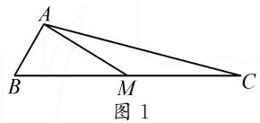
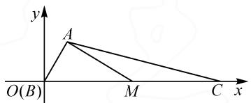
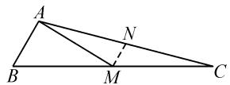

# 强化“三思维”,破解三角形

# 山东省东营市第一中学 林翠 刘德金

摘要: 解三角形问题可以有效沟通初中平面几何与高中相关知识, 实现知识的交汇与融合, 一直是高考中的基本考点, 本文中结合高考真题加以实例分析, 从不同思维视角切入, 强化破解三角形问题的“三思维”, 总结规律, 启示教学, 指导数学教学与解题研究.

关键词:三角形;正弦定理;余弦定理;坐标;几何

解三角形试题一直是历年高考命题的基本考点与热点问题之一,有时以解答题的形式出现,有时以选择题或填空题的形式出现,简单直观,变化多端.此类问题可以很好实现初中数学与高中数学之间的无缝链接,综合体现“在知识点交汇处命题”的高考命题指导思想,合理交汇与融合解三角形、函数、三角函数、平面几何与平面解析几何、基本不等式等相关知识,备受命题者青睐.

# 1 真题呈现

高考真题 如图 1, 在 $\triangle ABC$ 中, $\angle B = 60^{\circ}$ , $AB = 2$ , $M$ 是 $BC$ 的中点, $AM = 2\sqrt{3}$ , 那么 $AC = \_$ ; $\cos \angle MAC = \_$ .

text_image

A
B
M
C
图 1

# 2 真题剖析

此题以浙江卷所特有的特色——“两空”形式展现，通过三角形一边的中点引入，使得三角形“一分为二”，结合相关的边长与角度来巧妙设置，进而求解对应的边长与相应角的余弦值问题.

题目简单易懂,条件简明扼要,破解时,可以从解三角形问题的背景出发,或借助解三角形思维来处理,或建立平直直角坐标系结合坐标法来运算,或通过平面几何来直观推理与运算等,都可以达到合理处理、巧妙破解的目的.

# 3 真题破解

思维视角一: 解三角形思维.

方法 1: “正弦定理 + 余弦定理” 法.

解析: 在 $\triangle ABM$ 中, 由正弦定理得 $\frac{AB}{\sin\angle AMB} = \frac{AM}{\sin B}$ , 则有 $\sin\angle AMB = \frac{AB \cdot \sin B}{AM} = \frac{1}{2}$ , 结合 AB < AM, 可得 $\angle AMB = 30^{\circ}$ .

所以 $\angle BAM = 90^{\circ}$ ，又 $M$ 是 $BC$ 的中点，所以 $BM = CM = 4$ ，则有 $BC = 8$

在 $\triangle ABC$ 中，由余弦定理，得 $AC^{2}=2^{2}+8^{2}-2\times2\times8\cos60^{\circ}=52$ ，可得 $AC=2\sqrt{13}$ .

在 $\triangle AMC$ 中，由余弦定理，得 $\cos \angle MAC = \frac{AM^2 + AC^2 - MC^2}{2AM\cdot AC} = \frac{12 + 52 - 16}{2\times 2\sqrt{3}\times 2\sqrt{13}} = \frac{2\sqrt{39}}{13}.$

点评:根据题目条件,结合“已知两边与一边的对角”选择正弦定理来切入,求得对应角的正弦值,并通过三角形的性质确定对应角,利用直角求得三角形一边的长度,再利用余弦定理求得第三边的长度,并确定对应角的余弦值.巧妙借助正弦定理与余弦定理的联合应用来合理解决相关的解三角形问题.

方法 2: 诱导公式法.

解析:以上部分同方法1,可得 $AC=2\sqrt{13}$ .

在 $\triangle ABC$ 中,由正弦定理得 $\frac{BC}{\sin\angle BAC}=\frac{AC}{\sin B}$ ,则有 $\sin\angle BAC=\frac{BC\cdot\sin B}{AC}=\frac{2\sqrt{39}}{13}$ .

所以可得 $\cos\angle MAC=\sin(90^{\circ}+\angle MAC)=\sin(\angle BAM+\angle MAC)=\sin\angle BAC=\frac{2\sqrt{39}}{13}.$

点评:在求得三角形第三边长度的情况下,通过正弦定理的转化,并利用诱导公式的应用,进而确定对应角的余弦值.巧妙利用直角的转化,通过诱导公式的应用来处理相应三角形内角的三角函数值.诱导公式法的应用,是在特殊角的背景下才可以实现的.

方法 3: 余弦定理法.

解析: 在 $\triangle ABM$ 中, 由余弦定理, 得

$$
A M ^ {2} = B A ^ {2} + B M ^ {2} - 2 B A \cdot B M \cos 6 0 ^ {\circ}.
$$

所以有 $(2\sqrt{3})^{2}=2^{2}+BM^{2}-2\times2\cdot BM\cdot\frac{1}{2}$ ，整理得 $BM^{2}-2BM-8=0$ ，解得BM=4或-2（舍去）.

由于 M 是 BC 的中点, 因此 MC=4, BC=8.

在 $\triangle ABC$ 中，由余弦定理，得 $AC^{2}=2^{2}+8^{2}-2\times2\times8\cos60^{\circ}=52$ ，可得 $AC=2\sqrt{13}$ .

在 $\triangle AMC$ 中,由余弦定理,得

$$
\cos \angle M A C = \frac {A M ^ {2} + A C ^ {2} - M C ^ {2}}{2 A M \cdot A C} = \frac {2 \sqrt {3 9}}{1 3}.
$$

点评:根据题目条件,结合“已知两边与一边的对角”选择余弦定理来切入,建立对应的方程来求得对应线段的长度,利用中点关系求得三角形一边的长度,再利用余弦定理求得第三边的长度,并确定对应角的余弦值.巧妙借助余弦定理来综合处理形式各样的解三角形问题,方程思想的应用有助于简化解题过程,提升解题效益.

思维视角二:坐标思维.

方法 4: 坐标法.

解析: 如图 2 所示, 以 B 为坐标原点, BC 所在直线为 x 轴建立平面直角坐标系. 根据题目条件可知 $A(1, \sqrt{3})$ .

text_image

y
A
O(B)
M
C x

图2

设 $M(t,0)(t>0)$ ，则有 $AM^{2}=(t-1)^{2}+3=12$ ，解得t=4或-2（舍去），所以 $M(4,0)$ 。结合M是BC的中点，可得 $C(8,0)$ 。

所以 $AC=\sqrt{(1-8)^{2}+(\sqrt{3})^{2}}=2\sqrt{13}.$

又由于 $\overrightarrow{AM} = (3, -\sqrt{3})$ ， $\overrightarrow{AC} = (7, -\sqrt{3})$ ，因此 $\cos \angle MAC = \frac{\overrightarrow{AM}\cdot\overrightarrow{AC}}{|\overrightarrow{AM}||\overrightarrow{AC}|} = \frac{21 + 3}{2\sqrt{3}\times 2\sqrt{13}} = \frac{2\sqrt{39}}{13}.$

点评:根据平面直角坐标系的建立,结合条件确定相关点的坐标并设出对应点的坐标,利用两点间的距离公式建立关系式确定对应的参数值,进而确定所设点的坐标,通过中点性质的应用确定相关点的坐标,利用两点间的距离公式求得三角形第三边的长度,并利用平面向量的数量积公式的变形来求解对应角的余弦值.借助坐标法,通过代数运算来解决对应的解三角形问题,对数学运算能力的要求较高.

思维视角三:平面几何思维.

方法 5: 几何法.

解析: 如图 3 所示, 取 AC 的中点 N, 连接 MN, 由于 M 是 BC 的中点, 则有 $MN = \frac{1}{2} AB = 1$ .

  
图3

在 $\triangle ABM$ 中，利用余弦定理有 $AM^{2}=BA^{2}+BM^{2}-2BA\cdot BM\cos60^{\circ}$ .

于是有 $(2\sqrt{3})^{2}=2^{2}+BM^{2}-2\times2\cdot BM\cdot\frac{1}{2}$ ，整理得 $BM^{2}-2BM-8=0$ ，解得BM=4或-2（舍去）.

由于 $AB^{2} + AM^{2} = BM^{2}$ ，因此 $\angle BAM = 90^{\circ}$ ，则有 $MN \perp AM$ .

因而 $AN = \sqrt{AM^2 + MN^2} = \sqrt{13}$ ，所以 $AC = 2AN = 2\sqrt{13}$ .

在 Rt $\triangle AMN$ 中， $\cos\angle MAC=\frac{AM}{AN}=\frac{2\sqrt{3}}{\sqrt{13}}=\frac{2\sqrt{39}}{13}$ .

故填答案: $2\sqrt{13}$ ; $\frac{2\sqrt{39}}{13}$ .

点评:通过平面几何图形的数形直观,取相应边的中点,利用三角形的中位线定理确定对应的线段长度,结合“已知两边与一边的对角”选择余弦定理来切入,建立对应的方程求得对应线段的长度;通过三角形中三边长满足勾股定理确定垂直关系,进而结合平行线的性质转化垂直关系,确定对应的线段长度,进而求得三角形第三边的长度,并利用直角三角形中三角函数的定义求解对应边的余弦值.借助几何法,合理添加辅助线,直观形象,通过平面几何知识来转化与应用,逻辑推理能力强.

# 4 教学启示

解决解三角形问题最常见的思维方式主要包括以下三种：

(1) 解三角形思维, 借助正弦定理、余弦定理以及三角形的基本性质、面积公式等加以转化与应用. 用此思维破解问题时, 关键是通过正弦定理、余弦定理等合理沟通三角形的边与角的联系, 实现条件与结论之间的相互转化, 或解方程, 或解三角函数等, 借助代数运算, 进行必要的逻辑推理与代数运算等处理.  
(2)坐标思维,借助平面直角坐标系的建立,通过坐标运算来转化与应用.合理构建平面直角坐标系,把三角形放置其中,通过点的坐标的确定、向量的坐标的建立、直线方程的表示等,合理转化,或利用距离公式、夹角公式等来转化相应的长度、角的大小问题,将几何问题抽象为纯代数问题,利用平面解析几何或平面向量的相关知识来分析与处理.  
(3) 平面几何思维, 借助平面几何的直观形象性加以转化与应用. 合理构建平面几何图形中的边、角、线段等, 添加相应的辅助线, 通过平面几何的相关知识来转化边、角关系, 以初中平面几何知识交汇高中三角函数等相关知识, 合理逻辑推理, 巧妙代数运算, 综合处理与巧妙应用. Z