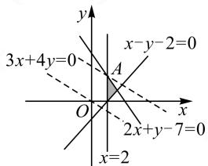
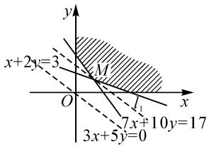
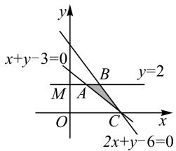
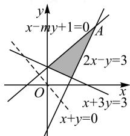
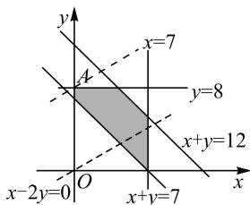
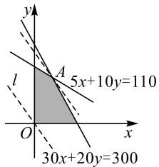

# 线性规划常见题型及解法例析

# 安徽省芜湖市南陵中学 汪珊珊

线性规划问题是高考的必考内容和热点之一,主要考查在线性约束条件下的函数最值问题以及应用线性规划的方法解决一些实际问题;内容涉及到了所有题型,其中选择题和填空题的分值占6\~8分,解答题中分值高达10\~15分,其重要性可见一斑.所以,无论是在平时的学习还是高考备考中,我们都应该注重学习和掌握线性规划知识,强化解题训练,熟知常见题型及解题方法,这样才能在考场上应对自如地获取高分,不断提升自身的数学综合能力.现将线性规划常见的题型及解题的思路与方法归纳如下.

# 1 以数形结合思想为指导,解决函数问题

例 1 （2022 年高考浙江卷）若 x, y 满足约束条件 $\left\{\begin{aligned}x-2&\geqslant0,\\ 2x+y&-7\leqslant0,\end{aligned}\right.$ 则 $z=3x+4y$ $x-y-2\leqslant0,$ 的最大值是( ).

A.20

B.18

C.13

D.6

text_image

3x+4y=0
x-y-2=0
A
O
2x+y-7=0
x=2

图1

解析: 画出不等式组对应的可行域, 如图 1 所示.
当动直线 $3x + 4y - z = 0$ 过点 A 时, z 有最大值.由 $\left\{\begin{aligned}x=2,\\ 2x+y-7=0,\end{aligned}\right.$ 可得 $\left\{\begin{aligned}x=2,\\ y=3,\end{aligned}\right.$ 则A(2,3).

故当 x=2, y=3 时， $z_{\max}=3\times2+4\times3=18$ .

故选：B.

思路与方法:本题运用数形结合思想,采用了图解法求最值,先在平面直角坐标系中画出可行域,然后平行移动直线 $z=3x+4y$ 即可求出最大值.

例 2 （2022 年重庆市仿真试题）变量 x, y 满足
约束条件 $\left\{\begin{aligned}x+2y&\geqslant3,\\ 7x+10y&\geqslant17,\\ x&\geqslant0,\\ y&\geqslant0,\end{aligned}\right.$ 求 $z=3x+5y$ 的最小值.
求 $z=3x+5y$ 的最小值.

解析:画出约束条件表示的点 $(x,y)$ 的可行域,如图2所示的阴影部分(包括边界直线).作直线 $l:3x+5y=0$ ,把直线l向右上方

text_image

x+2y=3
M
O
I₁
7x+10y=17
3x+5y=0

图2

平行移至 $l_{1}$ 的位置时，直线经过可行域上的点 $M$ ，此时， $l_{1}:3x + 5y - z = 0$ 的纵截距最小，则 $z = 3x + 5y$ 取得最小值.由方程组 $\left\{ \begin{array}{ll}x + 2y = 3,\\ 7x + 10y = 17, \end{array} \right.$ 解得 $M(1,1)$ .故当 $x = 1,y = 1$ 时， $z$ 的最小值为8.

思路与方法:本题根据已知的约束条件先在直角坐标平面上作图(画出可行域和直线),然后把直线 l 向右上方平行移到 $l_{1}$ ,再通过解方程组得到点 M 的坐标,最后求出最小值.

# 2 转化不规则图形,利用公式求面积

例3（2023年安徽省芜湖市第二次诊断试题）已知不等式组 $\left\{ \begin{array}{l} 2x + y - 6 \geqslant 0, \\ x + y - 3 \leqslant 0, \\ y \leqslant 2. \end{array} \right.$ 求该不等式组表示的平面区域的面积.

解析: 根据所给的不等式组作出可行域, 如图 3 所示. 由图 3 可知, $\triangle ABC$ 的面积即为所求. 易得

$$
S _ {\text {梯形} O M B C} = \frac {1}{2} \times (2 + 3) \times 2 = 5,
$$

$$
S _ {\text {梯形} O M A C} = \frac {1}{2} \times (1 + 3) \times 2 = 4.
$$

text_image

x+y-3=0
y
B
y=2
M
A
O
C
x
2x+y-6=0

图3

所以 $S_{\triangle ABC}=S_{梯形OMBC}-S_{梯形OMAC}=5-4=1.$

思路与方法:本题中的可行域是三角形,而这个不规则的三角形面积很难直接求解,于是将它看作梯形 OMBC 的一部分,利用梯形 OMBC 与梯形 OMAC 的面积之差即可得到 $\triangle ABC$ 的面积.这是把不规则图形转化为规则图形来解决的思路.

例 4 （2022 年安徽师大附中模拟题）如果 $a \geqslant 0$ ， $b \geqslant 0$ ，且当 $\left\{\begin{aligned} x &\geqslant 0,\\ y &\geqslant 0,\\ x &+y \leqslant 1\end{aligned}\right.$ 时，恒有 $ax + by \leqslant 1$ ，求以 a, b 为坐标的点 $P(a, b)$ 所构成的平面区域的面积.

解析: 设 $z = ax + by$ ，根据题意可知，想要 $ax + by \leqslant 1$ 恒成立，当且仅当 $z = ax + by$ 的最大值小于或等于 1, z 的最大值只能在平面区域内的 A(1,0), O, B(0,1) 三点处取得，因此只需要 A, O, B 三点的坐标都

满足不等式 $ax + by \leqslant 1$ ，即 $\left\{ \begin{array}{l} 0 \leqslant a \leqslant 1, \\ 0 \leqslant b \leqslant 1 \end{array} \right.$ 时，则点 $P(a, b)$ 构成的平面区域是边长为 1 的正方形，故面积是 1.

思路与方法:本题中由于存在字母系数,很多学生都感到一时无从下手,这时就需要运用转化的思想,把不熟悉的问题转化为熟悉的正方形面积问题来解决.

# 3 建立对应关系式,求参数的取值或范围

例 5 （2022 年浙江杭州二中测试题）若实数 x，
y 满足不等式组 $\left\{\begin{aligned}x+3y-3&\geqslant0,\\ 2x-y-3&\leqslant0,\end{aligned}\right.$ 且 $x+y$ 的最大值为 9，
则实数 m 的值为()。

A.-2

B.-1

C.1

D.2

解析: 因为直线 $x - my + 1 = 0$ 过定点 $(-1, 0)$ ，根据 $x + y = z$ 取最大值及另外两个线性不等式大致作出可行域（如图 4 所示），则平移直线 $x + y = 0$ 可知，z 应在点 A 处取最大值 9.

text_image

x-my+1=0
A
2x-y=3
O
x+3y=3
x+y=0

图4

由 $\left\{\begin{aligned}x+y=9,\\ 2x-y=3,\end{aligned}\right.$ 解得 $\left\{\begin{aligned}x=4,\\ y=5.\end{aligned}\right.$

又因为点 $A(4,5)$ 在直线 $x - my + 1 = 0$ 上，所以 m = 1.

故选：C.

思路与方法:本题属于线性问题中含有参数,要求参数的取值问题.首先确定可行域,然后结合题意寻找符合条件的最优解,建立相对应的关系式(方程组)即可获解.

# 4 用线性规划解决实际问题

例 6 （2022 年安徽省芜湖市一中检测卷）某百货公司仓库 A 存有货物 12 t，仓库 B 存有货物 8 t，现按 7 t，8 t 和 5 t 把货物分别调运给甲、乙、丙三个商场。从仓库 A 运货物到商场甲、乙、丙，运费分别为 8 元/t、6 元/t、9 元/t；从仓库 B 运货物到商场甲、乙、丙，运费分别为 3 元/t、4 元/t、5 元/t。问应如何安排调运方案，才能使得从两个仓库运货物到三个商场的总运费最少？

解析:(1)模型建立.设仓库A运给甲、乙商场的货物分别为x t,y t,则由表1可知仓库A运给丙商场的货物分别 $(12-x-y)$ t,从而仓库B运给甲、乙、丙商场的货物分别为 $(7-x)$ t, $(8-y)$ t, $(x+y-7)$ t,于是总运费为 $z=8x+6y+9(12x-x-y)+3(7-x)+4(8-y)+5(x+y-7)=x-2y+126.$

所以得到的数学模型为: 求 $z = x - 2y + 126$ 在约

束条件 $\left\{\begin{aligned}12-x-y&\geqslant0,\\ 7-x&\geqslant0,\\ 8-y&\geqslant0,\\ x+y-7&\geqslant0,\\ x&\geqslant0,\\ y&\geqslant0,\end{aligned}\right.$ 即 $\left\{\begin{aligned}x+y&\leqslant12,\\ 0&\leqslant x\leqslant7,\\ 0&\leqslant y\leqslant8,\\ x+y&\geqslant7\end{aligned}\right.$ 下的最小值.

表 1 单位: 元/t

<table><tr><td></td><td>甲</td><td>乙</td><td>丙</td></tr><tr><td>A</td><td>8</td><td>6</td><td>9</td></tr><tr><td>B</td><td>3</td><td>4</td><td>5</td></tr></table>

(2) 模型求解. 作出上述不等式组表示的平面区域, 即可行域, 如图 5 所示.

作出直线 l: x - 2y = 0，把直线 l 平行移动，显然当直线 l 移动到过点 A(0, 8) 时，在可行域内 z = x -$2y+126$ 取得最小值 $z_{\min}=0-2\times8+126=110$ ，则 $x=0,y=8$ 时，总运费最少.

text_image

y
x=7
A
y=8
x+y=12
O
x-2y=0
x+y=7

图5

(3) 模型应用. 安排的调运方案如下:

仓库 A 运给甲、乙、丙商场的货物分别为 0 t, 8 t, 4 t, 仓库 B 运给甲、乙、丙商场的货物分别为 7 t, 0 t, 1 t, 此时, 可使得从两个仓库运货物到三个商场的总运费最少.

思路与方法:本题属于实际问题中给定一项任务,问怎样统筹安排,使完成这项任务耗费的人力、物力资源量最小的问题.解答这类问题的主要思路是运用转化思想,通过设元,写出约束条件和目标函数,将实际问题转化为数学中的线性规划问题来解决.

例 7 （2022 年天津市大港区模拟试题）某公司计划今年内同时出售电子琴和洗衣机，由于这两种产品的市场需求量非常大，有多少就能销售多少，因此该公司要根据实际情况（如资金、劳动力等）确定产品的月供应量，以使得总利润达到最大。已知对这两种产品有直接限制因素的是资金和劳动力，通过调查，得到这两种产品的有关数据如表 2.

表 2

<table><tr><td rowspan="2">资金</td><td colspan="2">单位产品所需资金/百元</td><td rowspan="2">月资金供应量/百元</td></tr><tr><td>电子琴(架)</td><td>洗衣机(台)</td></tr><tr><td>成本</td><td>30</td><td>20</td><td>300</td></tr><tr><td>劳动力(工资)</td><td>5</td><td>10</td><td>110</td></tr><tr><td>单位利润</td><td>6</td><td>8</td><td></td></tr></table>

试问:怎样确定这两种产品的月供应量,才能使

总利润达到最大,最大利润是多少?

解析:设电子琴和洗衣机的月供应量分别为 x 架、y 台, 总利润为 z 百元, 则 $\left\{\begin{aligned}x&\geqslant0,\\ y&\geqslant0,\end{aligned}\right.$ 30x+20y≤300, 且 $z=6x+8y$ .

5x+10y≤110, $x,y\in N,$

作出上述不等式组表示的平面区域,即可行域(如图6中阴影部分内的整点).令z=0,作直线 $l:6x+8y=0$ ,当平行移动直线l过可行域内的点A时, $z=6x+8y$ 能够取得最大值.由方程组 $\left\{\begin{aligned}&30x+20y=300,\\ &5x+10y=110,\end{aligned}\right.$ 得 $\left\{\begin{aligned}x=4,\\ y=9.\end{aligned}\right.$

text_image

y
A
5x+10y=110
l
O
x
30x+20y=300

图6

将 $A(4,9)$ 代入 $z=6x+8y$ ，得

$$
z _ {\max} = 6 \times 4 + 8 \times 9 = 9 6.
$$

所以当月供应量为电子琴 4 架、洗衣机 9 台时，公司可获得最大利润是 96 百元.

思路与方法:本题是给定一定的人力、物力资源,问怎样运用这些资源,使完成的任务量最大,收到的效益或利润最大.解答这类问题时,首先要认真审题,明确约束条件中有无等号,未知数是否有限制等;其次是写出线性约束条件及目标函数,然后作出可行域,在可行域内求出最优解;最后将求解出来的结论反馈到具体的实例中,设计出最佳方案.

综上所述，线性规划问题在实际生产和生活中应用十分广泛，解决线性规划问题的基本方法是图解法，它是数形结合思想、等价转化思想以及函数思想与方法的具体体现。灵活运用线性规划知识，可将一些抽象的、不熟悉的、难度较大的问题化为具体的、熟悉的、较简单的问题来解决；学会并掌握这些解题思路与方法，能够帮助我们快速、准确地找到解决问题的突破口，有助于不断提高数学综合解题能力。Z

# (上接第74页)

已知抛物线 $y^{2}=2x$ 及点 $P(1,1)$ ，过点 P 且不重合的直线 $l_{1}, l_{2}$ 与此抛物线分别交于点 A, B, C, D，证明：A, B, C, D 四点共圆的充要条件是直线 $l_{1}, l_{2}$ 的倾斜角互补.

真题2（2011年全国高中数学联赛第11题）作斜率为 $\frac{1}{3}$ 的直线 $l$ 交椭圆 $C: \frac{x^2}{36} + \frac{y^2}{4} = 1$ 于 $A, B$ 两点，且 $P(3\sqrt{2}, \sqrt{2})$ 在直线 $l$ 的左上方。（1）证明： $\triangle PAB$ 的内切圆的圆心在一条定直线上；（2）若 $\angle APB = 60^\circ$ ，求 $\triangle PAB$ 的面积。

真题3（2017年全国I卷理科数学第20题）已知椭圆 $C: \frac{x^2}{a^2} + \frac{y^2}{b^2} = 1 (a > b > 0)$ ，四点 $P_1(1,1)$ ， $P_2(0,1), P_3\left(-1, \frac{\sqrt{3}}{2}\right), P_4\left(1, \frac{\sqrt{3}}{2}\right)$ 中恰有三点在椭圆 $C$ 上。(1)求 $C$ 的方程；(2)设直线 $l$ 不经过点 $P_2$ 且与 $C$ 相交于 $A, B$ 两点。若直线 $AP_2, BP_2$ 的斜率之和为 $-1$ ，证明：直线 $l$ 过定点。

真题 4 （2021 年全国新高考 I 卷第 21 题）在平面直角坐标系中，已知 $F_{1}(-\sqrt{17},0)$ ， $F_{2}(\sqrt{17},0)$ ，点 M 满足 $\left|MF_{1}\right|-\left|MF_{2}\right|=2$ 。记 M 的轨迹为 C。

(1) 求 C 的方程;

(2)设点 T 在直线 $x=\frac{1}{2}$ 上, 过点 T 的两条直线分别交 C 于点 A, B 和 P, Q, 且 $\left|TA\right|\cdot\left|TB\right|=\left|TP\right|\cdot$

$|TQ|$ ，求直线 AB, PQ 的斜率之和.

# 5 小结反思

纵观近几年全国卷新高考试题,发现全国卷不回避以往的高考题和常用结论.解析几何大题注重基础,很多题目来源于教材或历年高考题,而且都有着内涵丰富的知识背景.从一题多解到一题多变,亦或是多题一解,我们要鼓励学生“多思少算”,打破以往的“模式化”,充分挖掘题目的教学价值,发展创新思维能力和应用数学解决实际问题的能力,提升数学素养.同时,在新高考、新教材的衔接中要主动改革学习方式和育人方式,贯彻立德树人的要求.

2024 年 1 月, 教育部教育考试院命制数学科适应性测试卷, 并组织了相关省份进行适应性演练. 其中第 18 题解析几何题不仅分值增加, 而且更突出对学生思维品质的考查, 引起一线教师和专家学者的广泛关注. 教师更加深刻地认识到教学中要引导学生回归教材, 减少死记硬背和机械刷题, 学会融会贯通、灵活应用; 鼓励学生夯实基础, 多角度思考, 深入探究, 从而提升思维品质和数学素养.

教学是一门艺术, 是一门可以一直追求完美, 但不可能完美的艺术. 知识、能力与素养都是我们追求的目标. 路漫漫其修远兮, 只要不停息, 一起一步步地继续探索, 数学核心素养自然会在学生心里生根发芽, 慢慢生长. Z