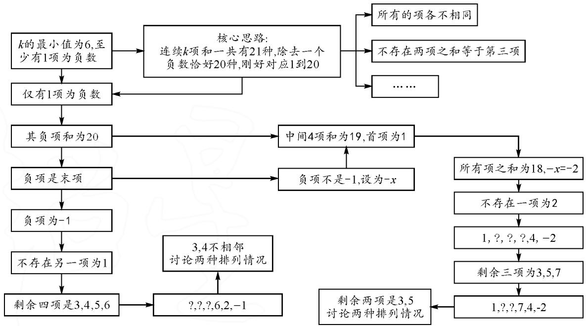
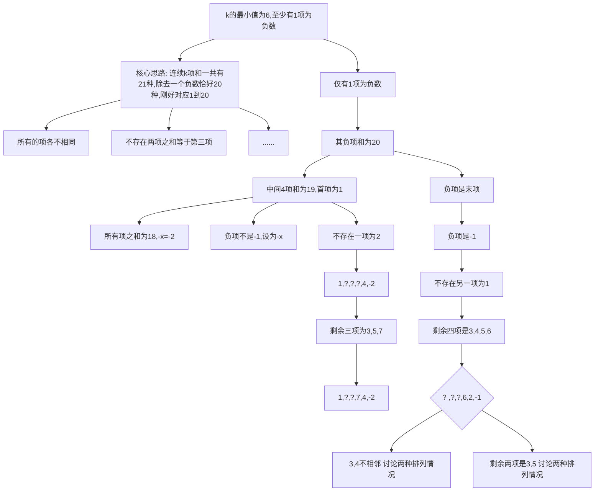
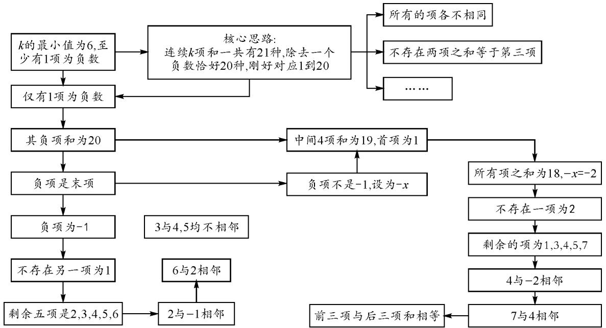
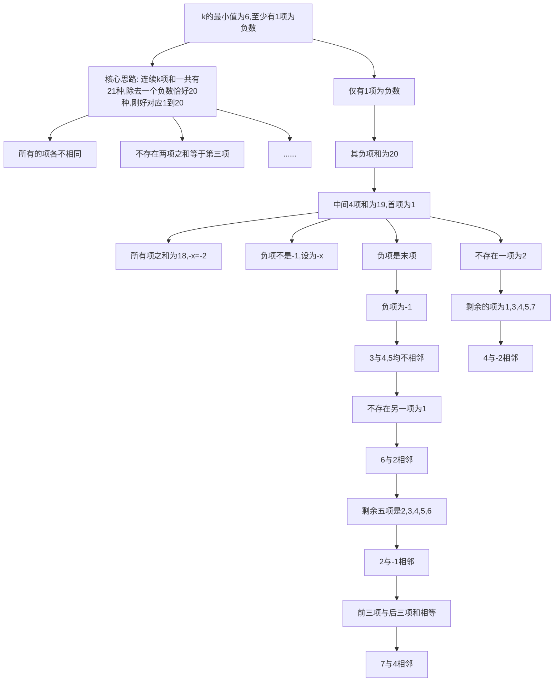

讲题比赛特等奖获奖论文之二十：

# 2022 年北京高考压轴题解法探究

●北京大学 徐震洋

# 1 真题呈现

已知 $Q:a_{1},a_{2},\cdots,a_{k}$ 为有穷整数数列.给定正整数 m，若对于任意的 $n\in\{1,2,\cdots,m\}$ ，Q 中存在 $a_{i},a_{i+1},\cdots,a_{i+j}(j\geqslant0)$ ，使得 $a_{i}+a_{i+1}+\cdots+a_{i+j}=n$ ，则称 Q 为 m-连续可表数列.

(1) 判断 Q:2,1,4 是否为 5-连续可表数列？是否为 6-连续可表数列？说明理由.  
(2) 若 $Q: a_{1}, a_{2}, \cdots, a_{k}$ 为 8-连续可表数列，求证：k 的最小值为 4.  
(3) 若 $Q: a_{1}, a_{2}, \cdots, a_{k}$ 为 20-连续可表数列，且 $a_{1} + a_{2} + \cdots + a_{k} < 20$ ，求证： $k \geqslant 7$ .

# 2 简析第(1)(2)问

(1) $1=a_{2},2=a_{1},3=a_{1}+a_{2},4=a_{3},5=a_{2}+a_{3}$ ，因此Q:2,1,4是5-连续可表数列.

由于数列中任意连续两项之和均不为6，而 $a_{1}+a_{2}+a_{3}=7$ 为数列Q的前三项之和.因此Q:2,1,4不是6-连续可表数列.

(2)(i)k<4时,数列中连续三项能表示的数字最多只有6个,当k=3时:

$$
\boxed { \begin{array}{c} a _ {1}, a _ {2}, a _ {3} \\ a _ {1} + a _ {2}, a _ {2} + a _ {3} \\ a _ {1} + a _ {2} + a _ {3} \end{array} }
$$

这 6 个数字构成的集合必然不可能有 8 个元素，故小于 4 项的 Q 数列不可能是 8-连续数列.

(ii) k=4 时, 可构造出 Q:1,3,3,2 是 8-连续数列.

# 3 第(3)问的核心思路

经过第(2)问的探究,不难发现,形如 $a_{i} + a_{i+1} + \cdots + a_{i+j}$ 的式子是有限的,即当项数为6时,一共有21个,我们将其列在下列数表中(以下统称为数表):

$$
\begin{array}{c} a _ {1}, a _ {2}, \dots \dots , a _ {6} \\ a _ {1} + a _ {2}, a _ {2} + a _ {3}, \dots \dots , a _ {5} + a _ {6} \\ a _ {1} + a _ {2} + a _ {3}, \dots \dots , a _ {4} + a _ {5} + a _ {6} \\ a _ {1} + a _ {2} + a _ {3} + a _ {4}, a _ {2} + a _ {3} + a _ {4} + a _ {5}, a _ {3} + a _ {4} + a _ {5} + a _ {6} \\ a _ {1} + a _ {2} + \dots \dots + a _ {5}, a _ {2} + a _ {3} + \dots \dots + a _ {6} \\ a _ {1} + \dots \dots + a _ {6} \end{array}
$$

所以 k=6 时, 数表中有 20 个数字对应了 1,2,……, 20 这 20 个正整数.

又因为 $a_{1}+\cdots+a_{6}<20$ ，而上述 21 个数字中有一个等于 $20, a_{1}\neq a_{6}$ 中有一个为负数，即除了这个数字以外的其他数字恰好与 $1,2,\cdots20$ 对应.

因此:数表中所有数字各不相同,且分别对应1,2,……,20和一个负数.

# 4 第(3)问的解析

方法 1: 整体分析, 奇偶性巧解.

证法 1: 假设 $k \leqslant 6$ ，下证不存在符合要求的 20-连续可表数列.

记所有的 $a_{i} + a_{i+1} + \cdots + a_{i+j}$ 构成的集合为 A，则 A 中至少有 20 个元素.

因为 $k \leqslant 5$ 时，A 中至多有 $C_{5}^{2} + 5 = 15$ 个元素，所以 $k \geqslant 6$ .

由题意可知,存在连续 j 项和为 20,而所有项之和小于 20,因此至少有一项为负数.

k=6 时，A 中至多有 $C_{6}^{2}+6=21$ 个元素，且其中至少一个为负数.

所以数列中仅有一项为负数,且剩下的任意连续k项和刚好对应1到20的所有正整数.(\*)

数列中任意连续 $j_{1}$ 项与任意连续 $j_{2}$ 项均不相等. ( $*$ $*$ )

又因为数列所有项之和小于20，且任意连续k项之和可以表达的数字最大为20，所以若除了负数以外的部分项为20，则这部分项的相邻项只可能是负数.

不妨假设负数项在中间,这一项之前的所有项之和为20,由(\*),负数项与其之后的所有项之和是正整数,所以数列所有项之和大于等于20,不符合题意!

故除了负数以外的所有项是连续的项,不妨令 $a_{6}<0$ .

假设 k=6，不妨令 $a_{6}\leqslant-1$ ，则 $a_{1}+a_{2}+a_{3}+a_{4}+a_{5}=20$ 。

由题意可知， $1+2+\cdots\cdots+20+a_{6}=6a_{1}+10a_{2}+12a_{3}+12a_{4}+10a_{5}+6a_{6}$ ，即 $210+a_{6}=6a_{1}+10a_{2}+12a_{3}+12a_{4}+10a_{5}+6a_{6}$ .

所以 $a_{6}$ 是偶数,由之前解法得 $a_{6} = -2$ ;

$$
2 1 0 = 1 2 0 + 4 a _ {2} + 6 a _ {3} + 6 a _ {4} + 4 a _ {5} - 1 0;
$$

$$
5 0 = 2 (a _ {2} + a _ {3} + a _ {4} + a _ {5}) + (a _ {3} + a _ {4}) <   3 (a _ {2} + a _ {3} + a _ {4} + a _ {5}) - 3.
$$

故 $a_{2} + a_{3} + a_{4} + a_{5}\geqslant 18.$

又因为 $a_{1}+\cdots+a_{6}=18$ ，所以 $a_{2}+a_{3}+a_{4}+a_{5}=19, a_{1}=1, a_{3}+a_{4}=12, a_{2}+a_{5}=7.$

由 $a_1, a_2, a_5, a_1 + a_2, a_5 + a_6$ 是互不相等的正整数，得

$$
a _ {2} = 1 \text {时,} a _ {1} = 1 = a _ {2};
$$

$$
a _ {2} = 2 \text {时,} a _ {1} + a _ {2} = 3 = a _ {5} + a _ {6};
$$

$$
a _ {2} = 3 \text {   时   }, a _ {1} + a _ {2} = 4 = a _ {5};
$$

$$
a _ {2} = 4 \text {时,} a _ {1} = 1 = a _ {5} + a _ {6};
$$

$a_{2}=5$ 或 6 时， $a_{5}+a_{6}$ 不是正整数.

故没有一种情况符合题意,假设不成立,因此 $k \geqslant 7$ ,原命题得证!

点评:证法1将所有数表中的式子全部相加并考虑得到的整个求和式,是目前为止最简洁的做法.虽然已经是最简,但是这个做法依然需要在前期花费大量笔墨书写基本结论的证明,正常人不可能在短时间内写出这道题的严谨证法.

方法 2: 逻辑推理, 逐个确定.

思维导图如图 1 所示.

flowchart

图1

证法 2: 同证法 1, ① $a_{6}=-1$ 时的情形.

若存在 $a_{i}=1$ ，由（\*）得 $i\neq5$ ，此时 $a_{i}+\cdots\cdots+a_{6}=a_{i+1}+\cdots\cdots+a_{5}$ ，与（\*\*）矛盾.

所以数列中不存在一项为 1, 必存在连续两项和为 1, 故 $a_{5} = 2$ .

由 $(*)$ $(**$ )及 $a_{1}+a_{2}+a_{3}+a_{4}=18$ 可知，剩余四项必为3,4,5,6.

若 $a_4 \neq 6$ ，则 $a_4 + a_5 + a_6 = a_4 + 1 = 4$ 或 5 或 6，与 $(\ast \ast)$ 矛盾。

故 $a_{4}=6, a_{4}+a_{5}+a_{6}=7$ ，故 3 与 4 不相邻，数列有以下 2 种情况：

(i)3,5,4,6,2,-1,对于这种情况, $a_{1}+a_{2}=a_{4}+a_{5}$ ,与 $(**)$ 矛盾;

(ii) 4, 5, 3, 6, 2, -1, 对于这种情况, $a_{2} + a_{3} = a_{4} + a_{5}$ , 与 $(\ast \ast)$ 矛盾.

故 $a_{6}=-1$ 时, 没有满足要求的数列.

② $a_{6}<-2$ 时的情形.

由于 $a_1 + \dots + a_6 < 18$ ，若 $a_1 + a_2 + a_3 + a_4 = 19, a_5 = 1$ ，则 $a_5 + a_6 < 0$ ，与 (\*) 矛盾。故 $a_2 + a_3 + a_4 + a_5 = 19, a_1 = 1$ .

由于不存在两项为1，只可能有 $a_1 + a_2 + a_3 + a_4 = 18, a_5 = 2$ ，此时 $a_5 + a_6 < 0$ ，与 $(*)$ 矛盾.

③ $a_{6}=-2$ 时的情形.

同(1)可得,数列中没有一项为2,只可能有 $a_{5}=4$ ,而 $a_{2}+a_{3}+a_{4}=15$ ,且这些项只可能是3,5,6,7,……

又 $a_{4}+a_{5}+a_{6}\neq5,7$ ，故 $a_{4}=7$ ，只剩下两种情况：

(i)1,3,5,7,4,-2, $a_{1}+a_{2}=a_{5}$ ，与（\*\*）矛盾；

(ii) 1, 5, 3, 7, 4, -2, $a_{1} + a_{2} + a_{3} = a_{4} + a_{5} + a_{6}$ , 与 ( $*$ $*$ ) 矛盾.

故 $a_{6}<-1$ 时, 没有满足要求的数列.

综上， $k \leqslant 6$ 时不存在符合要求的 20-连续可表数列，原命题得证！

点评:证法2是最自然的做法,要求考生从题目中获取隐藏的信息点并进行层层递进的逻辑推理,牢牢抓住 $(*)$ 和 $(*** )$ 两个结论并耐心地逐个确定数列中的项,最终排除 $k \leqslant 6$ 的所有情况.需要注意的是,有些做法是从20往下逐个判断数字是否出现在数表中,但是这样的做法在书写上不能达到严谨的要求,因为证明某个数字(比如16,17)不在数表中是很困难的.

方法 3: 考虑相邻, 逻辑反复.

思维导图如图 2 所示.

flowchart

图2

证法 3: 同证法 1 可以得到以下结论.

数列中仅有一项为负数,且剩下的任意连续 k 项和刚好对应 1 到 20 的所有正整数; (\*)

数列中任意连续 $j_{1}$ 项与任意连续 $j_{2}$ 项均不相等.
( \* \*)

负数项为首项或者末项,不妨设 $a_{6}<0$ .

① $a_{6}=-1$ 时的情形.

若存在 $a_{i}=1$ ，由（\*）得 $i\neq5$ ，此时 $a_{i}+\cdots\cdots+a_{6}=a_{i+1}+\cdots\cdots+a_{5}$ ，与（\*\*）矛盾.

所以剩下的项各不相同且最小为 2, 只能是 2, 3, 4, 5, 6.

因为 3,4,5,6 与 -1 相邻时， $a_{5}+a_{6}=2$ 或 3 或 4 或 5，所以 $a_{5}=2$ .

因为 2 与 3,4,5 相邻时， $a_{4}+a_{5}+a_{6}=4$ 或 5 或 6，所以 $a_{4}=6$ .

当 3 与 4 相邻时， $a_{4}+a_{5}+a_{6}=3+4$ ; 3 与 5 相邻时， $a_{4}+a_{5}=3+5$ . 所以没有符合题意的排列方式.

② $a_{6}<-1$ 时的情形.

同解法 1, 可证 $a_{6} = -2$ , 剩下的项互不相同, 且不存在 2, 只能是 1, 3, 4, 5, 6, 7, ……

若 1 或 3 或 4 或 5 不在数列中时， $a_{1} + a_{2} + a_{3} + a_{4} + a_{5} \geqslant 1 + 3 + 4 + 6 + 7 = 21$ ，所以前五项只能是 1, 3, 4, 5, 7.

因为 7,5,3,1 与 -2 相邻时， $a_{5}+a_{6}=-1$ 或 1 或 3 或 5，不合题意，所以 $a_{5}=4$ .

因为 5,3,1 与 4 相邻时， $a_{4}+a_{5}+a_{6}=3$ 或 5 或 7，不合题意，所以 $a_{4}=7$ 。此时 $a_{1}+a_{2}+a_{3}=a_{4}+a_{5}+a_{6}=9$ 。

综上,没有符合要求的数列,原命题得证!

点评:证法3建立在证法2的基础条件上,但是在证明过程中通过数列求和确定了数列中出现的项,同时抓住了与确定项相邻的项具有的特点,从而更好地利用了(\*)和(\*\*)两个结论来处理问题,具有形式简洁、逻辑相似易懂的优点和良好的严谨性,但是也需要考生能够想到利用相邻的逻辑确认某一项的位置.

这道题看似是考查数列,实际上依然在考查集合,围绕两集合相等的条件展开设问,实际上和2020年的北京高考题是一样的,考生应该对集合相等的模型有更深的理解.

纵观以上三种证法,这道题虽然有多种方法进行说理,不在思维上给考生设限,但是不论是哪种方法,都需要强大的论证能力,否则答题纸上只会出现一个又一个的“显然”,丢掉了严谨性而空有一个框架.

两类思路一种是寻找数列具有的某种排布规律，逐个推理、逐个确认，符合正常的逻辑思维，但缺少简洁性，耗费大量时间和笔墨；另一种是整体规划，将所有的可能情况列出来并相加，并从整体进行推理，十分简洁但也具有很强的技巧性.

(下转第32页)

生的知识面,发散了学生的数学思维,让学生感悟“学无止境”的真谛.在解题教学中,不要局限于一种方法,要学会多角度地思考和解决问题,以此避免单一思路无法求解时而陷入茫然.同时,借助以上有效的拓展,锻炼学生思维能力,培养思维的发散性、变通性.

# 4 课后反思

因受“题海战术”的影响,学生在学习过程中容易形成思维定式,在面对一些形似的问题时,往往不假思索地直接套用,进而因为忽视了题目的差异性而造成错误.为了改变这一局面,在解题教学中,教师应尝试应用对比的方式进行分析,引导学生观察题目间的差异性,认清问题的区别与联系,找到合理解决问题的方法,尽量避免思维定式的干扰,有效提高解题能力.

纵观以上解题过程,教师精心设计变式问题,让学生通过变式探究发现“对称”与“不对称”的区别.在教学中,教师遵循“生本”的教学理念,预留充足的时间和空间展示学生的思维过程,让学生在交流互动中得到了不同的解决问题的方法,有效地锻炼了学生的思维能力.以上变式探究中,学生给出了四种不同的解题方法,虽然前面两种解法最终没有得到答案,但是却为继续探究提供了宝贵的资源,推动了自身思维能力的发展.

当然,在此环节中,教师充分发挥了其主导作用.当学生陷入误区时,教师及时地点拨,引导学生利用函数思想方法解决了问题.问题解决后,教师又带领学生分析了二者的区别,给出新的结论让学生继续探索,让学生体会学习是一个不断发展和完善的过程,因此在学习过程中不能满足于现状,应该积极探索新方法,寻求新方案,以此在方法优化的过程中发展思维能力,提高解题效率.

总之,能力的培养是一个漫长的过程.在教学中切勿急于求成,要为学生营造一个宽松适合的学习氛围,积极开展“以生为本”的探究活动,让学生在参与的过程中不断修正思维,以此不断提高解题能力.

# 参考文献：

[1] 王琴, 李晓蒙. 类比推理法在高中数学解题中的应用分析 [J]. 生活教育, 2022(15): 108-110.  
[2] 李栋梁. 变式训练教学模式在高中数学解题中的应用分析 [J]. 数学学习与研究, 2019(18): 131.  
[3] 李源起. 数学分析思想在高中数学解题中的应用探究 [J]. 祖国, 2018(24): 212. Z

# (上接第8页)

# 5 备考指导

# 5.1 学习导向

这道题作为北京高考数学试卷的压轴题,是众多北京尖子生的目标.该题为大家的备考指出了几点方向:

(1) 探究真题、模拟题的一题多解, 学会灵活使用各种思路和技巧;  
(2)学会快速书写严谨过程,再显然的道理也要说明清楚,切勿偷懒,并及时进行复盘(最好同学之间互相讨论),优化、简化自己的过程,从而提高书写过程的速度和严谨性;  
(3)尝试独立思考,切勿依靠标签,要建立自己的思路、建立自己的逻辑框架,一旦有想法就应该勇敢地继续探索!

# 5.2 同类问题

本题考查的是数列中任意连续几项之和所构成的集合,与下面两道模拟卷中的问题非常相似,解题方法也有异曲同工之妙:

(1)(2020年昌平二模压轴)已知有限数列 $\{a_{n}\}$ ，从数列 $\{a_{n}\}$ 中选取第 $i_{1}$ 项、第 $i_{2}$ 项、……、第 $i_{m}$ 项 $(i_{1}<i_{2}<\cdots<i_{m})$ ，顺次排列构成数列 $\{b_{k}\}$ ，其中 $b_{k}=a_{i_{k}},1\leqslant k\leqslant m$ ，则称新数列 $\{b_{k}\}$ 为 $\{a_{n}\}$ 的长度为

m 的子列, 规定: 数列 $\{a_{n}\}$ 的任意一项都是 $\{a_{n}\}$ 的长度为 1 的子列, 若数列 $\{a_{n}\}$ 的每一个子列的所有项的和都不相同, 则称数列 $\{a_{n}\}$ 为完全数列. 设数列 $\{a_{n}\}$ 满足 $a_{n}=n,1\leqslant n\leqslant25,n\in N^{*}$ .

（Ⅰ）判断下面数列 $\{a_{n}\}$ 的两个子列是否为完全数列，并说明理由：

数列①:3,5,7,9,11;数列②:2,4,8,16.

（Ⅱ）数列 $\{a_{n}\}$ 的子列 $\{b_{k}\}$ 长度为m，且 $\{b_{k}\}$ 为完全数列，证明：m的最大值为6；  
（Ⅲ）数列 $\{a_{n}\}$ 的子列 $\{b_{k}\}$ 长度 $m = 5$ ，且 $\{b_{k}\}$ 为完全数列，求 $\frac{1}{b_1} +\frac{1}{b_2} +\frac{1}{b_3} +\frac{1}{b_4} +\frac{1}{b_5}$ 的最大值.

(2)(2022年海淀二模压轴)已知有限数列 $\{a_{n}\}$ 共M项 $(M\geqslant4)$ ，其任意连续三项均为某等腰三角形的三边长，且这些等腰三角形两两均不全等.将数列 $\{a_{n}\}$ 的各项和记为S.

（Ⅰ）若 $a_{n} \in \{1, 2\} (n = 1, 2, \cdots, M)$ ，直接写出 M, S 的值；  
(Ⅱ) 若 $a_{n} \in \{1, 2, 3\} (n = 1, 2, \cdots, M)$ ，求 M 的最大值；  
（Ⅲ）若 $a_{n} \in N^{*} (n = 1, 2, \cdots, M)$ ，M = 16，求 S 的最小值. Z