讲题比赛特等奖获奖论文之十九：

# 兵无常势 水无常形\*

——2022年新高考Ⅱ卷第20题解法分析

# 海南华侨中学 徐香 李玉玲

海南省近几年的高考立体几何解答题都给出了比较规则的几何体,要求进行线面关系的论证和空间角的求解.2022年的高考题打破了这一模式,学生需根据题目所给条件建立直观模型进行理解和分析,对核心素养的要求较高.应透彻了解教材上的定义、定理及其证明,领悟知识本质才能以不变应对题型的万变.当画出的立体图形所表达的位置关系不太精确时,学生需要借助直观想象,结合所学知识将模型分析清楚,将立体关系平面化,进而解决立体几何中的问题.

# 1 试题呈现

(2022 年新高考Ⅱ卷第 20 题) 如图, PO 是三棱锥 P-ABC 的高, PA = PB, AB ⊥ AC, E 是 PB 的中点.

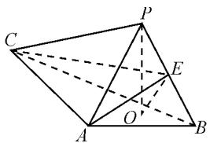

text_image

Geometric diagram of a triangular pyramid with labeled vertices and internal points, used for spatial geometry problems.

图1

(1) 求证: $OE \parallel$ 平面 PAC;  
(2) 若 $\angle ABO = \angle CBO = 30^{\circ}, PO = 3, PA = 5$ ，求二面角 C-AE-B 的正弦值.

# 2 试题分析

本题第(1)问是考查空间中的平行

关系,需要熟练掌握直线与平面平行的判定定理和性质定理,还需要有一定的平面几何知识基础.论证点O的位置时,用相似三角形或者直角三角形相关知识都可解决.与以往高考题不同的是,本题第(1)问并不简单,所给图形中底面直角三角形看上去并不像直角,学生直观感知容易受挫.第(2)问相对容易入手,而且与第(1)问没有直接联系,可跳过第(1)问直接做第(2)问(这就需要考生在考试中灵活处理).建系后将底面单独分离出来,将立体问题平面化,相关点的坐标就很容易找到.如果学生平时只是机械刷题,对概念和定理的本质理解不透彻,那么遇到和平时不一样的数学模型就会心慌退缩,在面对这题时就容易卡在第(1)问,白白浪费了第(2)问的得分机会.

第(1)问和第(2)问的思维导图如图2,图3所示.

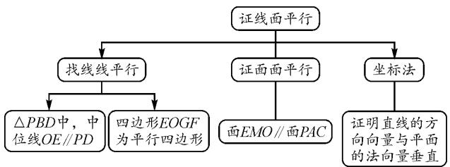

flowchart

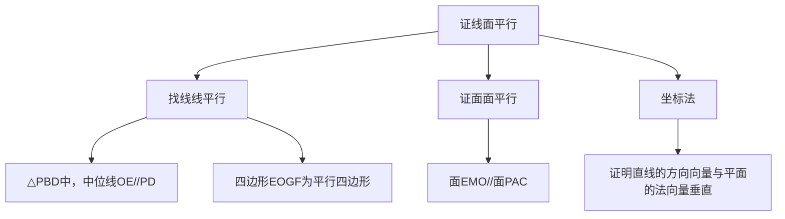

图 2 第(1)问的思维导图

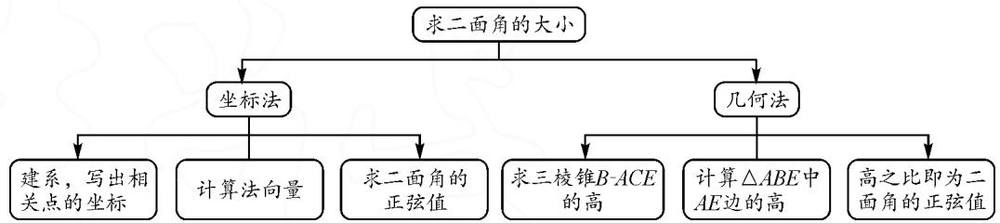

flowchart

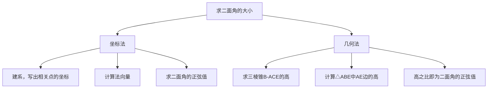

图 3 第(2)问的思维导图

# 3 解题分析

# 3.1 第(1)问的证法分析

3.1.1 角度一: 线线平行 $\Rightarrow$ 线面平行.

方法 1: 利用中位线“寻找”线线平行.

证明: 如图 4, 连接 BO 并延长交 AC 于点 D, 连接 OA, PD.

因为 $PO \perp$ 平面 ABC, AO, BO ⊂ 平面 ABC, 所以 $PO \perp AO, PO \perp BO.$

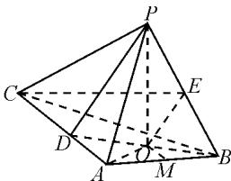

text_image

Geometric diagram of a pyramid with labeled vertices and internal points, used in spatial geometry problems.

图4

因为 PA = PB，所以 $PA^{2} - PO^{2} = PB^{2} - PO^{2}$ ，则 OA = OB， $\angle OAB = \angle OBA$ .

又因为 $AB \perp AC$ ，所以 $\angle OAB + \angle OAD = 90^{\circ}$ ， $\angle OBA + \angle ODA = 90^{\circ}$ .

故 $\angle ODA=\angle OAD$ ，则AO=DO，即AO=DO=OB。所以O为BD的中点。

（如图4，也可以通过取 $AB$ 中点 $M$ ，根据 $OM \perp AB$ ，得 $OM \parallel AC$ ，从而证明 $O$ 是 $BD$ 的中点。）

又 E 为 PB 的中点, 所以 $OE \parallel PD$ .

又因为 $OE \not\subset$ 平面 PAC, $PD \subset$ 平面 PAC, 所以 $OE \parallel$ 平面 PAC.

方法 2: 利用平行四边形“寻找”线线平行.

证明:如图 5, 取 PA 中点 F, 连接 EF. 取 AB 中点 M, 连接 OM.

过点 O 作 $OG \parallel AB$ ，交 CA 于点 G，连接 FG，GO，AO，BO。

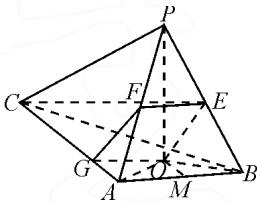

text_image

Geometric diagram of a pyramid with labeled vertices and internal points, used for spatial geometry problems.

图 5

易证 OA=OB，则 $OM \perp AB, OM \parallel AC.$

所以四边形 AGOM 为平行四边形.

于是 $OG \parallel \frac{1}{2} AB, EF \parallel \frac{1}{2} AB.$

所以 $OG \parallel EF$ .

所以四边形 EFGO 为平行四边形, 则 EO // FG.

又因为 $OE \not\subset$ 平面 PAC, $FG \subset$ 平面 PAC, 所以证得 $OE \parallel$ 平面 PAC.

3.1.2 角度二: 面面平行 $\Rightarrow$ 线面平行.

方法 3: 利用中位线“寻找”线线平行.

证明: 如图 6, 取 AB 中点 M, 连接 OM, EM, OA, OB.

因为 PA = PB, PO ⊥ 平面 ABC, 所以 OA = OB.

又因为 M 是 AB 中点, 所以 $OM \perp AB$ .

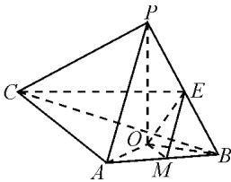

text_image

Geometric diagram of a pyramid with labeled vertices and internal points, used for spatial geometry problems.

图 6

由 $AC \perp AB$ ，得 $OM \parallel AC$ .

又因为 $OM \not\subset$ 平面 PAC, $AC \subset$ 平面 PAC, 所以证得 $OM \parallel$ 平面 PAC.

因为 M, E 分别是 AB, PB 的中点, 所以 $EM \parallel PA$ . 同理可证 $EM \parallel$ 平面 PAC.

又 $EM \subset$ 平面 EMO, $OM \subset$ 平面 EMO, $EM \cap OM = M$ , 所以平面 EMO // 平面 PAC.

又 $OE \subset$ 平面 EMO, 所以 $OE \parallel$ 平面 PAC.

3.1.3 角度三: 证明直线的方向向量与平面的法向量垂直

方法 4: 坐标法.

本题还可以改变底面直角的位置,将三棱锥还原到长方体模型中,如图7.

证明: 不妨设 AB = 2, AC = a, PO = t, 以 A 为坐标原点, 建立如图 7 所示的空间直角坐标系 A-xyz.

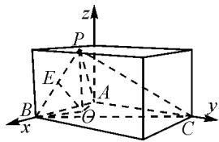

text_image

z
P
E
A
B
x
O
C
y

图 7

由 OA=OB，可设 $O(1,m,0)$ ，则 $B(2,0,0)$ ， $P(1,m,t)$ ， $C(0,a,0)$ ， $E\left(\frac{3}{2},\frac{m}{2},\frac{t}{2}\right)$ .

所以可得 $\overrightarrow{AP} = (1, m, t), \overrightarrow{AC} = (0, a, 0), \overrightarrow{OE} = \left(\frac{1}{2}, -\frac{m}{2}, \frac{t}{2}\right)$ .

设平面 PAC 的法向量为 $\vec{p}=(x,y,z)$ .

由 $\left\{\begin{aligned}\vec{p} & \cdot \overrightarrow{AP}=0,\\ \vec{p} & \cdot \overrightarrow{AC}=0,\end{aligned}\right.$ 得 $\left\{\begin{aligned}x+my+tz=0,\\ ay=0.\end{aligned}\right.$ 令 x=t，得 z=-1,y=0，所以 $\vec{p}=(t,0,-1)$ .

所以 $\overrightarrow{OE} \cdot \overrightarrow{p} = \frac{t}{2} - \frac{t}{2} = 0$ . 故 $\overrightarrow{OE} \perp \overrightarrow{p}$ .

又 $OE \not\subset$ 平面 PAC，所以 $OE \parallel$ 平面 PAC.

# 3.2 第(2)问的解法分析

解法 1: 坐标法. 过点 A 作 Az // OP, 以 A 为坐标原点建立如图 8 所示的空间直角坐标系 A-xyz.

因为 PO=3, AP=5,

所以 $OA = \sqrt{AP^{2} - PO^{2}} = 4.$

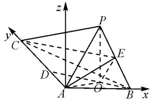

text_image

z
y
C
P
E
D
A
O
B
x

图 8

作出底面 ABC 的平面图, 如图 9.

又因为 $\angle OBA = \angle OBC = 30^{\circ}$ 所以 $BD = 2OA = 8, AD = 4, AB = 4\sqrt{3}, AC = 12$ ，则 $O(2\sqrt{3}, 2, 0), B(4\sqrt{3}, 0, 0), P(2\sqrt{3}, 2, 3), C(0, 12, 0), E\left(3\sqrt{3}, 1, \frac{3}{2}\right)$ .

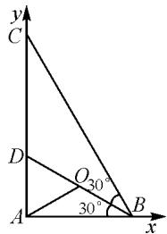

text_image

y
C
D
O_{30°}
30°
A
B
x

图9

所以 $\overrightarrow{AE}=\left(3\sqrt{3},1,\frac{3}{2}\right),\overrightarrow{AB}=$ $(4\sqrt{3},0,0),\overrightarrow{AC}=(0,12,0).$

设平面 ABE 的法向量为 $\overrightarrow{n_{1}}=(x,y,z)$ .

由 $\left\{ \begin{array}{l} \overrightarrow{n_1} \cdot \overrightarrow{AE} = 0, \\ \overrightarrow{n_1} \cdot \overrightarrow{AB} = 0, \end{array} \right.$ 得 $\left\{ \begin{array}{l} 3\sqrt{3}x + y + \frac{3}{2}z = 0, \\ 4\sqrt{3}x = 0. \end{array} \right.$ 令 $z =$

2, 则 $y = -3, x = 0$ , 所以 $\overrightarrow{n_1} = (0, -3, 2)$ .

同理,得平面 AEC 的一个法向量 $\overrightarrow{n_{2}}=(\sqrt{3},0,-6)$ .

所以 $\cos\langle\vec{n_{1}},\vec{n_{2}}\rangle=\frac{\vec{n_{1}}\cdot\vec{n_{2}}}{|\vec{n_{1}}||\vec{n_{2}}|}=\frac{-12}{\sqrt{13}\times\sqrt{39}}=-\frac{4\sqrt{3}}{13}.$

设二面角 C-AE-B 的大小为 $\theta$ ，由图可知二面角 C-AE-B 为钝二面角，所以 $\cos\theta=-\frac{4\sqrt{3}}{13},\sin\theta=\frac{11}{13}$ .

故二面角 C-AE-B 的正弦值为 $\frac{11}{13}$ .

解法 2: 几何法.

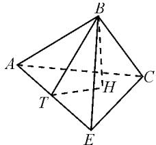

text_image

Geometric diagram of a tetrahedron with labeled vertices A, B, C, E, H, T and dashed/solid edges indicating hidden edges.

图 10

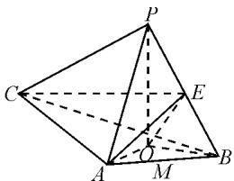

text_image

Geometric diagram of a pyramid with labeled vertices and internal points, used for spatial geometry problems.

图 11

因为 $PO \perp$ 平面 $ABC, E$ 为 $PB$ 的中点，所以点 $P$ 到平面 $ABC$ 的距离 $PO = 3, E$ 到平面 $ABC$ 的距离为 $\frac{3}{2}$ .

如图10, 设点 $B$ 到平面 $ACE$ 距离为 $BH = h$ , $\triangle EAB$ 中 $AE$ 边上的高为 $BT = h_1$ . 设二面角 $C - AE - B$ 的大小为 $\theta$ , 则 $\sin \theta = \frac{h}{h_1}$ .

如图 11, 在 $\triangle PAB$ 中可求得 $AE = \frac{11}{2}$ , $\triangle PCB$ 中可求得 $CE = \frac{\sqrt{601}}{2}$ .

在 $\triangle EAC$ 中,由余弦定理可求得 $\cos A=\frac{2}{11}$ ,所以 $\sin A=\frac{\sqrt{117}}{11}$ .

因为在三棱锥 B-AEC 中， $V_{B-ACE}=V_{E-ABC}$ ，所以 $\frac{1}{3}S_{\triangle ACE}\times h=\frac{1}{3}S_{\triangle ACB}\times\frac{3}{2}$ ，则 $\frac{1}{3}\times\frac{1}{2}\times\frac{11}{2}\times12\times\frac{\sqrt{117}}{11}\times h=\frac{1}{3}\times\frac{1}{2}\times4\sqrt{3}\times12\times\frac{3}{2}$ ，解得 $h=\frac{12}{\sqrt{39}}$ .

在 $\triangle EAB$ 中， $\cos \angle EAB = \frac{\frac{121}{4} + 48 - \frac{25}{4}}{2 \times \frac{11}{2} \times 4\sqrt{3}} = \frac{6\sqrt{3}}{11}$ ，

则 $\sin\angle EAB=\frac{\sqrt{13}}{11}$ ，可得

$$
h _ {1} = A B \cdot \sin \angle E A B = \frac {4 \sqrt {3 9}}{1 1}.
$$

所以 $\sin\theta=\frac{h}{h_{1}}=\frac{12}{\sqrt{39}}\times\frac{11}{4\sqrt{39}}=\frac{11}{13}.$

故二面角 C-AE-B 的正弦值为 $\frac{11}{13}$ .

实际上,本题第(2)问的解法1中,也可以不用 $\angle CBO=30^{\circ}$ 这个条件,设AC长度为b,得点C的坐标为 $(0,b,0)$ ,用法向量同样可求.使用 $\angle CBO=30^{\circ}$ 后,AC长度为确定数值,学生在运算时会更有信心,计算过程也会比较顺利.

新高考关注学生思维层次的提升,重视选拔高分高能的优秀学生,学生需具备良好的学科底蕴以及应试心理.在日常学习中,学生还需加深对概念和定理等知识的理解,合理运用向量法,提升创新意识,以在面对看似陌生的问题情境时能快速找到最优解法.

# 4 试题链接

例 1 （福建省漳州市 2022 届高三第三次质量检测第 20 题）如图 12，在四棱柱 ABCD-A₁B₁C₁D₁ 中，AA₁ ⊥ 平面 ABCD，底面 ABCD 为梯形. AD∥BC, BC = 4, AB = AD = DC = AA₁ = 2, Q 为 AD 的中点，平面 α经过直线 $AC_{1}, CQ \parallel \alpha, \alpha \cap$ 平面 $ADD_{1}A_{1} =$ 直线 l.

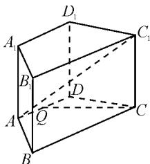

text_image

D₁
A₁ C₁
B₁ D
A Q C
B

图 12

(1)请在图中画出直线 l, 写出画法并说明理由;   
(2)求平面 $\alpha$ 与平面 $ADD_{1}A_{1}$ 所成角的余弦值.

例 2 （江苏省宿迁市2021－2022学年高二下学期期末试题21题改编）如图13，在三棱柱 $ABC-A_{1}B_{1}C_{1}$ 中，所有棱长都为2，且 $\angle A_{1}AC=60^{\circ}$ ，平面 $A_{1}ACC_{1}\perp$ 平面ABC，点P,Q分别在AB, $A_{1}C_{1}$ 上，且 $AP=A_{1}Q$ .

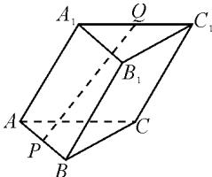

text_image

A₁
Q
C₁
B₁
A
P
B
C

图13

(1) 求证: $PQ \parallel$ 平面 $B_{1}BCC_{1}$ ;  
(2) 当 P 是边 AB 的中点时, 求二面角 $P-CQ-C_{1}$ 的大小.

# 参考文献：

[1] 李莹莹. 高考中立体几何解答题的研究与思考 [D]. 石家庄: 河北师范大学, 2017.  
[2]刘才华.2022年高考立体几何复习及命题趋势预测[J].中学数学杂志,2022(3):54-61.Z