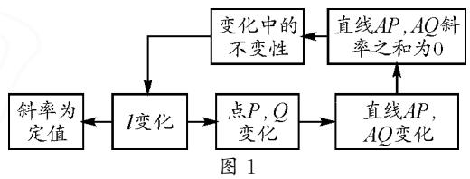
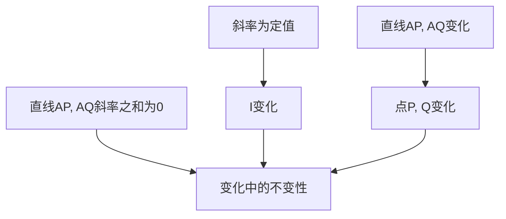
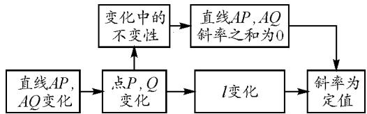
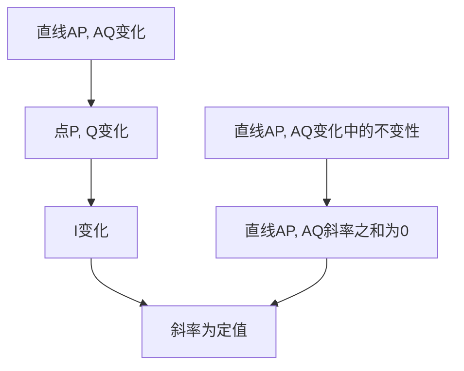

# 合乎逻辑地想,遵循理据地算

——一道解析几何试题的探究及反思

# ●武威第八中学 吕海林

摘要：“合乎逻辑地想，遵循理据地算”是指根据问题发生的逻辑顺序思考和分析解析几何问题，深刻理解运算对象、关注表达式的几何意义、设计合理运算程序、优化运算过程的数学思想方法和基本思维策略。其对解析几何问题的解决有着广泛、持久、深刻的影响，具有统摄性、一般性的应用功能。

关键词: 合乎逻辑; 遵循理据; 坐标法

《普通高中数学课程标准 2017 年版》中给出了解析几何的课程目标要求和学业要求,通过这些要求容易发现,解析法(坐标法)是解析几何的内核,解析几何要解决的主要问题是平面曲线的特征和相互位置关系,对曲线进行的计算中借助方程是问题解决的基本套路 $^{[1]}$ .

利用代数方法研究曲线问题,是解析几何的重要思维方式,也是其重要的学科特点.能把握好这一思维方式,合乎逻辑地分析条件与条件之间、题设与结论之间的关联,厘清为什么一个现象是另一现象的依据,敏锐捕捉到问题的关键,进而明确目标,定位思维的出发点、关键点和归宿点,是这一思维方式下问题解决的基础.理解运算对象,遵循运算法则,探究运算思路,重算理、优算法、不畏繁,是获得运算结果、有效解决问题的保障.下文以2022年新高考全国卷Ⅰ第21题第(1)问为例,呈现在“合乎逻辑想,遵循理据算”的引领下,对问题的多维探究,旨在提升在解析几何教学中教师对这一基本观念的重视程度.

试题 （2022 年新课标全国卷 I 第 21 题）已知点 A(2,1) 在双曲线 C: $\frac{x^{2}}{a^{2}} - \frac{y^{2}}{a^{2} - 1} = 1 (a > 1)$ 上，直线 l 交 C 于 P, Q 两点，直线 AP, AQ 的斜率之和为 0.

(1)求直线 l 的斜率;

(2) 若 $\tan \angle APQ = 2\sqrt{2}$ ，求 $\triangle PAQ$ 的面积.

将点 $A(2,1)$ 代入双曲线方程, 易得 $a=\sqrt{2}$ , 所以双曲线 C 的方程为 $\frac{x^{2}}{2}-y^{2}=1$ .

# 1 视直线 $l$ 的变化为基本变化原因

曲线 C 及点 A 是固定的, 直线 l 的变化导致 P, Q 两点运动, 进而使得直线 AP, AQ 发生变化, 但变化过程中又有不变性, 即直线 AP, AQ 的斜率之和为 0, 这说明直线 l 在变化过程中也应具有不变性, 即斜率是定值. 其基本的逻辑事实见图 1.

flowchart

基于上述对逻辑关联的认知,运算的理据应为用 k, t 表示变化的直线 l, 设其方程为 $y = kx + t$ , 结合曲线方程, 把直线 AP, AQ 的斜率之和为 0 转化为关于 k, t 的关系式, 获得直线 l 在运动中斜率不变这一性质.

设直线 l 的方程为 $y=kx+t$ ，由 $\left\{\begin{aligned}y&=kx+t,\\ \frac{x^{2}}{2}-y^{2}&=1,\end{aligned}\right.$ 得 $(1-2k^{2})x^{2}-4tkx-2t^{2}-2=0.$

由 $\left\{\begin{aligned}1-2k^{2}\neq0,\\ \Delta=16k^{2}t^{2}+8(1-2k^{2})(t^{2}+1)>0,\end{aligned}\right.$ 得

$$
\left\{ \begin{array}{l} k \neq \pm \frac {\sqrt {2}}{2}, \\ t ^ {2} - 2 k ^ {2} + 1 > 0. \end{array} \right.
$$

设 $P(x_{1},y_{1}),Q(x_{2},y_{2})$ ，则 $x_{1} + x_{2} = \frac{4tk}{1 - 2k^{2}},$ $x_{1}x_{2} = \frac{2t^{2} + 2}{2k^{2} - 1}.$

由 $k_{AP} + k_{AQ} = \frac{y_{1} - 1}{x_{1} - 2} + \frac{y_{2} - 1}{x_{2} - 2} = 0$ ，得 $(kx_{1} + t - 1) \cdot (x_{2} - 2) + (kx_{2} + t - 1)(x_{1} - 2) = 0$ ，即

$$
2 k x _ {1} x _ {2} + (t - 1 - 2 k) \left(x _ {1} + x _ {2}\right) - 4 (t - 1) = 0.
$$

于是 $\frac{4kt^2 + 4k}{2k^2 - 1} +\frac{8k^2t + 4kt - 4kt^2}{2k^2 - 1} -4(t - 1) = 0,$ 则 $k + kt + 2k^{2} + t - 1 = 0$ ，即 $(k + 1)(2k + t - 1) = 0.$

所以 k = -1，或 $k = \frac{1 - t}{2}$ .

当 $k=\frac{1-t}{2}$ 时，直线 l 为 $t(x-2)-x+2y=0$ ，过点 A(2,1)，不符合题意，舍去.

当 k = -1 时，符合 $\left\{\begin{aligned}1 - 2k^{2} & \neq 0, \\ \Delta & >0.\end{aligned}\right.$

所以直线 l 的斜率为 -1.

# 2 视直线 $AP, AQ$ 的变化为基本变化原因

从 P, Q 两点运动视角看整个问题, 认为是这两点运动导致的系列变化. 这两点运动中的不变性是直线 AP, AQ 的斜率之和为 0, 确定了直线 l 运动过程中斜率为常数这一基本事实. 这一视角逻辑事实见图 2.

flowchart

图 2

如果按这一视角看整个问题,结合直线 AP, AQ 过定点 A, 且斜率之和为零, 只需一个变量即可描述整个变化. 设直线 AP 的斜率为 k, 结合曲线方程, 可以用 k 表示出点 P, Q 的坐标, 进而用 k 表述出直线 l 的斜率, 发现其不变性.

设直线 AP 的斜率为 $k(k \neq 0)$ ，由题意知直线 AQ 斜率为 -k，则直线 AP 的方程为 $y = k(x - 2) + 1$ ，与双曲线方程联立 $\left\{ \begin{array}{l} y = k(x - 2) + 1, \\ \frac{x^2}{2} - y^2 = 1, \end{array} \right.$ 得

$$
(1 - 2 k ^ {2}) x ^ {2} + (8 k ^ {2} - 4 k) x - 8 k ^ {2} + 8 k - 4 = 0.
$$

由题意知 $\left\{\begin{aligned}1-2k^{2}\neq0,\\ \Delta>0.\end{aligned}\right.$ 设 $P(x_{1},y_{1}),Q(x_{2},y_{2})$ ,则 $2x_{1} = \frac{-8k^{2} + 8k - 4}{1 - 2k^{2}}$ ，即 $x_{1} = \frac{4k^{2} - 4k + 2}{2k^{2} - 1}$

于是 $y_{1} = \frac{-2k^{2} + 4k - 1}{2k^{2} - 1}$ 故 $P\left(\frac{4k^{2} - 4k + 2}{2k^{2} - 1}, \frac{-2k^{2} + 4k - 1}{2k^{2} - 1}\right)$ .

同理, $Q\left(\frac{4k^{2}+4k+2}{2k^{2}-1},\frac{-2k^{2}-4k-1}{2k^{2}-1}\right)$ .

所以,直线 l 的斜率为

$$
k _ {l} = \frac {\frac {- 2 k ^ {2} - 4 k - 1}{2 k ^ {2} - 1} - \frac {- 2 k ^ {2} + 4 k - 1}{2 k ^ {2} - 1}}{\frac {4 k ^ {2} + 4 k + 2}{2 k ^ {2} - 1} - \frac {4 k ^ {2} - 4 k + 2}{2 k ^ {2} - 1}} = \frac {- 8 k}{8 k} = - 1.
$$

# 3 优化运算程序,简化运算过程

上述两种解法,均聚焦变化的基本原因,定位逻辑起点,设出变量描述图形变化,结合已知条件中运动的不变性,探究直线 l 变化中的不变性.对问题的认识合乎事实逻辑,层次分明,在清晰的运算程序指引下,选择恰当的运算方法,求得运算结果,并回顾分析运算结果反映的图形特征.合乎逻辑地想、遵循理据地算,是对问题顺利解决具有引领性的基本观念.

上述探究过程,虽逻辑层次清晰,运算理据分明,但冗长方程、繁琐坐标下的相关运算表达式结构复杂,给运算带来一定困难.可否在尊重基本逻辑事实的基础上,进一步搞清运算对象本质,优化运算步骤,获得运算结果?运算步骤和过程的优化,能够有效促进数学思维的科学、持续发展,养成思考数学问题更简洁的思维品质,养成严谨求实的理性科学精神.

# 3.1 从平移视角简化动直线方程

结合函数图象变换及向量知识,注意到上述求解过程中,点 A 的位置可能是导致运算繁琐的原因.尝试通过平移变换,以 A 为原点建立平面直角坐标系,来简化运算过程.

解析: 将曲线 $\frac{x^{2}}{2}-y^{2}=1$ 按向量 $\vec{v}=(-2,-1)$ 平移, 得到曲线 $\frac{(x+2)^{2}}{2}-(y+1)^{2}=1$ , 此时 $A'(0,0)$ .

直线 AP, AQ, l 也按向量 $\vec{v}=(-2,-1)$ 平移后对应的直线分别为 $A^{\prime}P^{\prime}, A^{\prime}Q^{\prime}, l^{\prime}$ ，它们的斜率不变，设直线 $l^{\prime}$ 的方程为 $mx+ny=1$ .

将 $\frac{(x + 2)^2}{2} -(y + 1)^2 = 1$ 化为 $x^{2} - 2y^{2} + 4x - 4y = 0$ ，结合 $l^{\prime}$ 的方程得 $x^{2} - 2y^{2} + 4(x - y)(mx + ny) = 0$ ，即 $(2 + 4n)y^{2} + (4m - 4n)xy - (1 + 4m)x^{2} = 0$ ，得 $(2 + 4n)\left(\frac{y}{x}\right)^{2} + (4m - 4n)\frac{y}{x} -(1 + 4m) = 0.$

令 $\frac{y}{x}=k$ ，则方程 $(2+4n)k^{2}+(4m-4n)k-(1+4m)=0$ 的两根为直线 $AP'$ ， $AQ'$ 的斜率.

所以 $k_{A'P'} + k_{A'Q'} = -\frac{4m - 4n}{2 + 4n} = 0$ ，则 m = n，于是直线 $l'$ 斜率为 -1，

故直线 l 斜率为 -1.

上述解法在运算上并不能起到多大简化作用,但过程中体现出要时刻关注运算表达式的结构特征以及几何意义.解析几何问题求解中,结构式所体现出来的几何意义特别重要,厘清几何意义,才能找到合适运算的思路.抛开坐标变换,在更高层次思考上述解法,可获得下述更抽象的求解过程.

# 3.2 解法抽象

设直线 l 的方程为 $m(x-2)+n(y-1)=1$ ，曲线 C 的方程 $\frac{x^{2}}{2}-y^{2}=1$ 转化为 $(x-2)^{2}-2(y-1)^{2}+4(x-2)-4(y-1)=0$ .

由 $\left\{\begin{aligned}m(x-2)+n(y-1)=1,\\ (x-2)^{2}-2(y-1)^{2}+4(x-2)-4(y-1)=0,\end{aligned}\right.$ 得 $(x-2)^{2}-2(y-1)^{2}+\left[4(x-2)-4(y-1)\right]$

$$
\begin{array}{l} {\left[ m (x - 2) + n (y - 1) \right] = 0, \text {即} (2 + 4 n) (y - 1) ^ {2} +} \\ {(4 m - 4 n) (x - 2) (y - 1) - (4 m + 1) (x - 2) ^ {2} = 0.} \end{array}
$$

两边同除以 $(x - 2)^2$ ，可得 $(2 + 4n)\left(\frac{y - 1}{x - 2}\right)^2 + (4m - 4n)\frac{y - 1}{x - 2} -(4m + 1) = 0.$

令 $\frac{y-1}{x-2}=k$ ，则得到 $(2+4n)k^{2}+(4m-4n)k-(4m+1)=0$ ，其两根为直线AP，AQ的斜率.

所以 $k_{AP} + k_{AQ} = -\frac{4m - 4n}{2 + 4n} = 0$ ，则 m = n，故直线 l 的方程为 $m(x + y - 3) = 1$ ，其斜率为 -1。

# 3.3 解法的再抽象

设 $P(x_{1},y_{1}),Q(x_{2},y_{2})$ ，则

$$
\frac {x _ {1} ^ {2}}{2} - y _ {1} ^ {2} = , \tag {①}
$$

$$
\frac {x _ {2} ^ {2}}{2} - y _ {2} ^ {2} = 1. \tag {②}
$$

注意到

$$
\frac {2 ^ {2}}{2} - 1 ^ {2} = 1. \tag {③}
$$

①-③，得 $k_{AP}=\frac{y_{1}-1}{x_{1}-2}=\frac{x_{1}+2}{2(y_{1}+1)}$ .

同理②-③，得 $k_{AQ} = \frac{y_2 - 1}{x_2 - 2} = \frac{x_2 + 2}{2(y_2 + 1)}.$

由 $k_{AP} + k_{AQ} = 0$ ，得 $\frac{y_1 - 1}{x_1 - 2} +\frac{y_2 - 1}{x_2 - 2} = 0$ ，则

$$
x _ {1} y _ {2} + x _ {2} y _ {1} - (x _ {1} + x _ {2}) - 2 (y _ {1} + y _ {2}) + 4 = 0. \tag {④}
$$

又由 $\frac{x_{1}+2}{2(y_{1}+1)}+\frac{x_{2}+2}{2(y_{2}+1)}=0$ ，得

$$
x _ {1} y _ {2} + x _ {2} y _ {1} + (x _ {1} + x _ {2}) + 2 (y _ {1} + y _ {2}) + 4 = 0. \tag {⑤}
$$

⑤-④，得 $2(x_{1} + x_{2}) + 4(y_{1} + y_{2}) = 0.$

所以 $\frac{x_{1}+x_{2}}{y_{1}+y_{2}}=-2.$

①—②，得

$$
\left(x _ {1} - x _ {2}\right) \left(x _ {1} + x _ {2}\right) = 2 \left(y _ {1} - y _ {2}\right) \left(y _ {1} + y _ {2}\right) = 0.
$$

所以 $k_{PQ}=\frac{y_{1}-y_{2}}{x_{1}-x_{2}}=\frac{x_{1}+x_{2}}{2(y_{1}+y_{2})}=\frac{1}{2}\times(-2)=-1$ ，即直线 l 的斜率为 -1。

# 4 利用参数方程简化运算过程

# 4.1 利用直线的参数方程

设直线 $AP$ 的参数方程为 $\left\{ \begin{array}{l} x = 2 + t\cos \theta, \\ y = 1 + t\sin \theta \end{array} \right.$ （其中 $t$ 为参数， $\theta$ 为直线 $AP$ 的倾斜角），则直线 $AQ$ 的参数方程为 $\left\{ \begin{array}{l} x = 2 - t\cos \theta, \\ y = 1 + t\sin \theta. \end{array} \right.$ 分别代入 $\frac{x^2}{2} - y^2 = 1$ ，得 $t_1 = -\frac{4(\cos \theta - \sin \theta)}{\cos^2\theta - 2\sin^2\theta}, t_2 = -\frac{4(-\cos \theta - \sin \theta)}{\cos^2\theta - 2\sin^2\theta}$ . 于是直

线 $l$ 的斜率 $k = \frac{y_1 - y_2}{x_1 - x_2} = \frac{1 + t_1\sin\theta - (1 + t_2\sin\theta)}{2 + t_1\cos\theta - (2 - t_2\cos\theta)} =$

$$
\frac {\left(t _ {1} - t _ {2}\right) \sin \theta}{\left(t _ {1} + t _ {2}\right) \cos \theta} = \frac {\frac {- 8 \cos \theta \sin \theta}{\cos^ {2} \theta - 2 \sin^ {2} \theta}}{\frac {8 \sin \theta \cos \theta}{\cos^ {2} \theta - 2 \sin^ {2} \theta}} = - 1.
$$

# 4.2 利用双曲线的参数方程

由 $\frac{x^2}{2} - y^2 = 1$ ，得 $(\frac{x}{\sqrt{2}} - y)(\frac{x}{\sqrt{2}} + y) = 1.$ 不妨令 $\frac{x}{\sqrt{2}} - y = \frac{1}{t}, \frac{x}{\sqrt{2}} + y = t$ （其中 $t$ 为参数），解得

$\left\{ \begin{array}{l} x = \frac{\sqrt{2}(t^2 + 1)}{2t}, \\ y = \frac{t^2 - 1}{2t}, \end{array} \right.$ 则可设 $P\left(\frac{\sqrt{2}(t_1^2 + 1)}{2t_1}, \frac{t_1^2 - 1}{2t_1}\right)$ ,

$$
Q \left(\frac {\sqrt {2} (t _ {2} ^ {2} + 1)}{2 t _ {2}}, \frac {t _ {2} ^ {2} - 1}{2 t _ {2}}\right).
$$

所以 $k_{AP} = \frac{y_1 - 1}{x_1 - 2} = \frac{\frac{t_1^2 - 1}{2t_1} - 1}{\frac{\sqrt{2}(t_1^2 + 1)}{2t_1} - 2}$

$$
\begin{array}{l} = \frac {t _ {1} ^ {2} - 2 t _ {1} - 1}{\sqrt {2} t _ {1} ^ {2} - 4 t _ {1} + \sqrt {2}} \\ = \frac {(t _ {1} + \sqrt {2} - 1) (t _ {1} - \sqrt {2} - 1)}{\sqrt {2} (t _ {1} - \sqrt {2} - 1) (t _ {1} - \sqrt {2} + 1)} \\ = \frac {t _ {1} + \sqrt {2} - 1}{\sqrt {2} (t _ {1} - \sqrt {2} + 1)}. \\ \end{array}
$$

同理, $k_{AQ}=\frac{t_{2}+\sqrt{2}-1}{\sqrt{2}(t_{2}-\sqrt{2}+1)}$ .

由 $k_{AP} + k_{AQ} = \frac{t_1 + \sqrt{2} - 1}{\sqrt{2}(t_1 - \sqrt{2} + 1)} + \frac{t_2 + \sqrt{2} - 1}{\sqrt{2}(t_2 - \sqrt{2} + 1)}$

$$
= \frac {\sqrt {2} \left[ t _ {1} t _ {2} - (3 - 2 \sqrt {2}) \right]}{\left(t _ {1} - \sqrt {2} + 1\right) \left(t _ {2} - \sqrt {2} + 1\right)} = 0,
$$

得 $t_{1}t_{2}=3-2\sqrt{2}$ .

故 $k_{PQ} = \frac{\frac{t_1^2 - 1}{2t_1} - \frac{t_2^2 - 1}{2t_2}}{\frac{\sqrt{2}(t_1^2 + 1)}{2t_1} - \frac{\sqrt{2}(t_2^2 + 1)}{2t_2}} = \frac{\sqrt{2}(t_1 t_2 + 1)}{2(t_1 t_2 - 1)}$

$$
= \frac {\sqrt {2} (3 - 2 \sqrt {2} + 1)}{2 (3 - 2 \sqrt {2} - 1)} = - 1.
$$

# 参考文献：

[1]中华人民共和国教育部,普通高中数学课程标准(2017年版)[S].北京:人民教育出版社,2020:43-45.Z