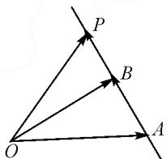
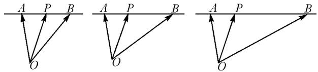
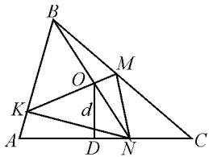
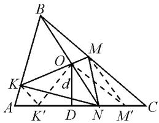
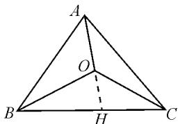
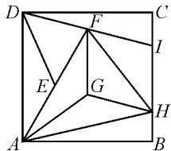
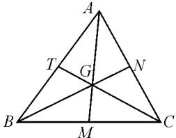
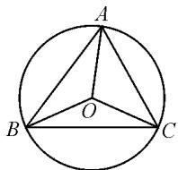
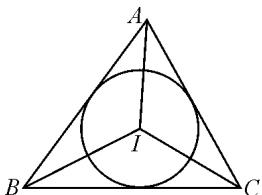
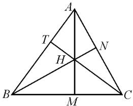

# 数学竞赛中的“三点共线定理”

# 北京市第一七一中学 王桢宇

摘要:从课本例题出发,深入探究了平面向量“三点共线定理”,运用该定理求解了两道北京市中学生数学竞赛题,并推广了三角形面积比例的一类问题.

关键词: 平面向量基本定理; 数学竞赛; 面积比例

向量是数学中重要的工具性知识,是数形结合的桥梁,其中平面向量基本定理说明平面中的向量都可以用两个不共线的向量进行线性表示,这种形式体现了数学的严谨性和逻辑性,是向量知识模块中的核心内容,其考查方式多以图形运算呈现.为了帮助学生更好地理解定理,做好向量图形运算题,笔者本着循序渐进的思想,开启了一场从课本到考题的探究之旅.

# 1 问道教材

例 1 如图 1, $\overrightarrow{OA}$ , $\overrightarrow{OB}$ 不共线, 且 $\overrightarrow{AP}=t\overrightarrow{AB}(t\in\mathbf{R})$ , 用 $\overrightarrow{OA}$ , $\overrightarrow{OB}$ 表示 $\overrightarrow{OP}$ .

解: 因为 $\overrightarrow{AP}=t\overrightarrow{AB}$ ，所以

$$
\begin{array}{l} \overrightarrow {O P} = \overrightarrow {O A} + \overrightarrow {A P} \\ = \overrightarrow {O A} + t \overrightarrow {A B} \\ = \overrightarrow {O A} + t (\overrightarrow {O B} - \overrightarrow {O A}) \\ = \overrightarrow {O A} + t \overrightarrow {O B} - t \overrightarrow {O A} \\ = (1 - t) \overrightarrow {O A} + t \overrightarrow {O B}. \\ \end{array}
$$

text_image

P
B
O
A

图1

(观察 $\overrightarrow{OP}=(1-t)\overrightarrow{OA}+t\overrightarrow{OB}$ ,你有什么发现?)

本题是学习了平面向量基本定理后的第一个例题,通过该题,学生进一步理解了平面向量基本定理,熟悉了图形运算,也发现了定理的重要推论,记作“三点共线定理”,表述如下:

如果 $\overrightarrow{OA},\overrightarrow{OB}$ 是同一平面内的两个不共线向量，那么对于这个平面内的任一向量 $\overrightarrow{OP}$ ，有且只有一对实数x,y，使 $\overrightarrow{OP}=x\overrightarrow{OA}+y\overrightarrow{OB}$ .

若点 P, A, B 共线，则 $x + y = 1$ .

特别地,其逆定理也成立,不再赘述.对学生而言,更为实用的是通过该定理认识下面的结论.

图 2 中, P 分别位于线段 AB 的中点、三等分点和四等分点靠近点 A 的位置, 写出 $\overrightarrow{OP} = x \overrightarrow{OA} + y \overrightarrow{OB}$ 的表达式分别为:

text_image

A P B
O
A P B
O
A P B
O

图 2

$$
\overrightarrow {O P} = \frac {1}{2} \overrightarrow {O A} + \frac {1}{2} \overrightarrow {O B},
$$

$$
\overrightarrow {O P} = \frac {2}{3} \overrightarrow {O A} + \frac {1}{3} \overrightarrow {O B},
$$

$$
\overrightarrow {O P} = \frac {3}{4} \overrightarrow {O A} + \frac {1}{4} \overrightarrow {O B}.
$$

利用这个规律,我们可以巧解一些竞赛难题.

# 2 解题应用

例 2 （2019 年北京市中学生数学竞赛 8）如图 3，在 $\triangle ABC$ 的边 AB, BC 上分别取点 K, M, 使得 $\frac{AK}{KB} = \frac{1}{4}$ , $\frac{BM}{MC} = \frac{4}{5}$ ; 在线段 KM 上取点

text_image

Geometric diagram of triangle ABC with internal points, lines, and labeled segments including O, M, K, D, N, and d

图3

O, 使得 $\frac{KO}{OM}=3.N$ 为射线 BO 与 AC 的交点, AC=a, 由点 O 到边 AC 的距离 OD=d, 则 $\triangle KMN$ 的面积为 \_\_\_\_.

# 2.1 参考答案 $^{[1]}$

如图 4, 过点 M 作 BN 的平行线, 与 NC 交于点 $M'$ ; 过点 K 作 BN 的平行线, 与 AN 交于点 $K'$ , 联结 $OM'$ , $OK'$ , 则 $S_{\triangle NOM} = S_{\triangle ONM'}$ , $S_{\triangle NOK} = S_{\triangle ONK'}$ .

两式相加，得 $S_{\triangle KMN} = S_{\triangle OM'K'}$ .

text_image

B
O
M
K
d
A
K'
D
N
M'
C

图 4

注意到, $\frac{NM'}{M'C}=\frac{BM}{MC}=\frac{4}{5}.$

设 $NM' = 4u, M'C = 5u.$

由 $\frac{K^{\prime}N}{NM^{\prime}}=\frac{KO}{OM}=3$ ，得 $K^{\prime}N=12u$ .

由 $\frac{AK^{\prime}}{K^{\prime}N}=\frac{AK}{KB}=\frac{1}{4}$ ，得 $AK^{\prime}=3u$ .

于是， $K^{\prime}M^{\prime}=12u+4u=16u,AC=3u+12u+4u+5u=24u.$

所以 $\frac{K^{\prime}M^{\prime}}{AC}=\frac{16u}{24u}=\frac{2}{3}$ ，则 $K^{\prime}M^{\prime}=\frac{2}{3}AC=\frac{2}{3}a$ .

因此， $S_{\triangle KMN}=S_{\triangle OM^{\prime}K^{\prime}}=\frac{1}{2}K^{\prime}M^{\prime}\cdot OD=\frac{1}{2}\cdot$

$$
\frac {2}{3} a d = \frac {a d}{3}.
$$

# 2.2 试题新解

解答中辅助线的运用十分巧妙,需要学生对平面几何问题有着较深的认识,下面给出应用“三点共线定理”解答的方法.

因为 $\frac{KO}{OM}=3$ ，所以 $\overrightarrow{BO}=\frac{1}{4}\overrightarrow{BK}+\frac{3}{4}\overrightarrow{BM}$ .

设 $\overrightarrow{BN} = u\overrightarrow{BO}$ ，则

$$
\overrightarrow {B N} = \frac {1}{4} u \overrightarrow {B K} + \frac {3}{4} u \overrightarrow {B M} = \frac {1}{4} u \cdot \frac {4}{5} \overrightarrow {B A} + \frac {3}{4} u \cdot
$$

$$
\frac {4}{9} \overrightarrow {B C} = \frac {u}{3} \overrightarrow {B C} + \frac {u}{5} \overrightarrow {B A}.
$$

因为 N, C, A 三点共线，所以 $\frac{1}{3}u + \frac{1}{5}u = 1$ ，则 $u = \frac{15}{8}$ .

故 $\frac{BN}{BO}=\frac{15}{8},\overrightarrow{BN}=\frac{5}{8}\overrightarrow{BC}+\frac{3}{8}\overrightarrow{BA}$ ，于是 $\frac{NC}{AC}=\frac{3}{8}$ .

设 $\triangle ABC$ 的高为 $BH$ , 由 $\frac{BN}{BO} = \frac{15}{8}$ , 可知 $\frac{d}{BH} = \frac{7}{15}$ , 则 $BH = \frac{15}{7} d$ . 所以 $S_{\triangle ABC} = \frac{1}{2} a \cdot BH = \frac{15}{14} ad$ .

故 $S_{\triangle KMN} = S_{\triangle KON} + S_{\triangle MON}$

$$
= \frac {7}{1 5} S _ {\triangle K B N} + \frac {7}{1 5} S _ {\triangle M B N}
$$

$$
= \frac {7}{1 5} \cdot \frac {4}{5} S _ {\triangle A B N} + \frac {7}{1 5} \cdot \frac {4}{9} S _ {\triangle C B N}
$$

$$
= \frac {7}{1 5} \cdot \frac {4}{5} \cdot \frac {5}{8} S _ {\triangle A B C} + \frac {7}{1 5} \cdot \frac {4}{9} \cdot \frac {3}{8} S _ {\triangle A B C}
$$

$$
= \frac {1}{3} a d.
$$

# 3 方法应用

下面再通过一个例题来熟悉“三点共线定理”.

例 3 证明:三角形的外心、重心、垂心共线(欧拉线).

2005 年全国卷 I 理科数学第 15 题考查了如下问题: 若 $\triangle ABC$ 的外接圆的圆心为 O, 两条边上的高的交点为 H, 且 $\overrightarrow{OH} = m (\overrightarrow{OA} + \overrightarrow{OB} + \overrightarrow{OC})$ , 则实数 m = \_\_\_\_.

该题答案是1,为了叙述方便,将其改编为如下引理: $\triangle ABC$ 的外心为O,且 $\overrightarrow{OH}=\overrightarrow{OA}+\overrightarrow{OB}+\overrightarrow{OC}$ ,则H为 $\triangle ABC$ 的垂心.

证明引理：

因为 $\overrightarrow{OB}+\overrightarrow{OC}=\overrightarrow{OH}-\overrightarrow{OA}$ ，所以 $\overrightarrow{AH}=\overrightarrow{OB}+\overrightarrow{OC}$ .

又 $\overrightarrow{BC}=\overrightarrow{OC}-\overrightarrow{OB}$ ，所以 $\overrightarrow{AH}\cdot\overrightarrow{BC}=\overrightarrow{OC^{2}}-\overrightarrow{OB^{2}}=0.$

即 $\overrightarrow{AH}\perp\overrightarrow{BC}$ ，同理 $\overrightarrow{BH}\perp\overrightarrow{AC}$ .

故 H 为 $\triangle ABC$ 的垂心.

证明欧拉线：

设 G 为 $\triangle ABC$ 的重心, P 为 BC 边中点, 则

$$
\begin{array}{l} \overrightarrow {A G} = \frac {2}{3} \overrightarrow {A P} = \frac {2}{3} (\overrightarrow {O P} - \overrightarrow {O A}) = \frac {2}{3} \left(\frac {\overrightarrow {O B} + \overrightarrow {O C}}{2} - \right. \\ \overrightarrow {O A}) = \frac {1}{3} \overrightarrow {O B} + \frac {1}{3} \overrightarrow {O C} - \frac {2}{3} \overrightarrow {O A} = \frac {1}{3} \overrightarrow {A H} + \frac {2}{3} \overrightarrow {A O}. \\ \end{array}
$$

所以 G, H, O 三点共线, 即三角形的外心、重心、垂心共线.

# 4 定理推广

已知点 O 在 $\triangle ABC$ 内部, 通过“三点共线定理”, 可以很容易得到一个常用的面积比例性质, 本文暂称 “面积比定理”, 内容如下:

若 $x\overrightarrow{OA} +y\overrightarrow{OB} +z\overrightarrow{OC} = 0$ ，则 $S_{\triangle OBC}:S_{\triangle OAC}:S_{\triangle OAB} = x:y:z.$

证明:如图 5,延长 AO 交 BC 于点 H,设 $\overrightarrow{AO}=t\overrightarrow{OH}$ .

因为 $x \overrightarrow{OA} + y \overrightarrow{OB} + z \overrightarrow{OC} = 0$ ，
所以 $x \overrightarrow{AO} = y \overrightarrow{OB} + z \overrightarrow{OC}$ ，则 $\overrightarrow{AO}=\frac{y}{x}\overrightarrow{OB}+\frac{z}{x}\overrightarrow{OC}.$

text_image

A
O
B
H
C

图 5

故 $t\overrightarrow{OH} = \frac{y}{x}\overrightarrow{OB} +\frac{z}{x}\overrightarrow{OC}.$

于是 $\overrightarrow{OH} = \frac{y}{xt}\overrightarrow{OB} +\frac{z}{xt}\overrightarrow{OC}.$

因为 B, C, H 三点共线，所以 $\frac{y}{xt} + \frac{z}{xt} = 1$ ，则 $\frac{y + z}{x} = t$ .
因为 $S_{\triangle OBC}: S_{\triangle ABC}=OH:AH$ ，又 $\overrightarrow{AH}=(t+1)\cdot\overrightarrow{OH}$ ，所以 $\frac{OH}{AH}=\frac{x}{x+y+z}$ .

于是 $\frac{S_{\triangle OBC}}{S_{\triangle ABC}} = \frac{x}{x + y + z}$ ，同理可得 $\frac{S_{\triangle OAC}}{S_{\triangle ABC}} = \frac{y}{x + y + z}$ ， $\frac{S_{\triangle OAB}}{S_{\triangle ABC}} = \frac{z}{x + y + z}$ .

故 $S_{\triangle OBC}:S_{\triangle OAC}:S_{\triangle OAB}=x:y:z.$

# 5 新知应用

例 4 （2020 年北京市中学生数学竞赛 4）已知点 O 在 $\triangle ABC$ 内部，且 $2021 \overrightarrow{AB} + 2020 \overrightarrow{BC} + 2019 \overrightarrow{CA} = 3 \overrightarrow{AO}$ ，记 $\triangle ABC$ 的面积为 $S_{1}, \triangle OBC$ 的面积为 $S_{2}$ ，则 $\frac{S_{1}}{S_{2}} =$ \_\_\_\_ .

解: 因为 $2021 \overrightarrow{AB} + 2020 \overrightarrow{BC} + 2019 \overrightarrow{CA} = 3 \overrightarrow{AO}$ ，所以 $2021 (\overrightarrow{OB} - \overrightarrow{OA}) + 2020 (\overrightarrow{OC} - \overrightarrow{OB}) + 2019 (\overrightarrow{OA} - \overrightarrow{OC}) = 3 \overrightarrow{AO}$ ，则 $\overrightarrow{OA} + \overrightarrow{OB} + \overrightarrow{OC} = 0$ .

由面积比定理, 可知

$$
S _ {\triangle O B C}: S _ {\triangle O A C}: S _ {\triangle O A B} = 1: 1: 1.
$$

故 $\frac{S_{1}}{S_{2}}=\frac{3}{1}=3.$

特别地,本题中 O 是 $\triangle ABC$ 的重心, $\overrightarrow{OA} + \overrightarrow{OB} + \overrightarrow{OC} = 0$ 也是常见的三角形重心的向量表示.

例 5 （2013 年北京市中学生数学竞赛 4）如图 6，正方形 ABCD 被分成面积相等的 8 个三角形，若 $AG = \sqrt{50}$ ，则正方形 ABCD 的面积 S = \_\_\_\_.

text_image

Geometric diagram of a square with labeled points and internal lines, likely for a math problem or proof.

图6

解: 设正方形 ABCD 边长为 a 则 $S_{\triangle DIC} = \frac{1}{8} a^{2}$ ，得 $IC = \frac{a}{4}$ .

又因为 $S_{\triangle DFA} = \frac{1}{4} a^{2}$ ，所以点 F 到 DA 距离为 $\frac{a}{2}$ ，即以 F 为 DI 中点.

因为 $S_{\triangle GAF}=S_{\triangle GAH}=S_{\triangle GHF}$ ，由面积比定理可知 $\overrightarrow{GA}+\overrightarrow{GB}+\overrightarrow{GC}=0$ ，所以 G 为 $\triangle FAH$ 的重心，则 FG 必过 AH 中点.

所以 $FG \parallel AD$ .

因为 $S_{\triangle FGA}=\frac{1}{8}a^{2}$ ，所以 $FG=\frac{a}{2}$ .

由 $\overrightarrow{GA} +\overrightarrow{GH} +\overrightarrow{GF} = \mathbf{0}$ ，得 $\overrightarrow{GA} +\overrightarrow{GA} +\overrightarrow{AB} +\overrightarrow{BH}+$ $\overrightarrow{GF} = \mathbf{0}$ ，即 $2\overrightarrow{GA} +\overrightarrow{AB} +\frac{1}{4}\overrightarrow{AD} +\frac{1}{2}\overrightarrow{AD} = \mathbf{0}.$

所以 $2\overrightarrow{AG}=\overrightarrow{AB}+\frac{3}{4}\overrightarrow{AD}.$

两边平方，可得 $200 = a^{2} + \frac{9}{16} a^{2}$ ，故 $a^2 = 128$

# 6 四心推广

通过“面积比定理”, 可以推导一组三角形四心的向量表达式.

# 6.1 重心

设 G 是 $\triangle ABC$ 的重心, 证明: $\overrightarrow{GA} + \overrightarrow{GB} + \overrightarrow{GC} = 0$ .

证明: 如图 7, 因为 G 是 $\triangle ABC$ 的重心, 即 G 是三条中线的交点, 所以点 M, N, T 分别为 BC, AC, AB 的中点, 则 $S_{\triangle ABM} = S_{\triangle ACM}$ , 且 $S_{\triangle GBM} = S_{\triangle GCM}$ .

text_image

A
T
G
N
B
M
C

图 7

所以 $S_{\triangle ABG}=S_{\triangle ACG}$ .

同理 $S_{\triangle ABG}=S_{\triangle BCG}$ .

所以 $S_{\triangle ABG}=S_{\triangle ACG}=S_{\triangle BCG}$ .

故 $\overrightarrow{GA}+\overrightarrow{GB}+\overrightarrow{GC}=\mathbf{0}.$

# 6.2 外心

设 O 是 $\triangle ABC$ 的外心，证明： $\sin 2A \cdot \overrightarrow{OA} + \sin 2B \cdot \overrightarrow{OB} + \sin 2C \cdot \overrightarrow{OC} = 0.$

证明:如图 8,O 是 $\triangle ABC$ 的外心,即 O 是三条中垂线的交点.

设 $\triangle ABC$ 外接圆半径为R，

又 $\angle BOC = 2\angle BAC$ ，所以

$$
S _ {\triangle O B C} = \frac {1}{2} R ^ {2} \sin \angle B O C = \frac {1}{2} R ^ {2} \sin 2 A,
$$

$S_{\triangle OAC} = \frac{1}{2} R^2\sin \angle AOC = \frac{1}{2}\cdot$ $R^2\sin 2B$

$$
S _ {\triangle O A B} = \frac {1}{2} R ^ {2} \sin \angle A O B = \frac {1}{2} \cdot
$$

  
图 8

$R^2\sin 2C.$

故 $S_{\triangle OBC} : S_{\triangle OAC} : S_{\triangle OAB} = \sin 2A : \sin 2B : \sin 2C.$

所以 $\sin 2A \cdot \overrightarrow{OA} + \sin 2B \cdot \overrightarrow{OB} + \sin 2C \cdot \overrightarrow{OC} = 0.$

# 6.3 内心

设 $I$ 是 $\triangle ABC$ 的内心，证明： $a\overrightarrow{IA} + b\overrightarrow{IB} + c\overrightarrow{IC} = 0.$

证明: 如图 9, 由 I 是 $\triangle ABC$ 的内心, 可知 I 是三条角平分线的交点.

设 $\triangle ABC$ 内切圆半径为 $r$ ，三边分别为 $a, b, c$ ，则

$$
S _ {\triangle I B C} = \frac {1}{2} a r,
$$

$$
S _ {\triangle I A C} = \frac {1}{2} b r, S _ {\triangle I A B} = \frac {1}{2} c r.
$$

所以 $S_{\triangle IBC}:S_{\triangle IAC}:S_{\triangle IAB}=a:b:c$

故 $a \overrightarrow{IA} + b \overrightarrow{IB} + c \overrightarrow{IC} = 0.$

text_image

A
B
C
I

图9

# 6.4 垂心

设 H 是 $\triangle ABC$ 的垂心, 证明: $\tan A \overrightarrow{HA} + \tan B \cdot \overrightarrow{HB} + \tan C \overrightarrow{HC} = 0$ .

证明: 如图 10, 由 H 是 $\triangle ABC$ 的垂心, 可知 H 是三条角高线的交点.

所以 $\frac{S_{\triangle HBC}}{S_{\triangle ABC}} = \frac{HM}{AM} = \frac{BM \cdot \tan \angle HBM}{BM \cdot \tan \angle B}.$

text_image

A
T
H
N
B
M
C

图 10

又因为在 $\triangle BNC$ 中， $\tan \angle HBM = \frac{1}{\tan \angle C}$ ， $\frac{S_{\triangle HBC}}{S_{\triangle ABC}} = \frac{HM}{AM} = \frac{1}{\tan \angle B \cdot \tan \angle C}$ .

同理 $\frac{S_{\triangle HAC}}{S_{\triangle ABC}} = \frac{1}{\tan\angle A \cdot \tan\angle C}, \frac{S_{\triangle HAB}}{S_{\triangle ABC}} = \frac{1}{\tan\angle A \cdot \tan\angle B}.$

所以 $S_{\triangle HBC}: S_{\triangle HAC}: S_{\triangle HAB} = \tan A: \tan B: \tan C.$

故 $\tan A \overrightarrow{HA} + \tan B \overrightarrow{HB} + \tan C \overrightarrow{HC} = 0.$

# 参考文献：

[1] 李延林. 2019 年北京市中学生数学竞赛预赛 (高一) [J].

中等数学,2019(8):24-27. Z