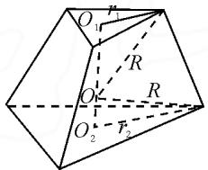
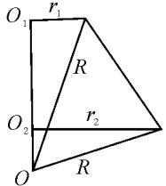
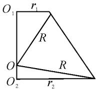
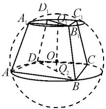
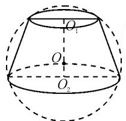
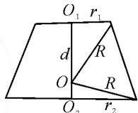
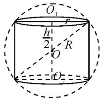
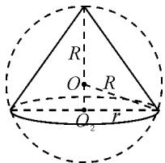
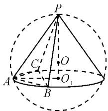

# 由正三棱台外接球引发的思考探究

——从 2022 年新高考 II 卷第 7 题说起

●广西柳州高级中学 高 路 黄瀚元

在高考中,空间几何体的外接球半径问题,常以棱锥、棱柱、圆锥、圆柱为载体,方式多种多样,难度中等可控,旨在考查学生的数学能力.

# 1 试题展示与解析

例 1 （2022 年新高考Ⅱ卷第 7 题）已知正三棱台的高为 1，上、下底面边长分别为 $3\sqrt{3}$ 和 $4\sqrt{3}$ ，其顶点都在同一球面上，则该球的表面积为（）.

A. $100\pi$

B. $128\pi$

C. $144\pi$

D. $192\pi$

解: 如图 1, 设正三棱台的上、下底面正三角形的外心分别为 $O_{1}, O_{2}$ ，则直线 $O_{1}O_{2}$ 垂直于上下底面。设上、下底截球所得的截面圆半径分别为 $r_{1}, r_{2}$ ，由球心与截面圆圆心连线垂直于截面可知,外接球的球心 O 在 $O_{1}O_{2}$ 所在的直线上.

text_image

O₁
r₁
R
O
R
O₂
r₂

图1

设 $O_{1}O=d$ ，又 $r_{1}=\frac{1}{2}\cdot\frac{3\sqrt{3}}{\sin60^{\circ}}=3,r_{2}=\frac{1}{2}\cdot\frac{4\sqrt{3}}{\sin60^{\circ}}=4$ ，由 $\left\{\begin{aligned}R^{2}&=3^{2}+d^{2},\\ R^{2}&=4^{2}+(1-d)^{2},\end{aligned}\right.$ 解得 d=4, $R^{2}=25$ .

所以 $S_{球}=4\pi R^{2}=100\pi$ . 故正确答案为选项 A.

注: 经计算, 此题的球心在线段 $O_{1}O_{2}$ 的延长线上, 如图 2.

text_image

O₁
r₁
R
O₂
r₂
O
R

图2

点评:例 1 以正三棱台为载体, 探求其外接球的表面积, 背景朴实, 立意新颖. 破解该问题, 需要结合正三棱台的本质特征和球的性质, 确定球心位置, 找半径, 把空间图形问题

转化为平面图形问题,建立方程(组)求解.既考查了化归与转化思想,又凸显数学本质,体现了直观想象和逻辑推理等核心素养.

# 2 思考探究

既然正三棱台有外接球,那么所有的正棱台都存在外接球吗?

首先,我们来看正棱台的前世今生:底面是正多边形，并且顶点与底面中心的连线垂直于底面的棱锥叫做正棱锥；用一个平行于棱锥底面的平面去截棱锥，我们把底面和截面之间的部分叫做棱台。其次，球的主要性质有：球心与截面圆圆心连线垂直于截面；球的两平行截面的圆心连线垂直于这两个截面，且经过球心。由此可知，因为正棱台的上下底面作为正多边形存在外接圆，且上下底面外接圆的圆心连线垂直于底面，所以正棱台存在外接球，且球心在上下底的外心连线上。

一般的棱台有外接球吗？

类比正棱台存在外接球的缘由,对于一般的棱台,如果同时满足“上下底面多边形存在外接圆,且这两个外接圆的圆心连线垂直于底面”这两个条件,那么这个棱台存在外接球,且球心在上下底的外心连线上.

探究 1 对于一个高为 h 的棱台, 如果它存在外接球, 那么如何求其外接球 O 的半径 R?

设此棱台上、下底面多边形的外心分别为 $O_{1}, O_{2}$ ，对应的外接圆半径为 $r_{1}, r_{2}$ 。因为外接球的球心 O 在直线 $O_{1}O_{2}$ 上，如图 3，设 $O_{1}O = d$ ，所以结合球心所在的直角梯形，建立方程组 $\left\{\begin{aligned}R^{2}&=r_{1}^{2}+d^{2},\\ R^{2}&=r_{2}^{2}+(h-d)^{2},\end{aligned}\right.$ 解得

  
图3

$$
R ^ {2} = r _ {1} ^ {2} + \left(\frac {h ^ {2} + r _ {2} ^ {2} - r _ {1} ^ {2}}{2 h}\right) ^ {2} = r _ {2} ^ {2} + \left(\frac {h ^ {2} + r _ {1} ^ {2} - r _ {2} ^ {2}}{2 h}\right) ^ {2}. \quad ①
$$

点评:笔者见到这道高考题后,从正三棱台存在外接球,马上想到正棱台、更一般的棱台是否也存在外接球.通过类比,找到了一般的棱台存在外接球的两个条件,并探究如何求其外接球的半径R,还给出了半径公式①.在反思总结、提炼知识的过程中,用到了从特殊到一般的思想.

例 2 已知四棱台 $ABCD-A_{1}B_{1}C_{1}D_{1}$ 的八个顶点在同一球面上， $AB \perp AD, AB = 18, AD = 6, A_{1}B_{1} = 6, A_{1}D_{1} = 2$ ，棱台的高为 4，求该球的半径.

解: 如图 4, 设球心为 O, 棱台上、下底面四边形的外心分别为 $O_{1}, O_{2}$ . 因为棱台 $ABCD-A_{1}B_{1}C_{1}D_{1}$ 的八个顶点在同一球面上,所以球心O在直线 $O_{1}O_{2}$ 上.

由 $AB \perp AD, AB = 18, AD = 6$ ，可知四边形 ABCD 的外心 $O_{2}$ 为 BD 中点，且外接圆半径 $r_{2} = \frac{BD}{2} = \frac{\sqrt{6^{2} + 18^{2}}}{2} = 3\sqrt{10}$ .

text_image

D₁
A₁
C₁
B₁
D
O
C
A
Q₂
B

图 4

同理，四边形 $A_{1}B_{1}C_{1}D_{1}$ 的外心 $O_{1}$ 为 $B_{1}D_{1}$ 中点，且外接圆半径 $r_1 = \frac{B_1D_1}{2} = \frac{\sqrt{6^2 + 2^2}}{2} = \sqrt{10}$ .

又知棱台的高 $h = 4$ ，将以上数据代入半径公式①，有 $R^2 = r_1^2 +\left(\frac{h^2 + r_2^2 - r_1^2}{2h}\right)^2 = (\sqrt{10})^2 +$ $\left(\frac{4^2 + (3\sqrt{10})^2 - (\sqrt{10})^2}{2\times 4}\right)^2 = 154$ ，所以 $R = \sqrt{154}$

点评:根据题中四边形 ABCD 的特点 $AB \perp AD$ ，迅速锁定其外心和外接圆半径.

# 3 旋转体外接球半径的思考探究

类比正棱台,进一步思考圆台、圆柱、圆锥的外接球半径是否有通法?

对于任意一个正棱台,我们可将它看成一个圆台的内接正棱台,而正棱台上、下底所在的外接圆为圆台的上、下底,因此它们有共同的外接球.

探究 2 已知圆台的上、下底面圆的半径分别为 $r_{1}, r_{2}$ ，高为 h，求其外接球半径 R.

设圆台的外接球球心为 O，则球心 O 在上、下底面圆的圆心 $O_{1}O_{2}$ 连线上，如图 5.作出圆台的轴截面如图 6.

text_image

O₁
O
O₂

图 5

  
图6

设 $O_{1}O=d$ ，则 $\left\{\begin{aligned}R^{2}&=r_{1}^{2}+d^{2},\\ R^{2}&=r_{2}^{2}+(h-d)^{2},\end{aligned}\right.$ 解得

$$
R ^ {2} = r _ {1} ^ {2} + \left(\frac {h ^ {2} + r _ {2} ^ {2} - r _ {1} ^ {2}}{2 h}\right) ^ {2} = r _ {2} ^ {2} + \left(\frac {h ^ {2} + r _ {1} ^ {2} - r _ {2} ^ {2}}{2 h}\right) ^ {2}. \tag {②}
$$

探究 3 运用联系和变化的观点,圆柱和圆锥可看作特殊的圆台.

当圆台的上底面扩大到和下底面全等, 即 $r_{1}=r_{2}$ 时, 得到圆柱, 其轴截面为矩形(如图 7), 且外接球半径公式为

$$
R ^ {2} = r ^ {2} + \left(\frac {h}{2}\right) ^ {2}. \tag {③}
$$

显然③式是②式中 $r_{1}=r_{2}=r$ 的情形.

text_image

O̅₁
r
h/2
R
O
rO₂

图7

text_image

R
O
R
O₂
r

图8

当圆台的上底面收缩为一个点，即 $r_1 = 0$ 时，得到圆锥，其轴截面为等腰三角形（如图8).由 $R^2 = r^2 + (h - R)^2$ ，得

$$
R = \frac {r ^ {2} + h ^ {2}}{2 h}. \tag {④}
$$

显然④式是②式中 $r_1 = 0, r_2 = r$ 的情形.

点评:对于侧棱垂直于底面的棱锥、对棱相等的三棱锥和直棱柱外接球的半径问题,不妨构造一个有共同外接球的旋转体,找出底面多边形外接圆的半径和几何体的高,代入公式②求外接球的半径.

# 4 融会贯通

例 3 已知三棱锥 P-ABC 的四个顶点都在球 O 的球面上, 若 PA = PB = PC = $\sqrt{5}$ , $\angle BAC = 60^{\circ}$ ,

$BC=\sqrt{3}$ ，则球 O 的半径为 \_\_\_\_.

解：寻找一个与三棱锥P-ABC有共同外接球的圆锥（如图9），以棱锥底面 $\triangle ABC$ 的外接圆 $O_{1}$ 为圆锥的底面圆 $O_{1}$ ，二者共半径r，以棱锥的顶点P为圆锥的顶点，那么 $PO_{1}$ 为圆锥的高h.

text_image

P
C'
O
A
O₁
B

图9

因为 PA = PB = PC = $\sqrt{5}$ ，所

以点 P 在面 ABC 上的射影为 $\triangle ABC$ 的外心 $O_{1}$ . 在 $\triangle ABC$ 中，由 $2r = 2AO_{1} = \frac{\sqrt{3}}{\sin 120^{\circ}} = 2$ ，得 r = 1. 在 $Rt\triangle PO_{1}A$ 中， $h = \sqrt{(\sqrt{5})^{2} - 1^{2}} = 2$ ，代入公式④，得球 O 的半径 $R = \frac{r^{2} + h^{2}}{2h} = \frac{1^{2} + 2^{2}}{2 \times 2} = \frac{5}{4}$ .

点评:对于侧棱长均相等的棱锥外接球半径问题,不妨构造一个具有共同外接球的圆锥,找出外接圆半径和高,代入公式④求外接球的半径.

因为数学知识具有本源性、联系性等特征，所以数学的教与学是一个纵向深入分析、横向拓展联系的探究过程。对于棱锥、棱柱和棱台的外接球半径问题，题目千变万化，虽然答题策略有区别，但是它们不仅有统一的一面，而且能够有机衔接起来，运用化归与转化的思想，构造一个与之有共同外接球的旋转体，把空间问题平面化，从而有效解决半径问题。数学学习需要不断反思总结，深刻理解数学本质，将知识系统化，方法灵活化，通过一道题解决一类题，通过一题多解和多题一解，提升思维能力，发展核心素养。Z