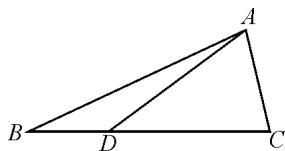
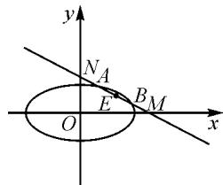
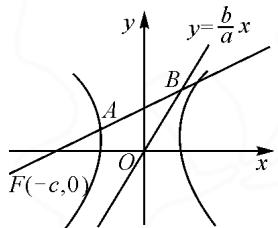
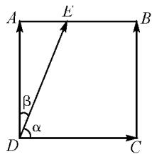
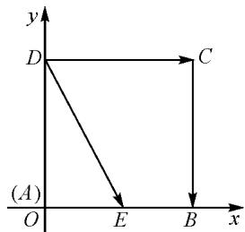

# 运用数形结合法解答填空题的思路与技巧

——以 2022 年高考数学部分真题为例

●甘肃省陇南市康县第一中学 张平彦

数学填空题具有“短小精悍、考查面广、目标集中、答案简短、明确具体、评分客观”等特点，已成为每年数学高考的题型之一。从近几年的高考数学全国卷试题来看，填空题的分值较高（一般4个小题，总分在20分左右），内容覆盖面广，难易适中，是高考备考中值得重视的内容。对于一些较简单的填空题，通常采用“直接判断、参照公式、推理计算、观察分析、转化未知”等方法即可解决，但是对于一些较复杂的填空题，特别是其难度已相当于简答题的填空题，这些常规方法就显得有些力不从心了，这时，可以考虑运用数形结合法来解题。

由于填空题不要求写出计算(论证)过程,因而对于一些较复杂的带有明显几何特征的填空题,例如解三角形问题、椭圆与直线方程问题、双曲线类问题、线性规划问题、与函数交点有关的问题等,可以先借助图形来直观分析,再辅以简单的运算即可得出正确答案,这就是数形结合法的优势所在.下面通过典型实例的解析,来了解和掌握运用数形结合法解答填空题的一些思路与技巧.

# 1 解三角形类问题

解三角形问题,通常要在准确理解题意、明确已知条件、了解应用背景的前提下,画出示意图;然后把所求问题归结到一个或几个三角形中,利用正、余弦定理等有关知识求解;最后回归实际问题并检验结果.

例 1 （2022 年全国高考理科甲卷）已知 $\triangle ABC$ 中，点 D 在边 BC 上， $\angle ADB = 120^{\circ}, AD = 2, CD = 2BD$ . 当 $\frac{AC}{AB}$ 取得最小值时，BD = \_\_\_\_.

解: 如图 1, 设 CD = 2BD = 2m > 0, 则在 $\triangle ABD$ 中, 根据余弦定理, 可得 $AB^{2} = BD^{2} + AD^{2} - 2BD \cdot AD\cos\angle ADB = m^{2} + 4 + 2m$ .

text_image

Geometric diagram of triangle ABC with point D on base BC, showing line segments AD and AC

图1

在 $\triangle ACD$ 中，由余弦定理，得 $AC^2 = CD^2 + AD^2 - 2CD \cdot AD \cdot \cos \angle ADC = 4m^2 + 4 - 4m$ .

所以，可得

$$
\frac {A C ^ {2}}{A B ^ {2}} = \frac {4 m ^ {2} + 4 - 4 m}{m ^ {2} + 4 + 2 m}
$$

$$
= \frac {4 (m ^ {2} + 4 + 2 m) - 1 2 (1 + m)}{m ^ {2} + 4 + 2 m}
$$

$$
= 4 - \frac {1 2}{(m + 1) + \frac {3}{m + 1}}
$$

$$
\geqslant 4 - \frac {1 2}{2 \sqrt {(m + 1) \cdot \frac {3}{m + 1}}} = 4 - 2 \sqrt {3},
$$

当且仅当 $m+1=\frac{3}{m+1}$ ，即 $m=\sqrt{3}-1$ 时，等号成立.

所以，当 $\frac{AC}{AB}$ 取最小值时， $m=\sqrt{3}-1$ .

思路与技巧: 设 CD=2BD=2m>0, 利用余弦定理表示出 $\frac{AC^{2}}{AB^{2}}$ , 这是关键的一步, 最后再结合基本不等式即可求得答案.

# 2 与椭圆、直线有关的方程类问题

在解析几何中,数形结合法起着“以数辅形”的作用.在求解与椭圆、直线有关的方程类问题时,我们可以结合该图形的几何性质,将条件信息或结论结合在一起,通过观察图形特征将其转化为代数语言,从而解决问题.

例 2 （2022 年全国新高考Ⅱ卷）已知椭圆 $\frac{x^{2}}{6} + \frac{y^{2}}{3} = 1$ ，直线 l 与椭圆在第一象限交于 A, B 两点，与 x 轴，y 轴分别交于 M, N 两点，且 $|MA| = |NB|$ ， $|MN| = 2\sqrt{3}$ ，则直线 l 的方程为 \_\_\_\_.

解:如图 2, 令 AB 的中点为 E. 因为 $\left| MA \right| = \left| NB \right|$ , 所以 $\left| ME \right| = \left| NE \right|$ .

设 $A(x_{1},y_{1}), B(x_{2},y_{2})$ ,
则 $\frac{x_{1}^{2}}{6}+\frac{y_{1}^{2}}{3}=1,\frac{x_{2}^{2}}{6}+\frac{y_{2}^{2}}{3}=1$ ，所

$$
\text {以} \frac {x _ {1} ^ {2}}{6} - \frac {x _ {2} ^ {2}}{6} + \frac {y _ {1} ^ {2}}{3} - \frac {y _ {2} ^ {2}}{3} = 0.
$$

故 $\frac{(x_{1}-x_{2})(x_{1}+x_{2})}{6}+\frac{(y_{1}+y_{2})(y_{1}-y_{2})}{3}=0,$

text_image

y
N_A
E
B_M
O
x

图2

则 $\frac{(y_1 + y_2)(y_1 - y_2)}{(x_1 - x_2)(x_1 + x_2)} = -\frac{1}{2}$ ，即 $k_{OE} \cdot k_{AB} = -\frac{1}{2}$ .

设直线 AB: $y=kx+m, k<0, m>0.$

令 $x = 0$ ，得 $y = m$ ；令 $y = 0$ ，得 $x = -\frac{m}{k}$ 所以 $M\left(-\frac{m}{k},0\right),N(0,m)$ ，故 $E\left(-\frac{m}{2k},\frac{m}{2}\right).$

于是 $k \times \frac{\frac{m}{2}}{-\frac{m}{2k}} = -\frac{1}{2}$ , 解得 $k = -\frac{\sqrt{2}}{2}$ 或 $k = \frac{\sqrt{2}}{2}$ (舍去).

由 $|MN| = 2\sqrt{3}$ ，得 $|MN| = \sqrt{m^2 + (\sqrt{2}m)^2} = 2\sqrt{3}$ ，解得 $m = 2$ 或 $m = -2$ （舍去）.

所以直线 $AB:y = -\frac{\sqrt{2}}{2} x + 2$ ，即 $x + \sqrt{2} y - 2\sqrt{2} = 0.$

思路与技巧: 令 AB 的中点为 E, 设 $A(x_{1}, y_{1})$ , $B(x_{2}, y_{2})$ , 利用点差法即可得到 $k_{OE} \cdot k_{AB} = -\frac{1}{2}$ . 设直线 AB: $y = kx + m, k < 0, m > 0$ , 先求出点 M, N 的坐标, 再根据 $|MN|$ 求出 k, m, 最后得直线 l 的方程.

# 3 双曲线离心率类问题

求双曲线离心率(或离心率的取值范围)的关键是,由条件寻找 a,c 所满足的等式(或不等式).当不能直接运用公式法或者 a,c 不易单独求出时,可以运用数形结合法,画出双曲线,通过观察图形,在图形上找出隐含条件,帮助我们找到解题思路.

例3（2022年高考浙江卷）已知双曲线 $\frac{x^2}{a^2} - \frac{y^2}{b^2} = 1 (a > 0, b > 0)$ 的左焦点为 $F$ ，过 $F$ 且斜率为 $\frac{b}{4a}$ 的直线交双曲线于点 $A(x_1, y_1)$ ，交双曲线的渐近线于点 $B(x_2, y_2)$ 且 $x_1 < 0 < x_2$ 。若 $|FB| = 3 |FA|$ ，则双曲线的离心率是 \_\_\_\_.

解：如图3，过 $F$ 且斜率为 $\frac{b}{4a}$ 的直线 $AB$ 方程为 $y = \frac{b}{4a} (x + c)$ .

联立 $\left\{\begin{aligned}y&=\frac{b}{4a}(x+c),\\ y&=\frac{b}{a}x,\end{aligned}\right.$ 解

text_image

y
y=b/a x
A
B
F(-c,0)
O
x

图3

得 $B\left(\frac{c}{3},\frac{bc}{3a}\right)$ . 由 $\left|FB\right|=3\left|FA\right|$ ，得 $A\left(-\frac{5c}{9},\frac{bc}{9a}\right)$ . 又点 A 在双曲线上，于是 $\frac{25c^{2}}{81a^{2}}-\frac{b^{2}c^{2}}{81a^{2}b^{2}}=1$ ，解得 $\frac{c^{2}}{a^{2}}=\frac{81}{24}$ ，所以双曲线的离心率 $e=\frac{3\sqrt{6}}{4}$ .

思路与技巧:首先作出双曲线草图,再借助图形,即可找出或转化其隐含条件,由此可以看出数形结合法的巨大优势.解题思路为首先通过联立直线AB和渐近线方程,求出点B的坐标;再根据 $|FB|=3|FA|$ 求出点A的坐标;最后根据“点在双曲线上”,即可求出双曲线的离心率.

# 4 平面向量的最值类问题

运用数形结合法求平面向量的最值类问题具有极大的灵活性与便捷性.通过作图,借助图形的几何性质,数中寻形,使原本繁琐的运算变得简捷;恰当地运用向量工具,形中觅数,又可以把几何问题代数化,从而降低问题的难度.

例 4 （北京市往届高考试题）已知正方形 ABCD 的边长为 1, E 是 AB 边上的动点，则 $\overrightarrow{DE} \cdot \overrightarrow{CB}$ 的值为 \_\_\_\_； $\overrightarrow{DE} \cdot \overrightarrow{DC}$ 的最大值为 \_\_\_\_.

解法 1: 如图 4, 令 $\angle EDC = \alpha$ , $\angle ADE = \beta$ , 则 $|\overrightarrow{DE}| \cos \beta = |\overrightarrow{DA}|$ , 因此 $\overrightarrow{DE} \cdot \overrightarrow{CB} = |\overrightarrow{DA}|^{2} = 1$ .

因为 $\overrightarrow{DE} \cdot \overrightarrow{DC} = |\overrightarrow{DE}| \cdot |\overrightarrow{DC}| \cos \alpha = |\overrightarrow{DE}| \cos \alpha$ ，又 $|\overrightarrow{DE}| \cdot \cos \alpha$ 是向量 $\overrightarrow{DE}$ 在 $\overrightarrow{DC}$ 方向上的投影,所以,要想 $\overrightarrow{DE}\cdot\overrightarrow{DC}$ 最大,就是要让投影最大.故当点E与点B重合时, $\overrightarrow{DE}\cdot\overrightarrow{DC}$ 最大值,且最大值为1.

text_image

A
E
B
β
α
D
C

图4

解法 2: 如图 5, 以 AB, AD 所在的直线分别为 x 轴和 y 轴建立平面直角坐标系. 因为正方形的边长为 1, 所以 $B(1,0)$ , $C(1,1)$ , $D(0,1)$ .

又因为点 E 在 AB 边上, 所以设 $E(t,0)$ ( $0 \leqslant t \leqslant 1$ ), 则 $\overrightarrow{DE} = (t, -1)$ , $\overrightarrow{CB} = (0, -1)$ , 可得 $\overrightarrow{DE} \cdot \overrightarrow{CB} = 1$ .

text_image

y
D
C
(A)
O
E
B
x

图5

又因为 $\overrightarrow{DC}=(1,0)$ ，所以 $\overrightarrow{DE}\cdot\overrightarrow{DC}=t$ .

由 $0 \leqslant t \leqslant 1$ ，得 $\overrightarrow{DE} \cdot \overrightarrow{DC}$ 的最大值为 1.

思路与技巧:解法1利用了投影的概念和平面向量的数量积公式 $\overrightarrow{DE}\cdot\overrightarrow{CB}=\overrightarrow{DE}\cdot\overrightarrow{DA}=|\overrightarrow{DE}|\cdot|\overrightarrow{DA}|\cdot\cos\theta$ ，以形助数，解题过程水到渠成；解法2利用正方形的特点，建立平面直角坐标系，以数辅形，把向量数量积运算转化为向量的坐标运算.

从以上典型例题的思路与技巧分析中我们可以看出,答案准确是数学的解题之本,填空题尤其如此.所以,在运用数形结合法解答填空题时,无论面对哪种题型,务必要读懂题意,弄清概念,明白算理,正确表达,仔细检验,才能做到答案准确.Z