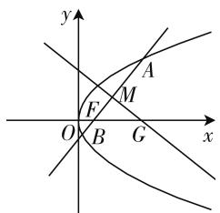
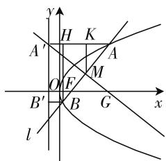
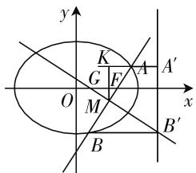

# 人生三境,数亦如是

——从圆锥曲线问题窥探数学解题的三境界

# ● 新疆昌吉州一中 董占新

王国维先生曾言：“古今之成大事业、大学问者，必经过三种之境界。”言及数学，亦复如是。第一境界“昨夜西风凋碧树，独上高楼，望尽天涯路”，之于数学，便是以通解通法，埋头苦算。虽得出正解，独上高楼时却不免发觉此间仍有学问颇深，静待钻研。第二境界“衣带渐宽终不悔，为伊消得人憔悴”，之于数学，便是寻一题多解，妙法破题。知识点的巧妙迁移，非常规解法的应用，可大大简化运算步骤。是以虽需潜心钻研，细思深算，然终不悔此道。第三境界“众里寻他千百度。蓦然回首，那人却在，灯火阑珊处”，之于数学，便是求类比延伸，推广结论。若可类比推广而得统一结论，再遇同类题目，便无需寻寻觅觅仍不得正解，只需套用结论,自可轻松求解,
浑然天成,恰如那灯火阑珊处
的回眸一笑.

题目 已知 AB 是过抛物线 $y^{2}=2px$ 焦点 F 的弦，其垂直平分线交 x 轴于点 G，设 $|AB|=\lambda|FG|$ ，则 $\lambda$ 的值是（）.

text_image

y
A
F
M
O
B
G
x

图 1

A. $\frac{3}{2}$

B. 2

C. 4

D. 与 $p$ 的值有关

# 优美解法一:(通解通法)

设直线 $AB$ 的方程为 $x = my + \frac{p}{2}$ ，联立方程 $\left\{ \begin{array}{l} x = my + \frac{p}{2}, \\ y^2 = 2px, \end{array} \right.$ 化简得 $y^2 - 2pmy - p^2 = 0$ .

由韦达定理得 $y_{1} + y_{2} = 2pm$ .

所以 $y_{中}=\frac{2pm}{2}=pm,x_{中}=pm^{2}+\frac{p}{2}.$

所以 $l_{MG}: y - y_{中} = -m (x - x_{中})$ .

令 $y = 0$ ，得 $x = \frac{y_{\text{中}}}{m} + x_{\text{中}} = \frac{3p}{2} + pm^2$ ，所以 $|FG| = \left|x - \frac{p}{2}\right| = p(1 + m^2)$ . 而 $|AB| = |x_1 + x_2 + p| =$

$\left|2pm^{2}+2p\right|$ ，所以 $\left|AB\right|=2\left|FG\right|$ 。所以 $\lambda=2$ ，故选B.

点评:解析几何的本质就是用代数方法解决几何问题,通解解法,易想难算,培养学生的运算能力.

# 优美解法二:(设而不求,点差法)

设 $A(x_{1},y_{1}), B(x_{2},y_{2}), M(x_{\text{中}},y_{\text{中}})$ ，则 $k_{AB} = \frac{p}{y_{\text{中}}}$ ，直线 MG 的方程为 $y - y_{\text{中}} = -\frac{y_{\text{中}}}{p}(x - x_{\text{中}})$ .

令 y=0，得 $x=p+x_{中}$ ，

则 $|FG| = \left|x - \frac{p}{2}\right| = \left|\frac{x_1 + x_2 + p}{2}\right|$ .

同解法一, 易得 $\left|AB\right|=\left|x_{1}+x_{2}+p\right|$ .

所以 $\left|AB\right|=2\left|FG\right|$ . 所以 $\lambda=2$ , 故选 B.

点评: 妙用点差法, 设而不求, 减少运算.

# 优美解法三:(回归定义)

如图2, 过A作 $AA^{\prime}\perp l$ 于 $A^{\prime}$ , 过B作 $BB^{\prime}\perp l$ 于 $B^{\prime}$ , 过M作 $MK\perp AA^{\prime}$ , 垂足为K, 作 $BH\perp AA^{\prime}$ , 垂足为H.

由抛物线定义得 $AA' = AF, BB' = BF.$

text_image

y
H K
A'
O F M
B' B G
x
l

图2

易得 $|AK| = \frac{|AA'| - |BB'|}{2} = \frac{1}{2} (|AF| - |BF|) = \frac{1}{2} (|BM| + |MF| - |BF|) = |MF|$ .

则 Rt△KMA ≌ Rt△MGF，所以 |MA| = |FG|，即 |AB| = 2 |FG|，所以 |AB| = 2 |FG|. 所以 λ = 2，故选 B.

点评:圆锥曲线问题,只要紧扣定义,就会减少运算,提高解题效率.

# 优美解法四:(妙用抛物线极坐标方程)

以 F 为极点, x 轴为极轴建立极坐标系, 如图 2, 设 $\left|FA\right|=\frac{p}{1-\cos\theta}=\rho_{1},\left|FB\right|=\frac{p}{1+\cos\theta}=\rho_{2}$ , 则 $\left|AB\right|=\left|FA\right|+\left|BF\right|=\frac{2p}{\sin^{2}\theta},\rho_{1}-\rho_{2}=\frac{2p\cos\theta}{\sin^{2}\theta}$ . 则

$$
\mid F M \mid = \rho_ {1} - \frac {\rho_ {1} + \rho_ {2}}{2} = \frac {\rho_ {1} - \rho_ {2}}{2} = \frac {p \cos \theta}{\sin^ {2} \theta}.
$$

在 Rt△FHG 中， $|FG|=\frac{|FH|}{\cos\theta}=\frac{p}{\sin^{2}\theta}$ ，所以 $|AB|=2|FG|$ 。所以 $\lambda=2$ ，故选 B.

点评:圆锥曲线本质是焦半径的产物.巧用抛物线的极坐标方程,减少运算,化繁为简,提高了解题效率,也体现了数学的和谐之美.

拓展推广:已知椭圆 E 的方程为 $\frac{x^{2}}{a^{2}} + \frac{y^{2}}{b^{2}} = 1 (a > b > 0)$ ，过右焦点 F 的直线 AB 与椭圆交于 A, B 两点，其垂直平分线交 x 轴于点 G，设 $|AB| = \lambda |FG|$ ，则 $\lambda$ 的值是 $\frac{2}{e}$ .

text_image

y
K
G F A
O M x
B
B'

图3

# 优美解法一:(通解通法)

设 AB 的方程为 $x = my + c$ ，联立得 $\left\{\begin{aligned}x&=my+c,\\ b^{2}x^{2}+a^{2}y^{2}&=a^{2}b^{2}\end{aligned}\right.\Rightarrow(b^{2}m^{2}+a^{2})y^{2}+2mcb^{2}y-b^{4}=0.$ 由韦达定理得 $y_{1}+y_{2}=\frac{-2mcb^{2}}{a^{2}+b^{2}m^{2}},y_{1}y_{2}=\frac{-b^{4}}{a^{2}+b^{2}m^{2}}$ 则 $y_{中}=\frac{-mcb^{2}}{a^{2}+b^{2}m^{2}},x_{中}=my_{中}-c=\frac{-m^{2}cb^{2}}{a^{2}+b^{2}m^{2}}-c.$

所以 $|AB| = \sqrt{1 + m^2}\sqrt{(y_1 + y_2)^2 - 4y_1y_2}$

$$
= \sqrt {1 + m ^ {2}} \sqrt {\left(\frac {- 2 m c b ^ {2}}{a ^ {2} + b ^ {2} m ^ {2}}\right) ^ {2} + \frac {4 b ^ {4}}{a ^ {2} + b ^ {2} m ^ {2}}}
$$

$$
= \sqrt {1 + m ^ {2}} \sqrt {\frac {4 c ^ {2} m ^ {2} b ^ {4} + 4 b ^ {4} \left(a ^ {2} + b ^ {2} m ^ {2}\right)}{\left(a ^ {2} + b ^ {2} m ^ {2}\right) ^ {2}}}
$$

$$
= (\sqrt {1 + m ^ {2}}) ^ {2} \frac {2 a b ^ {2}}{a ^ {2} + b ^ {2} m ^ {2}} = \frac {2 a b ^ {2} (1 + m ^ {2})}{a ^ {2} + b ^ {2} m ^ {2}}.
$$

直线 FG 的方程为 $y - y_{\text{中}} = -m(x - x_{\text{中}})$ ，令 y = 0，得 $x = \frac{y_{\text{中}}}{m} + x_{\text{中}}$ .

则 $|FG| = |x - (-c)| = \left|\frac{y_{\text{中}}}{m} + x_{\text{中}} + c\right|$

$$
= \left| \frac {- c b ^ {2}}{a ^ {2} + b ^ {2} m ^ {2}} + \frac {- m ^ {2} c b ^ {2}}{a ^ {2} + b ^ {2} m ^ {2}} - c + c \right|
$$

$$
= \frac {c b ^ {2} (1 + m ^ {2})}{a ^ {2} + b ^ {2} m ^ {2}}.
$$

所以 $\frac{|AB|}{|FG|} = \lambda = \frac{2}{e}$ .

# 优美解法二:(设而不求,点差法)

设 $M(x_{\text{中}}, y_{\text{中}})$ ，由点差法得 $k_{AB} = -\frac{b^{2}}{a^{2}} \cdot \frac{x_{\text{中}}}{y_{\text{中}}}$ ，则

直线 FG 的方程为 $y - y_{中} = \frac{b^{2}}{a^{2}} \frac{x_{中}}{y_{中}} (x - x_{中})$ ，令 y = 0，
得 $x = x_{中} - \frac{b^{2}x_{中}}{a^{2}}$ ，则 $\left|FG\right|=x_{中}e^{2}+c=e(ex_{中}+a)$ .

又因为 $r_1 = ex_1 + a, r_2 = ex_2 + a, |AB| = e(x_1 + x_2) + 2a = 2x$ 中 $e + 2a = 2(x_{\text{中}}e + a)$ ，

所以 $\frac{|AB|}{|FG|} = \lambda = \frac{2}{e}$ .

# 优美解法三:(妙用椭圆第二定义)

设 $|FB| = r_2$ , $|FA| = r_1$ , 则 $|MF| = \frac{|FA| + |FB|}{2} - |FA| = \frac{1}{2}(r_2 - r_1)$ .

在 Rt△FMG 中， $|FG|=\frac{|FM|}{\cos\theta}=\frac{1}{2\cos\theta}(r_{2}-r_{1})$ ；在 Rt△MKA 中， $|KA|=\frac{|BB'|-|AA'|}{2}$ .

又 $\frac{|BF|}{|BB'|}=e,\quad\frac{|AF|}{|AA'|}=e$ ，所以 $|BB'|=\frac{r_{2}}{e}$ $|AA'|=\frac{r_{1}}{e}$ ，所以 $|KB|=\frac{1}{2}\cdot\frac{1}{e}(r_{2}-r_{1})$ ，所以 $|BM|=\frac{|KB|}{\cos\theta}=\frac{r_{2}-r_{1}}{2e\cos\theta}$ ，所以 $\frac{|BM|}{|FG|}=\frac{1}{e}$ .

又因为 $2|BM|=|AB|$ ，所以 $\frac{|AB|}{|FG|}=\lambda=\frac{2}{e}$ .

# 优美解法四:(妙用椭圆的极坐标方程)

设 $|FB|=\rho_{2}=\frac{ep}{1-e\cos\theta},|FA|=\rho_{1}=\frac{ep}{1+e\cos\theta},$ 则 $\left|AB\right|=\left|FB\right|+\left|FA\right|=\rho_{2}+\rho_{1}=\frac{2ep}{1-e^{2}\cos^{2}\theta}\left|MF\right|=\frac{\rho_{2}+\rho_{1}}{2}-\rho_{1}=\frac{\rho_{2}-\rho_{1}}{2}.$

所以 $|MF| = \frac{2e^2p\cos\theta}{2(1 - e^2\cos^2\theta)}$ ，所以 $|FG| = \frac{|MF|}{\cos\theta} = \frac{2e^2p}{2(1 - e^2\cos^2\theta)}$ ，所以 $\frac{|AB|}{|FG|} = \lambda = \frac{2}{e}$ .

后记:本文从一道经典的圆锥曲线问题出发,从思路易得计算烦琐的通解通法,到稍用技巧简化运算的点差法,再至回归定义巧用几何关系,终而得出妙用极坐标方程之法,针对选择题的特殊化解法则一笔锦上添花.思路层层递进,解法丝丝入扣,一题之间,数学的精妙和谐之美跃然纸上.而之后的大胆推广,严谨求解,通用结论自此总结而出,更是将整道题目进行了升华.至此,首以通解通法,埋头苦算;再寻一题多解,妙法破题;终得类比延伸,推广结论——便是数学三境,恰应了人生三境.W