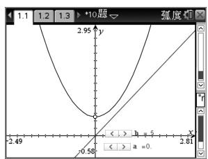
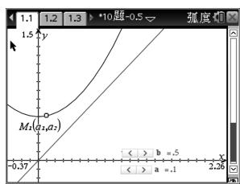
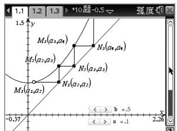
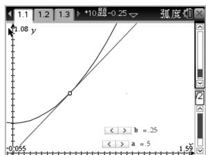
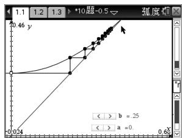
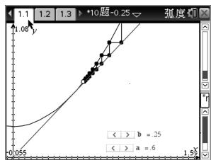

# 使用函数不动点探究数列性质

——从 2019 年高考数学浙江卷第 10 题说起

● 浙江省杭州第七中学 吴菁

函数不动点是荷兰数学家布劳威尔(Brouwer)首先提出的,指“被这个函数映射到其自身一个点”;用图像来表示,函数 $f(x)$ 的不动点即为函数 $f(x)$ 的图像与 $g(x)=x$ 交点的横坐标.将“不动点”的一些基本思想运用到初等数学中,可以扩大中学生的知识领域,加深他们对数学基础知识的掌握.

以函数不动点理论为背景的问题,在近几年的高考试题中频频出现,而2019年高考数学浙江卷正是函数不动点的经典之作.

原题 （2019年高考数学浙江卷第10题）设 $a, b \in \mathbf{R}$ ，数列 $\{a_n\}$ 中， $a_1 = a, a_{n+1} = a_n^2 + b, n \in \mathbf{N}^*$ ，则（ ）.

A. 当 $b=\frac{1}{2}$ 时, $a_{10}>10$   
B. 当 $b=\frac{1}{4}$ 时, $a_{10}>10$   
C. 当 b = -2 时, $a_{10} > 10$   
D. 当 b = -4 时, $a_{10} > 10$

解析:研究 A 选项, 当 $b=\frac{1}{2}$ 时, 根据递推关系 $a_{n+1}=a_{n}^{2}+\frac{1}{2}$ 绘制对应函数 $f(x)=x^{2}+\frac{1}{2}$ 的图像, 并绘制函数 $g(x)=x$ 的图像, 它们无交点, 如图 1.

line

| x     | y      |
|-------|--------|
| -2.49 | 2.95   |
| 0     | 0      |
| 2.81  | -0.58  |

图1

text_image

1.1 1.2 1.3 >*10题-0.5 弧度
1.5 y
M1(a₁,a₂)
-0.37
< > b = .5
< > a = .1
2.26

图2

取 $a_1$ 为横坐标，在函数 $f(x)$ 图像上绘制点 $M_1$ ，根据 $f(x)$ 的性质可得点 $M_1$ 的坐标为 $(a_1, a_2)$ ，如图2. 取 $a_2$ 为横坐标，在函数 $g(x)$ 与 $f(x)$ 的图像上绘制点 $N_1$ 与 $M_2$ ；根据此规律绘制点 $N_n$ 与 $M_n$ ，如图3，我们将这样的图称为蜘蛛网图。根据蜘蛛网图，得点 $M_n$ 的横坐标即 $a_n$ ，得出 $a_n \to +\infty$ 。

但 $a_{n} \rightarrow +\infty$ 不能严谨地判定 $a_{10} > 10$ ，故用此方法不能严谨地判定 A 选项，但用此方法可以快速地排除选项 B、C、D.

text_image

1.1 1.2 1.3 *10题-0.5
弧度
y
M₁(a₁,a₂)
N₃(a₁,a₂)
M₂(a₂,a₂)
N₂(a₂,a₂)
M₁(a₂,a₂)
N₁(a₂,a₂)
-0.37
b = .5
a = .1
< > a = .1

图3

text_image

1.1 1.2 1.3 >*10题-0.25 弧度
y
-0.065 b = .25
< > a = .5

图4

研究 B 选项, 当 $b=\frac{1}{4}$ 时, 根据递推关系 $a_{n+1}=a_{n}^{2}+\frac{1}{4}$ 绘制对应函数 $f(x)=x^{2}+\frac{1}{4}$ 的图像, 并绘制函数 $g(x)=x$ 的图像, 发现它们有唯一交点 $\left(\frac{1}{2},\frac{1}{2}\right)$ , 如图 4.

当 $a_1 = \frac{1}{2}$ 时，蜘蛛网图为固定一点 $\left(\frac{1}{2},\frac{1}{2}\right)$ ，此时 $a_{n} = \frac{1}{2}$ ，快速排除B选项.

同时结合蜘蛛网图也可继续探究数列的收敛性：

当 $a_1 \in \left[-\frac{1}{2}, \frac{1}{2}\right)$ 时，如图 $5, a_n \to \frac{1}{2}$ ;

当 $a_1 \in \left(-\infty, -\frac{1}{2}\right) \cup \left(\frac{1}{2}, +\infty\right)$ 时，如图6，

$$
a _ {n} \rightarrow + \infty .
$$

scatter

| x    | y     |
| ---- | ----- |
| 0.04 | 0.04  |
| 0.6  | 0.46  |

图 5

scatter

| x     | y     |
|-------|-------|
| 0.055 | 0.055 |
| 1.1   | 1.08  |

图 6

研究 C 选项, 当 b = -2 时, 根据递推关系绘制函数 $f(x) = x^{2} - 2$ 和函数 $g(x) = x$ (下转第 28 页)

可根据总结提升和学生的学习情况,做适当练习巩固,
让学生感受设参法“设而不求”的妙用.

解题后对解题规律和解题思想方法的总结是解题教学的更高层次,问题解决只有回归数学思想,能力才能有质的飞跃.也只有在思想方法的高度,学生才能学会数学地思维,这是培养数学核心素养的关键.

# 三、总结

教学中,不一定每一次解题都要经历这样的过程,但是这样的解题活动是解题教学应努力的方向.解题是学生数学实践的主要形式,是积累数学实践经验的基本途径.通过解题实践活动,让学生善于识别习题类型,总结解题方法,领悟解题规律,归纳解题策略,从各个不同的方面积累解题经验.有效的解题教学活动应着眼于解题的过程与方法,摒弃直接告诉的做法,让学生亲身经历数学解题的思维全过程,学会探究问题的方向,感受数学运算过程所带来的成功体验,从而提升学生解决问题能力,培养学生运算、逻辑推理等核心素养.

# 参考文献：

[1] 罗增儒. 一个最大值问题的教学分析 [J]. 中学数学教学参考, 2013(1/2).  
[2] 李宽珍. 基于核心素养理念下的解题教学初探——以一道高考题为例 [J]. 中学数学 (上), 2018(3).  
[3] 蒋海燕. 中学数学核心素养培养方略 [M]. 济南: 山东人民出版社, 2017. F

(上接第25页) 的图像,发现它们有两个交点(2,2)和 $(-1,-1)$ .

当 $a_{1}=2$ 或 -1 时，蜘蛛网图固定于一点 $(2,2)$ 或 $(-1,-1)$ ，此时 $a_{n}=2$ 或 -1，排除 C 选项。同时结合蜘蛛网图也可继续探究数列的收敛性：

当 $a_1 \in [-2, 2)$ 时，如图7， $a_n \in [-2, 2]$ ；

当 $a_1 \in (-\infty, -2) \cup (2, +\infty)$ 时，如图8， $a_n \to +\infty$ 。

text_image

1.1 1.2 1.3 >10题-0.2
2.44 y
(2, 2)
-2.79
4.47
b = -2.
<- a = 5

图 7

line

| x    | y     |
| ---- | ----- |
| -12.54 | 6.87  |
| 113.44 | 1.1   |

图 8

最后研究 D 选项, 当 b = -4 时, 根据递推关系绘制函数 $f(x) = x^{2} - 4$ 和函数 $g(x) = x$ 的图像, 发现它们有两个交点 $\left(\frac{1 + \sqrt{17}}{2}, \frac{1 + \sqrt{17}}{2}\right)$ 和 $\left(\frac{1 - \sqrt{17}}{2}, \frac{1 - \sqrt{17}}{2}\right)$ .

当 $a_{1}=\frac{1+\sqrt{17}}{2}$ 或 $\frac{1-\sqrt{17}}{2}$ 时，蜘蛛网图固定于一点，排除D选项；同时结合蜘蛛网图也可继续探究数列的收敛性：

当 $a_{1}\in\left[-\frac{1+\sqrt{17}}{2},\frac{1+\sqrt{17}}{2}\right)$ 时，如图9, $a_{n}\rightarrow$ $\frac{1\pm\sqrt{17}}{2}$ 或 $a_{n}\rightarrow+\infty;$

line

| x     | y     |
|-------|-------|
| -4.52 | -4.37 |
| 11.45 | 6.38  |

图9

当 $a_1 \in \left(-\infty, -\frac{1 + \sqrt{17}}{2}\right) \cup \left(\frac{1 + \sqrt{17}}{2}, +\infty\right)$ 时， $a_n \to +\infty$ .

使用蜘蛛网图,快速地排除选项 B、C、D,即可选出 A 为准确选项;同时借助蜘蛛网图,也可探究数列的收敛性与单调性,对数列有更加本质的分析.

新课标提出数学学科六大核心素养,本题正是数学核心素养在高考试题中的具体呈现:将数列的性质探究变形为函数不动点问题,考查数学建模与数学抽象;借助函数不动点研究数列的性质,考查学生直观想象能力;对参数讨论时采用的分类与整合思想,考查学生的逻辑推理能力.

解一道题,即解一类题.通过函数不动点的学习,可以求解已知递推关系的数列的收敛性与单调性的问题.

# 参考文献：

[1] 平小建. 不动点求解数列通项公式 [J]. 中学教学参考, 2016(23).  
[2] 李心娟, 王光明. 基于“不动点”的数列通项的命题及其应用 [J]. 数学通报, 2012(5). F