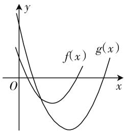
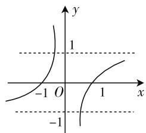
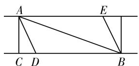

# 函数思想在高中数学解题中的应用

# 山东省济钢高级中学 杨同才

函数内容极其重要,它是连接常量数学与变量数学的桥梁,而函数思想就是将实际问题转化为函数问题,最终获得问题的解题方案.在中学数学中,有些问题,表面上看似与函数无关,我们若用函数的思想去思考,往往可以收到意想不到的效果.这就是函数思想应用的神奇与力量.下文举例说明,供大家参考.

# 一、集合问题中的函数思想

在高中数学中经常出现点集和数集,而这两种集合往往与方程和不等式有关,而方程和不等式,却是函数的“近亲”,因此,集合问题的解决往往离不开函数思想的应用.

例 1 设 $A=\{x \mid x^{2}-4x+3<0\}$ , $B=\{x \mid x^{2}-2x+m\leqslant0$ 且 $x^{2}-2nx+5\leqslant0\}$ . 若 $A\subseteq B$ , 求实数 m, n 的取值范围.

解析:化简集合 A 得 $A=\{x\mid1<x<3\}$ ，设 $f(x)=x^{2}-2x+m, g(x)=x^{2}-2nx+5, B_{1}=\{x\mid x^{2}-2x+m\leqslant0\}, B_{2}=\{x\mid x^{2}-2nx+5\leqslant0\}$ 则 $B=B_{1}\cap B_{2}$ ，由 $A\subseteq B$ 得 $A\subseteq B_{1}$ 且 $A\subseteq B_{2}$ ，即区间(1,3)应分别被集合 $B_{1}, B_{2}$ 对应的区间所包含，作出 $f(x)$ , $g(x)$ 的图像，如图 1，有 $\left\{\begin{aligned}f(1)\leqslant0,\\ f(3)\leqslant0\end{aligned}\right.$ 且 $\left\{\begin{aligned}g(1)\leqslant0,\\ g(3)\leqslant0\end{aligned}\right.$ 解不等式组即可.

text_image

y
f(x) g(x)
O x

图 1

评析:本题的本质是考查两个二次函数的位置关系,于是想到构造函数,并考查二次函数的图像,将集合问题转化为不等式问题,简单而明了.

# 二、方程问题中的函数思想

函数与方程,是新课标新增内容,其目的就是要求我们用辩证的眼光看待函数与方程之间的关系,对于方程问题,有时可以将其“退回”到函数,从而充分利用函数的性质和图像来解决方程问题.

例 2 （1）求方程 $x^{6}-6x^{4}-x^{3}+12x^{2}-8=0$ 的实数根.  
(2) 已知方程 $\left|x\right|=ax+1$ 有一个负根且没有正根，求 a 的取值范围.

解析:(1) 把原方程化为 $x^{6}-6x^{4}+12x^{2}-8=x^{3}$ ，即 $(x^{2}-2)^{3}=x^{3}$ ，作 $f(x)=x^{3}$ ，则方程为 $f(x^{2}-2)=f(x)$ ，因为 $f(x)$ 在 R 上为单调递增函数，所以 $x^{2}-2=x$ ，即 $x^{2}-x-2=0$ ，得 $x_{1}=-1, x_{2}=2$ ，原

方程的实根为 $x = -1$ 或 $x = 2$ .

(2) 把 $a$ 看作是一个变量，由已知方程得 $a = \frac{|x| - 1}{x} = \left\{ \begin{array}{l} 1 - \frac{1}{x} (x > 0), \\ -1 - \frac{1}{x} (x < 0). \end{array} \right.$

text_image

y
1
-1 O 1 x
-1

图 2

作出它的图像如图 2, 由图像直接可得 $a \geqslant 1$ .

评析:本例(1)为六次方程,难以分解因式,观察结构,巧妙引入函数,并考查函数的单调性,使问题得到简化;本例(2)则转换角度,将方程问题转化为函数问题,把复杂的需要讨论的问题转化成熟悉的求函数值域问题.类似地,还有将“二次型”函数问题转化成“一次型”,从而利用直线的性质简化解题的题目.

# 三、数列问题中的函数思想

数列,是高中数学与高考的又一核心内容.从本质上看,数列是函数特殊化的“产物”,即当函数的定义域变为正整数集时,函数就成了数列.因此当处理数列的某些问题时,尤其是数列最值问题,函数思想是处理这类问题最有效的思路.

例 3 已知函数 $f(x)=3x^{2}+bx+1$ 是偶函数， $g(x)=5x+c$ 是奇函数，正项数列 $a_{n}=\left(\frac{2}{3}\right)^{n-1}, n\in N^{*}$ ，若 $b_{n}=2f(a_{n})-g(a_{n+1})$ ，求数列 $\{b_{n}\}$ 中项的最大值和最小值.

解析:由题意得 $f(x)=3x^{2}+1$ , $g(x)=5x$ , 所以 $b_{n}=6a_{n}^{2}-5a_{n+1}+2$ , $n\in N^{*}$ , 即 $b_{n}=6\left(a_{n}-\frac{5}{18}\right)^{2}+\frac{83}{54}$ . 因为 $a_{n}=\left(\frac{2}{3}\right)^{n-1}$ 为减函数, 所以当 n=1,2,3,4 时, $a_{n}>\frac{5}{18}$ ; 当 $n\geqslant5$ , $n\in N$ 时, $a_{n}<\frac{5}{18}$ . 令 n=4 时, $b_{n}=\frac{274}{243}$ ; 令 n=5 时, $b_{n}\approx1.576$ , 所以 $b_{4}<b_{5}$ .

因为 $a_{n} = \left(\frac{2}{3}\right)^{n - 1}\in (0,1]$ ，所以 $a_{n} = 1$ ，即 $n = 1$ 时， $b_{n}$ 最大值为 $b_{1} = \frac{14}{3}$

综上所述,数列 $\{b_{n}\}$ 中项的最小值为 $b_{4}=\frac{274}{243}$ ,最大值为 $b_{1}=\frac{14}{3}$ .

评析:“数列是一类特殊的函数”在此例中体现得淋漓尽致,“特殊”是指自变量的取值为自然数.数列 $b_{n}$ 可以看成二次函数 $y=6\left(x-\frac{5}{18}\right)^{2}+\frac{83}{54}$ ,因此数列 $\{b_{n}\}$ 的最大(小)值可以参考采用二次函数求最值的方法来求得.看到数列,想到函数,应成为我们的一种思维习惯.

# 四、实际问题中的函数思想

学习数学最根本的目的是解决生活中的实际问题,在函数学习中,我们不仅要学会利用函数模型解决实际问题,而且要学会运用函数思想解决实际问题中与函数有关的问题,这样才能将函数学活学透,从而达到“应用自如”的理想境地.

例 4 一条河的对岸是两条平行线, 河的宽度为 1 千米, A 与 B 两座城市位于两岸, 它们的直线距离是 4 千米. 电力部门想铺设一条电缆线, 将 A 与 B 两座城市连接起来. 若地下电缆的修建费是 2 万元 / 千米, 而水下电缆的修建费是 4 万元 / 千米. 试问如何架设电缆线, 才可使总的修建费用最低.

解析: 如图 3 所示, 因为水下电缆的修建费用较高, 所以考虑架设电缆必须是部分位于地下, 部分位于水下, 应选择一个参照位

text_image

A
E
C D B

图3

置,于是我们不妨作 AC 与两岸垂直,C 为垂足(C 为参照位置). 又设河岸 CB 上有一点 D 与 C 点之间的距离为 x 千米,根据已知可求得 $AD = \sqrt{1 + x^{2}}$ 千米, $DB = (\sqrt{15} - x)$ 千米. 于是可以建立函数模型,利用这个函数来求出当 x 取什么值,函数取得最小值.

如图 3, 设 CD = x (公里), 则 $AD = \sqrt{1 + x^{2}}$ 公里, $DB = (\sqrt{15} - x)$ 公里.

设总修建费用为 $y$ (万元). $y = 4\sqrt{1 + x^2} + 2(\sqrt{15} - x)(0 \leqslant x \leqslant 15)$ , 设 $u = 2\sqrt{1 + x^2} - x > 0$ , 则 $(u + x)^2 = 4(1 + x^2)$ , 即 $3x^2 - 2ux + 4 - u^2 = 0$ , 令 $\Delta = 4u^2 - 12(4 - u^2) \geqslant 0$ , 得 $u^2 \geqslant 3, u \geqslant \sqrt{3}$ , 当且仅当 $x = \frac{\sqrt{3}}{3}$ 时, $u$ 取得最小值为 $\sqrt{3}$ , $y$ 也就取得最小值.

所以 D 点距离 B 城 $\left(\sqrt{15}-\frac{\sqrt{3}}{3}\right)$ 公里.

评析:该题通过先建立总修建费用函数关系式,再利用求无理函数最值方法来找到总修建费用的最小值,从中可以看出函数思想的重要性.

以上几例足以让我们看到函数思想在解题中的“威力”，并感受到这种思想方法的实用意义。用函数思想作指导去解决的问题有多种形式与类型但万变不离其宗，只要在学习中扎扎实实地掌握基础知识，学会全面地分析问题，把问题归纳为函数问题，并注意在解题中不断总结经验，运用函数的图像、性质、法则去研究，去解决，就可化繁为简，化难为易，就一定会真正掌握运用函数思想解题的思路和方法，从而收到事半功倍的效果。

# 参考文献：

[1] 徐卫文. 函数思想方法在数列解题中的应用 [J]. 上海中学数学, 2018(3).  
[2] 刘海东. 巧妙运用函数思想, 打造高中数学解题中的万能钥匙 [J]. 中学数学研究 (华南师范大学版), 2016(23).  
[3] 周丽津. 例谈高中生函数与方程思想的培养 [J]. 福建中学数学, 2015(3).  
[4] 项鸣晓, 靳贻良. 添加“催化剂” 解题更有效——函数思想在数列解题中的渗透 [J]. 高中数学教与学, 2014(10). F