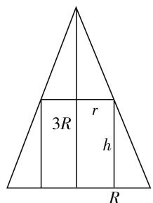
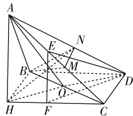
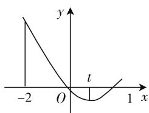

# 分类例析高中数学立体几何的解题技巧

# 湖南省株洲市石峰区第六中学 陈利华

在高中数学的教学活动中,立体几何是一种抽象化的问题. 在高考当中,立体几何题型的题目分值占比不小,因此,教师与学生都十分关注立体几何的解题方法及技巧. 本文将通过“巧用函数思想”“妙用空间思想”“化曲为直思想”等思想解答高中数学立体几何的解题技巧,目的是丰富学生的解题思路,在考试时能够用不同的解题思路全面作答立体几何的各种题型.

# 一、借助函数解答

函数思想贯穿着高中数学科目的始终,是高中数学解题思想的基本思想之一.此种思想在立体几何的问题当中有着十分重要的作用,许多立体几何的试题都可以通过函数思想解答.一般来说,函数思想就是借助数与数之间的关系而建立起一个模型的思想.教师需要借助此种思想对学生的解题进行指导,进而提升学生在立体几何问题方面的逻辑思维.下面,我们就通过一道具体的例题来说明函数思想在立体几何解题技巧中的重要性.

例 1 已知圆锥的底面半径为 R，高为 3R，在它的所有内接圆柱中，全面积的最大值是（）.

$$
\mathrm{A.} 2 \pi R ^ {2} \quad \mathrm{B.} \frac {9}{4} \pi R ^ {2} \quad \mathrm{C.} \frac {8}{3} \pi R ^ {2} \quad \mathrm{D.} \frac {3}{2} \pi R ^ {2}
$$

分析: 利用函数思想解立体几何试题时, 更加注重题目中函数关系的构造, 从而实现化难为易的目的. 本题立体几何问题中可以利用结合图像的关系, 构造函数表达式, 通过构造函数, 将立体问题转换为平面问题, 在平面内研究函数关系, 从而解答试题.

解:如图1所示,设内接圆柱的半径为 $r(0<r<R)$ ,高为h,则有 $\frac{h}{3R}=\frac{R-r}{R}$ ,得 $h=3(R-r)$ .

$$
\begin{array}{r l} & {\text {所以} S _ {\text {全}} = 2 \pi r ^ {2} + 2 \pi r h = 2 \pi r ^ {2} + 6 \pi r (R - r) =} \\ & {- 4 \pi \left(r ^ {2} - \frac {3}{2} R r\right) = - 4 \pi \left(r - \frac {3}{4} R\right) ^ {2} + \frac {9}{4} \pi R ^ {2} \leqslant} \end{array}
$$

$$
\frac {9}{4} \pi R ^ {2}.
$$

当 $r=\frac{3}{4}R$ 时, 全面积最大,
最大值为 $\frac{9}{4}\pi R^{2}$ ，故选B.

# 二、利用空间几何作答

在高中数学立体几何问题

text_image

3R
r
h
R

图1

中,有许多题型都可以利用空间几何思想进行解答.这要求教师能够通过教学活动的开展让学生们熟记空间几何中“线与线”“线与面”“面与面”之间的关系.熟记知识点之后,学生们在解答题目时就能够在脑海中自然而然地就想到利用空间几何中哪一部分的知识点进行解答.在空间几何中,不仅仅有线线垂直、线面垂直,同时也存在线线平行与线面平行等.高中数学教师们可以教授学生利用空间向量的转换对立体几何问题进行解答.下面以“线线”“线面”“面面”之间的关系作为例题.

例 2 如图 2, 在三棱锥 A—BCD 中, 侧面 ABD, ACD 是全等的直角三角形, AD 是公共的斜边, 且 $AD = \sqrt{3}$ , BD = CD = 1, 另一个侧面 ABC 是正三角形.

(1) 求证: $AD \perp BC$ ;   
(2) 求二面角 B—AC—D 的大小.

text_image

Geometric diagram of a triangular pyramid with labeled vertices and internal points, used for spatial geometry problems.

图2

解:(1)作 $AH \perp$ 平面 BCD 于 H, 连接 DH. AB $\perp BD, HB \perp BD$ , 因为 $AD = \sqrt{3}, BD = 1$ , 所以 $AB = \sqrt{2} = BC = AC, BD^{2} + CD^{2} = BC^{2}$ , 所以 $BD \perp DC$ .

又因为 BD = CD，则 BHCD 是正方形，则 $DH \perp BC$ 。所以 $AD \perp BC$ 。

(2) 作 $BM \perp AC$ 于 $M$ , 作 $MN \perp AC$ 交 $AD$ 于 $N$ , 则 $\angle BMN$ 就是二面角 $B - AC - D$ 的平面角.

因为 AB = AC = BC = $\sqrt{2}$ ，所以 M 是 AC 的中点，且 MN // CD，则 $BM = \frac{\sqrt{6}}{2}$ ， $MN = \frac{1}{2}CD = \frac{1}{2}$ ， $BN = \frac{1}{2}AD = \frac{\sqrt{3}}{2}$ .

由余弦定理得 $\cos\angle BMN=\frac{BM^{2}+MN^{2}-BN^{2}}{2BM\cdot MN}=\frac{\sqrt{6}}{3}$ ，所以 $\angle BMN=\arccos\frac{\sqrt{6}}{3}$ .

总之,高中数学求解立体几何问题中妙用空间几何思想,能够将题目化繁为简,借助空间几何思想使得立体几何中相对复杂的问题逐渐简单化,从而使得题目能够简单地解答出来.

# 三、利用转化思想作答

“化曲为直”思想就是将题目中得到的图形转化成简单易懂的图形,在立体几何中许多错综复杂的图形可以转换成平面图形,从而能够得到简单的图形进行解答.

例 3 正三棱柱 $ABC-A_{1}B_{1}C_{1}$ 中, 各棱长均为 2, M 是 $AA_{1}$ 中点, N 是 BC 中点, 则表面上从 M 到 N 的最短距离是多少?

分析:这种题型大多数可以分为两大类,一类可以进行计算得到结果,另一类可以通过比较而得到结果.

解:(1) 将三个侧面展开, AM=1, AN=3, MN= $\sqrt{AM^{2}+AN^{2}}=\sqrt{10}$ .

(2) 将侧面展开后翻转到底面，

$$
A M = 1, A N = \sqrt {3}, \angle M A N = 1 2 0 ^ {\circ},
$$

$$
\begin{array}{r l} M N & = \sqrt {A M ^ {2} + A N ^ {2} - 2 A M \cdot A N \cos 1 2 0 ^ {\circ}} = \\ & \sqrt {4 + \sqrt {3}}, \end{array}
$$

所以比较两种情况得出最短距离为 $\sqrt{4+\sqrt{3}}$ .

除了此种题型外，“化曲为直”思想还可应用于解析几何中线段的量比关系题型中，教师们应在课堂上开展解题方法的有效课堂，帮助学生在解题速度方面有所提升.

总而言之,立体几何问题作为高中数学学科的重点与难点,教师与学生们都应在考试前做好充足准备,将题型牢记于心,在考试中能够快速想到解题方法,将立体几何的解题技巧应用到实处. F

# (上接第40页)

(i) 当 t > 4 时, $g(-2) < 0$ , $g(t) > 0$ , 又因为 $g(0) = -\frac{2}{3}(t-1)^{2} < 0$ , 则 $g(x)$ 的图像如图 3 所示, 由图像可知, $g(x)$ 在 $(-2, t)$ 内有且仅有一个零点.

text_image

-2
O
y
t
x

图3

line

| x | y |
|---|---|
| -2 | 1 |
| 0 | 0 |
| 1 | 0 |

图4

(ii) 当 $-2 < t < 1$ 时, $g(-2) > 0$ , $g(0) < 0$ , $g(1)$ 小于 0 , 则 $g(x)$ 的图像如图 4 所示, 由图像可知, $g(x)$ 在 $(-2, 1)$ 内有且仅有一个零点.

因为 $g(t)<0$ ，所以 $g(-2)g(t)<0$ ，于是 $g(x)$ 在 $(-2,t)$ 内必定有零点，而 $(-2,t)$ 在 $(-2,1)$ 之中，所以 $g(x)$ 在 $(-2,t)$ 内有且仅有一个零点.

③ 当 t=1 时， $g(x)=x^{2}-x=x(x-1)$ ，在 $(-2,1)$ 内有且仅有一个零点 $x_{0}=0$ ;

当 t=4 时， $g(x)=x^{2}-x-6=(x-3)(x+2)$ 在 $(-2,4)$ 内有且仅有一个零点 $x_{0}=3$ .

综上所述，对于任意的 t > -2，总存在 $x_{0} \in (-2, t)$ ，满足 $\frac{f'(x_{0})}{\mathrm{e}^{x_{0}}} = \frac{2}{3}(t - 1)^{2}$ ，且当 $t \geqslant 4$ 或 -2 < t $\leqslant 1$ 时，有唯一的 $x_{0}$ 符合题意，当 1 < t < 4 时，有两个 $x_{0}$ 符合题意.

在高中数学的学习之中, 函数知识在其中的地位之高是显而易见的. 我们在分析与处理函数问题时, 一定要在把握函数的整体知识框架的同时, 尽量做到挖掘函数内部之间的、函数与其他知识之间的关系, 以揭示其中规律, 并将其合理地运用于学习过程之中, 将艰难的学习过程变成一种有趣的探索过程, 从而在提升函数解题能力的过程之中, 提升我们对数学的喜爱. F