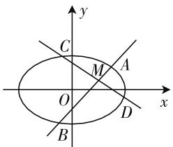
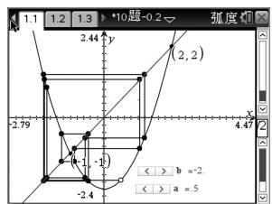
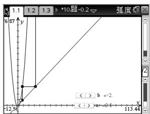
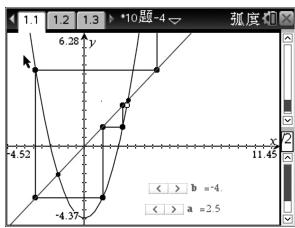

# 合理觅答案,反思探结论,总结明思想

—— 一道高考题的解题探究过程

● 陕西师范大学中学数学教学参考编辑部 燕娜

视升学为唯一目标的功利化教学深深地影响着我们的课堂教学，将解题研究的目标归结为应对升学考试，解题研究的内涵被简单化为“模仿＋练习＋数学事实接受”。在功利化背景下，解题教学也毅然成为了“一题一解”的题海教学，但我们都知道这不是教师层面的解题教学活动，仅仅是学生层面的试题解答。解题教学不是单纯的试题解答，不仅教解题活动的结果（答案），还要呈现解题活动的必要过程——暴露解题的思维活动。这个解题思维活动包括解题分析过程（读题分析、解题过程），解题反思（试题条件、结论的反思，试题解法的反思，试题拓展变式的反思），思想、规律的总结提升。解题教学活动就是教师要将这些关于解题研究的内容在课堂上一一展示出来，让学生经历这样的解题活动过程，跳出题海，减少低层次的大量的重复训练，注重数学本质、数学概念的理解，全面提高学生的逻辑推理能力、运算能力、空间想象能力以及运用数学知识分析问题和解决实际问题的实践能力与创新意识。

下面笔者以一道高考题为例,诠释解题的思维活动.

# 一、试题再现

题目 （2016年四川卷文科第20题）已知椭圆 E: $\frac{x^{2}}{a^{2}}+\frac{y^{2}}{b^{2}}=1(a>b>0)$ 的一个焦点与短轴的两个端点是正三角形的三个顶点，点 $P\left(\sqrt{3},\frac{1}{2}\right)$ 在椭圆上.

(1) 求椭圆 E 的方程;  
(2) 设不过原点 O 且斜率为 $\frac{1}{2}$ 的直线 l 与椭圆 E 交于不同的两点 A, B，线段 AB 的中点为 M，直线 OM 与椭圆 E 交于点 C, D。证明： $|MA| \cdot |MB| = |MC| \cdot |MD|$ 。

# 二、试题探究

# 1. 思路分析

讲解解题思路时,教师要从学生的视角、用最接近学生的方式进行引导,将探索解题思路的全部过程展现给学生,留出空间让学生参与其中,这样学生才有机会体会逻辑推理的力量.

第(1)问易得椭圆 E 的方程 $\frac{x^{2}}{4} + y^{2} = 1$ . 下面重点分析第(2)问, 证明等式相等, 且条件中有具体的数据, 所以我们首先想到的思路就是将等式两边的式子分别求出来(或表示出来), 看结构是否相等. 首先依据条件构造出左边式子, 已知 AB 为椭圆的弦, 点 M 为 AB 的中点, 所以可得出 $|MA| - |MB| = 0$ , 由此我们很容易构造出 $|MA| \cdot |MB|$ , 即 $|MA| \cdot |MB| = \frac{1}{4} |AB|^{2}$ , 已知所在直线的斜率, 我们可设直线方程为 $y = \frac{1}{2} x + m$ , 进而求弦 AB 的长, 所以 $|MA| \cdot |MB|$ 可表示. 右边式子容易表示, 联立方程求得 C, D 两点坐标, 再直接计算出 $|MC| \cdot |MD|$ 即可. 顺着我们分析的思路尝试证明.

# 2. 规范证明

证明:设直线 l 的方程为 $y=\frac{1}{2}x+m(m\neq0)$ , $A(x_{1},y_{1}),B(x_{2},y_{2})$ ，联立得方程组 $\left\{\begin{aligned}y&=\frac{1}{2}x+m,\\ \frac{x^{2}}{4}+y^{2}&=1,\end{aligned}\right.$ 则有 $x^{2}+2mx+2m^{2}-2=0,\Delta=(2m)^{2}-4(2m^{2}-2)>0$ 解得 $-\sqrt{2}<m<\sqrt{2}$ ，且有 $x_{1}+x_{2}=-2m$ ， $x_{1}x_{2}=2m^{2}-2$ ，所以点 $M\left(-m,\frac{m}{2}\right)$ ，所以 $\left|AB\right|^{2}=\left(x_{1}-x_{2}\right)^{2}+\left(y_{1}-y_{2}\right)^{2}=\left(x_{1}-x_{2}\right)^{2}+\left(\frac{1}{2}x_{1}-\frac{1}{2}x_{2}\right)^{2}=\frac{5}{4}\left[(x_{1}+x_{2})^{2}-4x_{1}x_{2}\right]=5(2-m^{2})$ 。所以 $\left|MA\right|\cdot\left|MB\right|=\frac{1}{4}\left|AB\right|^{2}=\frac{5}{4}(2-m^{2})$

由 M 点坐标可得直线 OM 的方程为 $y = -\frac{1}{2}x$ ，
联立得方程组 $\left\{\begin{aligned}y&=-\frac{1}{2}x,\\ \frac{x^{2}}{4}+y^{2}&=1,\end{aligned}\right.$ 解得 $C\left(-\sqrt{2},\frac{\sqrt{2}}{2}\right)$ , $D\left(\sqrt{2},-\frac{\sqrt{2}}{2}\right)$ ，所以 $\left|MC\right|\cdot\left|MD\right|=\frac{\sqrt{5}}{2}(-m+\sqrt{2})\cdot\frac{\sqrt{5}}{2}(\sqrt{2}+m)=\frac{5}{4}(2-m^{2})$ ，所以有 $\left|MA\right|\cdot\left|MB\right|=\left|MC\right|\cdot\left|MD\right|$ .

解题思路的分析一定要充分展示解题的细节,重视方法和方法由来的教学.让学生在解题分析和规范的解题步骤中,提高逻辑推理能力以及分析问题的能力,只有让学生经历这样的解题分析过程,才能积累基本活动经验,进而逐步培养数学核心素养.

# 3. 反思探究

在有效的解题教学中,我们不能仅仅满足于试题的解答,也不能止步于“练习巩固”,更需要有意义的探究活动,充分挖掘题目中隐藏的教学资源.

一般我们在解完题目后,都会再回头看解法是否可以进行简化,是否是学生最近发展区的解法,还有没有其他解法;看题目条件和结论,是否有机会进行拓展、变式,或思考可否得到某些新的结论等,这是我们解完一道题目后,必要的思维过程,这也是有效解题教学活动的必要环节.

看本题的条件和结论,我们发现结论 $\left|MA\right|\cdot\left|MB\right|=\left|MC\right|\cdot\left|MD\right|$ 很像圆中的相交弦定理,我们画图(图1)直观观察下,那是否在椭圆中也存在相交弦定理呢?我们不妨尝试验证下: 我们可先选择两条弦相交的特殊情况: 长轴和短轴, 显然这种情况下是不成立的. 那我们继续猜想, 是不是需要满足某种条件才成立呢? 回头看原题, 相交弦定理在本题中成立的条件是什么呢? 在解题过程中有 $k_{AB} = -k_{CD}$ , 这个特殊条件很可能就是结论成立的关键. 于是我们提出新的猜想:

text_image

y
C
M
A
O
x
B
D

图 1

在椭圆 $E: \frac{x^{2}}{a^{2}} + \frac{y^{2}}{b^{2}} = 1 (a > b > 0)$ 中，若两条相交弦 AB 和 CD 的斜率互为相反数，且交点为 M，则有 $\left| MA \right| \cdot \left| MB \right| = \left| MC \right| \cdot \left| MD \right|$ .

这种情况下,选择特殊情况验证,令交点 M 在坐标轴上,根据对称性,结论成立.所以接下来我们证明一般性.

证法 1: 可根据上述思维再现的过程, 分别设出 AB 和 CD 的直线方程, 然后分别求得 $\left|AB\right|$ 和 $\left|CD\right|$ 即可. 这种方法有一定的计算量, 这里不再赘述.

证法 2: 根据题目条件和结论特点, 我们设直线的参数方程, 可简化运算.

设直线 AB 的参数方程为 $\left\{\begin{aligned}x&=x_{0}+t\cos\alpha,\\ y&=y_{0}+t\sin\alpha,\end{aligned}\right.$ (t 为参数)，代入椭圆方程有 $(b^{2}\cos^{2}\alpha+a^{2}\sin^{2}\alpha)t^{2}+2(b^{2}x_{0}\cos\alpha+a^{2}y_{0}\sin\alpha)t+(b^{2}x_{0}^{2}+a^{2}y_{0}^{2}-a^{2}b^{2})=0$ ，设方程的两个根为 $t_{1},t_{2}$ ，则有 $|MA|\cdot|MB|=|t_{1}\cdot t_{2}|=\left|\frac{b^{2}x_{0}^{2}+a^{2}y_{0}^{2}-a^{2}b^{2}}{b^{2}\cos^{2}\alpha+a^{2}\sin^{2}\alpha}\right|$ .

对于直线 CD 的参数方程, 将直线 AB 参数方程中的 $\alpha$ 换成 $\pi - \alpha$ 即可, 所以同理可得 $|MC| \cdot |MD| = \left|\frac{b^{2}x_{0}^{2} + a^{2}y_{0}^{2} - a^{2}b^{2}}{b^{2}\cos^{2}\alpha + a^{2}\sin^{2}\alpha}\right|$ .

故有 $|MA| \cdot |MB| = |MC| \cdot |MD|$ . 猜想成立.

对于这个问题,我们还可以继续探索:如果两个相交弦的斜率不互补,会有怎样的结论?可让学有余力的学生课后进行探究.

通过探究,让学生在“变”中发现“不变”的本质,从“不变”中发现“变”的规律;通过观察、分析、运算和反思,培养学生逻辑推理、直观想象、数学运算及数学抽象等核心素养.

# 4. 总结提升

有关圆锥曲线问题,一般我们都会根据其结论或是条件找到另外的结论或性质,那是因为圆锥曲线问题大多会根据一些性质或结论为背景来命制,所以解后反思探究的过程就是挖掘试题命制的过程,也是揭示试题本质的过程,让学生通过一题会解一类题.

本题中, 原题解答和解后反思探究中的方法都体现了解决圆锥曲线的一种重要的解题思想——参数思想. 运用参数法解题必须恰到好处地引进参数, 除了要考虑条件和结论的特点外, 还必须注意参数的取值范围. 原题解答中直线 $l$ 的方程 $y = \frac{1}{2} x + m$ 中的 $m$ 和题后探究中设参数方程中的 $t$ 都是参数. 但是我们在求解的过程中, 在没有求出参数的情况下解决了问题, 这就是参数法的一大特色——设而不求. 有时设参法会依据解题需要设多个参数, 从表面上看给解题带来了麻烦, 但是参数并不是我们要直接研究的对象, 它只起到“桥梁”作用. 仔细审题, 根据题目条件, 建立有关参数的数量关系, 建立方程, 进行整体求解. 参数法在解题过程中常表现为: 设而不求, 整体代换, 换元等. 教师可根据总结提升和学生的学习情况,做适当练习巩固,
让学生感受设参法“设而不求”的妙用.

解题后对解题规律和解题思想方法的总结是解题教学的更高层次,问题解决只有回归数学思想,能力才能有质的飞跃.也只有在思想方法的高度,学生才能学会数学地思维,这是培养数学核心素养的关键.

# 三、总结

教学中,不一定每一次解题都要经历这样的过程,但是这样的解题活动是解题教学应努力的方向.解题是学生数学实践的主要形式,是积累数学实践经验的基本途径.通过解题实践活动,让学生善于识别习题类型,总结解题方法,领悟解题规律,归纳解题策略,从各个不同的方面积累解题经验.有效的解题教学活动应着眼于解题的过程与方法,摒弃直接告诉的做法,让学生亲身经历数学解题的思维全过程,学会探究问题的方向,感受数学运算过程所带来的成功体验,从而提升学生解决问题能力,培养学生运算、逻辑推理等核心素养.

# 参考文献：

[1] 罗增儒. 一个最大值问题的教学分析 [J]. 中学数学教学参考, 2013(1/2).  
[2] 李宽珍. 基于核心素养理念下的解题教学初探——以一道高考题为例 [J]. 中学数学 (上), 2018(3).  
[3] 蒋海燕. 中学数学核心素养培养方略 [M]. 济南: 山东人民出版社, 2017. F

(上接第25页) 的图像,发现它们有两个交点(2,2)和 $(-1,-1)$ .

当 $a_{1}=2$ 或 -1 时，蜘蛛网图固定于一点 $(2,2)$ 或 $(-1,-1)$ ，此时 $a_{n}=2$ 或 -1，排除 C 选项。同时结合蜘蛛网图也可继续探究数列的收敛性：

当 $a_1 \in [-2, 2)$ 时，如图7， $a_n \in [-2, 2]$ ；

当 $a_1 \in (-\infty, -2) \cup (2, +\infty)$ 时，如图8， $a_n$

$$
\rightarrow + \infty .
$$

text_image

1.1 1.2 1.3 >*10题-0.2
弧度切
2.44 y
(2, 2)
-2.79
4.47 x
(-1, -1)
-2.4
b = -2.
a = 5

图 7

line

| x    | y     |
| ---- | ----- |
| 0    | 6.87  |
| 12.54| -12.54|
| 113.44| 113.44|

图 8

最后研究 D 选项, 当 b = -4 时, 根据递推关系绘制函数 $f(x) = x^{2} - 4$ 和函数 $g(x) = x$ 的图像, 发现它们有两个交点 $\left(\frac{1 + \sqrt{17}}{2}, \frac{1 + \sqrt{17}}{2}\right)$ 和 $\left(\frac{1 - \sqrt{17}}{2}, \frac{1 - \sqrt{17}}{2}\right)$ .

当 $a_{1}=\frac{1+\sqrt{17}}{2}$ 或 $\frac{1-\sqrt{17}}{2}$ 时，蜘蛛网图固定于一点，排除D选项；同时结合蜘蛛网图也可继续探究数列的收敛性：

当 $a_{1}\in\left[-\frac{1+\sqrt{17}}{2},\frac{1+\sqrt{17}}{2}\right)$ 时，如图9, $a_{n}\rightarrow\frac{1\pm\sqrt{17}}{2}$ 或 $a_{n}\rightarrow+\infty;$

line

| x     | y     |
|-------|-------|
| -4.52 | -4.37 |
| 11.45 | 6.38  |

图9

当 $a_1 \in \left(-\infty, -\frac{1 + \sqrt{17}}{2}\right) \cup \left(\frac{1 + \sqrt{17}}{2}, +\infty\right)$ 时， $a_n \to +\infty$ .

使用蜘蛛网图,快速地排除选项 B、C、D,即可选出 A 为准确选项;同时借助蜘蛛网图,也可探究数列的收敛性与单调性,对数列有更加本质的分析.

新课标提出数学学科六大核心素养,本题正是数学核心素养在高考试题中的具体呈现:将数列的性质探究变形为函数不动点问题,考查数学建模与数学抽象;借助函数不动点研究数列的性质,考查学生直观想象能力;对参数讨论时采用的分类与整合思想,考查学生的逻辑推理能力.

解一道题,即解一类题.通过函数不动点的学习,可以求解已知递推关系的数列的收敛性与单调性的问题.

# 参考文献：

[1] 平小建. 不动点求解数列通项公式 [J]. 中学教学参考, 2016(23).  
[2] 李心娟, 王光明. 基于“不动点”的数列通项的命题及其应用 [J]. 数学通报, 2012(5). F