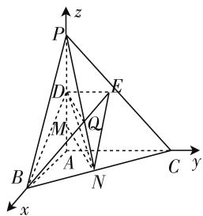
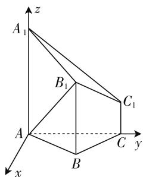
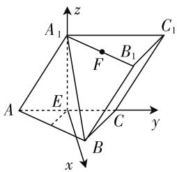
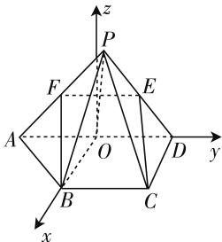

# 基于高考题 探讨向量法的建系技巧

# ● 浙江省诸暨市草塔中学 郑飞鹰

立体几何一直是浙江高考的必考题,是高考中的重难点,它对空间想象能力有很高的要求.但很多学生面对高考中的解答题,能够写出第(1)小题,第(2)小题根本无法入手.究其原因:找不到角.因为大部分学生喜欢用向量法解题,而纵观这些年的立体几何,直接建系类型展示的越来越少.无法建系,就无法求出角,这成为学生学习立体几何的障碍.但事实上,大部分立体几何都是可以建系的.结合本人多年对立体几何的归纳总结,特别是浙江卷的,对建系方法加以归纳总结.让学生手握该招,巧破立几.

# 一、常见立体几何建系类型

# 类型 1. 墙角类型

这类题型最简单,侧棱垂直于底面,底面又是直角,三条线两两垂直,直接可以建立 x,y,z 轴,然后利用向量公式进行运算即可.如 2017 年天津高考题.

例 1 （2017 年天津卷）如图 1，在三棱锥 P-ABC 中， $PA \perp$ 底面 ABC， $\angle BAC = 90^{\circ}$ ，点 D, E, N 分别为棱 PA, PC, BC 的中点，M 是线段 AD 的中点，PA = AC = 4，AB = 2.

text_image

z
P
E
D
M
Q
A
B
N
C y
x

(1) 证: MN // 平面 BDE;

图 1

(2) 求二面角 C-EM-N 的正弦值.

分析:该题属于简单题,可直接建系.然后求出法向量,利用法向量与二面角内外朝向关系,通过 $\cos\theta=\pm\frac{m\cdot n}{|m||n|}$ 求出余弦值,然后通过同角三角函数关系式,求出正弦值.下面就第(2)小题加以讨论研究.

解:(1)略.

(2) 以 AB 为 x 轴, AC 为 y 轴, AP 为 z 轴建立空间直角坐标系, 得 $C(0,4,0)$ , $E(0,2,2)$ , $M(0,0,1)$ , $N(1,2,0)$ , 平面 CEM 的一个法向量 $\boldsymbol{m} = (1,0,0)$ .

对平面 EMN, 设其法向量为 $\boldsymbol{n}=(x,y,z)$ ,

则 $\overrightarrow{EM} = (0, -2, -1), \overrightarrow{EN} = (1, 0, -2)$ ,

$$
\left\{ \begin{array}{l} \overrightarrow {E M} \cdot \boldsymbol {n} = 0, \\ \overrightarrow {E N} \cdot \boldsymbol {n} = 0 \end{array} \Rightarrow \left\{ \begin{array}{l} - 2 y - z = 0, \\ x - 2 z = 0. \end{array} \right. \right.
$$

令 $z = 1$ ，则 $\pmb {n} = \left(2, - \frac{1}{2},1\right)$ .设二面角 $C - ME-$ $N$ 的大小为 $\theta$ ，所以 $\cos \theta = \frac{2}{1\times\sqrt{\frac{21}{4}}} = \frac{4}{\sqrt{21}}$ ，即得 $\sin \theta$

$$
= \frac {\sqrt {5}}{\sqrt {2 1}} = \frac {\sqrt {1 0 5}}{2 1}.
$$

# 类型 2. 有侧棱垂直于底面, 底面无直角

这类题与类型1大致相同,一般选择垂直于底面的侧棱作为z轴,当然也可以根据底面x,y轴的需要,作平行于这条侧棱的直线为z轴,然后建立合适的x,y轴.其中2018年浙江卷的立体几何就属于这一类.

例 2 （2018 年浙江卷）已知多面体 ABC - $A_{1}B_{1}C_{1}$ ，侧棱 $AA_{1}$ 、 $BB_{1}$ 、 $CC_{1}$ 均垂直于平面 ABC， $\angle ABC = 120^{\circ}$ ， $AA_{1} = 4$ ， $CC_{1} = 1$ ，AB = BC = $BB_{1} = 2$ 。

(1) 证明: $AB_{1} \perp$ 平面 $A_{1}B_{1}C_{1}$ ;  
(2) 求直线 $AC_{1}$ 与平面 $ABB_{1}$ 所成角正弦值.

分析: 此题可以直接选择 $AA_{1}$ 为 z 轴, 接下来的关键是如何选择 x, y 轴, 使得运算更方便. 然后该题第(1)小题在用传统法的时候, 需要通过多次勾股定理得到, 向量法只需与法向量平行即可. 下面我们主要看第(2)小题的处理与运算.

解:(1)略.

text_image

z
A₁
B₁
C₁
A
B
C
y
x

图2

(2) 以垂直于 AC 的直线

为 $x$ 轴， $AC$ 为 $y$ 轴， $AA_{1}$ 为 $z$ 轴，建立空间直角坐标系， $A(0,0,0), C_{1}(0,2\sqrt{3},1), \overrightarrow{AC_{1}} = (0,2\sqrt{3},1)$ ，对平面 $ABB_{1}$ ，设其法向量为 $\boldsymbol{m} = (x,y,z), B(1,\sqrt{3},0), B_{1}(1,\sqrt{3},2), \overrightarrow{AB} = (1,\sqrt{3},0), \overrightarrow{AB_{1}} = (1,\sqrt{3},2)$ ，

$$
\left\{ \begin{array}{l} \overrightarrow {A B} \cdot \boldsymbol {m} = 0, \\ \overrightarrow {A B _ {1}} \cdot \boldsymbol {m} = 0 \end{array} \Rightarrow \left\{ \begin{array}{l} x + \sqrt {3} y = 0, \\ x + \sqrt {3} y + 2 z = 0. \end{array} \right. \right.
$$

令 y=1，得 $m=(-\sqrt{3},1,0)$ 。设 $AC_{1}$ 与平面 $ABB_{1}$ 的夹角为 $\theta$ ，则 $\sin\theta=\frac{\overrightarrow{AC_{1}}\cdot\boldsymbol{m}}{|\overrightarrow{AC_{1}}|\cdot|\boldsymbol{m}|}=\frac{2\sqrt{3}}{\sqrt{13}\cdot2}=$

$$
\frac {\sqrt {3 9}}{1 3}.
$$

# 类型 3. 有侧面垂直底面,无侧棱垂直底面

此类题型无现成的 $x, y, z$ 轴，要用向量法解决，关键是要找出 $z$ 轴。根据侧面与底面垂直这一条件，我们可以利用面面垂直的性质，在侧面上作一条垂直于两面交线的直线，则该线即可以作为 $z$ 轴。当然有时也需要根据题目条件，为了使 $x, y$ 轴建立更方便，也可以把与该线平行的直线作为 $z$ 轴。我们可以通过2019年浙江卷的高考题来深入了解一下这类题型的特点。

例 3 （2019 年浙江卷）如图 3, 已知三棱柱 ABC - $A_{1}B_{1}C_{1}$ , 平面 $A_{1}ACC_{1} \perp$ 平面 ABC, $\angle ABC = 90^{\circ}$ , $\angle BAC = 30^{\circ}$ , $A_{1}A = A_{1}C = AC$ , E, F 分别是 AC, $A_{1}B_{1}$ 的中点.

(1) 证: $EF \perp BC;$   
(2) 求 EF 与平面 $A_{1}BC$ 所成角的余弦值.

分析:根据平面 $A_{1}ACC_{1} \perp$ 平面 ABC, 只要在平面 $A_{1}ACC_{1}$ 内找出一条直线垂直于 AC, 即可作为 z 轴, 一般总是会去找 AC 中点. 而该题的第(1)小题如果用传统法去做, 在处理线面垂直的过程中也会遇到问题, 很多同学找不出来. 而向量法只需将坐标求出, 相乘为零即可.

解:(1) 连接 $A_{1}E$ ，因为 $AA_{1}=A_{1}C=AC$ ，所以 $A_{1}E\perp AC$ 。又因为平面 $A_{1}ACC_{1}\perp$ 平面 ABC，平面 $A_{1}ACC_{1}\cap$ 平面 ABC=AC，所以 $A_{1}E\perp$ 平面 ABC，则以垂直于 EC 的直线为 x 轴，EC 为 y 轴， $EA_{1}$ 为 z 轴建立空间直角坐标系，设 AC=2，则 $E(0,0,0)$ ， $C(0,1,0)$ ， $A_{1}(0,0,\sqrt{3})$ ， $B\left(\frac{\sqrt{3}}{2},\frac{1}{2},0\right)$ ， $B_{1}\left(\frac{\sqrt{3}}{2},\frac{3}{2},\sqrt{3}\right)$ ， $F\left(\frac{\sqrt{3}}{4},\frac{3}{4},\sqrt{3}\right)$ ，所以 $\overrightarrow{EF}=\left(\frac{\sqrt{3}}{4},\frac{3}{4},\sqrt{3}\right)$ ， $\overrightarrow{BC}=\left(-\frac{\sqrt{3}}{2},\frac{1}{2},0\right)$ 。因为 $\overrightarrow{EF}\cdot\overrightarrow{BC}=0$ ，所以 $EF\perp BC$ 。

(2) 对平面 $A_{1}BC$ ，设其法向量为 $\pmb{m} = (x, y, z)$ ，由(1)得 $\overrightarrow{A_1C} = (0, 1, -\sqrt{3})$ ， $\overrightarrow{BC} = \left(-\frac{\sqrt{3}}{2}, \frac{1}{2}, 0\right)$ ，则 $\left\{ \begin{array}{l} \overrightarrow{A_1C} \cdot \pmb{m} = 0, \\ \overrightarrow{BC} \cdot \pmb{m} = 0 \end{array} \right. \Rightarrow \left\{ \begin{array}{l} y - \sqrt{3}z = 0, \\ -\frac{\sqrt{3}}{2}x + \frac{1}{2}y = 0. \end{array} \right.$

令 z=1，得 $m=(1,\sqrt{3},1)$ 。设 EF 与平面 $A_{1}BC$ 的夹角为 $\theta$ ，则 $\sin\theta=\frac{|\overrightarrow{EF}\cdot\boldsymbol{m}|}{|\overrightarrow{EF}|\cdot|\boldsymbol{m}|}=\frac{2\sqrt{3}}{\sqrt{5}\cdot\frac{\sqrt{15}}{2}}=\frac{4}{5}$ ，即

text_image

A₁
z
C₁
B₁
F
E
A
C
y
x
B

图3

得 $\cos\theta=\frac{3}{5}$ .

# 类型 4. 没有任何面垂直底面

这类题型,最关键的是想办法找出垂直于底面的一个面,然后转到第三种类型. 我们可以通过 2017 年浙江卷的高考题来深入了解.

例 4 （2017 年浙江卷）如图 4，已知四棱锥 P-ABCD, P 以 AD 为斜边的等腰直角三角形, BC // AD, CD ⊥ AD, PC = AD = 2DC = 2CB, E 为 PD 中点.

text_image

z
P
F
E
A
O
D
y
B
C
x

图 4

(1) $CE \parallel$ 平面 PAB;  
(2) 求直线 CE 与平面 PBC 所成角的正弦值.

分析:该题最关键的是找到垂直于底面的面,只要取AD中点O,就可以得到面 $POB \perp$ 面ABC,则接下来的只要求出 $\angle BOP$ 的大小,建系得到坐标就很简单了.下面着重就第(2)小题加以讨论解答.

解:(1)略.

(2) 取 AD 中点 O，连 PO, BO，设 PC = AD = 2DC = 2CB = 2，则 PO = 1, BO = 1。因为 $AD \perp PO, AO \perp PO, PO \cap BD = O$ ，所以 $AD \perp$ 平面 POB。又因为 $AD \subset$ 平面 ABCD，所以平面 $PBO \perp$ 平面 ABCD，由于 $BC \parallel AD$ ，则 $BC \perp$ 平面 POB，即 $BC \perp PB$ 。在 Rt△PBC 中， $PB = \sqrt{PC^{2} - BC^{2}} = \sqrt{3}$ ，即 $\angle BOP = 120^{\circ}$ ，则以 OB 为 x 轴，OD 为 y 轴，在平面 POB 内垂直于平面 ABCD 的直线为 z 轴，可知 z 轴与 OP 成 $30^{\circ}$ 角，则 $B(1,0,0), C(1,1,0), P\left(-\frac{1}{2},0,\frac{\sqrt{3}}{2}\right), E\left(-\frac{1}{4},\frac{1}{2},\frac{\sqrt{3}}{4}\right), \overrightarrow{CE} = \left(-\frac{5}{4}, -\frac{1}{2},\frac{\sqrt{3}}{4}\right)$ 。对平面 PBC，设其法向量为 $m = (x, y, z), \overrightarrow{BP} = \left(-\frac{3}{2},0,\frac{\sqrt{3}}{2}\right), \overrightarrow{BC} = (0,1,0), \begin{cases} \overrightarrow{BP} \cdot m = 0, \\ \overrightarrow{BC} \cdot m = 0 \end{cases} \Rightarrow \begin{cases} y = 0, \\ -\frac{3}{2}x + \frac{\sqrt{3}}{2}z = 0. \end{cases}$

令 $x = 1$ ，得 $\pmb {m} = (1,0,\sqrt{3})$ .设 $CE$ 与平面 $PBC$ 的夹角为 $\theta$ ，所以 $\sin \theta = \frac{\overrightarrow{CE}\cdot\pmb{m}}{|\overrightarrow{CE}||\pmb{m}|} = \frac{\frac{1}{2}}{2\times\sqrt{2}} = \frac{\sqrt{2}}{8}.$

# 二、结语

由历年高考题可见,立体几何问题,只要合理分析,绝大部分都能够建系.关键是要学会归纳,融会贯通,掌握建系技巧,然后通过向量方法,巧破立体几何.F